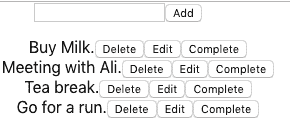
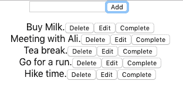
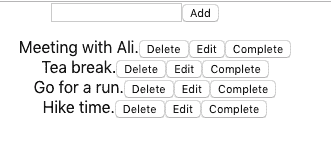
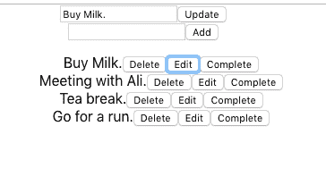
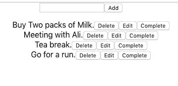
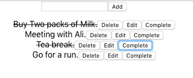

# 如何使用 React 执行 CRUD 操作

> 原文：<https://www.freecodecamp.org/news/crud-using-react-41d047224e26/>

作者:扎法尔·萨利姆

# 如何使用 React 执行 CRUD 操作


在我之前的文章中，我们已经使用[普通 JavaScript](https://medium.com/@zafarsaleem/crud-operations-using-vanilla-javascript-cd6ee2feff67) 和 [Angular](https://medium.com/@zafarsaleem/crud-operations-in-angular-536e1c03a715) 编写了相同的 Todo 应用程序。现在是时候进一步使用这个例子，使用一个更流行的框架:React。这个例子假设你已经在系统上安装了 [*节点*](https://nodejs.org/en/%5C) 和[*create-react-app*](https://github.com/facebook/create-react-app)。

首先，我们用这个命令创建一个新的 React 应用程序。

```
create-react-app todo
```

给它几秒钟，然后你应该在你的文件系统中有一个 todo 文件夹。CD 放到那个文件夹里。

首先创建的是一个名为 *Todo.js* 的新文件，位于 *src/* 文件夹中。下面是该文件中的代码:

```
import React, { Component } from 'react';
```

```
class Todo extends Component {     render() {        return(<h1>This message is from Todo component</h1>)     }  }
```

```
export default Todo;
```

首先，我们从 React 内核导入 *React* 和*组件*。

然后我们创建一个从*组件*扩展而来的 *Todo 组件*。

todo 组件有一个*呈现*方法，该方法用一个 *h1* 元素和文本“此消息来自 Todo 组件”来呈现 JSX。

最后，我们将导出这个组件，以便在项目的其余部分使用它。

现在打开 *src/App.js* 文件。在导入 *App.css* 文件之后，我们需要导入新创建的 Todo 组件。

在那里，现在在 App 组件的 render 方法中使用这个组件。

```
import React, { Component } from 'react';import logo from './logo.svg';import './App.css';
```

```
// import Todo component hereimport Todo from './Todo';
```

```
class App extends Component {
```

```
constructor(props) {    super(props);
```

```
this.state = {      show: false    };  }
```

```
render() {    // use Todo component inside render method.    return (      <div className="App">        <Todo />      </div>    );  }}
```

```
export default App;
```

现在我们已经有了基本的 Todo 组件文件，并且已经将它导入到 App 组件中并使用了它，是时候添加一些 *mockData* 了。这次我们将使用*反应状态*来处理我们的数据。这使得执行 CRUD 操作和相应地更新视图变得更加容易。将以下代码添加到 Todo 组件中:

```
class Todo extends Component {  state = {    edit: false,    id: null,    mockData: [{      id: '1',      title: 'Buy Milk',      done: false,      date: new Date()    }, {      id: '2',      title: 'Meeting with Ali',      done: false,      date: new Date()    }, {      id: '3',      title: 'Tea break',      done: false,      date: new Date()    }, {      id: '4',      title: 'Go for a run.',      done: false,      date: new Date()    }]  }}
```

> 状态就像 ReactJS 组件的数据存储。主要用于用户执行`clicking button`、`typing some text`、`pressing some key`等动作时更新组件。

上述状态也可以放在构造函数内部。选择你喜欢的任何一种方法。

如你所见，React 中的*状态*仅仅是一个 javascript 对象，具有诸如*编辑*、 *id、*和 *mockData* 等属性。*编辑*属性是布尔值。它将用于显示和隐藏编辑表单，以编辑 *mockData* 中的特定项目。 *id* 属性用于设置 mockData 中当前项的 id，以执行更新操作。

既然我们已经将 mockData 添加到了也被称为*初始状态*的状态中，那么是时候添加 JSX 了。如果你想知道更多关于 JSX 的事情，那么点击[这里](https://reactjs.org/docs/introducing-jsx.html)了解更多细节。它是 JavaScript 的语法扩展，生成 React 元素在页面上呈现数据。

JSX 列出了 mockData 中的所有项目，即它执行 CRUD 的“R”操作。为此，请将此代码呈现给该类。

```
render() {  return (    <div>      <form onSubmit={this.onSubmitHandle.bind(this)}>        <input type="text" name="item" className="item" />        <button className="btn-add-item">Add</button>      </form>      <ul>        {this.state.mockData.map(item => (          <li key={item.id}>            {item.title}            <button onClick={this.onDeleteHandle.bind(this, item.id)}>Delete</button>            <button onClick={this.onEditHandle.bind(this, item.id, item.title)}>Edit</button>            <button onClick={this.onCompleteHandle}>Complete</button>          </li>        ))}      </ul>    </div>  );}
```

*渲染*方法很简单。首先，它具有用于向 todo 列表添加新项目的表单。这个表单有一个 *onSubmit* 事件，它调用 *onSubmitHandle* 方法，我们将在这个组件的后面写这个方法。

然后，我们有 *ul* 并简单地映射 mockData 中的所有项目，显示标题并添加与我们之前的示例相同的按钮(删除、编辑和完成)。现在，如果您使用“npm start”命令运行您的应用程序，您应该会看到类似这样的内容。



既然 R 操作已经完成，是时候添加一个 *create* 操作了，它是 CRUD 中的 C。将 *onSubmitHandle* 方法添加到 Todo 组件，如下所示。

```
onSubmitHandle(event) {  event.preventDefault();
```

```
 this.setState({    mockData: [...this.state.mockData, {        id: Date.now(),        title: event.target.item.value,        done: false,        date: new Date()    }]  });
```

```
 event.target.item.value = '';}
```

当点击添加按钮时，调用 *onSubmitHandle* 方法。这里我们对 Todo 的状态使用 setState 方法，它是:

> `setState()`计划更新组件的`state`对象。当状态改变时，组件通过重新呈现来响应。

这里，调用 setState 方法来重置具有 mockData 的 Todo 组件的状态。它只是追加从输入字段中获取的新项。最后，将输入字段的值设置为空。



继续刷新浏览器中的应用程序，键入“远足时间”或任何你想要的内容，然后按下添加按钮。您应该能够在列表底部看到新项目，如上所示。

现在 C 已经完成了，是时候删除 D 了。简单地将 *onDeleteHandle* 方法添加到 Todo 组件，如下所示。

```
onDeleteHandle() {  let id = arguments[0];
```

```
 this.setState({    mockData: this.state.mockData.filter(item => {      if (item.id !== id) {        return item;      }    })  });}
```

单击“删除”按钮时会触发此方法。如你所见，我们将这个和 item.id 绑定到 *onDeleteHandle* 。 *this* 关键字是必需的，这样我们就可以访问当前作用域来访问带有 *this* 关键字的 Todo 组件的状态，而 id 部分则用于删除该特定项。

为了访问 item.id，我们将使用 arguments[0]对象。一旦我们有了 id，然后设置状态并过滤 mockData。找到需要删除的项目，并返回除需要删除的项目之外的所有项目。

继续刷新你的浏览器，在第一个项目上按 delete，你应该看到它被删除了，就像下面的截图。



删除部分到此为止。更新部分通常由两部分组成。首先，当编辑按钮被按下时显示编辑表单，然后执行更新操作。

为了显示和隐藏编辑表单，我们将使用添加到 state 中的 edit 属性。所以将下面的 *renderEditForm* 方法添加到组件中。

```
renderEditForm() {    if (this.state.edit) {      return <form onSubmit={this.onUpdateHandle.bind(this)}>        <input type="text" name="updatedItem" className="item" defaultValue={this.state.title} />        <button className="update-add-item">Update</button>      </form>    }  }
```

它检查编辑状态，并基于此返回 editForm，这是表单的 JSX 语法。

现在，在当前表单上方的 return 关键字内调用 render 方法中的上述方法，如下所示:

```
{this.renderEditForm()}
```

既然这部分已经不在我们的范围内了，那么是时候操作 edit 属性了。将下面的 *onEditHandle* 方法添加到 Todo 组件:

```
onEditHandle(event) {  this.setState({    edit: true,    id: arguments[0],    title: arguments[1]  });}
```

当编辑按钮被按下时，该方法被触发。我们绑定了三个参数:*这个*、 *id* 和*头衔*。*这个*关键字用于引用当前组件。它将 *id* 属性设置为正在编辑的当前项目的 id。它将 *edit* 设置为 *true* ，并向状态添加一个标题属性，我们将在该组件的后面访问该属性。

现在我们的组件中已经有了这段代码，转到浏览器，刷新并单击第一项的编辑按钮，这将显示如下所示的编辑表单:



这个表单有一个输入字段和一个更新按钮。现在是时候处理 CRUD 的 U 部分了。在上面显示的编辑表单中，当*更新*按钮被按下时，下面的方法将被触发:

```
onUpdateHandle(event) {  event.preventDefault();
```

```
 this.setState({      mockData: this.state.mockData.map(item => {        if (item.id === this.state.id) {          item['title'] = event.target.updatedItem.value;          return item;        }
```

```
 return item;      })   });
```

```
 this.setState({      edit: false   });}
```

将上述方法添加到您的 Todo 组件中。这将设置组件的状态，在状态中映射 mockData，找到需要更新的项目，并用新标题设置其标题。最后，将状态的 edit 属性设置为 false 以隐藏表单。就是这样。

现在在浏览器中运行代码，尝试更新第一项。您应该可以看到更新后的标题。



final 方法用于将该项设置为完成状态。添加下面的方法来实现这一点。

```
onCompleteHandle() {    let id = arguments[0];
```

```
 this.setState({      mockData: this.state.mockData.map(item => {        if (item.id === id) {          item['done'] = true;          return item;        }
```

```
 return item;    })  });}
```

上述方法将 mockData 中项的属性设置为 true。这与我们之前在普通 JavaScript 和 Angular 中的两个例子非常相似。

现在，为了实现这一点，将下面的代码添加到“li”中，根据 mockData 中的“done”属性状态设置它的类。

```
className={ item.done ? 'done' : 'hidden' }
```

现在刷新你的浏览器并点击完成按钮。你应该能看到下面的变化。



下面是需要添加到 *index.css* 文件中的基本 CSS，以便在屏幕上显示完成的项目。

```
.done {  text-decoration: line-through;}
```

就是这样。如您所见，Reactjs 是现代 JavaScript 应用程序的一个更加以组件为中心的解决方案。您的下一个任务是将表单元素拆分成它自己的组件，这样我们就不需要使用两个表单元素来进行更新和添加操作。这对每个人来说都应该是一个简单而有趣的任务。

要获得完整的代码，请复制下面的库。

[**zafar-saleem/react-todo**](https://github.com/zafar-saleem/react-todo)
[*通过在 GitHub 上创建账号，为 Zafar-saleem/react-todo 开发做贡献。*github.com](https://github.com/zafar-saleem/react-todo)