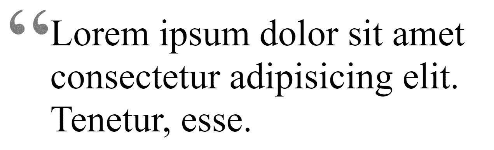
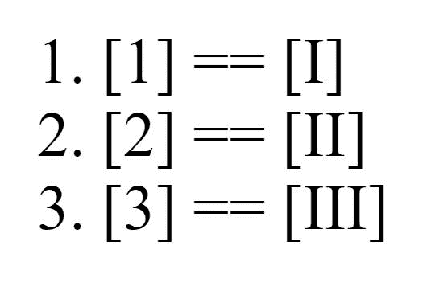

# CSS Before 和 CSS After–如何使用内容属性

> 原文：<https://www.freecodecamp.org/news/css-before-and-after-how-to-use-the-content-property/>

CSS 中的`content`属性定义了元素的内容。您可能听说过这个属性只适用于`::before`和`::after`伪元素。在本文中，我们将探索`content`属性的各种用例，包括伪元素之外的用例。

## 先决条件

由于`content`属性的大多数用例涉及伪元素，我建议您熟悉`::before`和`::after`伪元素的工作方式。这里有一篇很棒的文章，可以帮助你快速上手:

*   [CSS 伪元素-选择器前后解释](https://www.freecodecamp.org/news/css-pseudo-elements-before-and-after-selectors-explained/)

## 公认的价值观

首先，让我们看看`content`属性的所有可接受值。

*   `normal`:这是默认值。当与伪元素一起使用时，计算为`none`。
*   `none`:不会生成伪元素。
*   `<string>`:将内容设置为指定的字符串。该字符串可以包含 Unicode 转义序列。比如版权符号:`\\000A9`。
*   `<image>`:使用`url()`或`linear-gradient()`将内容设置为图像或渐变。
*   `open-quote` | `close-quote`:将内容设置为从`quotes`属性引用的适当引用字符。
*   `no-open-quote` | `no-close-quote`:从所选元素中删除一个引号，但仍然增加或减少从`quotes`属性引用的嵌套级别。
*   `attr(*attribute*)`:将内容设置为选中元素选中属性的字符串值。
*   `counter()`:将内容设置为一个`counter`的值，通常是一个数字。

## 线

一个最基本的例子是在元素之前或之后添加字符串内容。在本例中，我们将在链接前添加一个链接符号，并在其后添加链接的 URL。

```
a::before {
	content: "\\1F517 ";
}
a::after {
	content: " (" attr(href) ")";
} 
```

注意`::before`伪元素中 Unicode 字符后面的空格和`::after`伪元素中第一个括号前面的空格。这将在这些元素和父元素之间创建空间。

或者，您可以将`padding`或`margin`添加到伪元素中以增加分隔。

[https://codepen.io/codeSTACKr/embed/preview/OJMjpvL?height=300&slug-hash=OJMjpvL&default-tabs=css,result&host=https://codepen.io](https://codepen.io/codeSTACKr/embed/preview/OJMjpvL?height=300&slug-hash=OJMjpvL&default-tabs=css,result&host=https://codepen.io)

## 基本报价

使用`content`属性，您可以在元素之前和/或之后添加引号。现在，在 HTML 中我们有了`<q>`标签。这也将在其内容周围添加引号。然而，有了`content`属性，我们可以对实现有更多的控制。

下面是添加引号的最基本示例:

[https://codepen.io/codeSTACKr/embed/preview/NWxvpXq?height=300&slug-hash=NWxvpXq&default-tabs=css,result&host=https://codepen.io](https://codepen.io/codeSTACKr/embed/preview/NWxvpXq?height=300&slug-hash=NWxvpXq&default-tabs=css,result&host=https://codepen.io)

您也可以通过使用 HTML 标签`<q>`来实现这一点。但是，也许我们想改变报价的风格。所以我们只添加开始引用，不添加结束引用。让我们来设计一下开场白。

```
p {
  position: relative;
  font-size: 3rem;
  margin: 4rem;
}
p::before {
  content: open-quote;
  position: absolute;
  left: -3.5rem;
  top: -2rem;
  font-size: 8rem;
  color: rgba(0, 0, 0, 0.5)
} 
```

结果是:



## 高级报价

我们还可以指定哪里需要报价。例如，你可能在引用别人的话。所以你会在引号中有引号，这会让读者感到困惑。

在下面的代码笔中，我们使用 HTML `<q>`标签，然后指定哪些标签不应该显示引号。

乍一看，你可能认为我们应该在需要的地方去掉`<q>`标签。但是通过指定引用不应该在哪里，仍然增加或减少从`quotes`属性引用的嵌套级别。

为了解释这一点，我们需要理解`quotes`属性。这只是引用时应该使用的字符“数组”。这里有一个例子:

```
q {
  quotes: '“' '”' '‘' '’' '“' '”';
} 
```

这是几组引语。第一组将用于顶级报价。第二组将用于第一个嵌套报价。第三组将用于第二个嵌套报价。依此类推，如果包括更多组的话。

既然我们理解了`quotes`属性，我可以解释一下`no-open-quote`和`no-close-quote`属性是如何工作的。

对于每个级别的报价，我们可以为报价分配不同的字符集。通过指定引用不应该在哪里，仍然增加或减少从`quotes`属性引用的嵌套级别。

看看下面的例子。您将看到第二级报价被跳过。

[https://codepen.io/codeSTACKr/embed/preview/NWxvbLw?height=300&slug-hash=NWxvbLw&default-tabs=css,result&host=https://codepen.io](https://codepen.io/codeSTACKr/embed/preview/NWxvbLw?height=300&slug-hash=NWxvbLw&default-tabs=css,result&host=https://codepen.io)

## 属性

属性可以用来将内容从 HTML 传递到 CSS `content`属性中。实际上，我们已经在链接示例中使用了这一点，我们使用了`href`属性将 URL 字符串作为内容的一部分。

一个完美的用例是工具提示。您可以向 HTML 中的元素添加一个`title`属性，以便在悬停时有一个简单的内置工具提示。但是为了定制它，我们可以在 HTML 标签上使用一个数据属性，然后使用`content`属性添加一个工具提示。

在这个例子中，我们使用 HTML 元素中的属性`data-tooltip`将值传递到工具提示中。对于工具提示的指针，我们将`content`设置为`""`，因为需要`content`来呈现一个`::before`或`::after`伪元素。

[https://codepen.io/codeSTACKr/embed/preview/WNrEopO?height=300&slug-hash=WNrEopO&default-tabs=css,result&host=https://codepen.io](https://codepen.io/codeSTACKr/embed/preview/WNrEopO?height=300&slug-hash=WNrEopO&default-tabs=css,result&host=https://codepen.io)

## 计数器

CSS 函数返回一个代表指定计数器当前值的字符串。在下面的例子中，我们有一个有序列表，我们将使用一个`counter`来添加内容。

```
<ol>
  <li></li>
  <li></li>
  <li></li>
</ol> 
```

```
ol {
  counter-reset: exampleCounter;
}
li {
  counter-increment: exampleCounter;
}
li::after {
  content: "[" counter(exampleCounter) "] == ["
               counter(exampleCounter, upper-roman) "]";
} 
```

在不深入讨论`counter`函数的情况下，我们必须首先初始化`ol`元素的计数器。我们可以给它起任何我们喜欢的名字。然后我们告诉计数器在每个`li`元素上递增。最后，我们设置了`li::after`的`content`。

结果如下:



您可以使用它来定制每个列表项中需要相应数字的内容。或者您可以使用它来定制列表项本身。例如，您可以删除默认的编号并实现一个自定义的编号系统。

## 形象

图像和渐变可以与`content`属性一起使用。这是相当直接的。下面是一个两者都用的例子:

[https://codepen.io/codeSTACKr/embed/preview/WNrEpre?height=300&slug-hash=WNrEpre&default-tabs=html,result&host=https://codepen.io](https://codepen.io/codeSTACKr/embed/preview/WNrEpre?height=300&slug-hash=WNrEpre&default-tabs=html,result&host=https://codepen.io)

对于可访问性，还有一个为图像添加替代文本的选项。但是这个特性并不被完全支持。

```
content: url(//unsplash.it/200/200) / "Alternative Text Here"; 
```

> 注意:Firefox、IE 和 Safari 都不支持。此外，渐变在 Firefox 中不起作用。

## 伪元素之外

没错！您可以在伪元素`::before`和`::after`之外使用`content`属性。尽管如此，它的使用是有限的，并且不能在所有的浏览器中完全兼容。

最兼容的用例是元素的替换。

```
<div id='replace'>
  codeSTACKr
</div> 
```

```
#replace {
  content: url("<https://www.codestackr.com/logo_twoline_light.svg>");
  width: 100%;
} 
```

> 注意:IE 中不支持替换。

## 结论

大多数时候，你会在`::before`和`::after`伪元素中看到`content: ""`。但是`content`属性有许多有用的应用。

在我看来，最好的用途是用它来更新批量元素。如果你想在网站的每个链接前添加一个图标，通过`content`属性添加比添加到 HTML 文档中的每个元素更容易。

## **感谢阅读！**

感谢您阅读这篇文章。希望它能帮助你更好地理解 CSS 中的`content`属性是如何工作的。

我是来自德克萨斯州的杰西。查看我的其他内容，让我知道如何帮助你成为一名 web 开发人员。

*   [订阅我的 YouTube](https://youtube.com/codeSTACKr)
*   打个招呼！ [Instagram](https://instagram.com/codeSTACKr) | [推特](https://twitter.com/codeSTACKr)
*   [注册我的简讯](https://codeSTACKr.com)