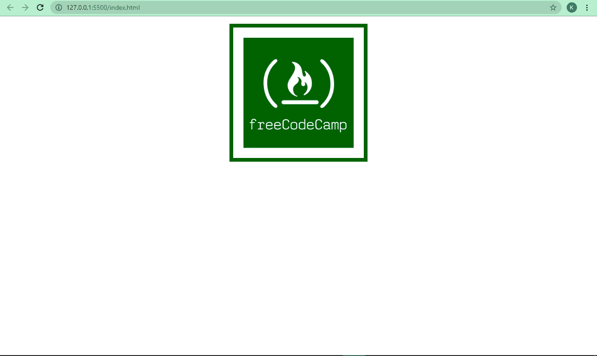
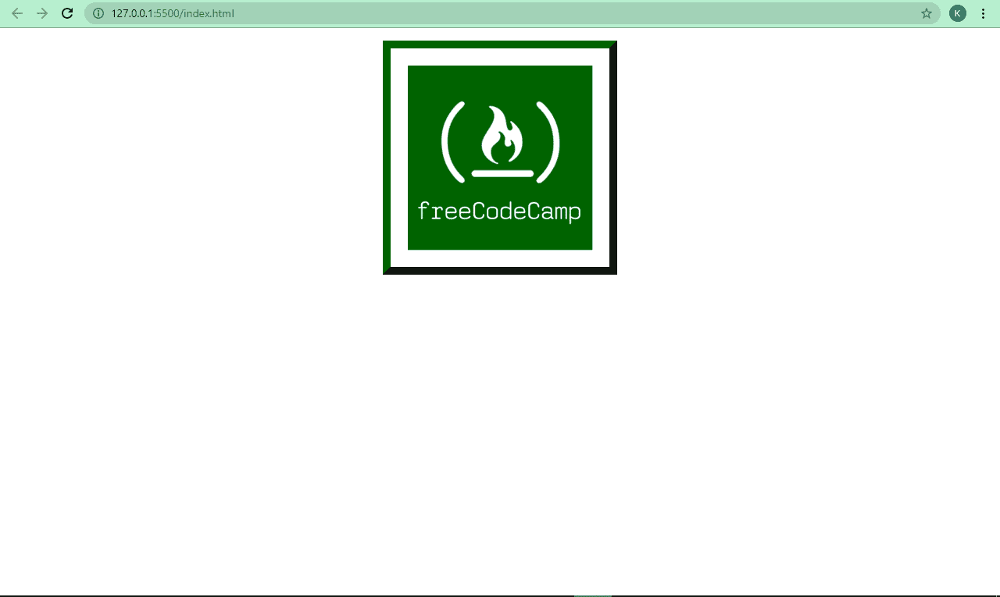
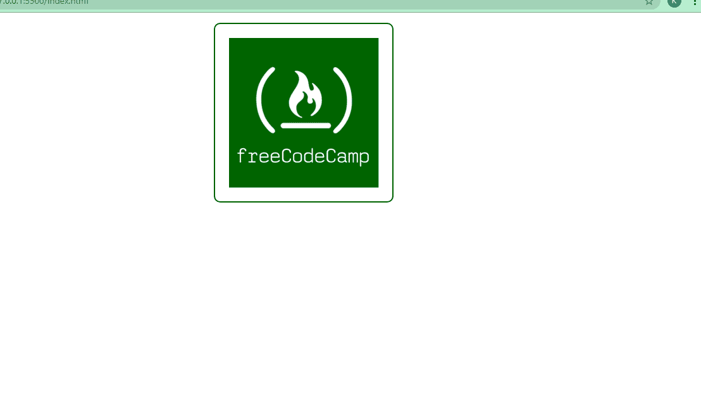
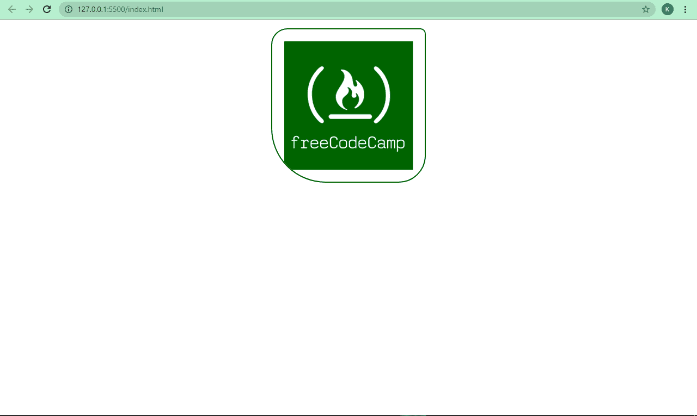
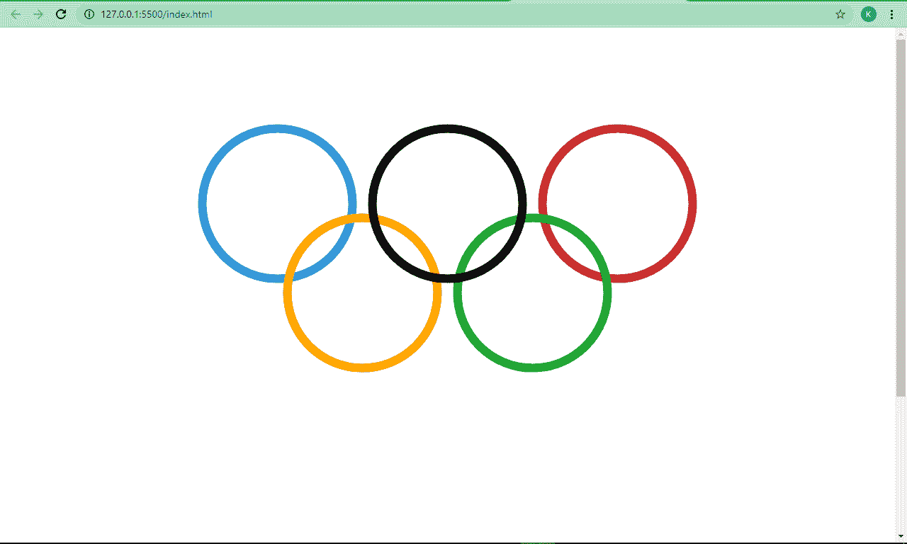

# CSS 边框样式和 HTML 代码示例

> 原文：<https://www.freecodecamp.org/news/css-border-style-and-html-code-examples/>

在 CSS 中，一切都是一个盒子。每个框——无论是文本、图像、div、span 还是任何其他元素——都有一个边框，将它的边缘与周围的其他框分开。

CSS border 属性允许我们对单个框的边框做一些事情。熟悉这个属性真的可以帮助你更有效地调试，更漂亮地设计你的网页。

在本教程中，我们将详细了解 CSS 的边界属性。这将帮助您熟悉它，并开始在您的下一个编码项目中使用它。

## CSS `border`属性是什么？

虽然需要注意的是，这是一个非常有用的简写方式，我们将在本教程的后面讲到。

因此，除此之外还有`border-width`、`border-style`、`border-color`和`border-radius`子属性。让我们一个一个的来看看。

### CSS `border-width`属性

使用`border-width`属性来指定边框的宽度。该值通常用像素(px)表示，但也可以用 rem、em 和百分比(%)表示。

这还没有结束——该属性还将`thin`、`medium`和`thick`作为值。

`border-width`属性是`border-top-width`、`border-right-width`、`border-bottom-width`和`border-left-width`的简写，按顺时针方向移动。因此，如果您愿意，您可以对上边框、右边框、下边框和右边框应用不同的宽度值。

### CSS `border-style`属性

使用`border-style`属性，您可以访问不同的样式，您可以应用到一个框的边界。需要`none`(默认)`solid``dashed``dotted``double``groove``ridge``inset``outset`。

就像`border-width`，`border-style`是`border-top-style`，`border-right-style`，`border-bottom-style`，`border-left-style`的简称。同样，如果您不想使用简写，可以为属性指定不同的值。

### CSS `border-color`属性

属性让你为你的边框指定不同的颜色。您可以使用命名颜色、RGB 颜色和 HSL 颜色来指定该颜色，没有任何限制。

黑色是该属性的默认颜色。因此，如果你没有为它指定一个值，只要你把边框宽度和边框样式设置为某个值，就会自动设置为黑色。

与`border-width`和`border-style`一样，你也可以在边框的所有边上指定不同的颜色。所以，`border-color`是`border-top-color`、`border-right-color`、`border-bottom-color`和`border-left-color`的简写。

下面是代码片段及其各自的截图，显示了`border`的三个子属性:

```
 
```

```
img {
      display: block;
      margin: 0 auto;
      margin-top: 1rem;
    }

    img {
      border-top-width: 2px;
      border-right-width: 4px;
      border-bottom-width: 6px;
      border-left-width: 8px;
      border-top-style: solid;
      border-right-style: dotted;
      border-bottom-style: dashed;
      border-left-style: groove;
      border-top-color: #006100;
      border-right-color: #050116;
      border-bottom-color: #2ecc71;
      border-left-color: #3498db;
    } 
```


```
img {
      display: block;
      margin: 0 auto;
      margin-top: 1rem;
    }

img {
      border-width: 8px;
      border-style: solid;
      border-color: #006100;
    } 
```



```
img {
     border-width: 10px;
     border-style: outset;
     border-color: #006100;
   } 
```



您可以摆弄一下子属性，以便更好地理解它们的工作方式。

### `border`速记

我们已经逐个应用了`border`子属性(`border-width`、`border-style`和`border-color`)，但是它们可以与`border`简写一起应用。

这种简写非常有用，尤其是当你想要四个边都一样的时候，就像我下面做的那样:

```
img {
      border: 2px solid #006100;
    } 
```


### CSS `border-radius`属性

使用`border-radius`，您可以去除边框的锐边，使其变成圆角。我认为这也使它们更漂亮。

该值以像素(px)和百分比(%)指定，具体取决于您的偏好。

```
img {
      border: 2px solid #006100;
      border-radius: 10px;
    } 
```



如果你愿意，你也可以用`border-top-right-radius`、`border-top-left-radius`、`border-bottom-right-radius`和`border-bottom-left-radius`为边框的上、左、下、右边缘指定不同的半径。这是因为`border-radius`也是这四个子属性的简写。

我们也可以对边界应用一些半径:

```
img {
      border: 2px solid #006100;
      border-top-right-radius: 10px;
      border-top-left-radius: 30px;
      border-bottom-right-radius: 50px;
      border-bottom-left-radius: 100px;
    } 
```



## 一个小项目:如何使用 CSS `border`属性制作奥运五环

我们可以利用我们所学的关于`border`属性的知识，将它与 CSS 定位和 Flexbox 结合起来制作奥运五环。

```
 <section class="container">
      <section class="top">
        <div class="red"></div>
        <div class="black"></div>
        <div class="blue"></div>
      </section>

      <section class="bottom">
        <div class="green"></div>
        <div class="yellow"></div>
      </section>
    </section> 
```

```
div {
      height: 12.5rem;
      width: 12.5rem;
      border: 12px solid;
      border-radius: 50%;
      margin: 1rem;
    }

    .blue {
      color: #3498db;
    }

    .black {
      color: black;
      position: relative;
      z-index: 1000;
    }

    .red {
      color: #ca2e2e;
    }

    .yellow {
      color: #ffa600;
    }

    .green {
      color: #19a019;
    }

    .container {
      display: flex;
      align-items: center;
      justify-content: center;
      transform: rotate(90deg);
    }

    .bottom {
      position: relative;
      right: 8.125rem;
    }

    @media screen and (max-width: 750px) {
      div {
        width: 130px;
        height: 130px;
      }

      .bottom {
        right: 7rem;
      }
    } 
```

那么这段代码是怎么回事呢？

奥林匹克五环有 5 个圆圈，3 个在顶部，2 个在底部，颜色分别是蓝色、黑色、红色、黄色和绿色。

为了使用 border-radius 属性制作一个圆，我们将宽度和高度分别设置为 12.5rem，然后将`border-radius`本身设置为 50%。这就是你如何用 CSS 做一个圆。

我们将顶部和底部的环放在一个父容器中，所以我们可以用 CSS Flexbox 将它们一个放在另一个上面。但是这并没有完成工作，所以我们使用 CSS 动画的 transform 属性来完成它。

最后，我们对 CSS 定位做了一些小小的调整，以使圆环互锁。

最终，我们得到下面的结果:


## 结论

我希望这篇教程可以帮助你开始使用 CSS `border`属性，这样你就可以在你的项目中有效地使用它。

非常感谢你的阅读，祝你玩得愉快。