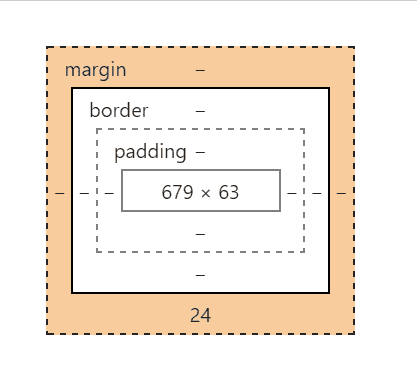
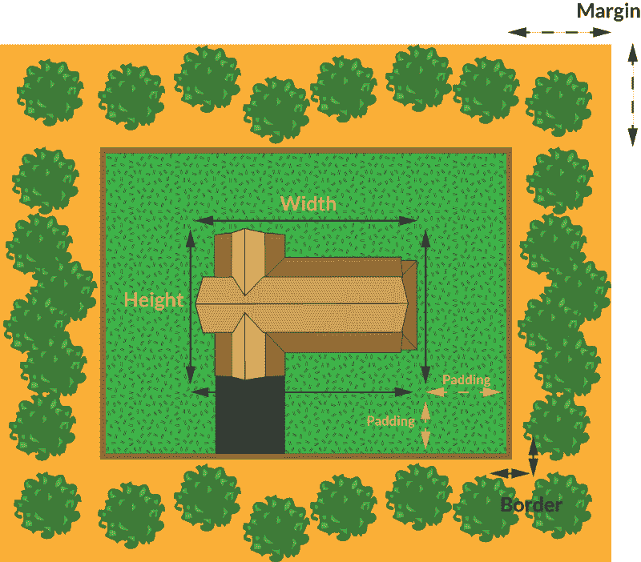
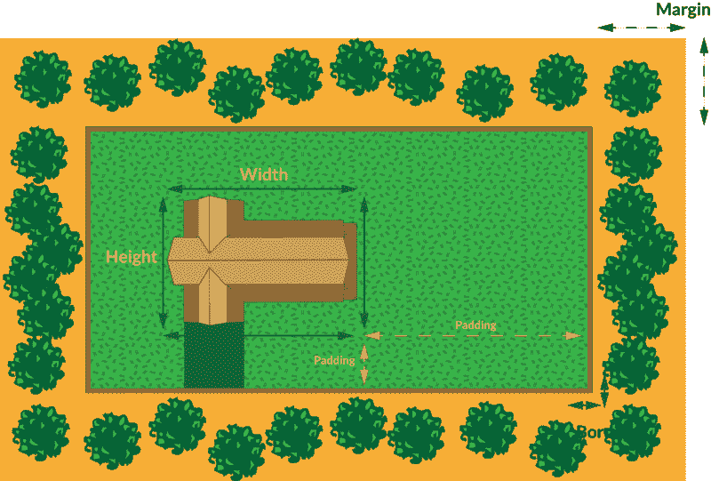
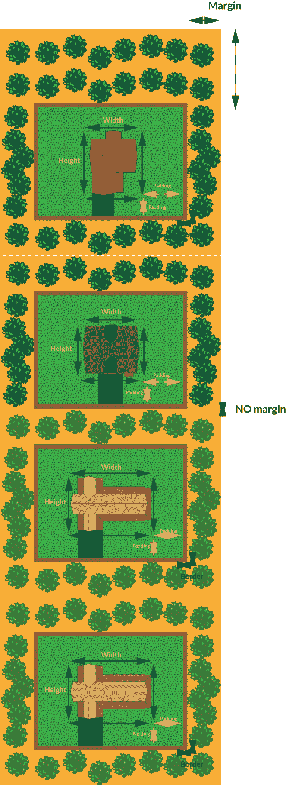
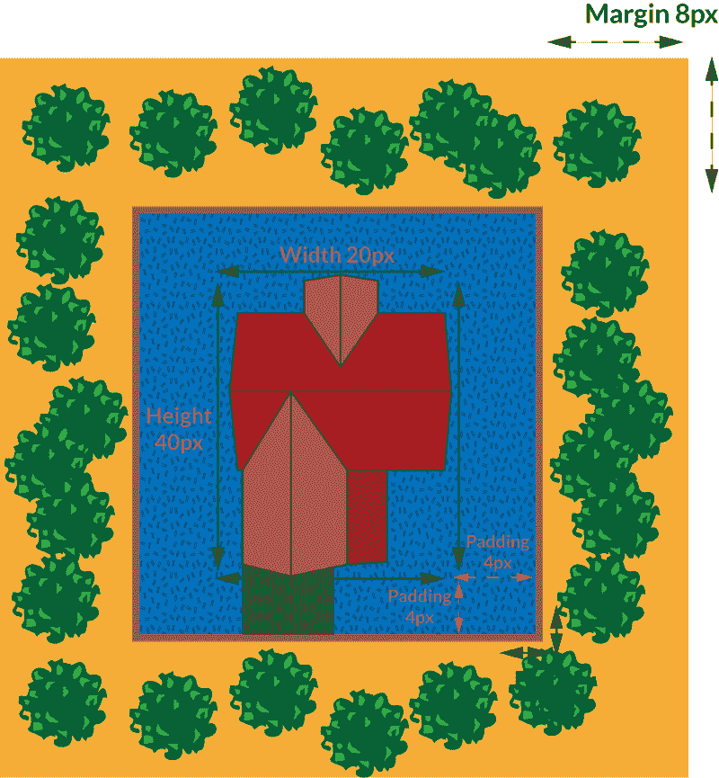
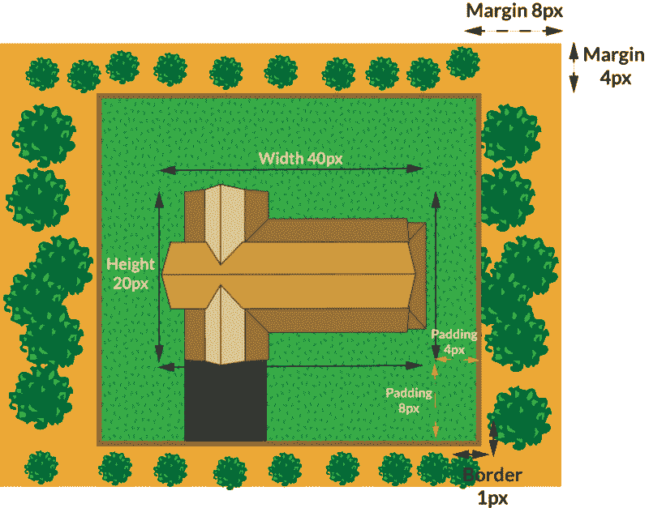

# 生活在一个无聊的郊区社区解释了 CSS 盒子模型

> 原文：<https://www.freecodecamp.org/news/css-box-model-explained-by-living-in-a-boring-suburban-neighborhood-9a9e692773c1/>

凯文·科诺年科

#### 如果你去过普通的郊区，那么你就能理解 CSS 盒子模型。

一个有经验的前端 web 开发人员会告诉你，一个 HTML 布局其实就是一系列的盒子。这些盒子在它们的容器盒中相互堆叠，那些容器盒在一个更大的容器盒中相互堆叠，然后…

哇哦。这是许多盒子中的盒子。我想至少一周内我都不想听到“盒子”这个词。此外，框的概念没有很好地描述边距和填充。这是创建等间距元素的两个最大的工具。

实际上，在安排 HTML 元素时，有一点细微的差别。CSS 盒子(喘息！)模型允许我们在页面上创建平衡且易读的内容。

盒子模型的不同部分有点像典型的郊区住宅开发中的地产。如果你能正确地使用它们，你就可以避免在繁琐的 CSS 上花费数小时的反复试验。

如果你正在寻找一个更技术性的解释，MDN 有一个[非常好的解释](https://developer.mozilla.org/en-US/docs/Web/CSS/CSS_Box_Model/Introduction_to_the_CSS_box_model)。

#### 盒子模型的主要部分

有 5 个重要属性允许您调整 HTML 元素的大小和分布:

*   宽度
*   高度
*   填料
*   边境
*   边缘

这是它在图表中的样子:

呀！对于一个元素来说，盒子太多了。让我们退一步说。这里实际上有三个不同的区域。

**区域 1:** 实际元素的高度和宽度。这是房子本身。在图中，这是 679 像素乘 63 像素。

**区域 2:** 受边界限制的元素周围的区域。这有点像你家的院子和栅栏。这是**填充**和**边界**。

**区域 3:** 将该元素与周围元素隔开的空白空间。这类似于技术上仍然是你的财产的一部分的树，但是给你一些来自邻居的隐私，只是为了给你一个缓冲。这就是**的余量**。

请记住，每个 div、段落和标题都有这些属性。当一系列元素堆叠在一起，并且不知道哪些元素包含缓冲空间时，很快就会变得混乱。

边距和填充之间的差异可能是**最具挑战性的部分**。这两者用于不同的原因。正如你所看到的绿草，填充仍将有一个背景颜色，如果你选择设置它。如果你想改变**边界**和**内容之间的距离，这也是你想改变的属性。**

假设你想在房子的右边有一个大院子，这会让右边的边界变得很远。您可以用**右填充**属性来改变这一点。

**边距**属性影响元素之间的间距。这就是那种没有发展的“无人区”。严格来说，它是用来分隔元素的。这里有一排房子，其中一些有更大或更小的利润。

注意:这些堆叠房屋中的每一个都必须有一个显示值为“内嵌块”的显示。防止[边缘塌陷](https://developer.mozilla.org/en-US/docs/Web/CSS/CSS_Box_Model/Mastering_margin_collapsing)。

#### 一些真实的例子

好吧，让我们使用一些真正的 CSS！想象一下，你有很多具有以下特征的东西:

这看起来是这样的:

一些观察结果:

1.  请注意背景色只影响边框内的像素。边距不受此属性的影响
2.  当您用一个值声明边距和填充时，比如 4px，CSS 会自动将该数字应用到元素的顶部、底部、左侧和右侧。

这是最后一个例子。在这个例子中，我们将在声明填充和边距时使用两个值。第一个值决定顶部/底部，第二个值决定左侧/右侧。

这是图表:

如果你喜欢这篇文章，你可能也会喜欢我对挑战 CSS、JavaScript 和 SQL 主题的其他解释，比如定位、模型-视图-控制器和回调。

如果你认为这可能会帮助和你处境相同的人，那就给它一颗“心”吧！