# CSS 盒子模型属性–用✨的例子解释

> 原文：<https://www.freecodecamp.org/news/css-box-model-explained-with-examples/>

今天我们将通过例子学习如何使用 **CSS 盒子模型**。这将有助于你制作完美的网站，并教你更准确地使用框尺寸、边距、填充和边框属性。

我们还将看到这些属性的一些实际用例。我们开始吧💖

## 目录

*   **[为什么要学习 CSS 盒子模型？](#why-learn-css-box-model)**
*   [CSS 盒子模型图](#css-box-model-diagram)
*   [填充属性](#the-padding-property)
*   [边界属性](#the-border-property)
*   [保证金属性](#the-margin-property)
*   [**装箱规格**属性。](#the-box-sizing-property)
*   [内容框 **VS** 边框](#what-is-the-difference-between-content-box-and-border-box-in-css)

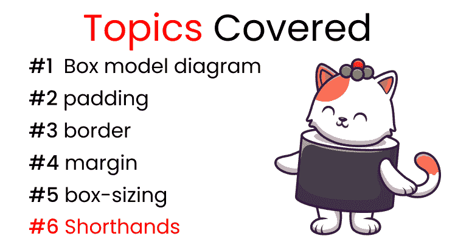

**Topics covered**

### 如果你喜欢，你也可以在 YouTube 上观看这个教程:

[https://www.youtube.com/embed/WJ8Yoi04XvQ?feature=oembed](https://www.youtube.com/embed/WJ8Yoi04XvQ?feature=oembed)

## 为什么要学习 CSS 盒子模型？

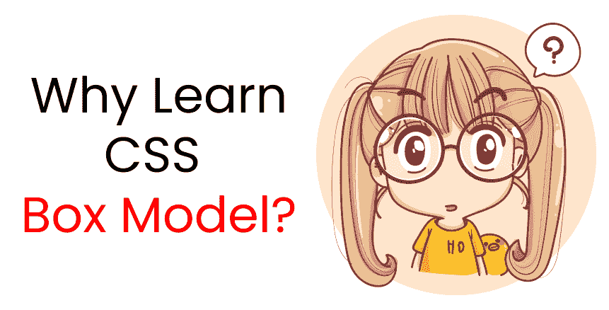

CSS 盒子模型包括**盒子大小、填充**和**边距**属性。如果你**不**使用它们，你的网站就会变成这样👇

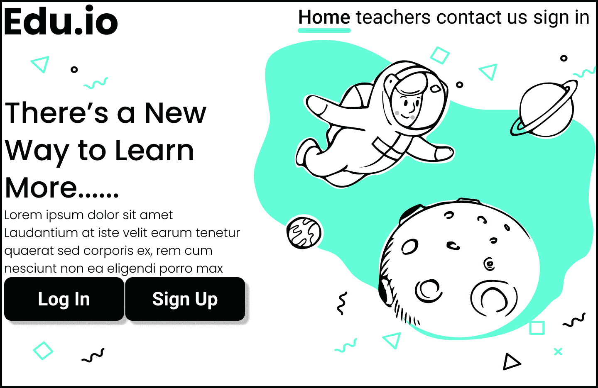

**A website with no margin or padding**

但是如果你正确使用盒子模型属性，你的网站将会是这样的👇

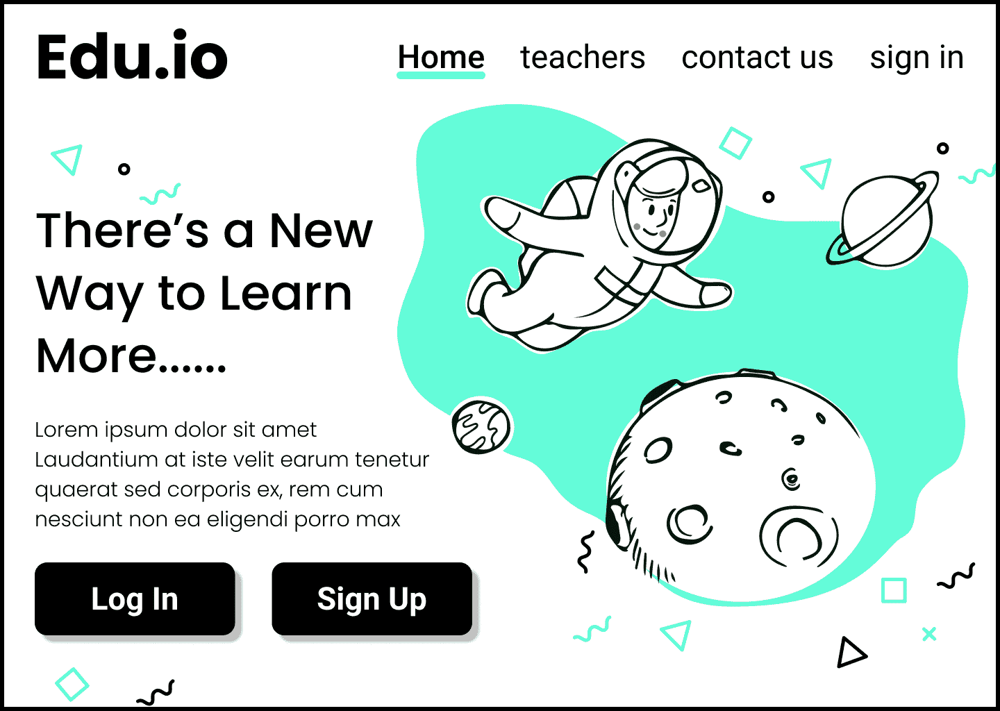

**A website using box model properties**

视觉上更吸引人，对吧？如果你想让你的网站有精确的计算，就像上面的一样👆那么这个题目是给你的。学习 CSS 盒子模型是帮助你制作完美网站的众多方法之一。

本文将讨论如何使用这些属性:

*   填料
*   边缘
*   边境
*   盒子尺寸

## 如何使用 CSS 盒子模型属性

让我们看一些例子，看看我们可以在哪里使用 CSS 盒子模型的属性。我们将剖析上面显示的网站。👆

让我们仔细看看**导航条**。您可以注意到使用 padding 属性的示例和不使用 padding 属性的示例之间的区别:

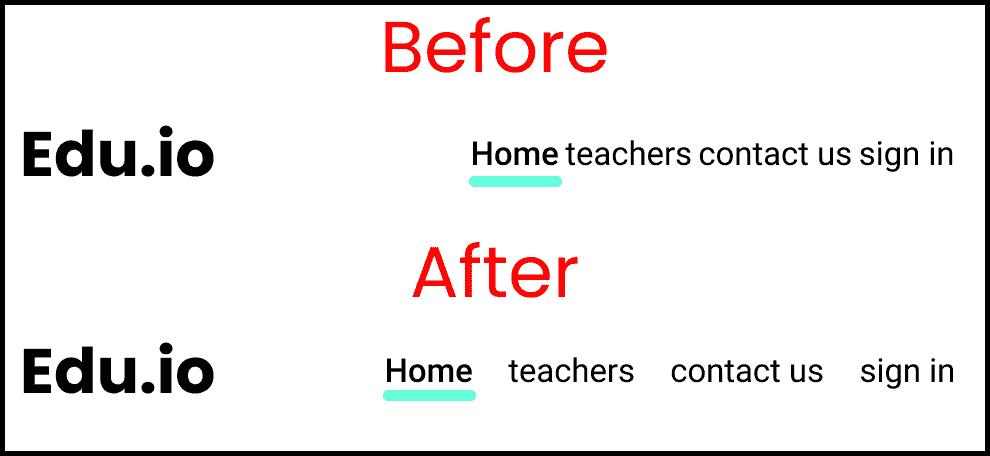

**Navbar items using the padding property**

现在让我们仔细看看**内容部分以及按钮**。同样，你会注意到不同之处——右边的也使用了**填充**属性。

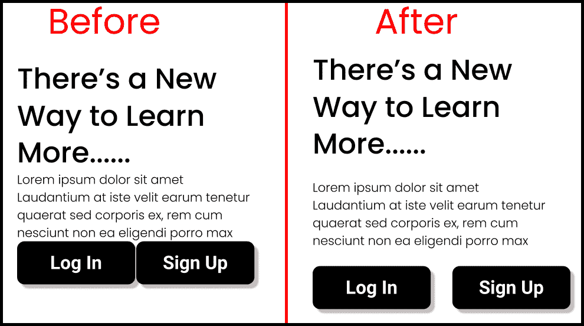

**A content section using the padding property**

## CSS 盒子-模型图

把 CSS 盒子模型想象成一个洋葱。它有**4 层**:

*   **第一层**内容
*   **第二层**填充
*   **第三层**层:边框
*   **第四层**页边距

### 第一个盒子-模型层:内容

在 HTML 中，**一切都表现得像一个盒子**。让我们插入一些带有小猫图片的内容。👇

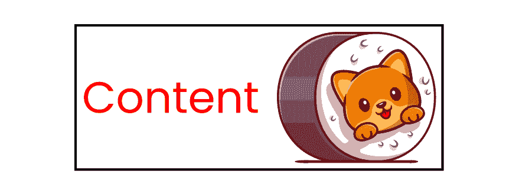

**1st layer of the box model: content**

### 第二个盒子-模型层:填充

CSS 盒子模型的下一层是**填充**层。它这样包装我们的内容👇


**2nd layer of the box model: padding**

### 第三个盒子-模型层:边框

CSS 盒子模型的下一层是**边框**层。它像这样包装我们的内容+填充👇


**The black dashed line is the border**

### 第四个框-模型层:边距

CSS 盒子模型的下一层也是最后一层是**边距**层。它这样包装我们的内容+填充+边框👇

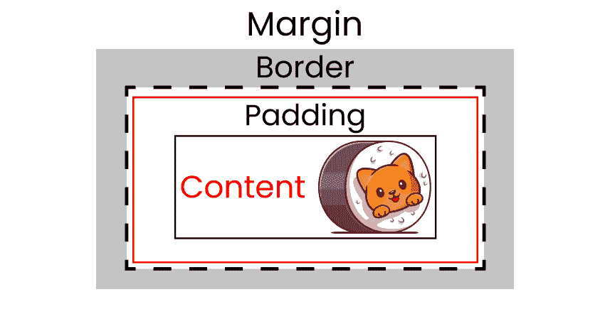

**Grey Region is The Margin**

好，让我们看看这些属性在项目中是如何工作的。

## 如何设置项目


这个教程对每个人都有好处，包括初学者。如果你想继续编码，那么遵循以下步骤。

### 超文本标记语言

打开 VS 代码或 [Codepen.io](http://codepen.io/) 并写入该代码👇**体内标签:**

```
<div class="box-1"> Box-1 </div>
```

### 半铸钢ˌ钢性铸铁(Cast Semi-Steel)

清除我们浏览器的默认样式👇

```
* {
  margin: 0px;
  padding: 0px;
  font-family: sans-serif;
} 
```

现在，让我们来设计我们的盒子👇

```
.box-1 {
  width: 300px;
  background-color: skyblue;
  font-size: 50px;
}
```

我们都准备好了，开始编码吧！✨

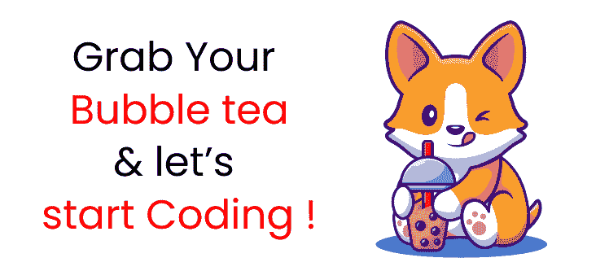

## Padding 属性

不过先来讨论一下 padding 属性的**实际用途**。然后，我们将看到如何使用这个属性。

一般我用填充在内容之间放一些空格。看这个**导航条**👇


**Navbar items using padding property**

这是另一个例子，看看下面的内容，有两个按钮👇


**content section using padding property**

### 如何在 CSS 中使用 padding 属性

这是四个填充属性的**简写**:

*   衬垫顶部
*   填充-右侧
*   底部填充
*   填充-左侧


**Shorthand of padding property**

记住，填充是你在**主内容**上添加的空间:

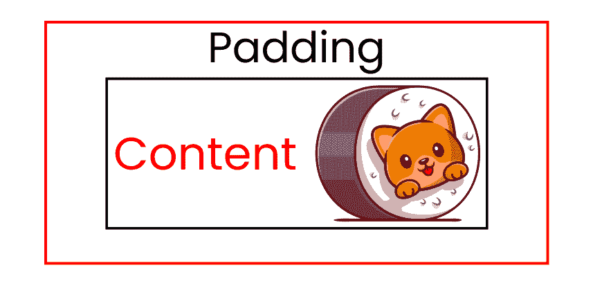

**2nd Layer of Box-Model : Padding**

让我们给我们的内容添加一些填充。**红色区域是填充区👇**

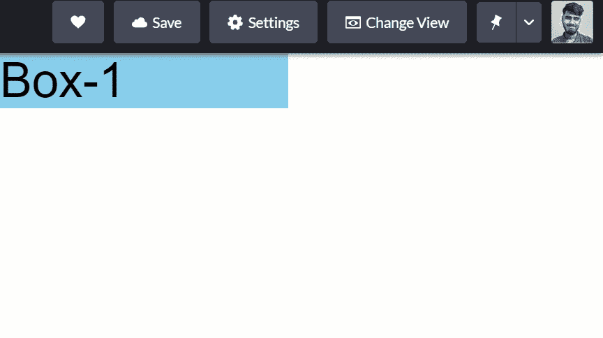

**The red colored area is padding**

为了重现上面的结果，☝在你的 CSS 中写下这段代码:👇

```
// Padding added on top, right, left, bottom of .box-1

.box-1{
   padding : 100px;
}
```

让我们打开开发人员控制台，**转到计算部分**:

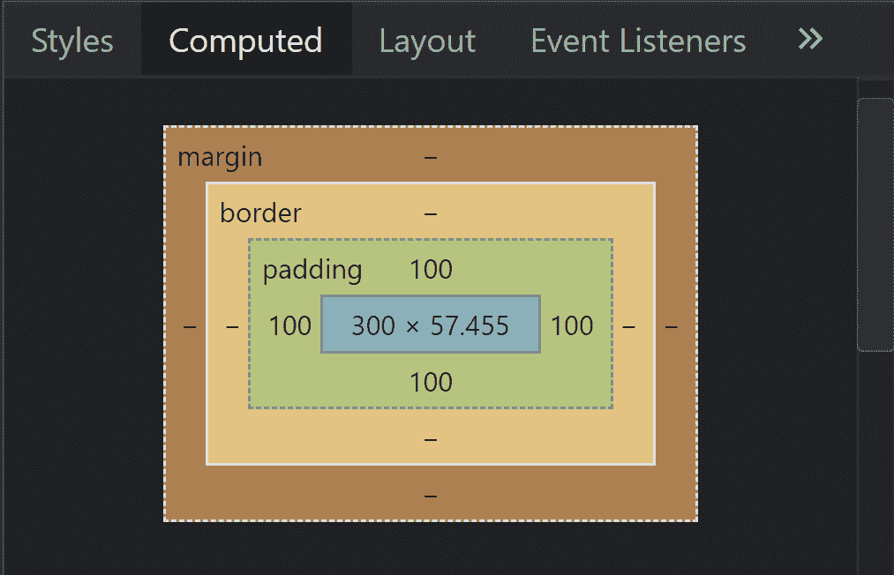

**Computed CSS Box model **

最中间是我们的**内容**，宽度为 **300px** 。环顾我们的内容，我们已经添加了 **100px 填充**。

让我们尝试将填充符添加到内容的一侧(仅右侧):

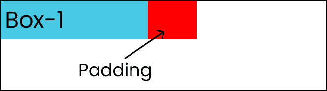

**padding-right property**

为了重现上面的结果，☝在你的 CSS 中写下这段代码:👇

```
.box-1{
   padding: 0 100px 0 0;
}

// Or you can use 👇

.box-1{
   padding-right: 100px;
}
```

现在，在开发人员控制台上打开计算部分👇

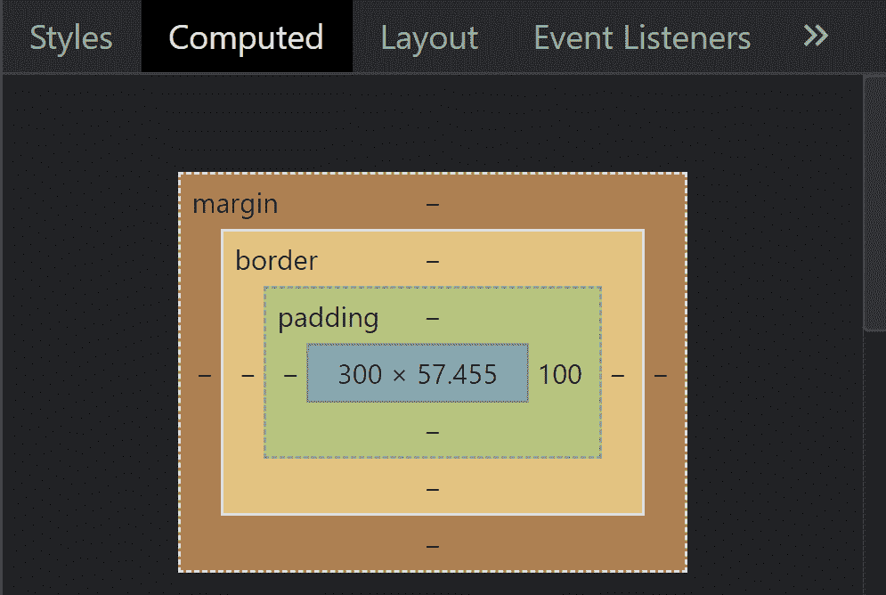

**Computed CSS Box model **

看——100px**的填充只在我们指定的内容的**右侧**添加。**

## **边境地产**

**在制作按钮时，您通常会使用 border 属性**。这里有一个 GIF 演示👇****

**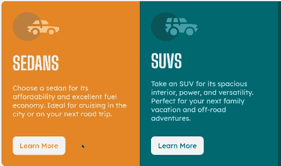

**Buttons using the border property**** 

**请注意，当我将鼠标悬停在按钮上时，按钮周围会出现一个白色边框。**

### **如何在 CSS 中使用 border 属性**

**记住，**边框**是添加在我们**主要内容+填充** : **顶部的空间👇****

**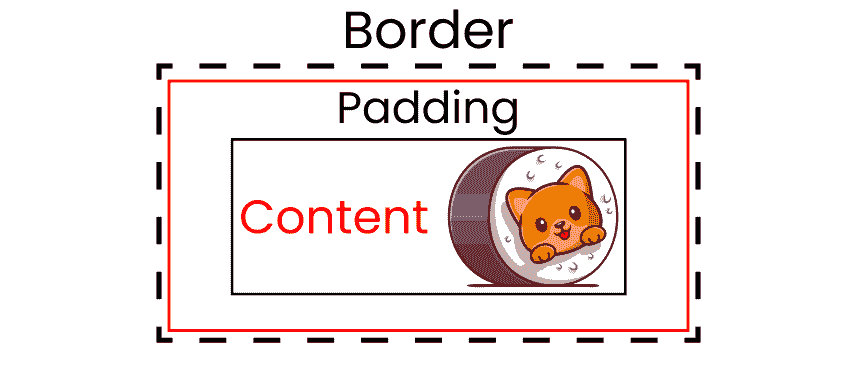

**The black dashed line is the border**** 

**边界属性有三个关键的输入:**

*   **边框大小**
*   **边框样式:**实线/虚线/虚线****
*   **边框颜色**

**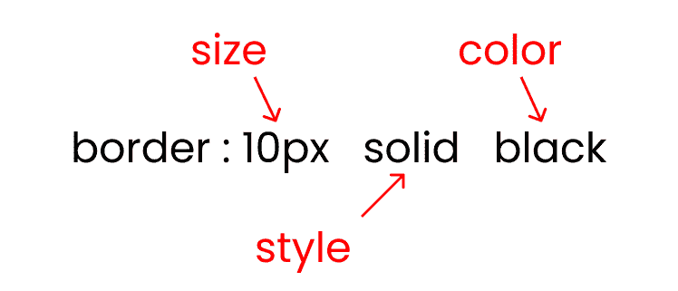

**Border property syntax**** 

**我上面列出了三种类型的边界属性。在本例中，我们将使用**虚线**样式:**

**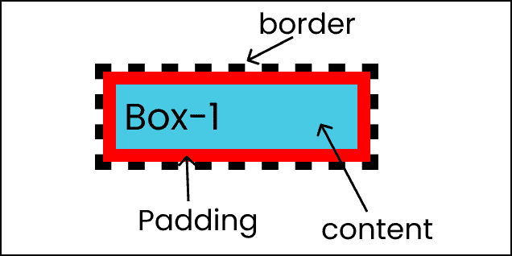**

**要重新创建上述结果，请在 CSS 中编写以下代码:👇**

```
`.box-1 {
  width: 300px;
  font-size: 50px;
  padding: 50px;
  border: 10px dashed black;
}` 
```

**让我们打开控制台，查看箱式模型计算:**

**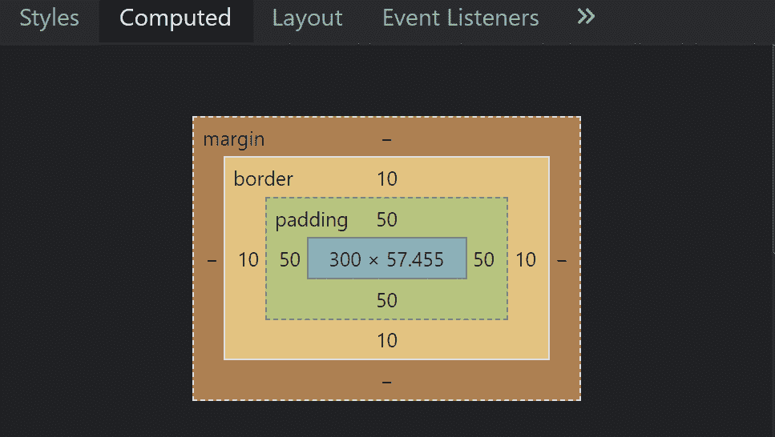

**Computed CSS box model**** 

**现在看看上面的 image☝——在我们的**内容+填充**周围添加了一个 10px 的边框。**

## **保证金财产**

**通常，我使用 **margin** 属性在我的内容和桌面布局上的主屏幕(大屏幕)之间放置一些**空白**。看这张 GIF:👇**

**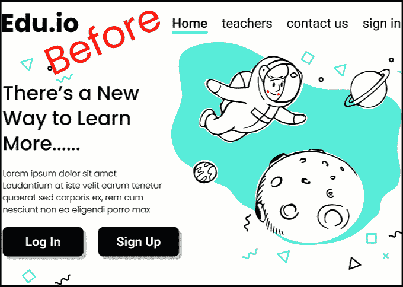

**Adding margin to a website**** 

**请注意，我在上面的网站的左右边缘添加了边距👆**

**这里是 margin 属性的一个用例的另一个示例 GIF:👇**

**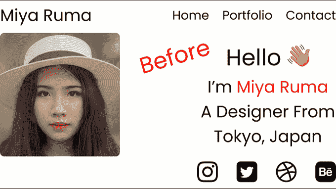

**Adding margin to a website**** 

### **如何在 CSS 中使用 margin 属性**

**这是 margin 属性的四个属性的**简写**:**

*   **上边距**
*   **右边距**
*   **页边距-底部**
*   **左边距**

**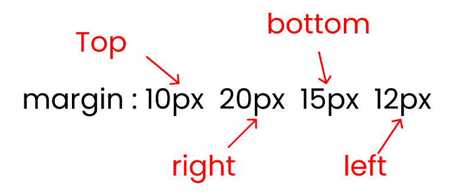

**Shorthand of the margin property**** 

**请记住， **margin** 是添加在我们的**主要内容之上的空间+填充+边框**:**

**

**The grey region is the margin**** 

**让我们为我们的内容添加一个边距。**由于 GIF: **中的页边距**，内容被推送👇****

**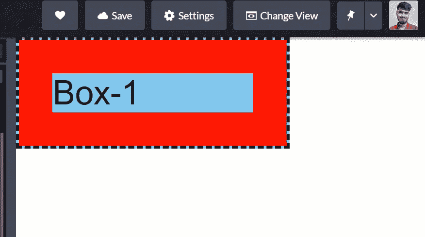

**Content getting pushed due to margin**** 

**要重新创建上述结果，请在 CSS 中编写以下代码:👇**

```
`.box-1 {
  padding: 50px;
  border: 10px dashed black;

  margin: 50px;
}`
```

**我们可以再次检查计算结果:👇**

**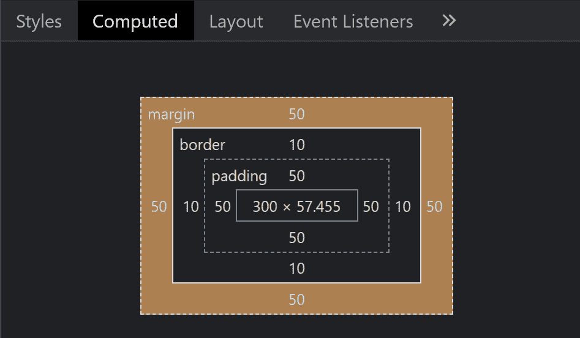

**Computed CSS box model**** 

**看，我们的**内容+填充+边框**周围都增加了 50px 的边距。**

**让我们试着在内容的一侧(仅左侧)添加一个**边距**:**

**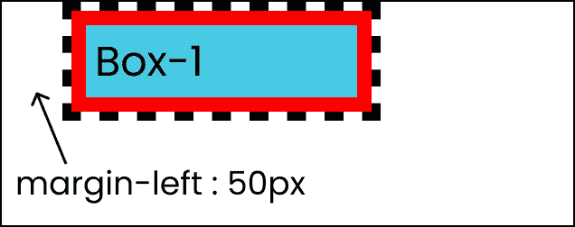

**The margin-left property**** 

**要重新创建上述结果，请在您的 CSS 中编写以下代码👇**

```
`.box-1 {
  padding: 50px;
  border: 10px dashed black;

  margin-left: 50px;
}`
```

**在控制台上，我们可以看到仅在**左侧**应用了 **50px 边距**👇**

**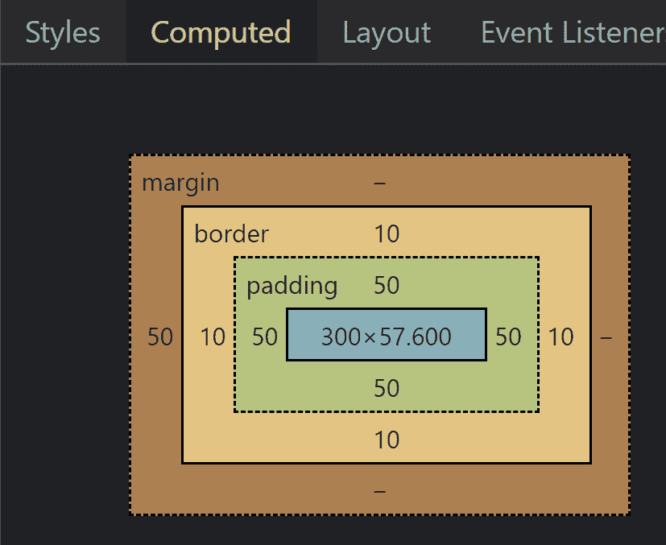

**Computed CSS Box Model **** 

## **休息一下！**

**到目前为止还不错——休息一下吧！这是你应得的💖**

****

## **框大小属性**

**这个属性定义了如何计算边距、填充和边框。有三种类型的计算(你可以称之为数值):**

*   **边框**
*   **填充盒**
*   **内容框**

### **注意:**

**我们不打算讨论**框大小:填充框，**因为只有 Firefox 支持它，而且不经常使用。**

## **CSS 中的内容框和边框有什么区别？**

**边框和内容框的工作方式是一样的。看看这些图片:👇**

**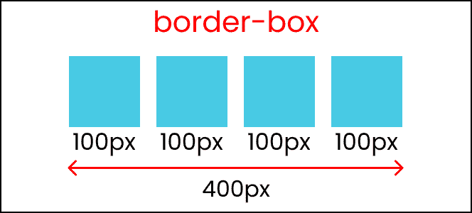

**Boxes using the border-box value**** **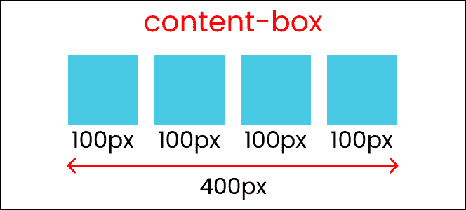

**Boxes using the content-box value**** 

**那么，这里的主要区别是什么呢？当我们给盒子添加边距、边框或填充时，这种差异是显而易见的。**

**当我们使用 **box-sizing: content-box** ，这是默认值，它将**在框**外添加边距、填充和边框**，就像这样:👇****

**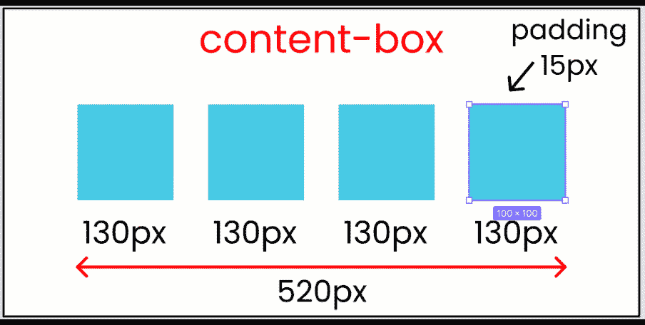

**Padding getting applied outside the box**** 

**你也可以在这里看到计算结果:👇**

**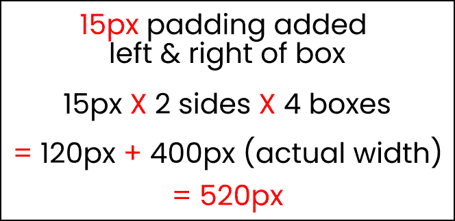

**Calculations with content-box**** 

**这意味着事情可能会失去控制，你会看到意想不到的计算。这意味着很难制作响应性网站。总是使用**框大小:边框框**属性。**

**但是当我们使用 **box-sizing: border-box** 属性时，它会**在框**内添加边距、填充和边框**，就像这样:👇****

**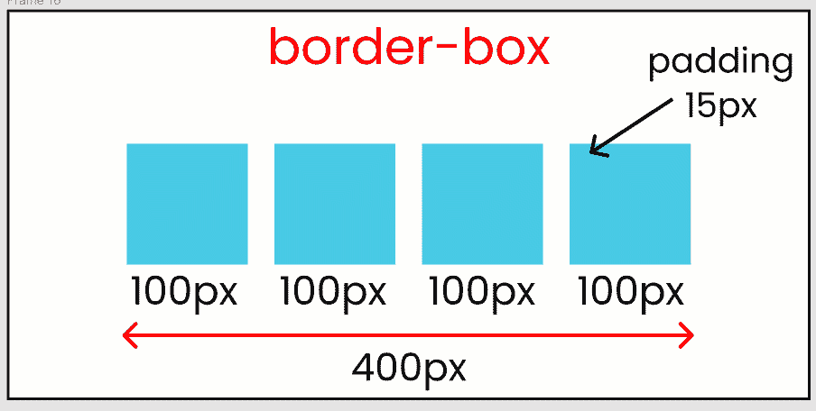

**Padding getting applied inside the box**** 

****box-sizing: border-box** 属性向我们展示了 HTML 元素的**精确**计算，这意味着这个值对于制作响应式网站来说是**理想值。****

**您也可以试验这些值，只需遵循以下代码即可:👇**

```
`* {
  box-sizing: border-box;
}

/* Or, Write 👇 */

* {
  box-sizing: content-box;
}`
```

## **结论**

**恭喜你！你现在可以制作完美的网站。不仅如此，当你编码时，你可以找出为什么你的内容表现奇怪。**

**这是你的阅读到最后的奖章，❤️**

## **建议和批评是高度赞赏❤️**

****

****YouTube[/Joy Shaheb](https://youtube.com/c/joyshaheb)****

****LinkedIn[/JoyShaheb](https://www.linkedin.com/in/joyshaheb/)****

****推特[/JoyShaheb](https://twitter.com/JoyShaheb)****

****insta gram[/JoyShaheb](https://www.instagram.com/joyshaheb/)****

## **信用**

*   **[来自 Freepik 的图片](https://www.freepik.com/collection/css-box-model-vectors/2187534)**