# 通过编写一个漂亮的按钮✨来学习 CSS 盒子阴影属性

> 原文：<https://www.freecodecamp.org/news/css-box-shadow-property-with-examples/>

今天我们将学习如何使用 CSS 的 **box-shadow** 属性来制作漂亮的网站组件。在这个过程中，我们将**创建一个按钮**，并获得使用该属性的实际经验。让我们开始吧。🎖️

# 目录

*   [**为什么**应该使用 CSS 的 box-shadow 属性](#why-should-you-use-the-css-box-shadow-property)
*   [盒子阴影属性](#the-syntax-of-the-box-shadow-property)的**语法**
*   [如何使用 box-shadow 属性制作一个**按钮**](#how-to-add-a-drop-shadow-to-a-button)
*   [附加资源](#additional-resources)
*   [什么是中的**插图**CSS**框阴影属性**？](#what-is-inset-in-the-css-box-shadow-property)

## 如果你喜欢，你也可以在 YouTube 上看这个教程:

[https://www.youtube.com/embed/4Clc-Bb5sY4?feature=oembed](https://www.youtube.com/embed/4Clc-Bb5sY4?feature=oembed)

# 为什么应该使用 CSS box-shadow 属性？

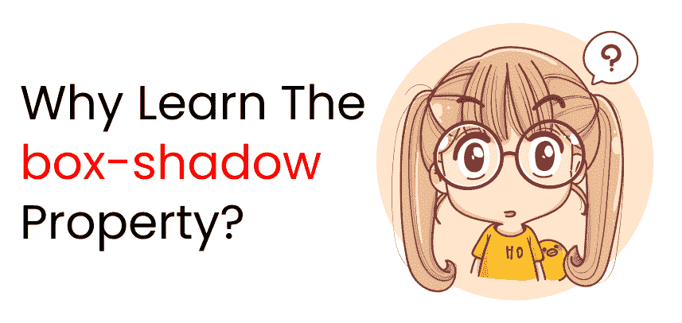

关注小细节区分一个好网站和一个外观优秀的网站。如果你想把这些小细节添加到你的网站上，你一定要把这个属性和其他属性一起使用。

让我们看一些例子。👇

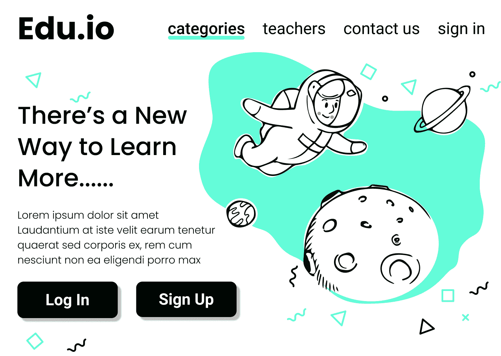

**A Website Design**

请密切注意上图中的按钮组件。你会看到我们有一些阴影。☝

让我们进一步检查这些按钮:👇

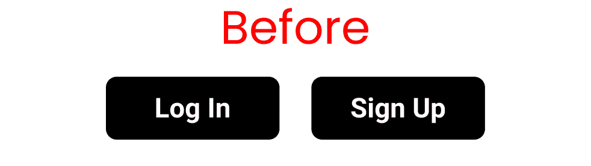

**Button with no box-shadow property**

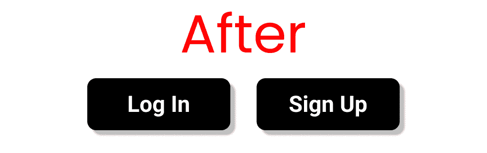

**Button using the box-shadow property**

你可以看出，后者看起来更有活力、更有趣，因为它更注重细节。这叫做**投影效果**。让我们看看如何在我们的代码中实现它。

# **项目设置**

### 超文本标记语言

在 body 标记内编写以下代码:👇

```
<div class="box-1"> A Button </div>
```

### 半铸钢ˌ钢性铸铁(Cast Semi-Steel)

像这样清除您的默认浏览器设置:

```
*{
   margin: 0px;
   padding: 0px;
   box-sizing: border-box;
   font-family: sans-serif;
}
```

现在，让我们用下面的代码创建一个按钮:👇

```
.box-1{
   margin: 100px 0 0 100px;
   height: 80px;
   width: 200px;
   border: 2px solid black;
   border-radius: 8px;
   font-size: 40px;

   display: grid;
   place-content: center;
} 
```

我们都准备好了，现在让我们开始编码吧！

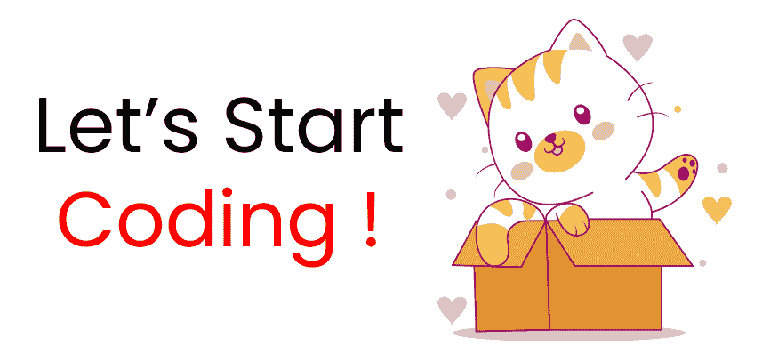

# 方框阴影属性的语法

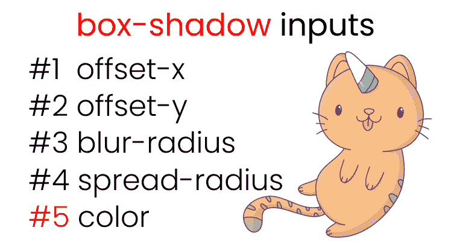

**All the inputs of box-shadow property**

下面是 box-shadow 属性的语法:👇

```
box-shadow: offset-x | offset-y | blur-radius | spread-radius | color ;
```

让我们更详细地看一下每个部分。

## 如何在 box-shadow 属性中使用偏移 x

您将使用 offset-x 属性沿 X 轴左右移动阴影。这里有一个演示，向您展示它是怎样的:👇

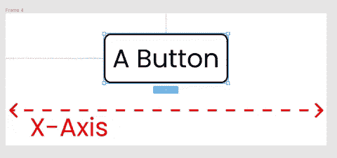

**We can move the shadow left & right**

要重新创建这些结果，请在 CSS 中编写以下代码:👇

```
/* offset-x | offset-y | color */
.box-1{
   box-shadow: -50px 0px rgba(0,0,0,0.5);
}

/*Or, you can write*/

.box-1{
   box-shadow: 50px 0px rgba(0,0,0,0.5);
}
```

## 如何在框阴影属性中使用 Offset-y

您将使用 offset-y 属性沿 Y 轴上下移动阴影。这里有一个演示:👇

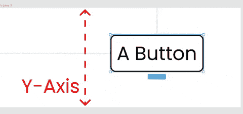

**We can move the shadow top & bottom**

要重新创建这些结果，请在 CSS 中编写以下内容:👇

```
/* offset-x | offset-y | color */
.box-1{
   box-shadow: 0px -50px rgba(0,0,0,0.5);
}

/*Or, you can write*/

.box-1{
   box-shadow: 0px -50px rgba(0,0,0,0.5);
}
```

### 如何组合偏移-x 和偏移-y

在 CSS 中编写以下代码:👇

```
.box-1{
   box-shadow: 10px 10px rgba(0,0,0,0.5);
}
```

以下是按钮右侧和底部显示方框阴影的结果:👇

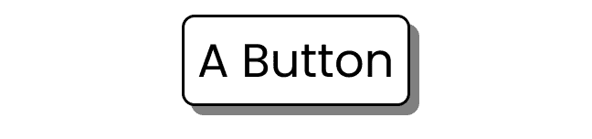

**Our button with box shadow**

## 如何在框阴影属性中使用模糊半径

模糊半径属性将模糊按钮周围的颜色，如下所示:👇

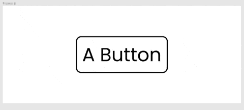

**Experimenting w/ blur radius**

若要复制结果，请在 CSS 中编写以下内容:👇

```
/* offset-x | offset-y | blur-radius | color */

.box-1{
/* play around with 👇 this */
   box-shadow: 0 0 50px rgba(0,0,0,0.8);
}
```

## 如何在框阴影属性中使用扩散半径

这个值将我们的阴影分布在按钮周围，就像这样:👇

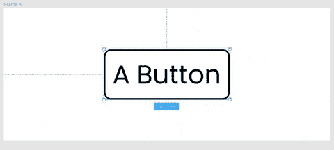

**Experimenting w/ spread radius**

让我们用下面的 CSS 代码重新创建结果:

```
/* offset-x | offset-y | blur-radius | spread-radius | color */

.box-1{
/*  play around with 👇 this */
   box-shadow: 0 0 0 50px rgba(0,0,0,0.5);
} 
```

# 如何给按钮添加阴影

让我们把目前为止所学的东西放在一起，给我们的按钮添加一个投影效果:👇

```
.box-1{
   box-shadow: 8px 10px 10px 1px rgba(0,0,0,0.5);
}
```

结果看起来像这样:👇


**The result**

# 额外资源

*   [ [GetCssScan](https://getcssscan.com/css-box-shadow-examples) ] -获取现成的盒子阴影
*   [[key frames . app](https://keyframes.app/animate/)-实时测试和练习这些属性
*   [flatuicolors](https://flatuicolors.com/) -漂亮的调色板

## ✨ Bonus Tip ✨

# CSS box-shadow 属性中的 Inset 是什么？

有一个名为`inset`的关键字可以用于 box-shadow 属性。这将把阴影放在我们的按钮内部，而不是在外部扩散。编写以下 CSS 代码进行试验:👇

```
.box-1{
   box-shadow: inset 8px 10px 10px 1px rgba(0,0,0,0.5);
}
```

结果如下:👇

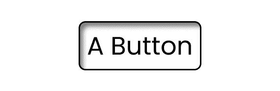

**Effect of the inset keyword**

# 结论

现在，你可以放心地使用框阴影属性，不仅添加**投影**，而且添加更多的**注意细节**到你的项目中。

这是你阅读到最后的奖章。❤️

### 建议和批评得到了❤️的高度赞赏


*   **YouTube[/Joy Shaheb](https://youtube.com/c/joyshaheb)**
*   **LinkedIn[/JoyShaheb](https://www.linkedin.com/in/joyshaheb/)**
*   **推特[/JoyShaheb](https://twitter.com/JoyShaheb)**
*   **insta gram[/JoyShaheb](https://www.instagram.com/joyshaheb/)**

# 信用

*   [少女](https://www.freepik.com/free-vector/young-girl-thinking-face-wondering-cartoon-illustration_11652601.htm#page=1&query=worried%20illustration&position=31)
*   [可爱猫](https://www.freepik.com/free-vector/cute-cat-playing-with-box-cartoon_13747509.htm?query=happy%20illustration)，[独角兽猫](https://www.freepik.com/free-vector/kawaii-cat-unicorn-character-collection_5481560.htm)