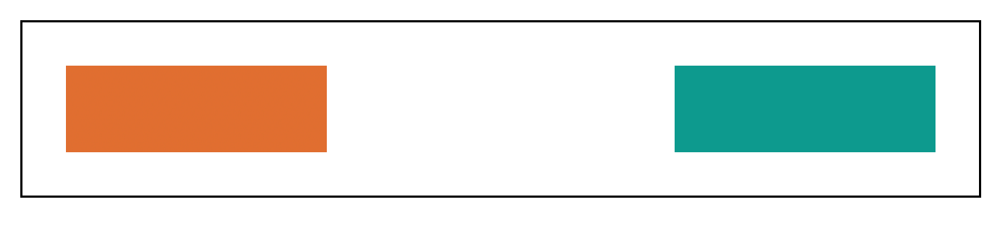
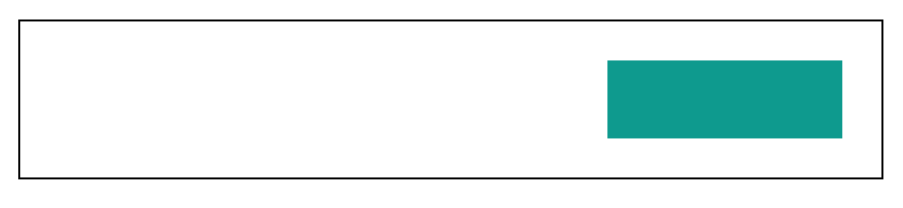
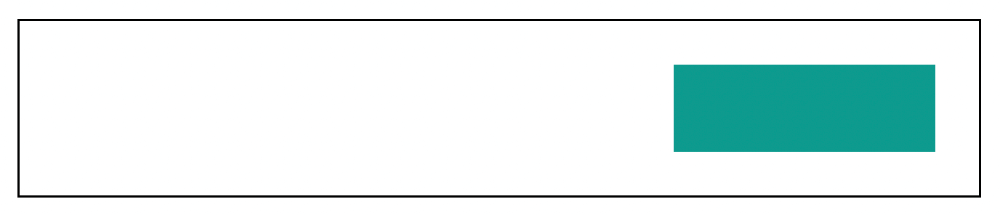

# CSS 显示:无和可见性:隐藏–有什么区别？

> 原文：<https://www.freecodecamp.org/news/css-display-none-and-visibility-hidden-the-difference/>

`display:none`和`visibility:hidden`是两个样式声明，你可以用它们来隐藏 CSS 在屏幕上的元素。但是它们之间有什么区别呢？

在构建应用程序时，有时您希望在视觉上隐藏元素(不是从 DOM 中删除它们，只是在屏幕上)。你可以用不同的方法来做这件事。

两种常见的方法包括使用带有 **none** 值的`display`属性或带有 **hidden** 值的`visibility`属性。

尽管这两种方法都在视觉上隐藏了元素，但它们导致元素以不同的方式表现。我将在本文中解释这些差异。

如果你感兴趣，这里有这篇文章的视频版本。

我将用下面的例子来解释这一切是如何工作的:

HTML:

```
<div class="container">
  <div class="block1"></div>
  <div class="block2"></div>
  <div class="block3"></div>
</div> 
```

和 CSS:

```
.container {
  padding: 20px;
  width: max-content;
  display: flex;
  border: 1px solid black;
}

.block1,
.block2,
.block3 {
  height: 40px;
  width: 120px;
}

.block1 {
  background-color: rgb(224, 110, 49);
  margin-right: 20px;
}

.block2 {
  background-color: rgb(77, 77, 234);
  margin-right: 20px;
}

.block3 {
  background-color: rgb(12, 154, 142);
} 
```

我们有一个`div`和一个**容器**的类。这个`div`有三个子`div` s，分别是 **block1** 、 **block2** 和 **block3** 的类。我们已经为`divs`指定了一些样式。第一个`div`小孩是橙色的，第二个是`blue`，第三个是`teal`。

结果如下:


## 如何在 CSS 中使用`display: none`

`display`属性设置元素如何显示(作为**内联**或**块**)，还决定元素子元素的布局(作为**伸缩**、**网格**等等)。

如果该属性的值为 **none** ，则该元素的显示将被关闭。这意味着该元素及其子元素将不会显示。文档被渲染成没有元素**，就像它不存在一样**。

现在让我们看看`display: none`是如何工作的。下面是一个将该样式应用于 **.block2** 元素的示例:

```
.block2 {
  background-color: rgb(77, 77, 234);
  margin-right: 20px;
  display: none;
} 
```

结果如下:


正如你在这里看到的，**。容器**元素的宽度减少了。就像 **.block2** 元素不存在一样。因为我们在这个元素上使用了`display:none`，所以它不会在文档中呈现。因此它在屏幕上的空间变得空出来，让其他元素占据。

我们也可以通过向 **.block1** 元素添加`display:none`来测试这一点:

```
.block1 {
  background-color: rgb(224, 110, 49);
  margin-right: 20px;
  display: none;
}

.block2 {
  background-color: rgb(77, 77, 234);
  margin-right: 20px;
  display: none;
} 
```

结果是:


这里你看到 **.block1** 和 **.block2** 没有渲染，所以它们的空间被占用了。

## 如何在 CSS 中使用`visibility: hidden`

`visibility`属性，顾名思义，指定一个元素是否可见。但是，该属性不影响元素的布局。这是与`layout`属性相比的主要区别。

使用该属性的**隐藏**值，它所应用到的元素变得“不可见”。元素的[盒子模型](https://youtu.be/opHpcJIUbEU)所需的空间保持不变，但是元素本身是隐藏的。

让我们看看这个属性如何应用到上面的例子中。下面是这个样式应用到 **.block2** 元素的结果:

```
.block2 {
  background-color: rgb(77, 77, 234);
  margin-right: 20px;
  visibility: hidden;
} 
```

结果是:



你会注意到，与`display: none`不同的是， **.block2** 元素是不可见的，但是它的布局保持不变。其实这个元素上的`margin-right`还在。只有元素本身是隐藏的。

让我们也将这个样式添加到 **.block1** 中来看看结果:



现在这两个元素都是不可见的，但是它们仍然呈现在文档中，所以它们的空间不是空的。

接下来你可能会想“T0 和 T1 有什么区别？”

## `visibility: hidden`对`opacity: 0`

两种风格看起来非常相似。在上面的例子中，我可以用`opacity:0`代替`visibility:hidden`来说明这一点:

```
.block1 {
  background-color: rgb(224, 110, 49);
  margin-right: 20px;
  opacity: 0;
}

.block2 {
  background-color: rgb(77, 77, 234);
  margin-right: 20px;
  opacity: 0;
} 
```

结果是:



你可以看到这个结果和之前的结果没有任何视觉上的区别。但是元素的行为有所不同。

带有`visibility: hidden`的元素是**不可交互的**。我不知道这是不是最合适的词😂但我的意思是，用户不能与这样的元素交互(例如，通过点击)。那是因为这样的元素确实是看不见的。

另一方面，带有`opacity: 0`的元素是**可交互的**，因为它们实际上是可见的，非常透明。属性不指定元素的可见性——它只指定透明度。

我们可以用一个例子来验证这种差异。假设【T1 . block 2 元素有这样一个`onclick`属性:

```
<div class="block2" onclick="alert('hello')"></div> 
```

如果你在这个元素上使用`visibility:hidden`，点击这个元素所在的空间将不会触发任何东西。但是如果在这个元素上使用`opacity:0`,点击相同的空间将触发显示“hello”文本的警告模式。你可以在你的浏览器上测试一下，看看这个。

## `display:none`和`visibility:hidden`的用例

这些样式声明可以服务于不同的目的，这取决于您想要实现的目标。

根据我的经验，当我想隐藏什么的时候，我会使用`display:none`。考虑隐藏一个弹出窗口、UI 上已被选中的待办事项列表项或页面中的侧边栏。

对这些东西使用`visibility:hidden`会保留它们的空间，当有空白空间时，它会使页面看起来很奇怪。

我唯一使用`visibility:hidden`的时候是当我想在“隐藏”或“显示”一个元素时显示一些动画。`display`属性不会在值之间产生动画效果，但是`visibility`属性可以。我结合使用`visibility`和`opacity`来制作这样的淡入淡出动画。

## 包裹

总之，`display:none`、`visibility:hidden`和`opacity:0`可以用来隐藏元素，但是:

*   `display:none`关闭元素的布局，这样它们就不会被渲染
*   `visibility:hidden`隐藏元素而不改变其布局
*   使元素变得非常透明，但用户仍然可以与之交互。

如果你喜欢这篇文章，请分享给其他人学习😇