# 最好的 CSS 例子和 CSS3 例子

> 原文：<https://www.freecodecamp.org/news/css-example-css3/>

CSS 提供了网站的风格。

背景属性允许您使用图像和颜色为网页创建背景。

### **背景颜色示例**

背景颜色属性允许您选择元素的颜色。这可以是整个页面的背景，也可以是页面某一部分的背景。

*   元素是 HTML 的一部分，例如网页上的标题或段落。

下面是一个将网页背景色设置为绿色的例子。

```
 body {
    background-color: green;
  }
```

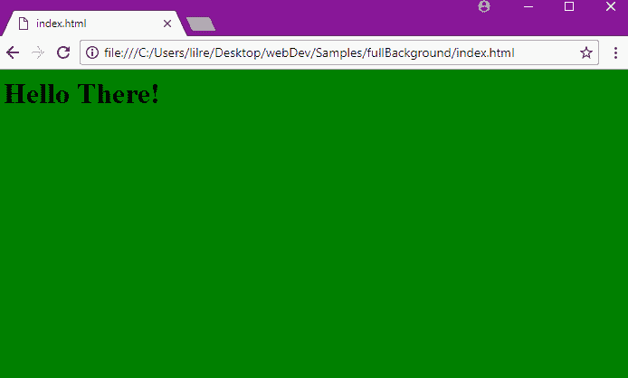

下面是一个为两个元素设置颜色的例子。这将设置标题的背景为紫色，页面的其余部分为蓝色。

```
 body {
    background-color: blue;
  }
  h1 {
    background–color: purple;
  }
```

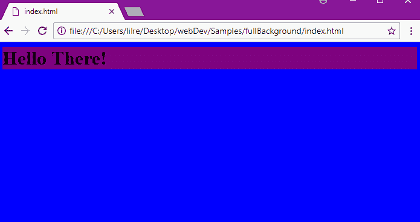

在 CSS 中，颜色可以用三种方式定义:

*   有效的颜色名称，如`blue`
*   十六进制值，如`#FFFFF`(这是白色的十六进制值。)
*   一个 RGB 值，如`rgb(76,175,80)`(这是浅绿色的 RGB 值。)

### **背景图像**

可以使用 background image 属性将图像设置为元素的背景。默认情况下，图像是重复的，因此它覆盖了整个元素。

```
body {
  background-image: url("barn.jpg");
}
```

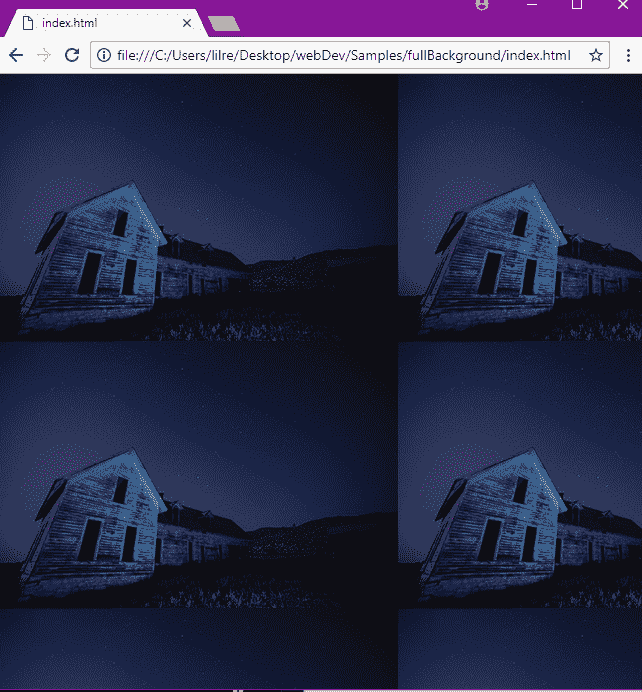

您还可以通过使用链接来链接您在网上找到的图片或 gif(例如，从 Google Images 搜索)。

```
body {
  background-image: url("https://mdn.mozillademos.org/files/11983/starsolid.gif");
}
```

### **背景图像-重复属性**

默认情况下，背景图像在垂直方向(上下)和水平方向(整个网页)上重复出现。您可以使用 background-repeat 属性垂直或水平重复图像。

下面是一个垂直重复图像的示例:

```
body {
  background-image: url("barn.jpg");
  background-repeat: repeat-y;
} 
```


您可以通过将 background-repeat 属性设置为“repeat-x”来水平重复图像。

```
body {
  background-image: url("barn.jpg");
  background-repeat: repeat-x;
}
```

还可以使用 background-repeat 属性将图像设置为不重复。

```
body {
  background-image: url("barn.jpg");
  background-repeat: no-repeat;
}
```

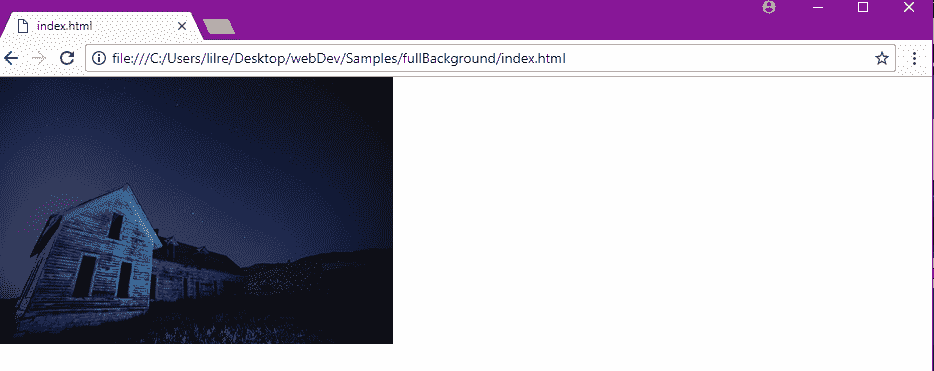

### **背景图像–位置属性**

可以使用 position 属性指定图像在网页上的位置。

```
body {
  background-image: url("barn.jpg");
  background-repeat: no-repeat;
  background-position: right top;
} 
```

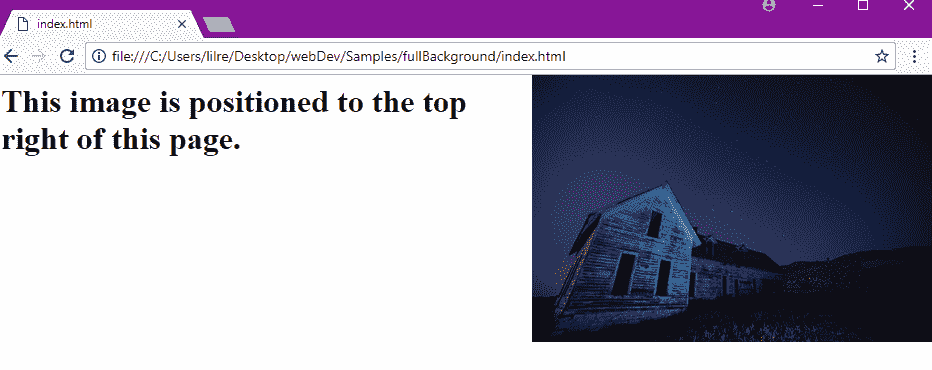

### **背景图像–固定位置**

您可以使用 background-attachment 属性将图像设置到固定位置。固定的位置使得图像不会随着页面的其余部分滚动。

```
body {
  background-image: url("barn.jpg");
  background-repeat: no-repeat;
  background-position: right top;
  background-attachment: fixed;
}
```

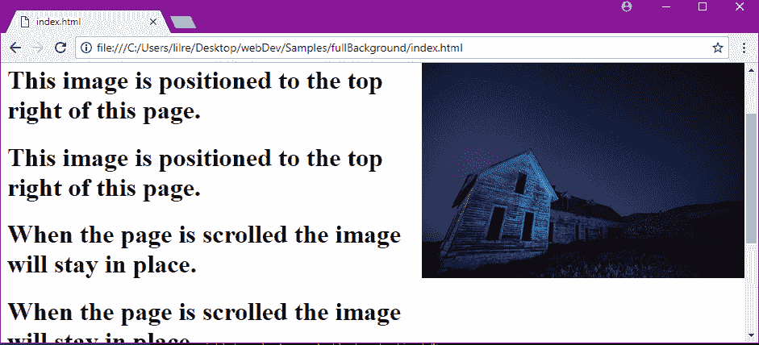

### **背景渐变**

渐变是两种或多种颜色之间的过渡，可以通过 CSS 使用，类似于背景图像。

渐变背景的语法可能相当复杂，并且由于支持的浏览器之间的不一致，仍然经常与供应商前缀一起使用。

Colorzilla 渐变编辑器是一个很棒的在线工具，用于生成定制渐变和相关的 CSS 标记。

### **背景–速记属性**

您可以在一行中编写背景属性。这被称为速记属性。

```
body {
  background: url("barn.jpg") no-repeat right top;
}
```

使用速记属性时，可以省略不需要的属性，但这些属性必须按一定的顺序使用。顺序是:

*   颜色
*   图像
*   重复
*   附件
*   位置

### **多个背景图像**

您可以在单个背景属性中指定多个背景图像。

```
body {
  background: url("barn.jpg"), url("stars.jpg"), linear-gradient(rgba(0, 0, 255, 0.5), rgba(255, 255, 0, 0.5));
}
```

指定的第一个图像(或渐变)在最上面，第二个在后面，依此类推。如果其中一个元素由于其 URL 或语法而不正确，浏览器将忽略整行。

### **CSS 的一些基本背景属性**

CSS 背景属性用于定义元素的背景效果。

CSS 背景属性:背景颜色，背景图像，背景重复，背景附件，背景位置

## CSS 断点示例

CSS 断点是基于[媒体查询](https://guide.freecodecamp.org/css/css3-media-queries)变得活跃，网站布局改变的特定点。

通常，当您想要重新调整网站的布局以适应浏览器视窗的大小时，您需要指定一个断点；主要是视口的宽度。

例如，如果您的网站内容在狭窄的视窗上看起来很好(比如在智能手机浏览器上)，但在更大的屏幕上看起来就不好了(例如，可能字体太小，难以阅读)，那么您可能需要为更大的屏幕引入一个新的断点，使字体更大:

CSS 断点可以被认为是响应式 web 设计的核心，因为它们定义了内容在不同的设备宽度/比例下如何表现或排列。这使您可以向用户展示最佳的布局。

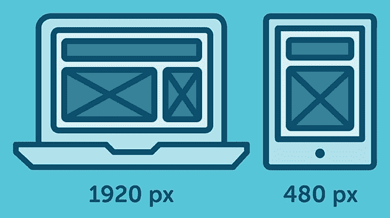

## **设置断点**

断点大致基于以下任一项设置:

*   基于设备宽度的断点
*   基于内容的断点

### **基于器件宽度的断点**

很明显，我们所有的设备都没有相同的屏幕宽度/尺寸。现在的设计决策是包含一组特定的设备，并相应地编写 CSS 规则。

我们已经有足够多的设备需要担心，当一个新的设备以不同的宽度出现时，回到 CSS 并重新添加一个新的断点是非常耗时的。

这里有一个例子:

```
/* ----------- iPhone 6, 6S, 7 and 8 ----------- */

/* Portrait */

@media only screen

and (min-device-width: 375px)

and (max-device-width: 667px)

and (-webkit-min-device-pixel-ratio: 2)

and (orientation: portrait) {

}

/* Landscape */

@media only screen

and (min-device-width: 375px)

and (max-device-width: 667px)

and (-webkit-min-device-pixel-ratio: 2)

and (orientation: landscape) {

}

/* ----------- Google Pixel ----------- */

/* Portrait */

@media screen

and (device-width: 360px)

and (device-height: 640px)

and (-webkit-device-pixel-ratio: 3)

and (orientation: portrait) {

}

/* Landscape */

@media screen

and (device-width: 360px)

and (device-height: 640px)

and (-webkit-device-pixel-ratio: 3)

and (orientation: landscape) {

}
```

使用这种方法，您将最终拥有一个庞大的媒体查询列表。

### **基于内容的断点**

这是制定或编写断点规则时的首选。因为只有在需要改变时，根据特定的布局来调整内容才更容易。

```
@media only screen (min-width: 768px){
...
}
```

此断点意味着当设备宽度为 768px 及以上时，将应用 CSS。

#### 您还可以设置一个带有断点的范围，这样 CSS 将只在这些限制内应用。

```
@media only screen and (min-width: 768px) and (max-width: 959px){

...

}
```

****注意**** 总是尽量根据自己的内容而不是设备来创建断点。将它们分割成一个逻辑宽度，而不是随机宽度，并保持在一个可管理的数量，这样修改就简单明了。

****CSS 断点**** 在你想根据屏幕大小更新样式的时候很有用。例如，从测量宽度为 1200px 及以上的设备，使用`font-size: 20px;`，否则使用`font-size: 16px;`。

我们从大于 1200 像素的设备开始，这是一个普通笔记本电脑屏幕的宽度。你可能也已经注意到我们提到了“大于”，意思是我们在某种程度上使用了类似于“ ****if-then**** ”的语句。

让我们把它变成 CSS 代码:

```
.text1 {
    font-size: 16px;
}
@media (min-width: 1200px) {
    .text1 {
        font-size: 20px;
    }
}
```

****为了方便**** ，我们先写下`.text1`基本造型……然后再指定`@media`规则。

****提示**** :你可以在一个叫做‘Bootstrap’的普通 CSS 框架上看到，他们在 Bootstrap v4.0 中采用了 ****【最小宽度】和 up**** ，相比之下，他们的旧 Bootstrap v3.0 使用了 ****【最大宽度】和 down**** 。这只是一个 ****偏好**** ，说'*这个*大小且小于'对'*这个*大小且大于'没有错。

使用`@media (max-width) {}`完全没问题。这里有一个例子:

```
.text1 {
    font-size: 20px;
}
@media (max-width: 1199px) {
    font-size: 16px;
}
```

```
// Normal, basic styles
// that look great on small screens
// but not on bigger screens
body {
  font-size: 16px;
}

// Define a new breakpoint, with a media query.
// In this case, for when the viewport's width
// is at least 512px wide.
@media (min-width: 512px) {
	body {
		font-size: 20px;
	}
}
```

基于内容而非设备的断点没有那么复杂。这里有一个简单的代码片段，当设备的宽度超过大约智能手机屏幕大小时就会触发

```
@media only screen and (min-width: 700px) {
  something {
    something: something;
  }
}
```

您还可以设置最小和最大宽度，这使您可以尝试不同的范围。这一个大概在智能手机和更大的桌面和显示器尺寸之间触发:

```
@media only screen and (min-width: 700px) and (max-width: 1500px) {
  something {
    something: something;
  }
}
```

## CSS 颜色示例

### 颜色；色彩；色调

CSS Colors 是一个处理颜色、颜色类型、颜色混合和不透明度的 CSS 模块。并非所有将作为值的 CSS 属性都是此模块的一部分，但它们确实依赖于它。

在 CSS 中，你可以改变 HTML 页面中几乎任何元素的颜色。像`background-color`、`color`和`border-color`这样的属性设置这些元素的颜色。

CSS 支持颜色名称、十六进制和 RGB 颜色。除了引入了`opacity`声明，CSS3 中的颜色现在可以使用颜色名称或者 RGB、十六进制、HSL、RGBA、HSLA 值来指定。

HTML 支持 140 种标准的[颜色名称](https://www.w3schools.com/colors/colors_names.asp)。

### **RGB(A)**

RGB 代表“红、绿、蓝”。RGB 值是红色、绿色和蓝色强度值的组合。每个都在 0(黑色)和 255(全强度)之间。RGBA 颜色值是带有 alpha 通道的 RGB 颜色值的扩展，alpha 通道指定颜色的不透明度。alpha 参数是介于 0.0(完全透明)和 1.0(完全不透明)之间的数字。

rgb 颜色值是用:RGB(红、绿、蓝)指定的。RGBA 颜色值与此类似，alpha 值在最后一个位置:rgba(红、绿、蓝、alpha)。

### **HSL(A)**

HSL 代表“色调、饱和度和明度”。色调是色轮上的度数(从 0 到 360): 0(或 360)是红色，120 是绿色，240 是蓝色。饱和度是一个百分比值:100%是全色。明度也是百分比；0%是深色(黑色)，100%是白色。

HSLA 颜色值是带有 alpha 通道的 HSL 颜色值的扩展，alpha 通道指定颜色的不透明度。

hsl 颜色值由 HSL(色调、饱和度、亮度)指定。hsla 颜色值与此类似，alpha 值在最后一个位置:HSLA(色调、饱和度、亮度、alpha)。

### **CMYK**

CMYK 颜色是青色、洋红色、黄色和黑色的组合。计算机屏幕使用 RGB 颜色值显示颜色。打印机通常使用 CMYK 颜色值来呈现颜色。HTML 不支持 CMYK，但它被建议作为 CSS4 的新标准。

示例颜色:cmyk 红色:cmyk(0%，100%，100%，0%)，CMYK 绿色:cmyk(100%，0%，100%，0%)，或 CMYK 蓝色:cmyk(100%，100%，0%，0%)。

### **Hexcodes**

Hexcode 是十六进制代码的缩写，是一种向计算机表达颜色值的方法。这样命名是因为可以使用 16 个唯一的符号作为值。在这种情况下，使用数字 0 到 9 和字母 a 到 f。

十六进制代码以这种格式表示:#000000，在本例中是黑色。每个 hexcode 使用六个字符，使用前面提到的 16 个字符中的任何一个。这六个角色分成三对两个。

这三对分别表示特定颜色的红色、绿色和蓝色的数量值。以 hexcode 颜色#AA11BB 为例，AA 是红色的量，11 是绿色的量，BB 是蓝色的量。0 是颜色的最低值，而 f 是最高值。

十六进制代码不区分大小写，这意味着#FFFFFF 和#ffffff 将是相同的颜色:白色。

此外，使用 hexcode 有 16，777，216 种可能的颜色组合。

### **不透明度**

CSS3 opacity 属性设置整个元素的不透明度(背景颜色和文本都是不透明/透明的)。与用 rgba 和 hsla 指定的 alpha 值不同，不透明度由子元素继承。

不透明度属性值必须是介于 0.0(完全透明)和 1.0(完全不透明)之间的数字。

#### **例题**

```
<html>
  <body>
    <p>Hello Moto</p>
  </body>
</html>
```

```
body {
  background-color: green;
  color: white;
}
```

在上面的例子中，`background-color: green`将`<body>`元素变成绿色。这会使整个网页变绿。`<p>`元素在`color: white`之后也全部是白色的。你可以使用命名的颜色，像`green`、`blue`、`yellow`、`red`、`purple`等等。但是对于自定义颜色，可以使用十六进制代码(`#147ACC`)、RGB 值(`rgb(20, 122, 204)`)，甚至 HSL 值(`hsl(145, 59%, 30%)`)。

```
p {
  color: rgba(244, 145, 14, 0.80); // bright orange
}

h2 {
 color: #FA8072; //salmon 
}
```

您还可以给颜色添加 alpha 值或透明度。透明度允许文本覆盖在图像上，并且仍然可以透过文本看到部分图像，或者如果文本前后没有其他元素，可以使用透明度来改变颜色的阴影。使用`rgba()`或`hsla()`并填写您的颜色值。alpha 值放在最后，是转换成小数的百分比。(比如 20%是 0.2，75%是 0.75 等等。)

```
body {
  background-color: hsl(184, 87%, 94%); // bright blue
}
```

上面显示的段落样式为亮橙色和 20%透明，h2 元素为橙红色，主体背景为亮蓝色。

要在 CSS 中使用自定义颜色，您可能会发现颜色选择器很有帮助。一些文本编辑器有内置的颜色选择器，如 Visual Studio 代码。如果你在谷歌或 DuckDuckGo 上搜索“拾色器”，你会得到一个你可以使用的拾色器。谷歌 Chrome 和 Firefox 也有你可以安装的颜色选择器插件。Adobe Color CC 不仅可以帮助您选择颜色，还可以帮助您为网页选择配色方案！

使用像 WebAIM 的颜色对比检查器这样的工具来检查文本和背景颜色之间是否有足够的对比度是一个好主意。

## CSS 示例中的颜色

CSS 中的颜色用于给网页中的元素着色。有许多方法可以为元素指定颜色。您可以使用颜色的实际名称、它们的 RGB 值或十六进制值。在 CSS3 中，hsl(色调-饱和度-亮度)已被添加到规范中。

### **颜色名称**

目前 HTML 中支持 140 种颜色名称，只需输入它们的名称就可以在 CSS 规则中分配。例如:

### **语法**

```
p {
  color: green;
}
```

该规则将所有

元素的所有字体颜色更改为绿色。
查看完整的 140 种颜色列表，请点击这里:【https://www.w3schools.com/colors/colors_names.asp 

### **RGB 值**

RGB 代表“红”、“绿”和“蓝”，我们还可以通过在规则中键入它们的 RGB 值来分配颜色。RGB 值如下所示:rgb(255，0，0)，其中每个数字定义了每种颜色在最终混合中所占的比例。

值的范围从 0 到 255，在我们的示例中，我们看到只有第一个值是 255，而其他两个值都设置为 0。这意味着在我们的值中只有红色，相应的元素将被染成红色。RGB 值为(0，0，0)会产生黑色，值为(255，255，255)会产生白色。

试图记住每个颜色代码是不可能的，因此网上有很多工具可以为你的项目选择你想要的颜色。比如:[https://www.w3schools.com/colors/colors_picker.asp](https://www.w3schools.com/colors/colors_picker.asp)或者[http://htmlcolorcodes.com/color-picker/](http://htmlcolorcodes.com/color-picker/)。

```
p {
  color: rgb(0, 255, 0);
}
```

这个规则将所有 p 元素的字体颜色都改为绿色，就像上面一样。

### **十六进制值**

十六进制值是在 CSS 中定义颜色的另一种方式，它们的工作方式与 RGB 值非常相似。

一个随机的十六进制代码应该是这样的:`#29432b`，其中散列后的前两个字符代表混合中红色的数量，后两个字符代表绿色的数量，最后两个字符代表蓝色的数量。

`#000000`和`#ffffff`的值分别代表黑色和白色。
你可以使用与 RGB 值相同的工具找到你需要的特定十六进制颜色。

### **语法**

```
p {
  color: #00fe00;
}
```

该规则再次将所有 p 元素的字体颜色更改为绿色。

### **HSL**

HSL 有三个价值。第一个是 ****色相**，**用度数来衡量。所以 0(或 360)代表红色，120 代表绿色，240 代表蓝色。

第二个是 ****饱和度**** ，其百分比值范围从 0 到 100%。

第三个是**，也是 0-100%的百分比值。0%是深黑色，50%一般，100%是白色。**

### ****语法****

```
`p {
  color: hsl(0, 100%, 50%);
}`
```

### ****输出****

**[小提琴](https://jsfiddle.net/qcw2n145/)**

### ****为什么使用 RGB 或十六进制值？****

**颜色名称只有 140 个值，而 RGB 和十六进制值有 16，777，216 种可能的组合。因此，如果您希望您的项目看起来完全符合您的设想，您应该使用后两个选项，并保留颜色名称的值用于模型和测试目的。**

### **当前颜色关键字**

**currentColor 关键字，顾名思义，是 CSS 中有效的颜色值。这表示特定元素的`color`属性的值。这允许您将`color`属性的值用于默认情况下不接收它的属性。**

**例如，如果我们声明每个`div`都有一个颜色为`currentColor`的 3px 边框，这意味着每个`div`的边框都将使用其`color`属性 [:](http://jsfiddle.net/tjkp0cm3/) 的相同值来着色**

```
`div{
  /* The currentColor keyword for the color value, which means that the border will have the value of the respective div's color property */
  border: 3px solid currentColor;
}

/* This div will have green borders, because its color value is green. */
#div1{
  color: green;
}

/* This div will have blue borders, because its color value is blue. */
#div2{
  color: blue;
}`
```

### ****SVG 的实际应用****

**这里有一个网络上非常常见的例子——一个带有 SVG 图标和文本的按钮。边框、文本和图标的颜色在将鼠标停留在按钮上时会发生变化。下图按顺序描绘了按钮的初始状态和盘旋状态。**

**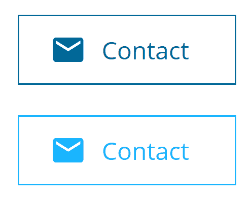**

**图标字体也可以用于此目的，但是内嵌 SVG 比图标字体有多种优势，这可能使 SVG 成为许多开发人员的选择。引用[CSS-诡计](https://css-tricks.com/icon-fonts-vs-svg/)，**

> **定位字体图标可能会令人沮丧。图标是通过伪元素插入的，这取决于`line-height`、`vertical-align`、`letter-spacing`、`word-spacing`，字体字形是如何设计的(周围自然有空间吗？它有字距信息吗？).那么伪元素`display`类型会影响这些属性是否有效。SVG 就是它的大小。总而言之，在文本中使用字体图标有时会令人沮丧。**

**我们可以使用我们的代码来实现期望的行为:**

```
`button {
  color: #016898;
}

.emailIcon {
  fill: #016898;
}

button:hover {
  color: #19B5FE;
}

button:hover .emailIcon {
  fill: #19B5FE;
}`
```

**现在，我们可以将填充设置为`currentColor`，而不是在悬停时显式更改 SVG 的`fill`颜色。这会自动将 SVG 的颜色更改为按钮的`color`属性的值。我们现在只需要改变按钮的`color`属性。这使得 CSS 代码更短、更智能:**

```
`.emailIcon {
  fill: currentColor;
}

button {
  color: #016898;
}

button:hover {
  color: #19B5FE;
}`
```

**在[https://repl.it/NNt9/2](https://repl.it/NNt9/2)看看这个活生生的例子。**

## ****CSS3 媒体查询示例****

**媒体查询允许您针对不同的设备/屏幕尺寸使用不同的样式。它们在 CSS3 中的引入大大简化了响应式网页的构建。**

**设计响应式网站的最佳方法是首先考虑移动性；这意味着你从手机版的设计和内容开始创建你的网页。**

**你可能认为有了一些可伸缩的大小(%，vw 或 vh)，你的页面将完美地适应任何设备。但它不会。也许对于一些非常基础的设计来说是这样，但对于更普通或复杂的页面来说肯定不是这样！**

**当你为小型设备设计页面时，你应该关注主要内容。在更大的屏幕上，你将不得不重新调整一些字体大小、页边空白、填充等等，以保持你的网站舒适易读。但是你也会想要/需要添加更多的内容，你没有判断基本的位，并填充屏幕尺寸创造的空间。**

**思考过程应该是:**

1.  **要显示哪些内容？**
2.  **如何布局？**
3.  **尺寸？**

### ****基本语法****

```
 `@media only screen and (min-width: 768px) {
      p {padding: 30px;}
    }`
```

**一旦屏幕宽度达到最小 768 像素，标签就会有一个 30 像素的填充。**

### ****AND 语法****

```
 `@media only screen and (min-height: 768px) and (orientation: landscape) {
    p {padding: 30px;}
  }`
```

**一旦屏幕达到最小 768 像素的高度，并且其方向为横向，标签就会有一个 30 像素的填充。**

### ****OR 语法****

```
 `@media only screen and (min-width: 768px), (min-resolution: 150dpi) {
      p {padding: 30px;}
    }`
```

**一旦屏幕宽度达到最小 768px 或分辨率达到最小 150dpi，`p`标签将有一个 30px 的填充。**

## ****CSS 字体示例****

**不同的 CSS 字体属性定义了页面上文本的大小、粗细、样式、行高和字体系列/字样。**

### ****字体系列****

**使用`font-family`属性设置文本的字体系列或字样。**

**这个属性在一个后备系统中起作用——如果你的浏览器不支持第一种字体，它会尝试下面的每一种字体，直到找到它支持的字体。如果字体名称超过一个单词，必须用引号括起来。例如:**

```
`p {
    font-family: "Times New Roman", Times, serif;   
}`
```

**Times New Roman 由三个单词组成，必须用引号括起来。同时，serif 只是一个单词，所以不需要引号。**

**列表中的最后一项应该始终是一个通用的字体系列名称，如 serif、sans-serif、monospace、草书、fantasy、system-ui。**

### ****字体样式****

**属性可以用来使文本倾斜。**

**该属性有三个可能的值:**

*   **正常-文本正常显示**
*   **斜体-文本以斜体*显示***
*   **倾斜-文本倾斜显示**

```
`.normal {
    font-style: normal;
}

.italic {
    font-style: italic;
}

.oblique {
    font-style: oblique;
}`
```

### ****字体大小****

**使用`font-size`属性调整文本的大小。在大多数浏览器中，文本的默认大小是`16px`。**

**以下是最常用的字体大小值:**

*   **`px`(像素)**
*   **`em`-`1em`–父字体大小**
*   **`rem`–根元素的字体大小**
*   **`%` -百分比**

```
`.with-pixels {
    font-size: 14px;
}

.with-ems {
    font-size: 0.875em;
}

.with-absolute {
    font-size: large;
}

.with-percentage {
    font-size: 80%;
}`
```

### ****字体粗细****

**`font-weight`属性调整文本的粗细。该属性接受关键字值，如`bold`或`normal`，以及数字关键字值，如`400`和`700`。**

**以下是一些常见的关键字和数字关键字值:**

| 关键词值 | 数字关键字值 |
| --- | --- |
| One hundred | `thin` |
| Three hundred | `light` |
| four hundred | `normal` |
| Five hundred | `medium` |
| Seven hundred | `bold` |
| Nine hundred | `black` |

 **默认字体粗细为`400`或`normal`。

```
p {
   font-weight: bold
}
```

**注意:**并非所有的关键字或数字关键字值都适用于每个字体系列。例如，如果您从 Google Fonts 加载一个字体系列，您需要选择您想要使用的所有字体粗细。

## **CSS 文本对齐示例**

这个 CSS 属性描述了内嵌内容在其父 block 元素中的水平对齐方式。`text-align`不控制块元素的对齐，它只影响它们的行内内容。

### **值:**

`text-align`属性被指定为从以下值列表中选择的单个关键字:

`text-align: left;`将文本向左对齐

`text-align: right;`将文本向右对齐

`text-align: center;`将文本居中对齐

`text-align: justify;`使线条宽度相同

`text-align: justify-all;`使各行宽度相同，包括最后一行

`text-align: start;`将最后一行对齐行首

`text-align: end;`将最后一行对齐行尾

`text-align: match-parent;`计算父方向的值的起点和终点，并替换为适当的左值或右值。

****【块对齐值(非标准语法)**** :

`text-align: -moz-center;`

`text-align: -webkit-center;`

****全局值**** :

`text-align: inherit;`从其父元素继承

`text-align: initial;`默认值

`text-align: unset;`根据元素的默认属性，应用继承值或初始值

## **CSS 盒子模型示例**

理解 CSS 盒子模型对于正确布局网页至关重要。

当浏览器呈现(绘制)网页时，每个元素(例如，一段文本或一幅图像)都被绘制为遵循 CSS Box 模型规则的矩形框。

盒子的中心是内容本身，占据了一定的高度和宽度。这个地区被称为 ****内容区**** 。内容区域的大小可以自动确定，也可以显式设置高度和宽度的大小(参见下面关于`box-sizing`的注释)。

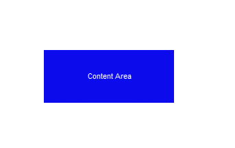

在内容区域周围，这是一个称为 ****填充区域**** 的区域。填充的大小可以在四周相同(用`padding`设置)，也可以分别设置上、右、下、左填充(用`padding-top`、`padding-right`、`padding-bottom`、`padding-left`)。

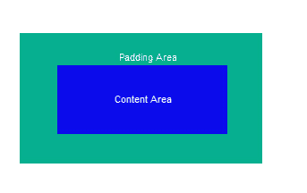

接下来，还有一个 ****边境地区**** 。这会在元素及其填充周围创建一个边框。您可以设置边框的粗细(`border-width`)、颜色(`border-color`)和样式(`border-style`)。样式选项有`none`(无边框)、`solid`、`dashed`、`dotted`等几种。

此外，您可以分别设置 4 条边的边框；例如，顶部边框用`border-top-width`、`border-top-color`和`border-top-style`表示其粗细、颜色和样式。(参见下面关于`box-sizing`的注释。)

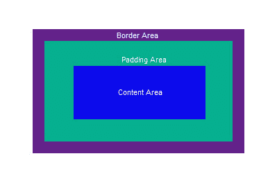

最后，还有 ****边距区域**** 。这将在元素、填充和边框周围创建空白空间。同样，您可以单独设置上边距、右边距、下边距和左边距(使用`margin-top`、`margin-right`、`margin-bottom`和`margin-left`)。在某些情况下，会发生边距折叠，并且相邻元素之间的边距可能会被共享。


****`box-sizing`属性** :** 该属性默认为`content-box`。如果使用缺省值，那么框模型将允许作者指定内容区域的大小。但是，可以使用这些来指定边界区域的大小。这是通过将`box-sizing`属性更改为`border-box`来实现的。这有时可以使布局更容易。您可以根据需要设置每个元素的`box-sizing`属性。

## **CSS 光标**

cursor 属性指定当您将光标悬停在某个元素上时要显示的光标类型。它有 36 个可能的值:

```
 .auto            { cursor: auto; }
    .default         { cursor: default; }
    .none            { cursor: none; }
    .context-menu    { cursor: context-menu; }
    .help            { cursor: help; }
    .pointer         { cursor: pointer; }
    .progress        { cursor: progress; }
    .wait            { cursor: wait; }
    .cell            { cursor: cell; }
    .crosshair       { cursor: crosshair; }
    .text            { cursor: text; }
    .vertical-text   { cursor: vertical-text; }
    .alias           { cursor: alias; }
    .copy            { cursor: copy; }
    .move            { cursor: move; }
    .no-drop         { cursor: no-drop; }
    .not-allowed     { cursor: not-allowed; }
    .all-scroll      { cursor: all-scroll; }
    .col-resize      { cursor: col-resize; }
    .row-resize      { cursor: row-resize; }
    .n-resize        { cursor: n-resize; }
    .e-resize        { cursor: e-resize; }
    .s-resize        { cursor: s-resize; }
    .w-resize        { cursor: w-resize; }
    .ns-resize       { cursor: ns-resize; }
    .ew-resize       { cursor: ew-resize; }
    .ne-resize       { cursor: ne-resize; }
    .nw-resize       { cursor: nw-resize; }
    .se-resize       { cursor: se-resize; }
    .sw-resize       { cursor: sw-resize; }
    .nesw-resize     { cursor: nesw-resize; }
    .nwse-resize     { cursor: nwse-resize; }
```

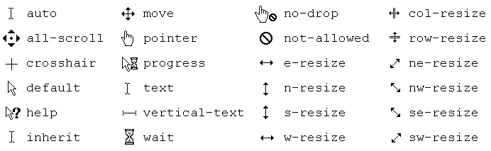

您也可以将图像设置为光标。

```
.custom-cursor {
  cursor: url(cursor-image.png);
}
```**