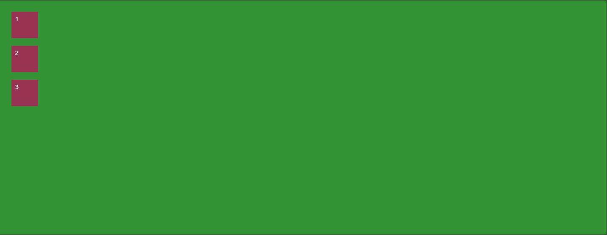
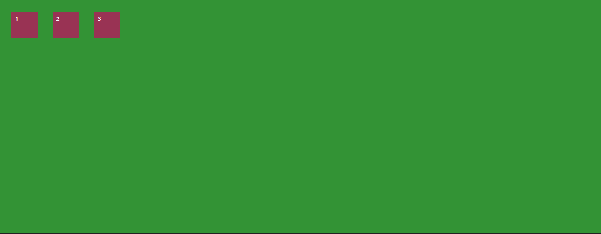
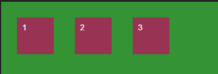
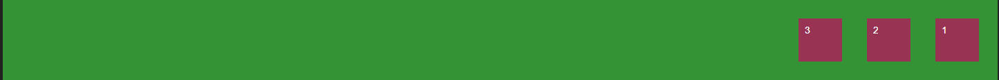
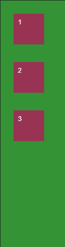

# CSS Flexbox 提示和技巧

> 原文：<https://www.freecodecamp.org/news/css-flexbox-tips-and-tricks/>

CSS Flexbox 允许你轻松地格式化你的 HTML，就像你从来不知道的那样。使用 Flexbox，您可以轻松地进行垂直和水平对齐。喜欢这个声音吗？是啊，我也是。

当你创建网站或应用程序的总体布局时，Flexbox 也非常有用。它很容易学习，得到很好的支持(在所有现代浏览器中),并且非常适合使用——更不用说它不需要很长时间就能掌握基础知识。

因此，让我们深入了解更多信息。

## **柔性盒**

以下是可用于在 CSS 中定位元素的 Flexbox 属性列表:

### **可应用于容器的 CSS**

```
display: flexbox | inline-flex;
flex-direction: row | row-reverse | column | column-reverse;
flex-wrap: nowrap | wrap | wrap-reverse;
flex-flow: <‘flex-direction’> || <‘flex-wrap’>
justify-content: flex-start | flex-end | center | space-between | space-around;
align-items: flex-start | flex-end | center | baseline | stretch;
align-content: flex-start | flex-end | center | space-between | space-around | stretch;
```

### **可应用于容器中项目/元素的 CSS**

```
order: <integer>;
flex-grow: <number>; /* default 0 */
flex-shrink: <number>; /* default 1 */
flex-basis: <length> | auto; /* default auto */
flex: none | [ <'flex-grow'> <'flex-shrink'>? || <'flex-basis'> ]
align-self: auto | flex-start | flex-end | center | baseline | stretch;
```

所以现在你有了你的工具箱。但是你可能会问“我用我的工具做什么，我如何使用它们？”好吧，让我给你看看。

### **显示伸缩**

只是告诉你的浏览器，“嘿，我想用 Flexbox 来装这个容器。”这将把这个框初始化为一个 Flex 容器，并应用一些默认的 Flex 属性。

这是我们的容器没有`display: flex;`时的样子:



添加`display: flex;`后，我们得到了下面的结果——你可以看到默认的 Flex 属性被应用，导致它看起来像这样:



### **弯曲方向**

`flex-direction:`允许我们控制容器中的项目如何显示。你想让他们从左到右，从右到左，从上到下还是从下到上？您可以通过设置容器的伸缩方向轻松完成所有这些工作。

Flexbox 将行应用为方向的默认值。以下是它们的样子:

`flex-direction: row;`



`flex-direction: row-reverse;`



`flex-direction: column;`



`flex-direction: column-reverse;`


### **柔性包装**

默认情况下，Flexbox 会尝试将所有元素放入一行。但是您可以使用 flex-wrap 属性来更改这一点。这允许您选择元素是否溢出。

`flex-wrap:`有 3 个属性:

`flex-wrap: nowrap`是默认值，将尝试从左到右将所有内容放在一行中。

`flex-wrap: wrap`允许项目继续从左到右创建多行。

`flex-wrap: wrap-reverse`允许项目在多行上，但这次从右向左显示。

### **伸缩流**

Flex flow 将`flex-wrap`和`flex-direction`的使用合并到一个属性中。使用时，先设置方向，然后换行。

这是一个如何使用的例子。

### **调整内容**

`justify-content`是一个将容器中的项目沿主轴对齐的属性(这根据内容的显示方式而变化)。

对此有多种选择。它允许我们填充行中的任何空白空间，但让我们定义我们想要如何“调整”它。

当我们调整我们的内容时，我们有以下选择。

### **对齐项目**

对齐项目允许我们沿横轴对齐项目。这允许使用对齐内容以多种不同方式定位内容，并将项目对齐在一起。

`align-items: flex-start | flex-end | center | baseline | stretch;`

### **对齐内容**

这是为了将项目与多行对齐。它用于在横轴上对齐，对单行内容没有影响。

`align-content: flex-start | flex-end | center | space-between | space-around | stretch;`

## Flexbox 和网格上的其他资源

### 文章和课程

[终极 CSS Flex 备忘单](https://www.freecodecamp.org/news/flexbox-the-ultimate-css-flex-cheatsheet/)

[完整的 CSS 视频课程(包括 Flexbox 和网格)](https://www.freecodecamp.org/news/full-css-course-flexbox-grid/)

[CSS Flexbox 的可视化指南](https://www.freecodecamp.org/news/do-you-even-flex-box-c16449cfca96/)

[如何用 CSS 网格创建图片库](https://www.freecodecamp.org/news/how-to-create-an-image-gallery-with-css-grid-e0f0fd666a5c/)

### 游戏和应用

[Flexbox Defense](http://www.flexboxdefense.com/) 是一款以有趣的方式教 Flexbox 的网页游戏。

[Flexbox Froggy](http://flexboxfroggy.com/) 也是一款以有趣的方式教 Flexbox 的网页游戏。

5 中的 flexbox 是一个网络应用程序，它可以让你看到 Flexbox 如何通过一些简单的控件工作。

[Flexyboxes](http://the-echoplex.net/flexyboxes/) 是一个允许你查看代码样本和更改参数的应用程序，以直观地了解 flexbox 的工作方式。

[Flexbox Patters](http://www.flexboxpatterns.com/) 是一个展示大量 Flexbox 示例的网站。

### 录像

[Flexbox 基础知识](https://www.youtube.com/watch?v=G7EIAgfkhmg)

[Flexbox 实例](https://www.youtube.com/watch?v=H1lREysgdgc)

[什么是 Flexbox？！](https://www.youtube.com/watch?v=Vj7NZ6FiQvo&list=PLu8EoSxDXHP7xj_y6NIAhy0wuCd4uVdid)