# CSS Flexbox 教程和 Flexbox 属性备忘单🎖️

> 原文：<https://www.freecodecamp.org/news/css-flexbox-tutorial-with-cheatsheet/>

在这篇文章中，我将教你 CSS Flexbox 的基础知识，这样你就可以创建自己的响应网站。我将解释 Flexbox 的每个属性是如何工作的，并且我会给你一个备忘单，涵盖你可以用 Flexbox 做的所有事情。我们走吧，🎖️

# 目录

*   [Flexbox 架构](#flexbox-architecture)
*   [弯曲方向](#flex-direction-property)
*   [调整内容](#justify-content-property)
*   [对齐内容](#align-content-property)
*   [对齐项目](#align-items-property)
*   [自我对齐](#align-self-property)
*   [伸缩|收缩|包裹|基础](#flex-grow-shrink-wrap-basis-properties)
*   [人手不足](#shorthand-flexbox-properties)
*   [结论](#conclusion)

### 如果你喜欢，你也可以在 YouTube 上观看这个教程:

[https://www.youtube.com/embed/7YUR0Igl9eU?feature=oembed](https://www.youtube.com/embed/7YUR0Igl9eU?feature=oembed)

# 一、什么是 Flexbox？

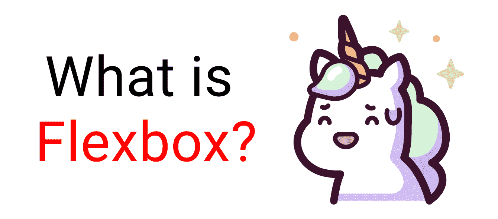

当你盖房子时，你需要一张蓝图。同样，当我们制作网站时，我们需要一个蓝图。而 Flexbox 就是蓝图。

Flexbox 模型允许我们**设计我们网站的内容**。不仅如此，它还帮助我们创建为多种设备创建**响应式网站**所需的结构。

这是我用 Flexbox 作为主要蓝图创建的一个演示。

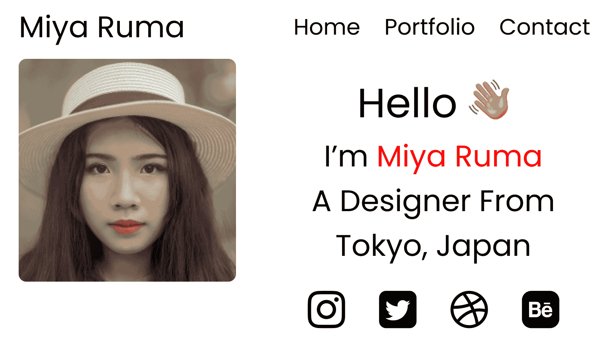

这个项目是本文的[部分。](https://www.freecodecamp.org/news/learn-css-media-queries-by-building-projects/)

# Flexbox 架构

那么 Flexbox 架构是如何工作的呢？弹性项目[内容]沿主轴和横轴分布。并且，根据 flex-direction 属性，行和列之间的布局位置会发生变化。


# Flexbox 图表

此图表包含了您在使用 Flexbox 时可以使用的所有可能的属性和值。您可以在做项目时参考它，并尝试不同的值。


# 如何设置项目

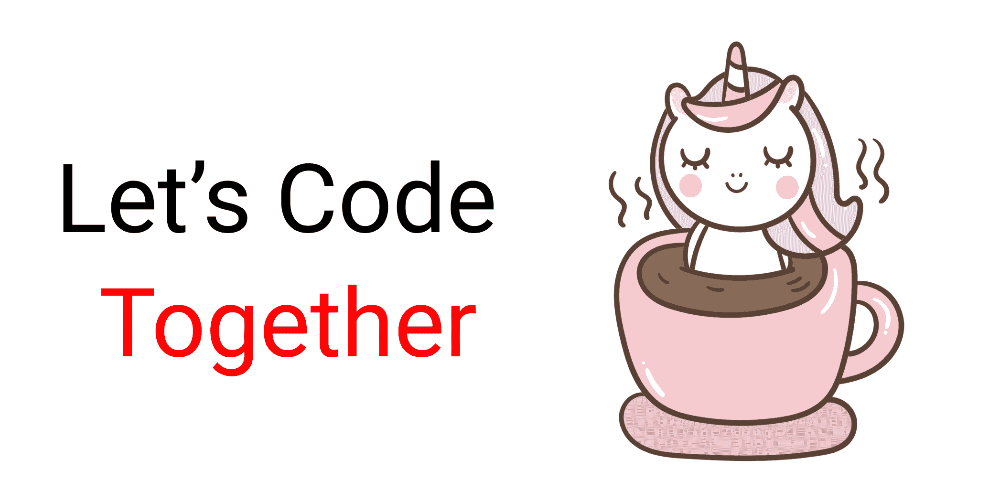

对于这个项目，你需要知道一点点的 HTML，CSS，以及如何与 VS 代码。请跟我一起完成以下任务:

1.  创建一个名为“Project-1”的文件夹，打开 VS 代码
2.  创建`index.html`和`style.css`文件
3.  安装并运行 Live Server。

或者，你可以直接打开 [Codepen](https://codepen.io/) 开始编码。

在本教程结束时，你将能够做出准确而漂亮的网站布局。

## 超文本标记语言

在 HTML 中，在 body 标记内编写以下代码行👇

```
<div class="container">
    <div class="box-1"> A </div>
    <div class="box-2"> B </div>
    <div class="box-3"> C </div>
</div> 
```

## 半铸钢ˌ钢性铸铁(Cast Semi-Steel)

瞄准`.container`类和所有的盒子。然后设计这些盒子的样式，使它们看起来都相似，就像这样:👇

**注意:**别忘了放容器的高度。

```
.container{
   height : 100vh;
}

[class ^="box-"]{
    width: 140px;
    height: 140px;
    background-color: skyblue;
    border: 2px solid black;

// To view the letter better
    font-size: 65px;
} 
```

## 但是等等....


在开始之前，您需要了解父类和子类之间的关系。


Flexbox 作用于**父类**，而不是子类。

在这里，`.container`类是**父类**，我们的`.box-*`类是我们的**子类**。

因此，在`.container`类中应用 display: flex。像这样把字母放在盒子的中央:

```
.container{
    display : flex;
    height : 100vh;

// To place some gap between boxes
    gap : 25px;
}
[class ^="box-"]{
// Code from previous step are here

// Placing text at center 
    display : flex;
    justify-content : center;
    align-items : center;
} 
```

和...我们都准备好了！开始编码吧。😊


# 弯曲方向属性

这个属性允许我们设置 flex-items 在 flex-container 中的分布方向。

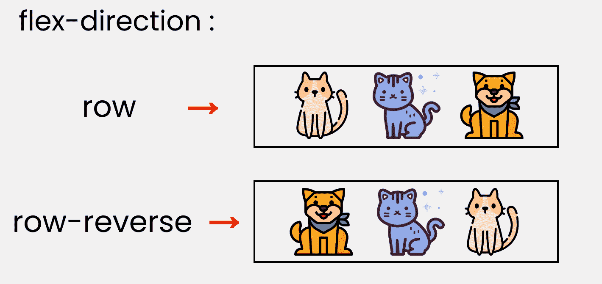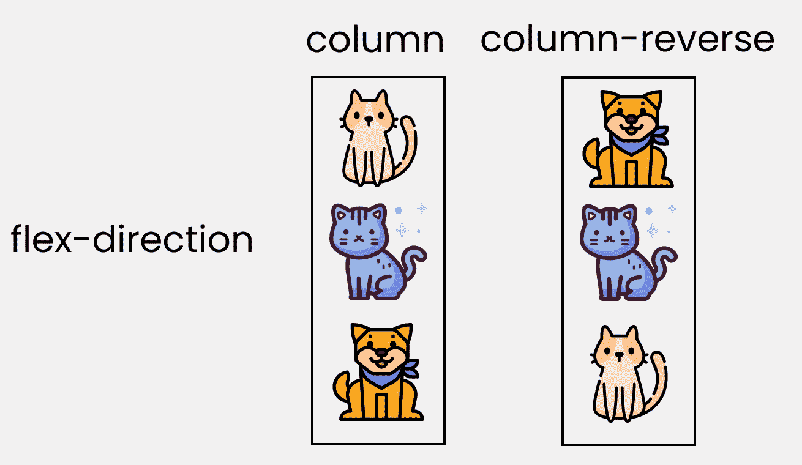

为了重现这些结果，让我们在 CSS 中写下这几行:

**请注意**我们将把它们写在`.container`类中。

```
.container{
//code from setup stage are here

// Change the value  👇 here to see results
    flex-direction : row;
} 
```

# 对齐内容属性

该属性在 flex-container 中沿着主轴**排列 flex-items。**

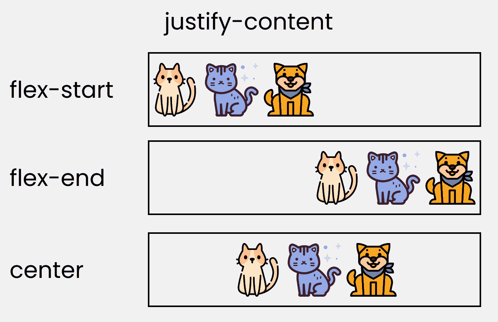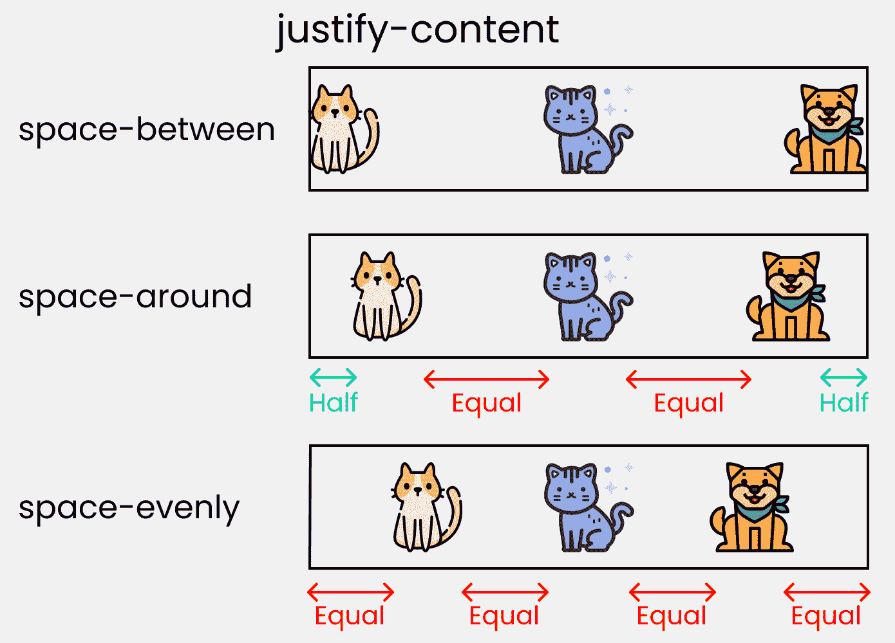

要重新创建这些结果，请在 CSS 中写入以下代码行:

```
.container{
//code from setup stage are here

//  Change the value  👇 here to see results
    justify-content: flex-start;
} 
```

# 对齐内容属性

该属性在 flex 容器内沿着**横轴**排列 flex 项目。这类似于**的 justify-content** 。

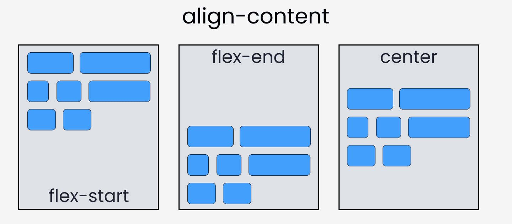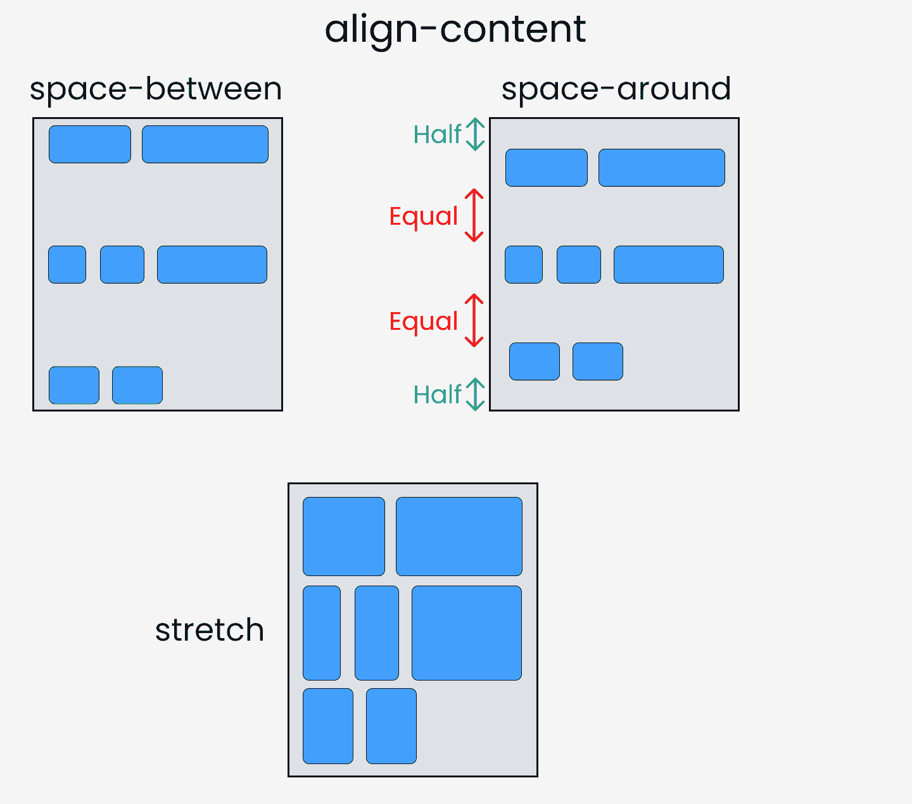

请注意，没有 **flex-wrap** 属性，该属性不起作用。这里有一个演示:

```
.container{

//  Change the value  👇 here to see results
    align-content: center;

// without this line, align-content won't work
    flex-wrap: wrap;
} 
```

# 对齐项目属性

该属性沿**横轴**分布伸缩项。

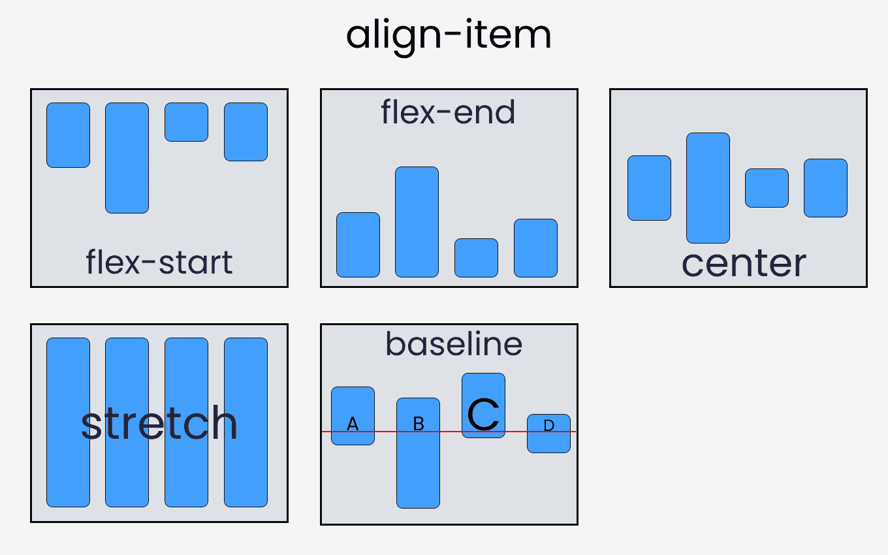

为了重现这些结果，让我们用 CSS 编写以下代码:

```
.container{
//code from setup stage are here

// Change the value 👇 here to see results
    align-items: flex-end;
} 
```

# 自对齐属性

这个属性作用于子类。它沿着**横轴**定位选中的项目。

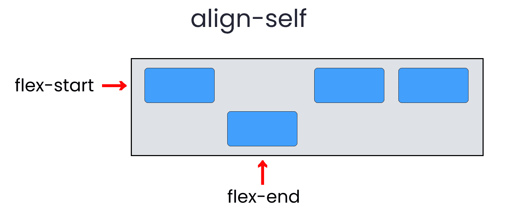

我们总共有 6 个值:

*   灵活启动
*   挠性端
*   中心
*   基线
*   伸展
*   汽车

要重新创建结果，选择任何`.box-*`并编写以下代码:

```
.box-2{
// Change the value 👇 here to see results
     align-self : center;
} 
```

## 休息一会儿

到目前为止一切顺利。休息一下！


# 伸缩|收缩|环绕|基础属性

我们现在要讨论的属性将在我们调整窗口大小时生效。让我们开始吧。

### 灵活增长

该属性根据 flex 容器的宽度增加 flex 项目的大小。

### 弯曲收缩

该属性有助于 flex 项目根据 flex 容器的宽度进行收缩。这与灵活增长正好相反。

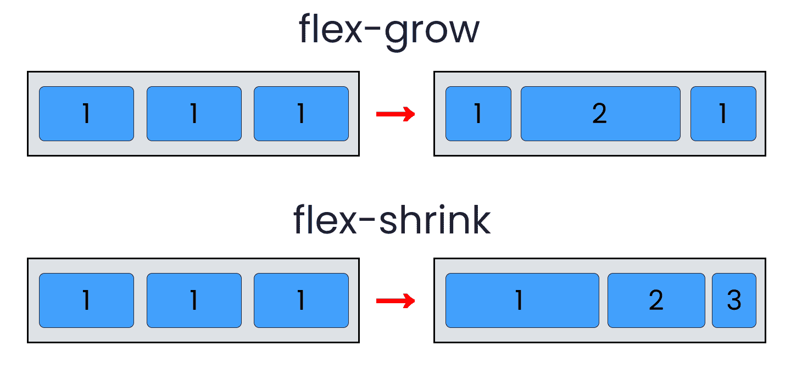

要取得这些成果，请跟我来。

**请注意**flex-grow 和 flex-shrink 对子类有效。因此，我们将像这样定位我们的所有盒子:

```
.box-1{
    flex-grow: 1;
}
.box-2{
    flex-grow: 5;
}
.box-1{
    flex-grow: 1;
} 
```

调整窗口大小，你会看到结果。

若要复制 flex-shrink 的结果，请编写以下代码:

**请注意**需要先删除 flex-wrap 属性，否则无法工作。

```
.box-1{
    flex-shrink: 1;
}
.box-2{
    flex-shrink: 5;
}
.box-1{
    flex-shrink: 1;
} 
```

现在，调整窗口大小，你会看到结果。

### 柔性包装

此属性帮助您设置行或列中所需的弹性项目数。

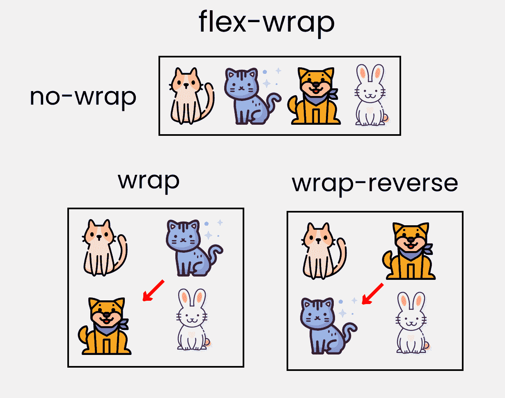

这适用于`.container`父类。因此，编写以下代码:

```
.container{
    //other codes are here 

// Change value 👇 here to see results
    flex-wrap : wrap; 
```

### 弹性基础

这类似于为伸缩项增加宽度，但更加灵活。例如，flex-basis: 10em 会将 flex-item 的初始大小设置为 10em。其最终大小将基于可用空间、伸缩和伸缩。

# 速记 Flexbox 属性

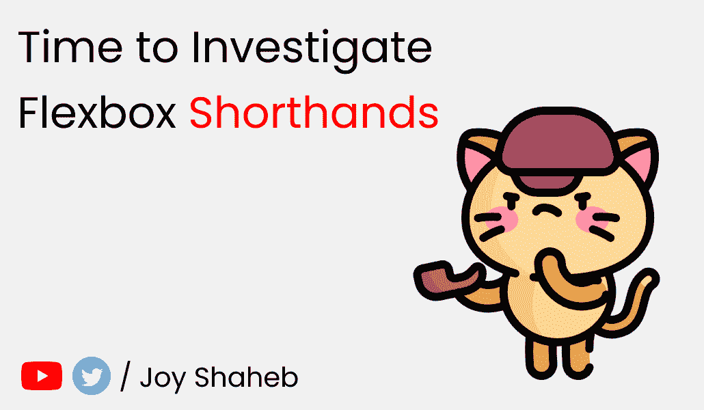

### 灵活速记

这是综合了**伸缩**、**伸缩**和**伸缩**属性的简写。

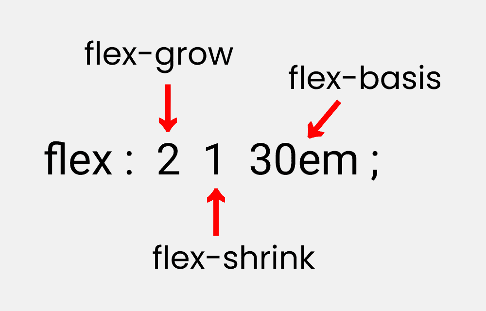

您可以通过编写以下代码来尝试这一点:

**请注意**它只对子类有效:

```
.box-2{
    flex : 2 1 30em;
} 
```

### 柔性流

这是**伸缩方向**和**伸缩缠绕**属性的简写:

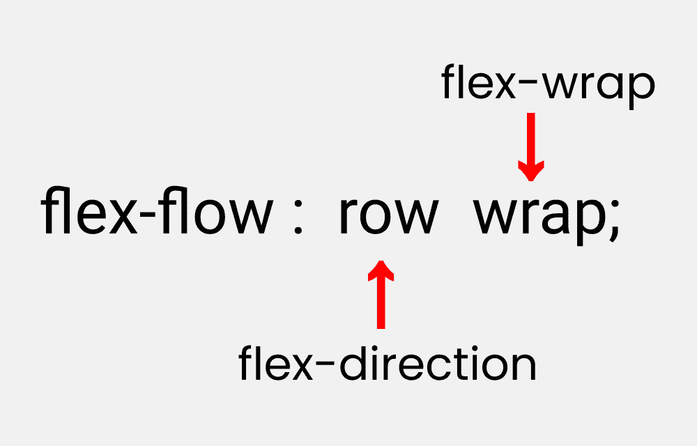

您可以通过编写以下代码来尝试这一点:

**请注意**它只对父类有效。

```
.container{
    flex-flow : row wrap;
} 
```

## 地点内容

这是对齐内容和对齐内容属性的简写:

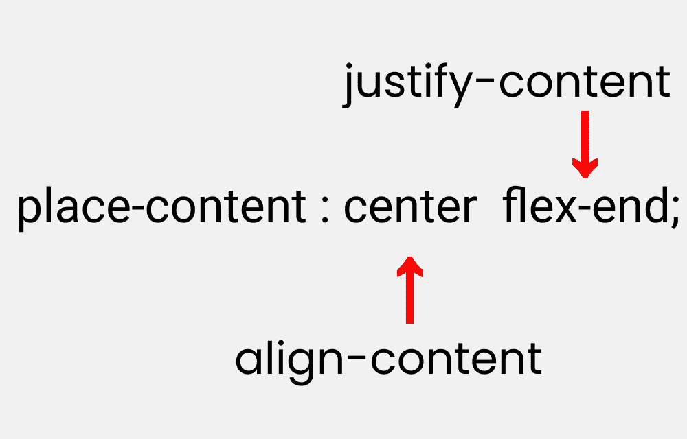

让我们复制结果:

**请注意**它作用于父类。

```
.container{
    place-content : center flex-end;
} 
```

## 更多资源

如果你想**锻炼**你的 Flexbox 知识，你可以[阅读我的这篇文章](https://www.freecodecamp.org/news/learn-flexbox-build-5-layouts/)，你将**使用 F** lexbox 构建五个响应式布局。这里有一个演示:


# 结论

这是你的阅读到最后的奖章，❤️

### 建议和批评是高度赞赏❤️


**YouTube[/Joy Shaheb](https://www.youtube.com/c/joyshaheb)**

**推特[/JoyShaheb](https://twitter.com/JoyShaheb)**

**insta gram[/JoyShaheb](https://www.instagram.com/joyshaheb/)**

## 信用

* [独角兽装](https://www.flaticon.com/packs/unicorn-4)， [Kitty 替身](https://www.flaticon.com/packs/kitty-avatars-3)

* [猫-1](https://www.flaticon.com/free-icon/cat_1864514?term=kitty&page=1&position=12&page=1&position=12&related_id=1864514&origin=search) 、[猫-2](https://www.flaticon.com/free-icon/cat_3629088?related_id=3629088) 、[狗](https://www.flaticon.com/free-icon/shiba_1623792?term=dog&related_id=1623792)、[兔](https://www.flaticon.com/free-icon/rabbit_1807972?term=rabbit&page=1&position=13&page=1&position=13&related_id=1807972&origin=search)

* [宇航员](https://www.freepik.com/free-vector/cute-astronaut-holding-coffee-cup-cartoon-illustration-science-food-drink-icon-concept-flat-cartoon-style_10479412.htm#position=0)、[独角兽杯](https://www.vecteezy.com/vector-art/668079-little-pony-in-coffee-cup)、[彩虹猫](https://www.vecteezy.com/vector-art/668109-rainbow-cat-unicorn-mermaid)

* [CSS 招数](https://css-tricks.com/snippets/css/a-guide-to-flexbox/)

