# 完整的 CSS 网格教程与备忘单🎖️

> 原文：<https://www.freecodecamp.org/news/css-grid-tutorial-with-cheatsheet/>

今天我们将学习 CSS 网格属性，这样你就可以创建自己的响应网站。我将解释 Grid 的每一个属性是如何工作的，并提供一个备忘单，涵盖了您可以使用 Grid 做的所有事情。我们走吧。🎖️

# 目录:

*   [CSS 网格架构](#css-grid-architecture)
*   [CSS 网格图](#css-grid-chart)
*   [网格父属性](#css-grid-parent-properties)
    *   [网格-模板-列](#the-grid-template-columns-property)
    *   [网格-模板-行](#the-grid-template-rows-property)
    *   [网格-模板-区域](#the-grid-template-areas-property)
    *   [如何在网格中创建行列间隙](#the-column-gap-property)
    *   [如何对齐项目并使项目与网格对齐](#the-justify-items-property)
    *   [如何对齐内容并使内容与网格对齐](#the-justify-content-property)
*   [CSS 网格中的子属性](#css-grid-child-properties)
    *   [网格-列:开始/结束](#the-grid-column-start-end-properties)
    *   [网格-行:开始/结束](#the-grid-row-start-end-properties)
    *   [网格区域](#the-grid-area-property)
    *   [自对齐||自对齐](#the-justify-self-property)
*   [网格的简写](#shorthand-for-css-grid-properties)
*   [结论](#conclusion)

## 如果你喜欢，你也可以在 YouTube 上观看这个教程:

[https://www.youtube.com/embed/VXW1r09Y6Tw?feature=oembed](https://www.youtube.com/embed/VXW1r09Y6Tw?feature=oembed)

# 一、什么是 CSS 网格？

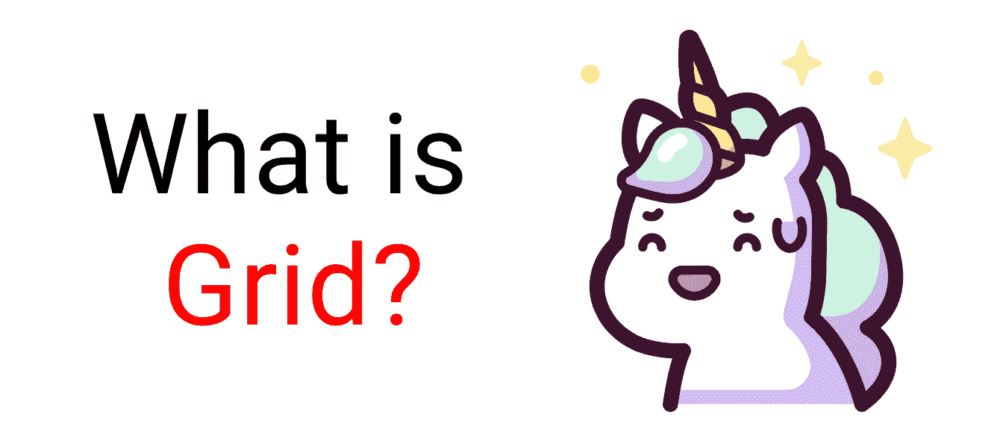

网格是制作网站的蓝图。

网格模型允许你设计网站的内容。不仅如此，它还可以帮助您创建为多种设备构建响应式网站所需的结构。这意味着你的网站在桌面、手机和平板电脑上都很好看。

这是一个简单的演示，我用 Grid 作为主要蓝图创建的。

### 桌面视图


### 移动视图


# CSS 网格架构

那么网格架构是如何工作的呢？网格项目[内容]沿主轴和横轴分布。使用各种网格属性，您可以操纵项目来创建您的网站布局。

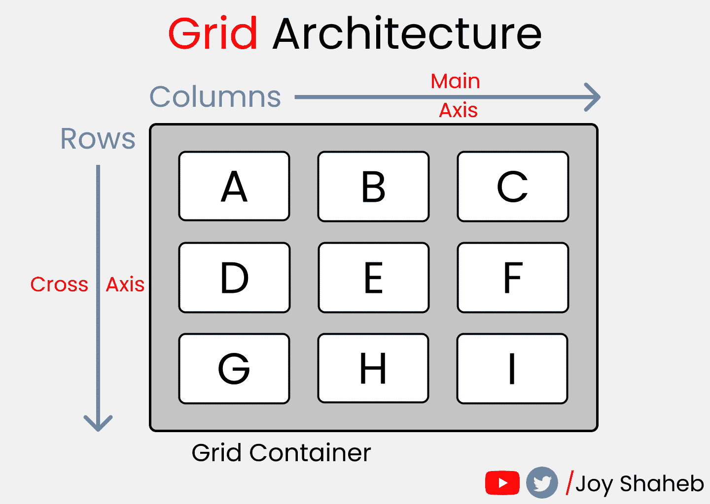

grid architecture

顺便说一下，你可以连接多个行和列，就像在 Excel 软件中一样，这比 Flexbox 提供了更多的灵活性和选择。

顺便说一下，如果你想了解更多，这里有一张我为 [Flexbox](https://www.freecodecamp.org/news/css-flexbox-tutorial-with-cheatsheet/) 做的备忘单。

# CSS 网格图

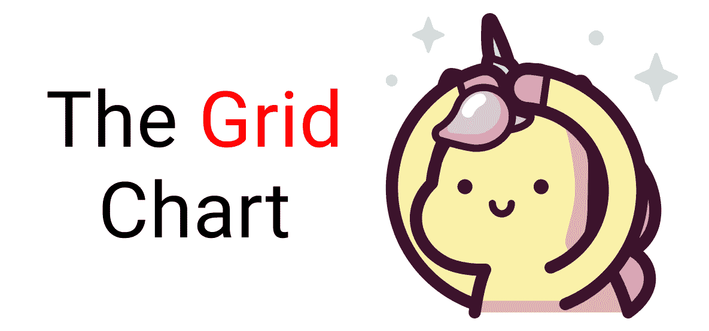

这张图表包含了你在使用网格时可能用到的所有属性。网格属性分为:

*   父属性
*   子属性

**注意:**红色文本表示速记属性:

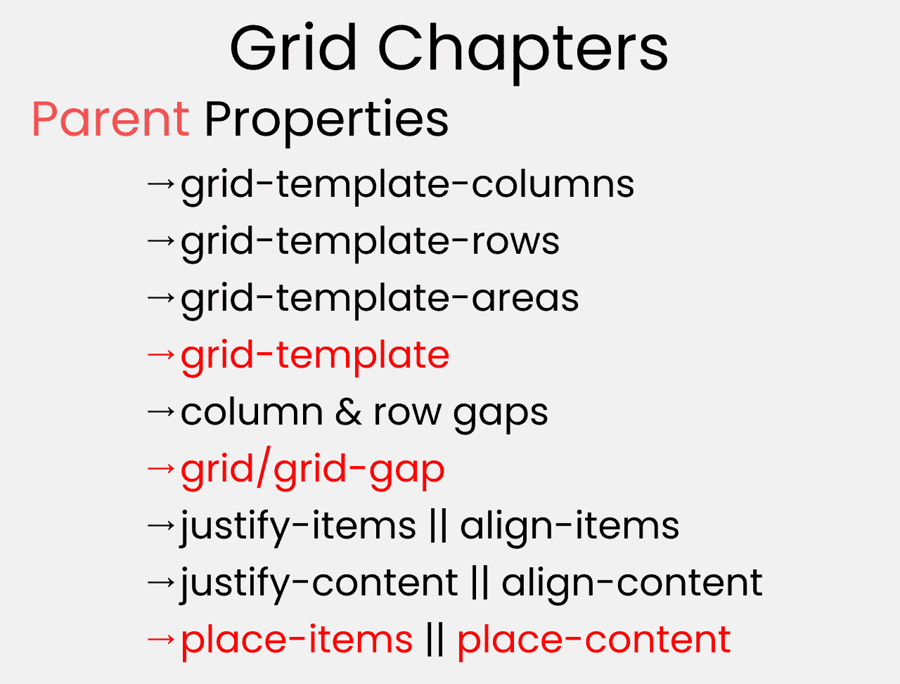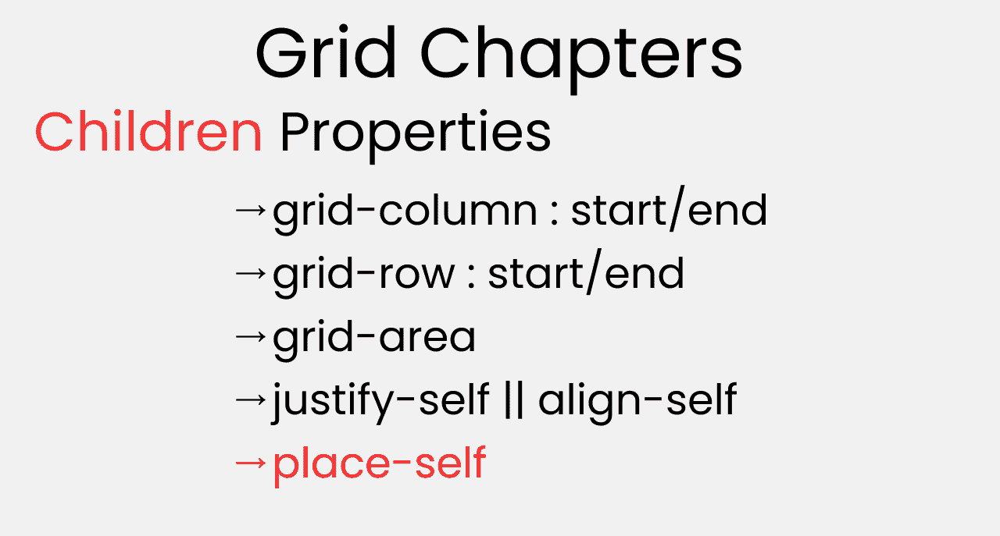

在本教程结束时，您将清楚地了解如何使用所有这些属性。

# 如何设置项目


对于这个项目，你需要知道一点点的 HTML，CSS，以及如何与 VS 代码。请跟我一起完成以下任务:

1.  创建一个名为“Project-1”的文件夹，打开 VS Code
2.  创建 index.html 和 style.css 文件
3.  安装并运行 Live Server。

或者，你可以直接打开 [Codepen](https://codepen.io) 开始编码。

在本教程结束时，你将能够做出准确而漂亮的网站布局。

和...我们都准备好了！开始编码吧。😊

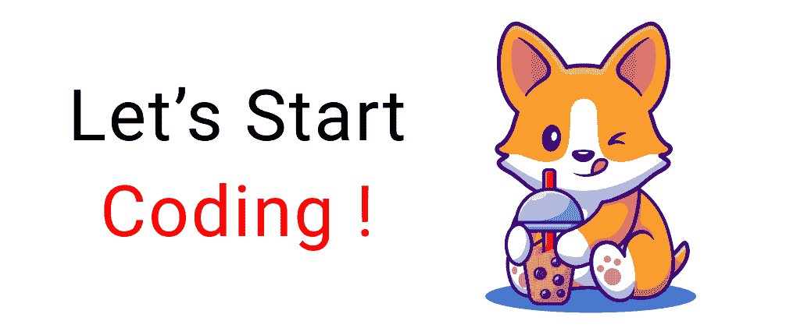

## 超文本标记语言

在 body 标签内创建三个框，如下所示👇

```
<div class="container">
  <div class="box-1"> A </div>
  <div class="box-2"> B </div>
  <div class="box-3"> C </div>
</div> 
```

## 半铸钢ˌ钢性铸铁(Cast Semi-Steel)

### 第一步

让我们清除默认的浏览器风格。跟我来👇

```
*{
  margin: 0px;
  padding: 0px;
  box-sizing: border-box;
} 
```

### 第二步

在身体选择器内，进行以下调整:

```
body {
  font-family: sans-serif;
  font-size: 40px;
  width: 100%;
  min-height: 100vh;
} 
```

### 第三步

现在，让我们一起选择所有的盒子来设计它们的样式-->

```
[class^="box-"] {
  background-color: skyblue;

/* To place the letter at the center */
  display: grid;
  place-items: center;
} 
```

**注意:**别急，我们稍后会详细讨论那些网格属性。

### 第四步

现在，像这样在我们的盒子之间放置一些间隙👇

```
.container {
  display: grid;
  gap: 20px;
} 
```

## 但是等等....


在开始之前，您需要了解父类和子类之间的关系。


对于网格父属性，我们将在`.container`类内部编写。对于 Grid 子属性，我们将在`.box-*`类中编写。

# CSS 网格父属性

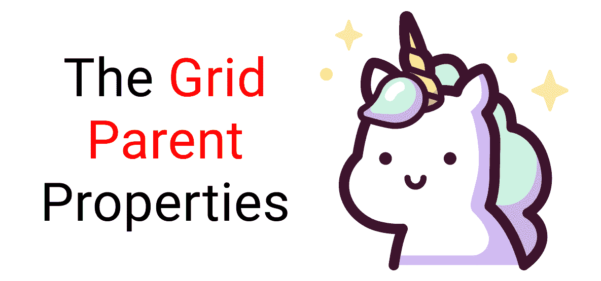

首先，我们来了解一下 CSS Grid 的父属性！

## 网格模板列属性

您使用该属性来定义列的**数量和宽度**。您可以单独设置每列的宽度，也可以使用`repeat()`功能为所有列设置统一的宽度。

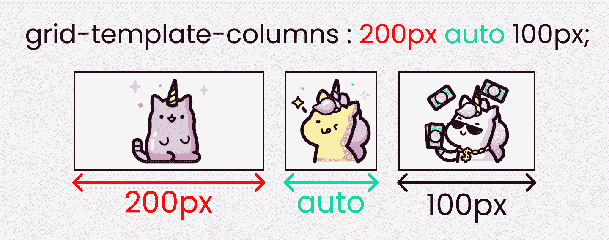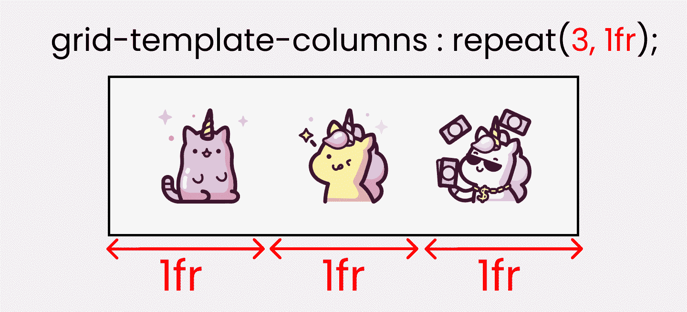

grid-template-columns

要重新创建这些结果，请编写以下 CSS 行-->

```
.container {
  display: grid;
  gap: 20px;

/*  Change the values     👇 to experiment */
  grid-template-columns: 200px auto 100px;
} 
```

**注:**

*   像素值将是精确的测量值。“auto”关键字将覆盖可用空间。
*   如果您使用 fr(分数单位)作为度量单位，所有的盒子大小都相同。

## 网格模板行属性

您使用该属性来定义行的数量**和高度**。您可以单独设置每行的高度，也可以使用`repeat()`功能为所有行设置统一的高度。

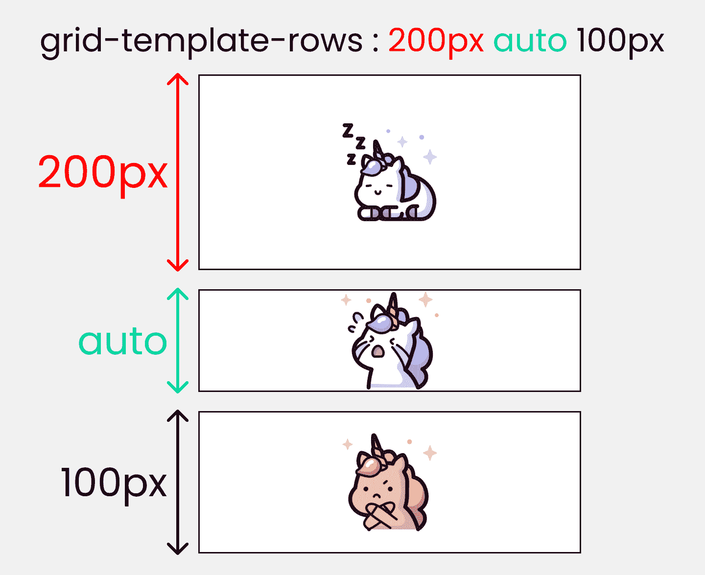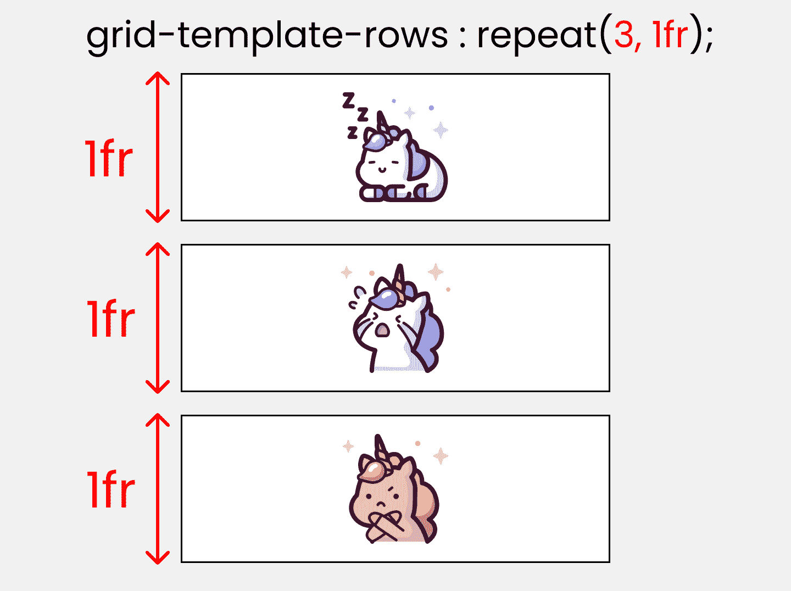

grid-template-rows

要测试这些结果，请编写以下 CSS 代码->

```
.container {
  display: grid;
  gap: 20px;
  height: 100vh;

/* Change the values  👇 to experiment */
  grid-template-rows: 200px auto 100px;
} 
```

## 网格模板区域属性

您可以使用此属性来指定网格单元格在父容器中应包含的列和行的空间量。有了这个属性，生活变得简单多了，因为它让我们可以直观地看到我们在做什么。

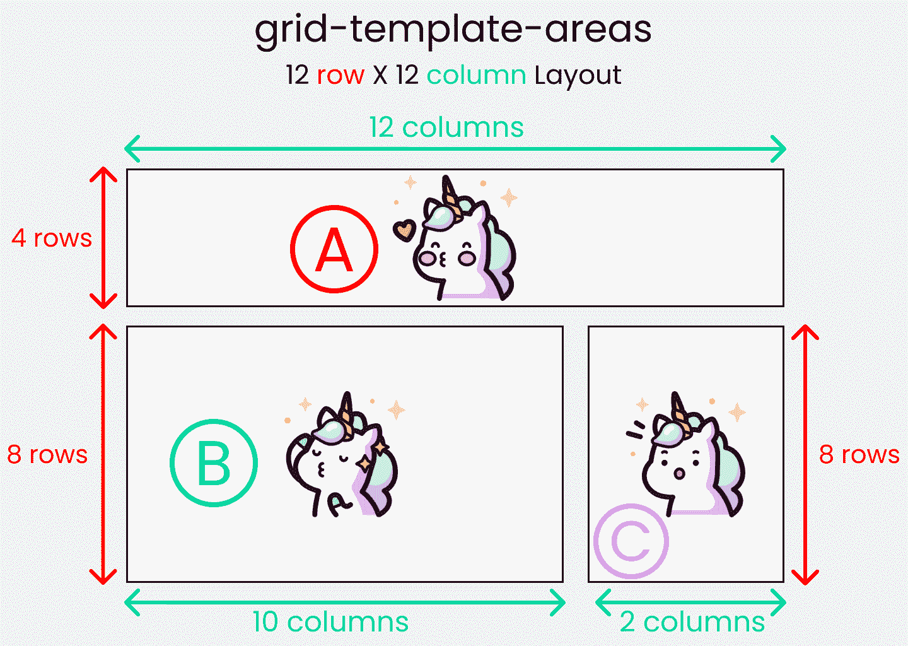

Standard 12X12 layout

称之为我们布局的蓝图(模板)👇


The blueprint

要试验这一点，您需要了解父属性和子属性:

*   **网格-模板-区域:**将创建蓝图的父属性
*   **grid-area:** 将跟随蓝图的子属性。

### 首先，创建蓝图

像这样👇在父体内。容器类别:

```
.container {
  display: grid;
  gap: 20px;
  height: 100vh;

  grid-template-areas: 
    "A A A A   A A A A   A A A A"
    "B B B B   B B B B   B B C C"
    "B B B B   B B B B   B B C C";
} 
```

### 实施蓝图

将我们所有的子`.box-*`类作为目标，并像这样设置值- >

```
.box-1{
  grid-area: A;
}
.box-2{
  grid-area: B;
}
.box-3{
  grid-area: C;
} 
```

**注意:**我将在 grid 子属性部分再次讨论 grid-area 属性。

## 列间距属性

您使用该属性在网格内的**列**之间放置一个间隙👇

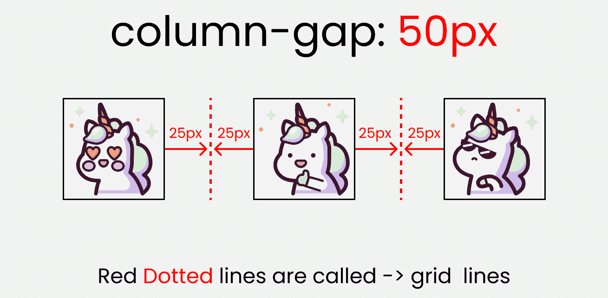

column-gap

为了测试这一点，用 CSS 编写以下代码👇

```
.container {
  display: grid;
  height: 100vh;

  grid-template-columns: 100px 100px 100px;
//Change values👇 to experiment
  column-gap:  50px;
} 
```

**注意:**列-间隙与网格-模板-列一起工作。

## 行间距属性

您使用该属性在网格内的**行**之间放置一个间隙👇

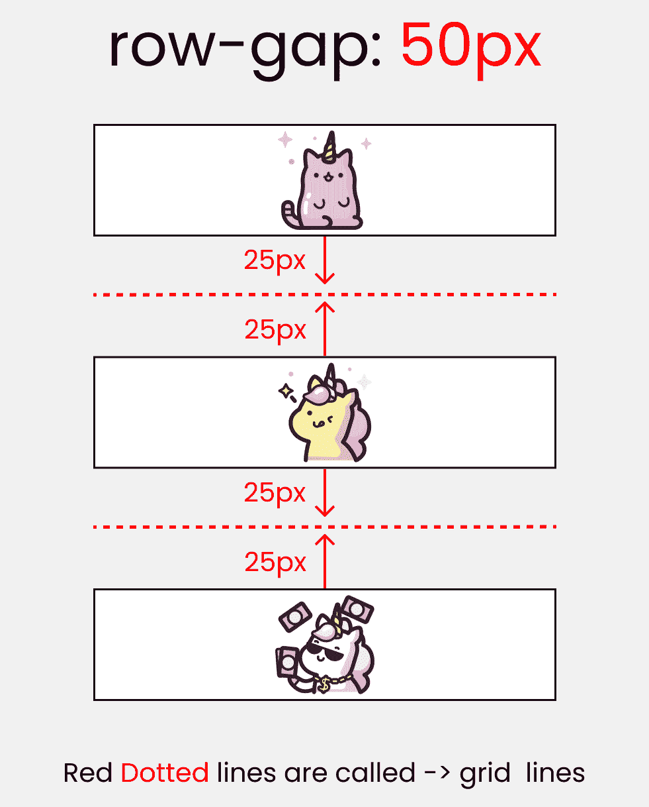

row gap

让我们测试一下👇

```
.container {
  display: grid;
  height: 100vh;

  grid-template-rows: 100px 100px 100px;
// Change   👇  values to experiment
  row-gap:  50px;
} 
```

**注意:** row-gap 与 grid-template-rows 一起工作。

## “对齐项目”属性

您可以使用该属性沿着 **X 轴【主轴】**定位网格容器内的网格项目(子项目)。 **4** 的值为👇

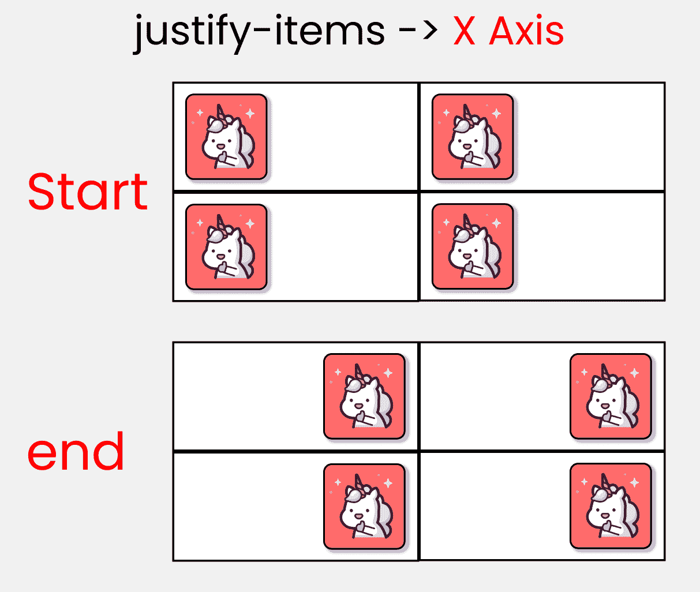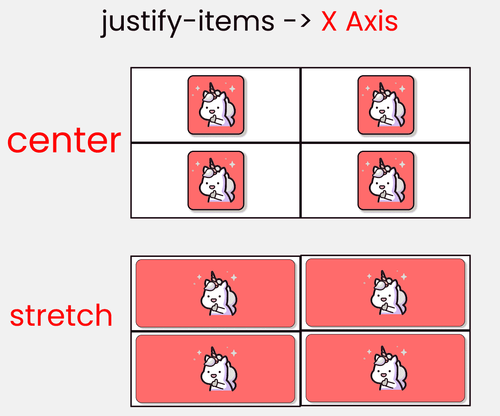

justify-items

如果你想测试这一点，那么在 HTML ->

```
<div class="container">

  <!--Other boxes - A, B, C are here-->

  <div class="box-4"> D </div>
</div> 
```

并且在 CSS ->

```
.container {
  display: grid;
  gap: 50px;
  height: 100vh;

// each box is 200px by 200px
  grid-template-rows: 200px 200px;
  grid-template-columns: 200px 200px;

//  Change values 👇  to experiment
  justify-items : end;
} 
```

## align-items 属性

您可以使用该属性沿着 **Y 轴【横轴】**定位网格容器内的网格项目(子项目)。 **4** 的值为👇

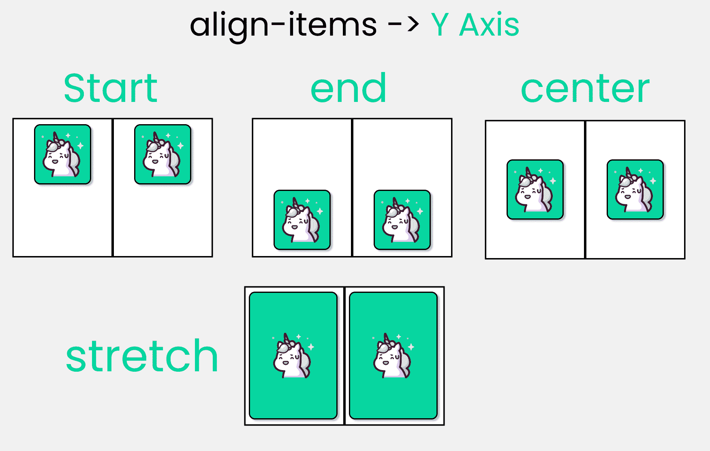

align-items

不要在 HTML 中修改任何东西，而是在 CSS 中写->

```
.container {
  display: grid;
  gap: 50px;
  height: 100vh;

// each box is 200px by 200px
  grid-template-rows: 200px 200px;
  grid-template-columns: 200px 200px;

//  Change values 👇  to experiment
  align-items: center;
} 
```

## 内容对齐属性

您可以使用该属性沿着 X 轴[主轴] 定位网格容器中的网格[基本上是所有内容]。 **7** 值为👇

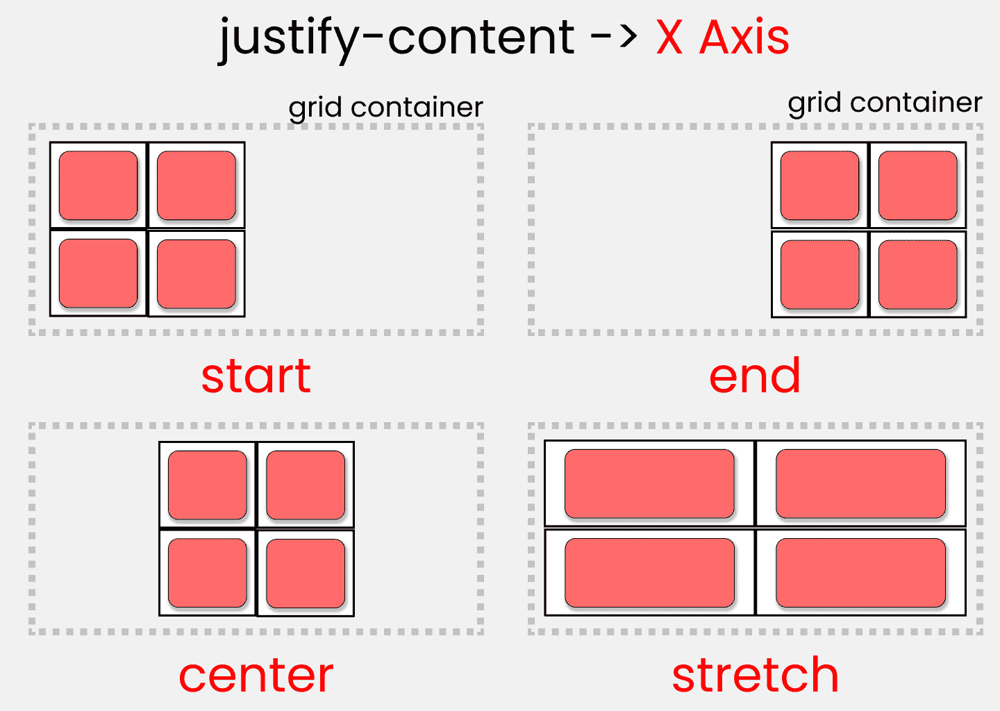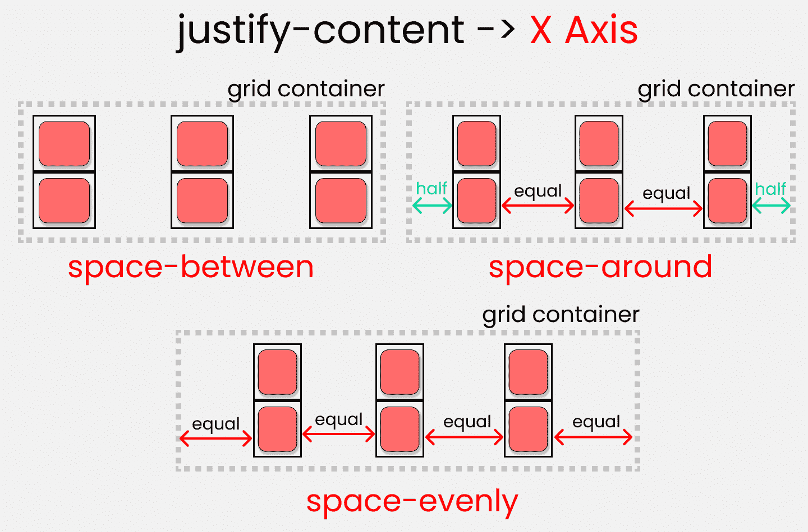

justify-content

不要在 HTML 中修改任何东西，而是在 CSS 中写->

```
.container {
  display: grid;
  gap: 50px;
  height: 100vh;

// each box is 200px by 200px
  grid-template-rows: 200px 200px;
  grid-template-columns: 200px 200px;

//  Change  values  👇  to experiment
  justify-content: center;
} 
```

## 对齐内容属性

您使用这个属性沿着 Y 轴[横轴]定位网格容器中的网格[基本上是所有内容]。 **7** 值为👇

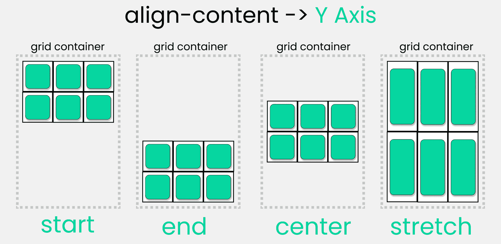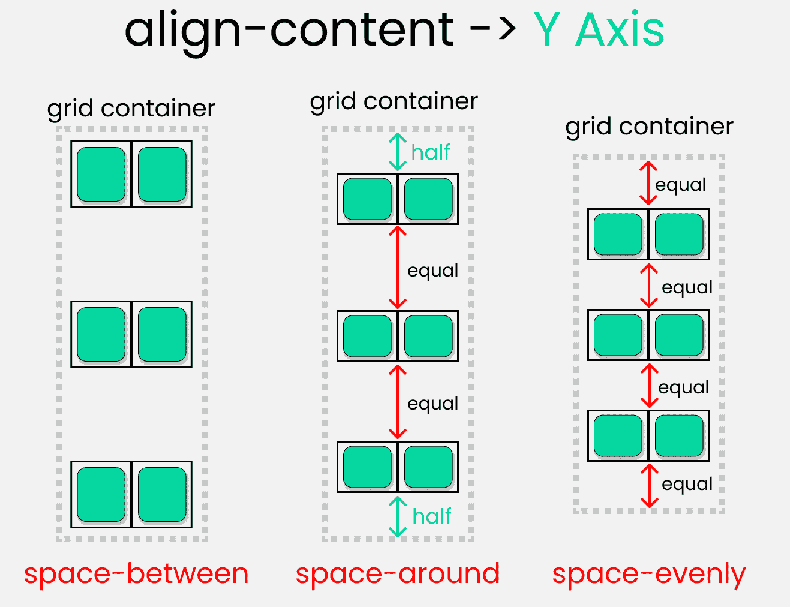

align-content

不要在 HTML 中修改任何东西，而是在 CSS 中写->

```
.container {
  display: grid;
  gap: 50px;
  height: 100vh;

// each box is 200px by 200px
  grid-template-rows: 200px 200px;
  grid-template-columns: 200px 200px;

//  Change  values 👇  to experiment
  align-content : center;
} 
```

# 休息一会儿

到目前为止一切顺利！休息一下，这是你应得的。


# CSS 网格子属性

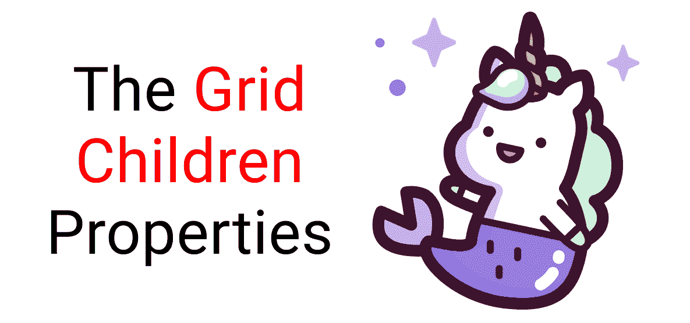

现在，让我们看看网格子属性。

# CSS 网格比例

我制作了这个网格比例来演示行和列是如何连接在一起的。我们可以使用两种测量方法中的任何一种:

*   数字[1，2，3，4 等]...]
*   span 关键字

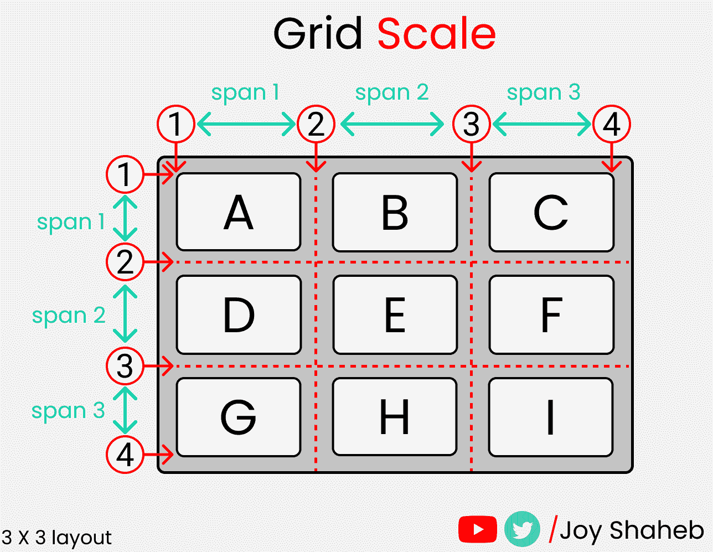

The Grid Scale

当我们马上写代码时，你会清楚地看到这个指南是如何在☝️工作的。

下图👇显示单个单元格的行和列的起点和终点。

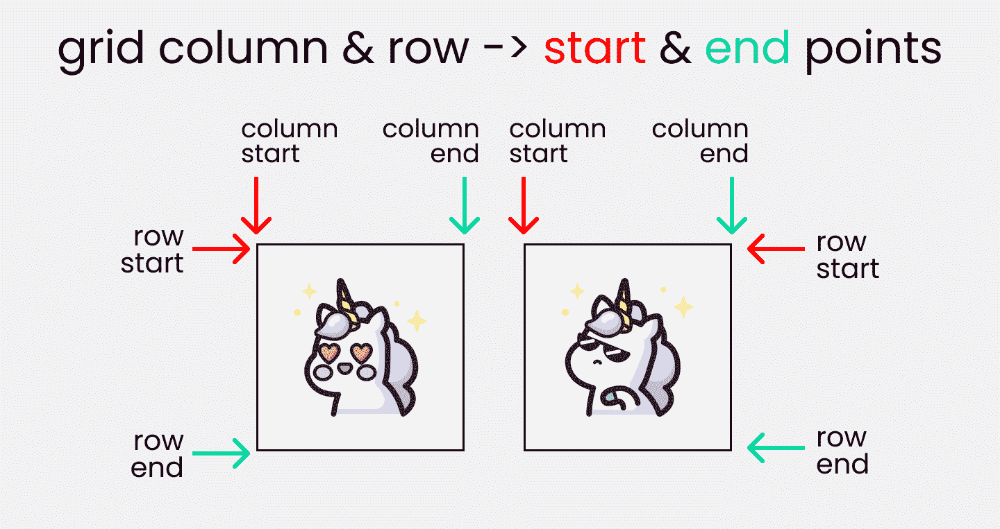

Grid column & row -> start & end points

### 超文本标记语言

要试验网格比例并理解以下属性，请在 body 标记内制作 4 个框:

```
<div class="container">
  <div class="box-1"> A </div>
  <div class="box-2"> B </div>
  <div class="box-3"> C </div>
  <div class="box-4"> D </div>
</div> 
```

我们将利用`repeat()`函数。它重复我们的代码一定次数。这里有一个例子👇

```
grid-template-columns : repeat(5,1fr); 
```

这个☝️相当于这样写:👇

```
grid-template-columns : 1fr 1fr 1fr 1fr 1fr ; 
```

#### 快速笔记

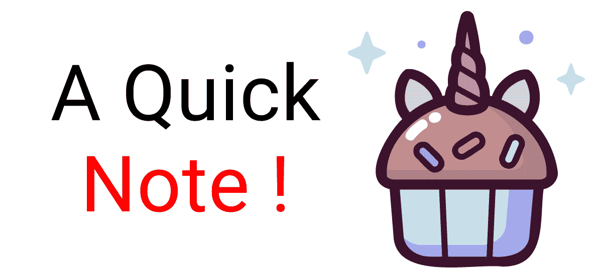

当我们使用 fr [ Fraction ]单位时，我们将屏幕区域分成相等的比例。

```
 grid-template-columns: repeat(5, 1fr); 
```

这个☝️代码将我们的屏幕宽度分成 5 等份。

我们准备好了，开始吧！

## 轴网-柱:起点/终点属性

您使用这两个属性将多个**列**连接在一起。它是两个属性的简写:

*   **网格-列-开始**
*   **网格-列-端**

在您的 CSS 中编写以下代码:

```
.container {
  display: grid;
  gap: 20px;
  height: 100vh;

  grid-template-columns: repeat(12, 1fr);
  grid-template-rows: repeat(12, 1fr);
} 
```

结果看起来像这样:

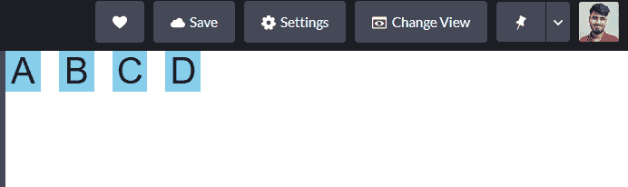

这里，我们将屏幕(宽度和高度)分成 12 个相等的部分。1 个盒子占 1 个部分，也可以叫 1fr [ 1 个分数]。沿着宽度的其余 8 个分数是空的。

当我们处理子属性时，我们需要像这样定位我们的`.box-*`类:

```
.box-1{}
.box-2{}
.box-3{}
.box-4{} 
```

您可以尝试这些框中的任何一个或全部，我将坚持使用`.box-1`。

让我们带上网格标尺。我们正在处理列——只关注列，而不是行。


The Grid Scale

每个`.box-*`类的默认比例是:

```
grid-column-start : 1;
grid-column-end : 2;

/* The shorthand -> */
 grid-column : 1 / 2 
```

我们也可以用跨度单位写这个☝️，像这样👇

```
grid-column : span 1; 
```

让我们像这样把空的 8 个分数分配给`.box-1`👇

```
.box-1{
grid-column : 1/10
} 
```

结果看起来像这样:👇

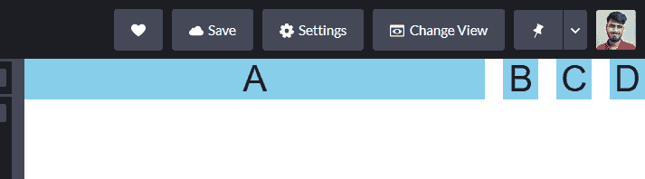

### 快速笔记

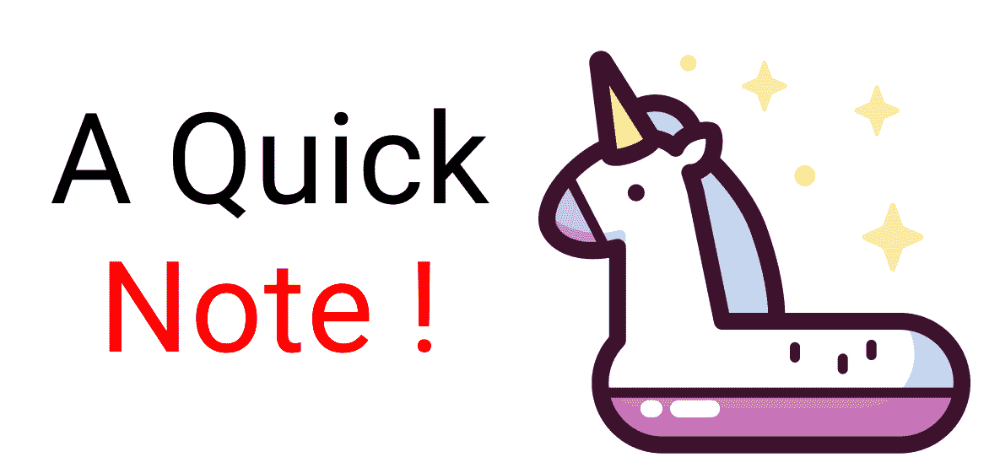

我是怎么计算的？`box-1`本身占据 1 个盒子。除此之外，我们还增加了 8 个盒子。最后，你必须加 1 表示结束，所以，8+1+1 = 10。

### 如何使用 span 关键字

如果你对第一个属性感到困惑，你可以使用`span`关键字，因为它更容易理解。

我们需要给已经占据一个盒子的`.box-1`增加 8 个盒子。所以，我们要做 8+1 = 9。

```
.box-1{
  grid-column : span 9;
} 
```

这会输出相同的结果。

## 网格行:开始/结束属性

您使用这两个属性将多个**行**连接在一起。它是两个属性的简写:

*   **网格-行-开始**
*   **网格-行-结束**

我们来试验一下吧！在这里，我会坚持。方框 1，这是我们的网格指南。现在，只关注行的比例，而不是列。


The Grid Scale

让我们把 9 个盒子排成一排。

编写以下代码:👇

```
.box-1{
  grid-row : 1/11;
} 
```

计算看起来是这样的-> `.box-1`持有 1 个盒子，你再添加 9 个盒子，在最后一个位置加上一个强制的 1 来表示结束，这样你就得到 9+1+1=11。

这是另一种选择👇使用 span 关键字:

```
.box-1{
  grid-row : span 10;
} 
```

而这里的计算是-> `.box-` 1 装 1 个箱子，你再加 9 个箱子
9+1=10。

以下是目前为止的结果:👇

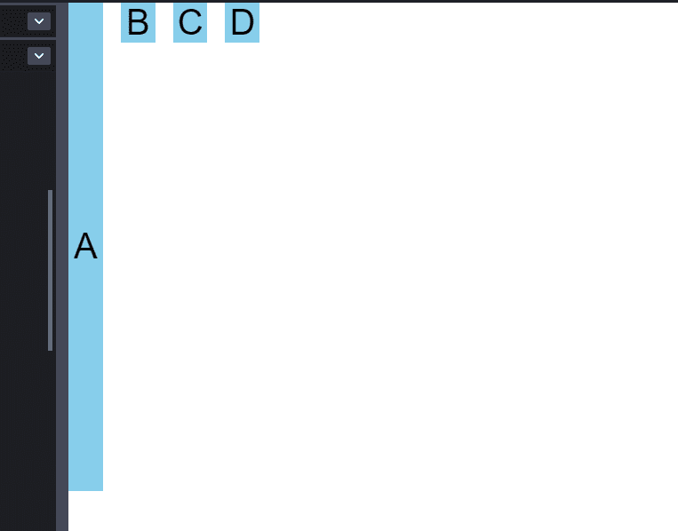

## 网格区域属性

首先，我们需要设置 ☝️一旦我们完成了这些，我们必须在子类中指定父类中使用的名称，就像这样:👇

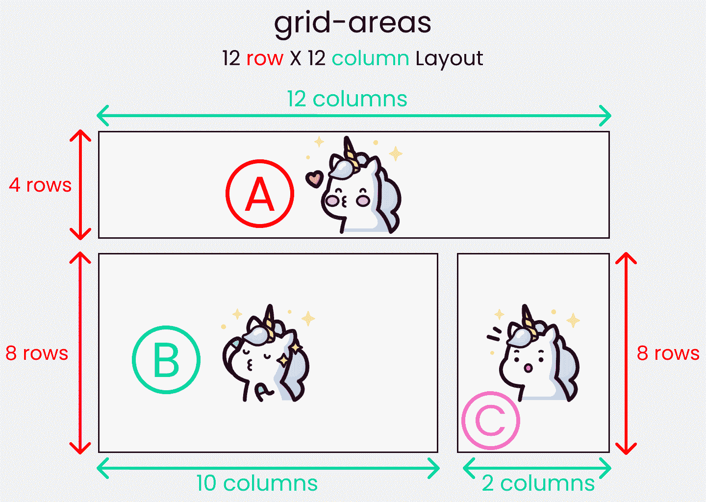

Standard 12X12 layout

然后我们需要在父容器中指定网格模板区域:👇

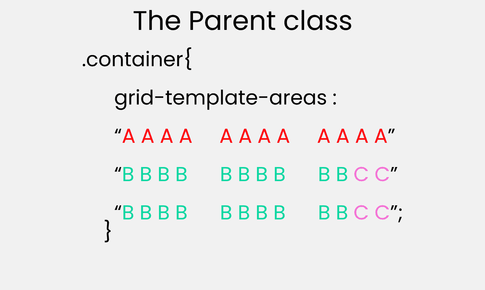

像这样👇在父类内部:

```
.container {
  display: grid;
  gap: 20px;
  height: 100vh;

  grid-template-areas: 
    "A A A A   A A A A   A A A A"
    "B B B B   B B B B   B B C C"
    "B B B B   B B B B   B B C C";
} 
```

然后，我们用网格区域在子类中指定父容器中使用的名称👇

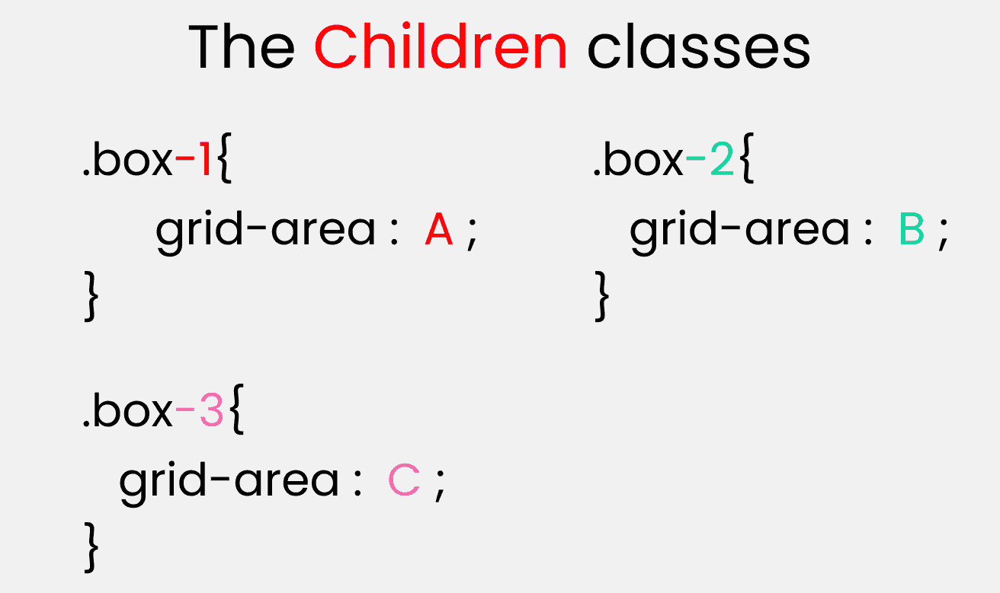

像这样👇在儿童班级中:

```
.box-1{
  grid-area: A;
}
.box-2{
  grid-area: B;
}
.box-3{
  grid-area: C;
} 
```

## 自圆其说的性质

您可以使用该属性沿着 **X 轴【主轴】**在网格容器内定位 **1 个单独的**网格项目(子项目)。 **4** 的值为👇

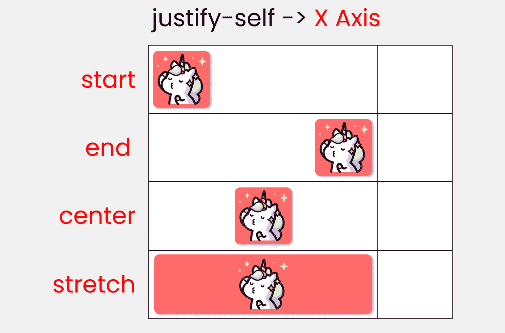

Justify-self

编写以下代码来试验这些值👇

```
.container {
  display: grid;
  gap :25px;
  height: 100vh;

/* // each box has equal size */
  grid-template-rows: 1fr 1fr;
  grid-template-columns: 1fr 1fr;
} 
```

**切记！**这只对子类有效。所以，瞄准任何`.box-*`类。我将瞄准第一个盒子:

```
.box-1 {
/*  Change values 👇  to experiment */
  justify-self : start;  
} 
```

## 自对齐属性

您可以使用该属性沿着 **Y 轴【横轴】**在网格容器内定位 **1 个单独的**网格项目(子项目)。 **4** 的值为👇

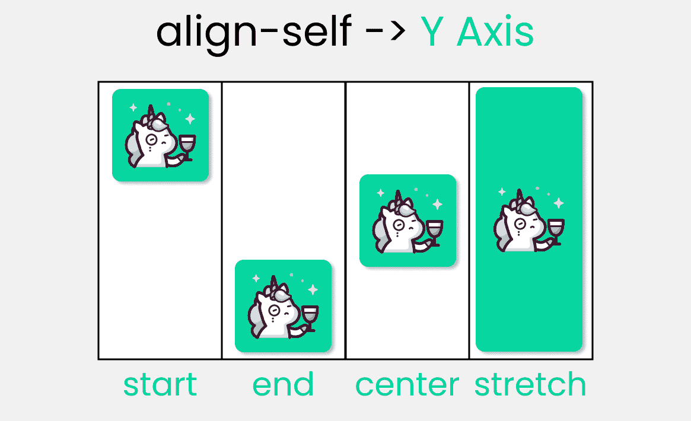

align-self

让我们试验一下这些值👇

```
.container {
  display: grid;
  gap :25px;
  height: 100vh;

/* // each box has equal size */
  grid-template-rows: 1fr 1fr;
  grid-template-columns: 1fr 1fr;
} 
```

**切记！**这只对子类有效。所以，瞄准任何`.box-*`类。我将瞄准第一个盒子:

```
.box-1 {
/*  Change values 👇  to experiment */
  align-self : start;  
} 
```

# CSS 网格属性的简写


让我们看看这些网格速记属性:

*   `place-content`
*   `place-items`
*   `place-self`
*   `grid-template`
*   `gap` / `grid-gap`

## 地点内容

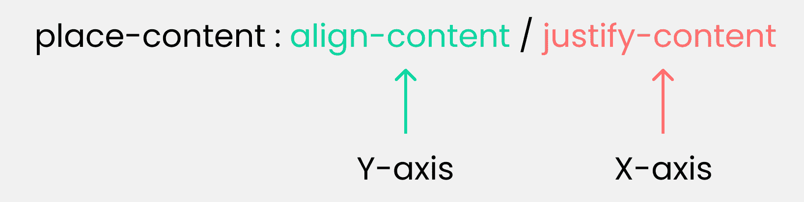

place-content

这是两个属性的简写:

*   对齐内容
*   调整内容

#### 一个例子

```
align-content : center;
justify-content : end;

/* The shorthand */
place-content : center / end ; 
```

## 地点-项目

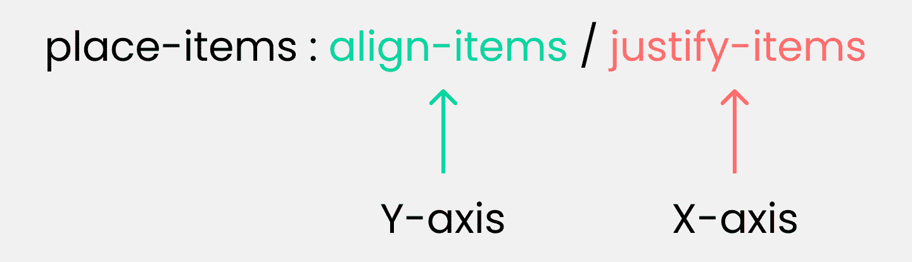

place-items

这是两个属性的简写:

*   对齐-项目
*   对齐-项目

#### 一个例子

```
align-items : end;
justify-items : center;

/* The shorthand */
place-items : end / center ; 
```

## 自我定位


place-self

这是两个属性的简写:

*   自我对齐
*   自圆其说

#### 一个例子

```
align-self : start ;
justify-self : end ;

/* The shorthand */
place-self : start / end ; 
```

## 网格模板

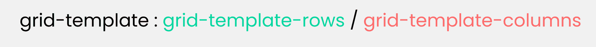

grid-template

这是两个属性的简写:

*   网格-模板-行
*   网格-模板-列

#### 一个例子

```
grid-template-rows : 100px 100px;
grid-template-columns : 200px 200px;

/* The shorthand */
grid-template : 100px 100px / 200px 200px; 
```

## 间隙/网格间隙

Gap 和 grid-gap 是同一个东西，做同样的工作。你可以使用其中任何一个。

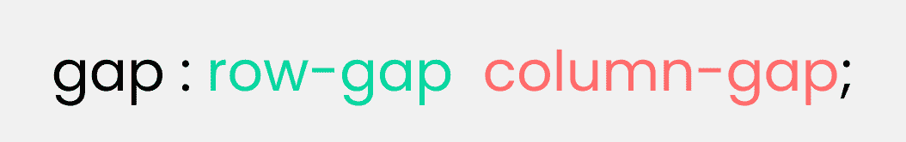

gap

这是两个属性的简写:

*   行间隙
*   列间隙

#### 一个例子

```
row-gap : 20px ; 
column-gap : 30px ;

/* The shorthand */
gap : 20px  30px; 
```

## 信用

*   [柯基犬](https://www.freepik.com/free-vector/cute-corgi-drink-milk-tea-boba-cartoon-vector-illustration-animal-drink-concept-isolated-vector-flat-cartoon-style_10336142.htm#position=13)，[吉](https://www.freepik.com/free-psd/pet-food-banner-template_13762522.htm#position=1)

# 结论

现在，您可以使用您的网格知识自信地制作响应性网站布局！

这是你的阅读到最后的奖章，❤️

## 建议和批评是高度赞赏❤️


**YouTube**

**LinkedIn[/Joy Shaheb](https://www.linkedin.com/in/joyshaheb/)**

**推特[/JoyShaheb](https://twitter.com/JoyShaheb)**

**insta gram[/JoyShaheb](https://www.instagram.com/joyshaheb/)**