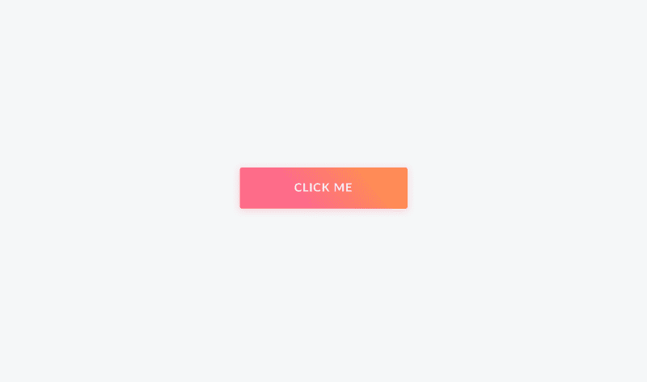
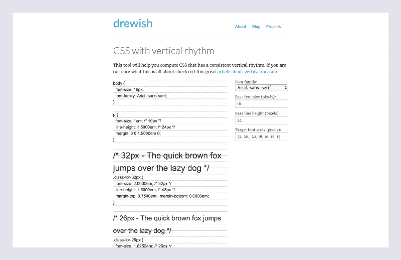

# JavaScript 中的 CSS:基于组件的样式的未来

> 原文：<https://www.freecodecamp.org/news/css-in-javascript-the-future-of-component-based-styling-70b161a79a32/>

通过采用内联样式，我们可以获得 JavaScript 的所有编程启示。这给了我们类似 CSS 预处理器(变量、混合和函数)的好处。它还解决了 CSS 的许多问题，比如全局命名空间和样式冲突。

要深入探究 JavaScript 中 CSS 解决的问题，请查看著名的演示: [React CSS in JS](https://speakerdeck.com/vjeux/react-css-in-js) 。关于阿芙罗狄蒂提高性能的案例研究，你可以阅读可汗学院的[内联 CSS:阿芙罗狄蒂](http://engineering.khanacademy.org/posts/aphrodite-inline-css.htm)。如果你想在 JavaScript 最佳实践中了解更多关于 CSS 的知识，请查看 [Airbnb 的风格指南](https://github.com/airbnb/javascript/tree/master/css-in-javascript)。

此外，我们将使用内联 JavaScript 样式来构建组件，以解决我在以前的一篇文章中提到的一些设计基础:[在掌握设计之前，您必须首先掌握基础](https://medium.freecodecamp.com/before-you-can-master-design-you-must-first-master-the-fundamentals-1981a2af1fda)。

### 激励人心的例子

让我们从一个简单的例子开始:创建和设计一个按钮。

正常情况下，组件及其相关的样式会放在同一个文件中:`Button`和`ButtonStyles`。这是因为它们属于同一个关注点:视图。然而，对于这个例子，我将代码分解成多个 gists，使其更容易理解。

下面是按钮组件:

这并不意外——只是一个无状态的 React 组件。阿芙罗狄蒂在`className`地产中发挥作用。函数`css`接收一个`styles`对象并将其转换成 css。`styles`物体是用阿芙罗狄蒂的`StyleSheet.create({ ... })`功能创建的。用这个[阿芙罗狄蒂游乐场](https://output.jsbin.com/qoseye?)可以看到`StyleSheet.create({ ... })`的输出。

**下面是按钮样式表:**

Aphrodite 的一个好处是迁移很简单，学习曲线很低。像`border-radius`这样的属性变成了`borderRadius`，值变成了字符串。伪选择器、媒体查询和字体定义都可以工作。此外，供应商前缀是自动添加的。

结果如下:



[One of the benefits of Aphrodite is that migration is straightforward and the learning curve is low.](https://twitter.com/JonathanZWhite)

记住这个例子，**让我们看看如何使用 Aphrodite 来构建一个基本的视觉设计系统**，重点关注以下设计基础:排版和间距。

### 基础№1—排版

让我们从排版开始，这是设计的基础。**第一步是定义排版常数**。与 Sass 或 Less 不同，Aphrodite 的常量可以放在 JavaScript 或 JSON 文件中。

#### 定义排版常数

创建常量时，**为变量使用语义名称**。例如，不要给你的字体大小命名为`h2`，而是用一个类似`displayLarge`的名字来描述它的*角色*。同样，对于字体粗细，不要给你的一个粗细命名为`600`，而是给它一个类似`semibold`的名字来描述它的*效果*。

为字体大小和行高等变量获取正确的值非常重要。这是因为它们直接影响设计中的垂直节奏。垂直节奏是一个概念，可以帮助您实现元素之间的一致间距。

关于垂直节奏的更多内容，你可以阅读这篇文章:[为什么垂直节奏是一种重要的排版实践？](https://zellwk.com/blog/why-vertical-rhythms/)



[Use a calculator to determine line-heights](https://drewish.com/tools/vertical-rhythm/)

选择行高和字体大小的值是有科学依据的。我们可以使用数学比率来生成一组潜在的候选尺寸。几周前，我写了一篇文章，详细介绍了这种方法:[字体设计可以成就或毁灭你的设计:选择字体的过程](https://medium.freecodecamp.com/typography-can-make-your-design-or-break-it-7be710aadcfe)。为了确定字体大小，你使用[模块比例](http://www.modularscale.com/)。为了确定行高，您可以使用这个[垂直节奏计算器](https://drewish.com/tools/vertical-rhythm/)。

#### 定义标题组件

定义了字体常量后，下一步是创建一个组件来消费这些值。该组件的目标是在整个代码库中加强标题设计和实现的一致性。

`Heading`组件是一个无状态函数，它接受一个标签作为属性，并返回该标签及其相关的样式。这是可能的，因为我们已经在常量文件中定义了标记映射。

在组件文件的底部，我们定义了我们的`styles`对象。这是我们使用字体常量的地方。

这就是`Heading`组件的使用方式:

通过这种方法，**，我们减少了我们的类型系统**中不可预料的可变性。我们通过消除对全局样式的需求和标准化整个代码库的标题来避免一百种不同字体大小的陷阱。此外，我们用来构建`Heading`组件的方法可以应用于构建用于主体复制的`Text`组件。

### 基本№2 —间距

**间距控制设计中的垂直和水平节奏**。这使得空间成为建立视觉设计系统的关键。就像在排版部分一样，解决间距问题的第一步是定义间距常数。

#### 定义间距常数

当定义元素之间的间距常数时，我们可以采用数学方法。使用一个`spacingFactor`常数，我们可以基于一个公共因子生成一组距离。**这种方法确保我们在元素之间有逻辑和一致的间距。**

上面的例子使用了线性标度，从 1 到 13。但是，可以尝试不同的比例和比率。根据设计的目的、受众和目标设备，设计需要不同的尺度。作为一个例子，**这里是使用黄金分割比例**和八的`spacingFactor`计算的前六个距离。

```
Golden Ratio (1:1.618)
```

```
8.0 x (1.618 ^ 0) = 8.0008.0 x (1.618 ^ 1) = 12.948.0 x (1.618 ^ 2) = 20.948.0 x (1.618 ^ 3) = 33.898.0 x (1.618 ^ 4) = 54.828.0 x (1.618 ^ 5) = 88.71
```

这是间距刻度在代码中的样子。我添加了一个助手函数来处理计算，并将输出四舍五入到最接近的像素值。

在定义了间距常数之后，我们可以用它们来增加设计中元素的边距。**我们可以采用的一种方法是导入间距常数，并在组件**中使用它们。

例如，让我们给`Button`组件添加一个`marginBottom`。

这在大多数情况下都有效。然而，如果我们想根据按钮的位置改变按钮的`marginBottom`属性，会发生什么呢？

实现可变边距的一种方法是覆盖消费父组件的边距样式。另一种方法是**创建一个** `Spacing` **组件来控制元素**的垂直边距。

使用这种方法，我们可以将设置边距的责任从子组件转移到父组件。通过这种方式，子组件变得与布局无关，不需要任何关于相对于其他元素放置自身的知识。

这是因为按钮、输入和卡片等组件可能需要可变的边距。例如，表单中的按钮可能比导航栏中的按钮需要更大的边距。需要注意的是，如果一个组件总是有一致的边距，那么在组件内部处理边距会更有意义。

你可能也注意到了，这些例子只使用了`marginBottom`。这是因为**在一个方向定义所有的垂直页边距可以让你避免折叠页边距，并跟踪你设计的垂直节奏**。你可以在 Harry Robert 的文章[单向保证金申报](https://csswizardry.com/2012/06/single-direction-margin-declarations/)中读到更多。

最后，您还可以使用您定义为填充的间距常量。

通过对边距和填充使用相同的间距常数，您可以在设计中获得更好的视觉一致性。

结果可能是这样的:


[By using spacing constants for your margins and padding, you can achieve more visual consistency.](https://twitter.com/JonathanZWhite)

既然您已经掌握了 JavaScript 中的 CSS，那就出去尝试一下吧。尝试将内联 JavaScript 风格融入到您的下一个项目中。我想**你会喜欢能够在一个单一的环境中处理你所有的风格和视图问题**。

关于 CSS 和 JavaScript 这个话题，有哪些让你感到兴奋的新进展？就我个人而言，我对 async/await 很感兴趣。给我留言或者在 Twitter 上给我发一条 [tweet](https://twitter.com/jonathanzwhite) 。

你可以在 [Twitter](https://twitter.com/JonathanZWhite) 上关注我，在那里我会发布一些关于设计、前端开发和虚拟现实的无聊漫谈。