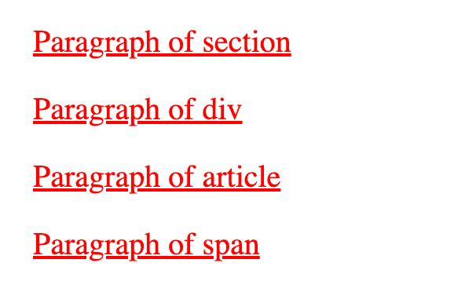
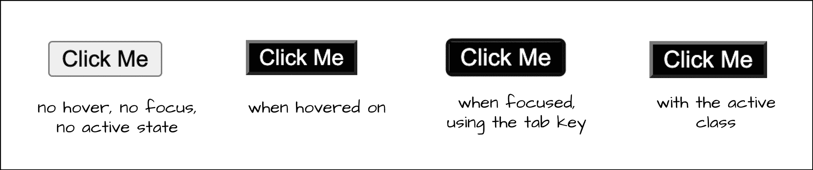

# CSS 伪类——is 伪类如何与示例一起工作

> 原文：<https://www.freecodecamp.org/news/css-is-pseudo-class-explained/>

伪类允许您在特定状态下设计元素的样式。CSS 中有许多支持状态的类。在本文中，我将解释`:is`伪类是如何工作的。

这篇文章是我在接下来的几周和几个月里将要撰写的新系列文章的第一篇: **CSS 伪类解释**。我打算尽可能多地解释伪类，每篇独立的文章都处理一个特定的伪类。

我有一个 CSS 伪类解释了 YouTube 播放列表，你也可以看看。

注意:伪类不同于伪元素。伪类适用于元素的不同**状态**，而伪元素适用于元素的不同**部分**。

你可以在这里了解更多关于差异的[。](https://dillionmegida.com/p/pseudo-elements-vs-pseudo-classes-in-css/)

在本教程中，您将学习到`:is`伪类的所有基础知识。

## `:is`伪类如何工作

`:is`伪类接受一个选择器参数列表，并匹配适用于列表中任何选择器的所有元素。下面是语法:

```
:is(selector1, selector2, selector3) {
  /* styles */
} 
```

您可以指定任何类型的选择器，DOM 中与任何选择器匹配的任何元素都将被选择并样式化。

我有一篇关于 CSS 中的[选择器类型的文章，你可以看看可以和`:is`伪类一起使用的不同选择器。](https://www.freecodecamp.org/news/how-to-select-elements-to-style-in-css/)

唯一不能用于该类的选择器类型是一个**伪元素**。

此外，因为我喜欢我的文章有视频版本(对于那些可能喜欢/喜欢看视频的人来说)，你可以在 YouTube 上查看:is 伪类的[视频版本。](https://youtu.be/sDa4zDHv41Y)

让我们看看这个伪类的一些例子。

### `:is`伪类的例子

看看这段 CSS 代码:

```
:is(.selector1, #selector2, selector3, :selector4, [selector5]) {
  /* styles */
} 
```

作为参数列表，我们有**选择符 1**T0、**选择符 2**T1、**选择符 3** 、**选择符 4**T3、**选择符 5** 、`attribute`选择符。DOM 中与这些选择器中的至少一个匹配的所有元素都将被选择用于样式化。

我们来看一个实际的例子。

```
<section>
  <p>Paragraph of section</p>
</section>

<div>
  <p>Paragraph of div</p>
</div>

<article>
  <p>Paragraph of article</p>
</article>

<span>
  <p>Paragraph of span</p>
</span> 
```

这里，我们有一个`section`、`div`、`article`和一个`span`元素。每个元素都有一个`p`子元素。如果我们想设计这些元素的所有`p`子元素的样式，我们可以使用下面的样式声明:

```
section p,
div p,
article p,
span p {
  text-decoration: underline;
  color: red;
} 
```

结果:



但是我们可以用`:is`伪类来改进 CSS。方法如下:

```
:is(section, div, article, span) p {
  text-decoration: underline;
  color: red;
} 
```

这给了我们与上面相同的结果。但是有什么不同呢？

在`:is`伪类中，我们传递四个选择器:标签名`selection`、`div`、`article`和`span`。使用[后代组合符](https://www.freecodecamp.org/news/css-combinators-to-select-elements#1howtousethedescendantcombinator)(一个空格字符)，我们选择作为列表中任何选择器的后代的`p`标记元素。这意味着，该选择将选择:

*   `p`的后代`section`
*   `p`的后代`div`
*   `p`和`article`的后代
*   `p`的后代`span`

使用`:is`伪类，我们缩短了元素选择器。

让我们看另一个例子。

```
<button>Click Me</button>
<!-- <button class="active">Click Me</button> --> 
```

对于这个按钮，假设你想在它处于`hover`或`focus`状态时，或者当它有一个`active`类时应用相同的样式。通常，您可以拥有以下代码:

```
button:hover,
button:focus,
button.active {
  background-color: black;
  color: white;
} 
```

结果是:



您还可以使用`:is`伪类来改进这一点:

```
button:is(:hover, :focus, .active) {
  background-color: black;
  color: white;
} 
```

在这里，您可以看到我们将`:is`伪类添加到了`button`中，对于选择器，我们有:

*   `:hover`伪类
*   `:focus`伪类和
*   `.active`阶级

这将相应地匹配按钮。

## `:is`不支持伪元素

正如我前面提到的，除了伪元素之外，您可以将不同类型的选择器作为参数传递给`:is`伪类。

例如:

```
:is(::after, ::selection) {
  /* styles */
} 
```

这里，我们将`::after`和 [`::selection`](https://dillionmegida.com/p/css-selection-pseudo-element/) 伪元素作为`:is`伪类的参数。这样的风格声明是行不通的。

## 什么是宽容的选择列表？

当您在 CSS 中将多个选择器组合在一起，并且其中一个选择器不受支持(或者无效)时，您的样式声明将被忽略。我的意思是:

```
.button, #box, invalid {
  /* styles */
} 
```

对于我们上面的风格，我们有**。按钮** `class`、**#框** `id`、**无效** `tag`选择器。第一个和第二个选择器是有效的，但是没有像**这样的标签名无效**。因为不支持第三个，所以会忽略整个样式。

但是`:is`伪类允许**宽容选择列表**的概念。这意味着，如果您作为参数传递的选择器之一不被支持，您将被“原谅”。也就是说，将应用支持的选择器，并相应地设计目标元素的样式。例如:

```
button:is(:hover, :focuss, .active) {
  background-color: black;
  color: white;
} 
```

这里我们通过**:悬停**、**:聚焦**、**。** `class`主动为我们出谋划策。不支持 **:focuss** 伪类，但不是忽略整个样式声明，而是忽略 **:hover** 和**。激活的**选择器仍将被应用。

## 包扎

您可以使用`:is`伪类进行许多高级选择。这个类允许你用更短更易读的方式编写长的选择器。

在本文中，我们已经了解了`:is`伪类。通过例子，我们看到了它是如何工作的，以及它是如何让 CSS 代码写得更好的。

请记住，这个伪类的工作方式类似于`:where`伪类，只有一个主要区别。我将在以后的文章中解释`:is`和`:where`伪类之间的区别。

如果你喜欢它，请分享😇