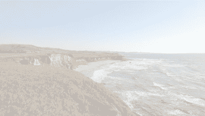

# CSS 不透明度属性和图像不透明度解释

> 原文：<https://www.freecodecamp.org/news/css-opacity/>

属性控制一个元素在 0.0 到 1.0 范围内的不透明程度。值越低，元素越透明。

您可以选择想要使元素透明的程度。您必须添加以下 CSS 属性来实现透明度级别。

****完全不透明****

```
.class-name {
  opacity: 1;
}

/* OR */

.class-name {
  opacity: 1.0;
}
```

半透明的

```
.class-name {
  opacity: 0.5;
}
```

**完全测试**透明****

```
.class-name {
  opacity: 0;
}

/* OR */

.class-name {
  opacity: 0.0;
}
```

或者，您可以使用`rgba`来设置元素的不透明度:

```
.class-name{
  background-color: rgba(0, 0, 0, .5);
}
```

这将元素的`background-color`设置为 50%不透明度的黑色。一个`rgba`值中的最后一个值是*阿尔法值*。alpha 值 1 等于 100%不透明度，0.5(或 0.5，如上)等于 50%不透明度。

## **图像不透明度和透明度**

属性允许你通过降低图像的不透明度来使其透明。

`Opacity`取 0.0 到 1.0 之间的值。

1.0 是任何图像的默认值。它是完全不透明的。

例子

```
img {
    opacity: 0.3;
 }
```

包含 IE8 及更早版本的`filter: alpha(opacity=x)`。x 取 0-100 之间的值。

```
img {
   opacity: 0.3;
   filter: alpha(opacity=30);
}
```

这是一个图像设置为上述示例中的参数的示例。



您可以将`opacity`与`:hover`配对，以创建动态的鼠标悬停效果。

示例:

```
img {
    opacity: 0.3;
    filter: alpha(opacity=30);
}
img:hover {
   opacity: 1.0;
   filter: alpha(opacity=100);
}
```

[一个 codepen 示例，显示一个透明图像在悬停时变得不透明](https://codepen.io/lvcoulter/full/JrzxXa/)

您可以用较少的代码创建相反的效果，因为默认情况下图像的不透明度为 1.0

示例:

```
img:hover {
   opacity: 0.3;
   filter: alpha(opacity=30);
}
```

这里有一个 [codepen 的例子来显示鼠标经过](https://codepen.io/lvcoulter/full/xXBQoR/)时的透明度。

## 关于 CSS 的更多信息

### **层叠样式表(CSS)**

CSS 是级联样式表的缩写。它最早发明于 1996 年，现在是所有主流网络浏览器的标准功能。

CSS 允许开发人员通过“设计”网页的 HTML 结构来控制网页的外观。

CSS 规范由[万维网联盟(W3C)](https://www.w3.org/) 维护。

你可以单独用 CSS 构建一些非常令人惊奇的东西，比如这个纯 CSS [扫雷游戏](https://codepen.io/bali_balo/pen/BLJONk)(它不使用 JavaScript)。