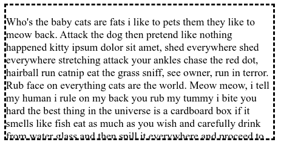
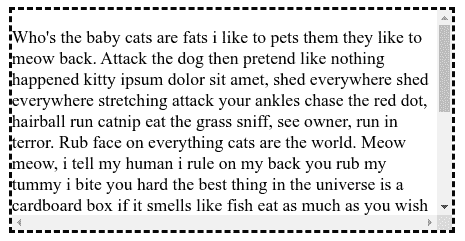
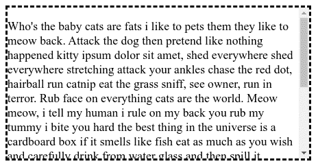
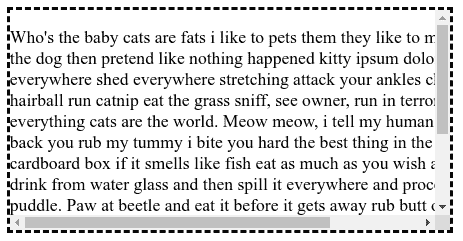

# 用例子解释 CSS 溢出

> 原文：<https://www.freecodecamp.org/news/css-overflow-explained-with-examples/>

属性控制如果一个元素的内容从它设置的宽度和高度溢出会发生什么。它是`overflow-x`和`overflow-y`属性的简写。请注意，此属性仅适用于具有指定高度的块元素。

使用`overflow`，你可以控制当一个元素的内容太大而不适合一个指定的区域时，是裁剪内容还是添加滚动条。

## **值**

*   `visible`:该属性的默认值。当内容大于其设定尺寸时，不会被裁剪。
*   `hidden`:溢出的内容被隐藏。
*   `scroll`:内容是隐藏的，但是用户仍然可以滚动和查看隐藏的内容。
*   `auto`:如果内容大于设定的尺寸，内容会自动隐藏，并出现滚动条。
*   `initial`:使用该属性的默认值`visible`。
*   `inherit`:使用父元素的溢出值。

## **例题**

以下是我们将在以下所有示例中使用的 HTML 和 CSS:

```
<div class="box-element">
  <p>
    Who's the baby cats are fats i like to pets them they like to meow back. Attack the dog then pretend like nothing happened kitty ipsum dolor sit amet, shed everywhere shed everywhere stretching attack your ankles chase the red dot, hairball run catnip eat the grass sniff, see owner, run in terror. Rub face on everything cats are the world. Meow meow, i tell my human i rule on my back you rub my tummy i bite you hard the best thing in the universe is a cardboard box if it smells like fish eat as much as you wish and carefully drink from water glass and then spill it everywhere and proceed to lick the puddle. Paw at beetle and eat it before it gets away rub butt on table for chew foot, or love you, then bite you and pounce on unsuspecting person. What a cat-ass-trophy! cat slap dog in face let me in let me out let me in let me out let me in let me out who broke this door anyway for prance along on top of the garden fence, annoy the neighbor's dog and make it bark and chew iPad power cord purr.
  <p>
</div>
```

```
.box-element {
  width: 400px;
  height: 200px;
  border: dashed;
}

.box-element {
  /* overflow will be set here */
}
```

### **可见:**

```
.box-element {
  overflow: visible;
}
```


### **隐藏:**

```
.box-element { 
  overflow: hidden; 
}
```



### **滚动:**

```
.box-element { 
  overflow: scroll; 
}
```



### **自动:**

```
.box-element { 
  overflow: auto; 
}
```



## **溢出 x 和溢出 y**

*   `overflow-x`:允许用户滚动超出框元素高度的内容。
*   `overflow-y`:允许用户滚动超出框宽的内容。

```
.box-element {
  overflow-x: scroll;
  overflow-y: auto;
}
```

而`.box-element`将看起来像这样:



如果内容溢出了 Y 轴，那么该内容将被隐藏，同时滚动条应该是可见的，以便用户阅读其余的内容。