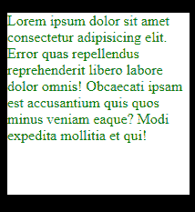
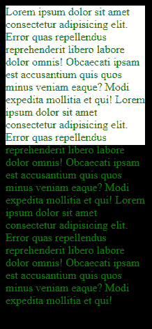
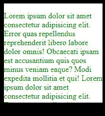
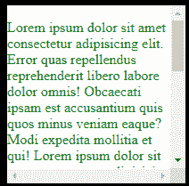
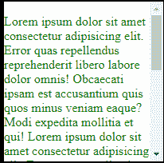

# CSS 溢出–可见、滚动、自动还是隐藏？解释的溢出属性

> 原文：<https://www.freecodecamp.org/news/css-overflow-visible-scroll-auto-hidden/>

在本教程中，我们将讨论一个重要的 CSS 属性——`overflow`属性。

它帮助我们控制当一个元素的内容太大而不适合一个区域时会发生什么。当这种情况发生时，它会使内容“溢出”到另一个区域，水平方向(X 轴)或垂直方向(Y 轴)。

我们将查看溢出属性的以下值，并了解它们是如何工作的:

*   `visible`
*   `hidden`
*   `scroll`
*   `auto`

## 如何使用`visible`值

如果没有指定，这是`overflow`属性采用的默认值。有了这个属性，当我们的内容溢出到另一个区域时，我们可以清楚地看到它。

考虑下面的例子:

```
<div>
      <p>
        Lorem ipsum dolor sit amet consectetur adipisicing elit. Error quas
        repellendus reprehenderit libero labore dolor omnis! Obcaecati ipsam est
        accusantium quis quos minus veniam eaque? Modi expedita mollitia et qui!
      </p>
</div>
```

```
body{
    background: black;
}

div{
    height: 200px;
    width: 200px;
    background: white;
}

p{
    color: green;
}
```

这是非常基本的。我们给我们的页面设置了黑色的背景色。我们将充当容器的`div`元素的背景色设置为白色。它的高度和宽度各为 200 像素。然后我们将段落的文本颜色设为绿色。

看起来是这样的:



文本舒适地放置在白色容器中，不会在两个轴上跨越容器的边框。但情况并非总是如此。

您可能正在处理一个项目，然后意识到一段文本跨越了边界。大概是这样的:

```
<div>
      <p>
        Lorem ipsum dolor sit amet consectetur adipisicing elit. Error quas
        repellendus reprehenderit libero labore dolor omnis! Obcaecati ipsam est
        accusantium quis quos minus veniam eaque? Modi expedita mollitia et qui!
        Lorem ipsum dolor sit amet consectetur adipisicing elit. Error quas
        repellendus reprehenderit libero labore dolor omnis! Obcaecati ipsam est
        accusantium quis quos minus veniam eaque? Modi expedita mollitia et qui!
        Lorem ipsum dolor sit amet consectetur adipisicing elit. Error quas
        repellendus reprehenderit libero labore dolor omnis! Obcaecati ipsam est
        accusantium quis quos minus veniam eaque? Modi expedita mollitia et qui!
      </p>
</div>
```

CSS 样式保持不变。现在看看容器和文本发生了什么变化:



文本无法放入白色容器，因此会溢出并越过容器的边框。在真实的项目中，这甚至会更令人讨厌，因为您会让这些文本与页面上的其他元素重叠。

我们可以看到文本溢出到另一个区域，因为这里的默认值是`visible`，尽管我们没有指定。

让我们继续将它添加到我们的 CSS 中，这样您就可以看到正在应用的`overflow`属性:

```
body{
    background: black;
}

div{
    height: 200px;
    width: 200px;
    background: white;
    overflow: visible;
}

p{
    color: green;
}
```

我们已经将`overflow: visible;`添加到了`div`中。结果是一样的——我们会看到我们的文本溢出到另一个区域。

在下一节中，我们将看到各种可以帮助我们控制内容溢出时会发生什么的值。

## 如何使用`hidden`值

使用`hidden`值，溢出的文本部分将被剪切掉——它将是“不可见的”。你不必担心溢出所占用的空间。一旦内容被剪切掉，它将不再位于溢出的区域。

在讨论为什么这不是最佳解决方案之前，我们先看一个例子。让我们添加`hidden`值:

```
body{
    background: black;
}

div{
    height: 200px;
    width: 200px;
    background: white;
    overflow: hidden;
}

p{
    color: green;
}
```

下面是容器中的文本发生的情况:



如您所见，我们再也看不到越过容器边界的那部分文本。

这解决了内容在不应该在的区域的问题，但是它没有提供访问被切断的内容的方法。因此，我们将在下一部分解决这个问题。

## 如何使用`scroll`值

所以我们已经知道,`hidden`值会剪切掉文本并隐藏它。但是`scroll`值也会剪切文本并提供滚动条，这样我们就可以滚动查看被剪切掉的文本部分。

让我们来看看:

```
body{
    background: black;
}

div{
    height: 200px;
    width: 200px;
    background: white;
    overflow: scroll;
}

p{
    color: green;
}
```



现在我们在两个轴上都有滚动条。水平滚动条与我们无关，因为我们没有在那个方向溢出的内容。我们将在下一节中解决这个问题。

## 如何使用`auto`值

```
body{
    background: black;
}

div{
    height: 200px;
    width: 200px;
    background: white;
    overflow: auto;
}

p{
    color: green;
}
```



现在滚动条只垂直显示。`auto`值检测溢出发生的位置，并在该方向添加滚动条。

没有水平添加滚动条，因为我们在那个轴上没有内容溢出。类似地，如果我们在两个轴上都没有溢出，那么就不会添加滚动条。

## `overflow-x`和`overflow-y`属性

在我们在前面章节中使用的例子中，我们使用了`overflow`属性。这适用于水平轴和垂直轴。如果您想单独检查溢出，可以使用以下方法:

*   `overflow-x`指定当内容水平溢出(从左到右)时会发生什么。
*   `overflow-y`指定当内容垂直溢出(从上到下)时会发生什么。

同样的值——`visible`、`hidden`、`scroll`和`auto`——也可以在这里使用。

一个简单的例子:

```
div {
  overflow-x: hidden; /* overflow is visible in x-axis */
  overflow-y: scroll; /* scrollbar is added when there is overflow in y-axis */
}
```

## 结论

在本教程中，我们学习了如何控制页面内容的溢出。我们看到了可以分配给`overflow`属性的各种值以及这些值产生的不同结果。

最后，我们学习了如何只在水平或垂直方向应用`overflow`属性的值。

编码快乐！