# CSS Position 属性如何工作——用代码示例解释

> 原文：<https://www.freecodecamp.org/news/css-position-property-explained/>

今天我们将学习你需要知道的关于 CSS position 属性的所有东西，以及一些例子。让我们开始吧，🎖️

# 目录

*   [什么是 CSS 位置属性？](#what-is-the-position-property-in-css)
*   [CSS 中的**静态位置**是什么？](#what-is-the-static-position-in-css)
*   CSS 中的相对和绝对职位是什么？
*   [CSS 中的**固定 P** 位置是什么？](#what-is-the-fixed-position-in-css)
*   [CSS 中的**粘 P** 是什么位置？](#what-is-the-sticky-position-in-css)

## 如果你喜欢，你也可以在 YouTube 上看这个教程:

[https://www.youtube.com/embed/yFXEur3SCGI?feature=oembed](https://www.youtube.com/embed/yFXEur3SCGI?feature=oembed)

# CSS 中的 position 属性是什么？

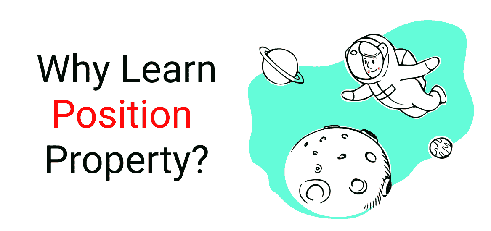

如果你想让**惊人的网站看起来艺术，独特，美丽，**那么你一定要学会如何使用 CSS 位置属性。让我们看看它是如何工作的。

使用 **Flexbox 或 Grid** ，你可以制作一个**对称的网站**，如下所示:👇


**Website made w/ Flexbox**

有了**位置属性**，你可以像这样做一个**非对称网站**:👇


**Website made w/ Grid & position properties**

使用 Flexbox 和 Grid，你不能把你的内容放在任何你想放的地方。您被限制在 **X 轴和 Y 轴**周围。看这幅画，看看我的意思:👇

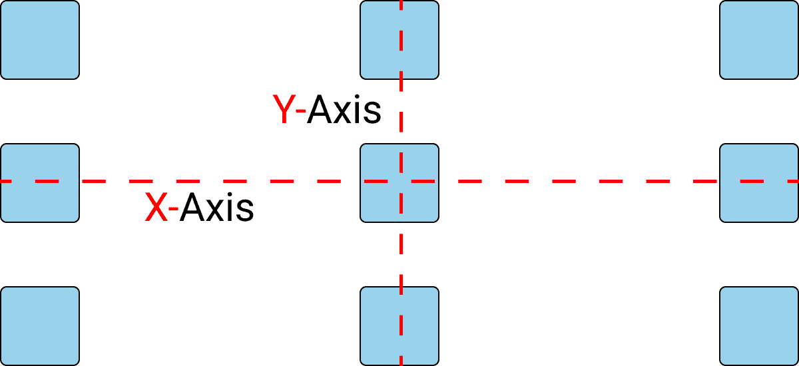

**Symmetrical content layout showing elements placed respective to the x and y axis**

你的盒子将遵循这些精确的尺寸。👆

但是，使用**位置属性**，你可以通过**将每个元素从其他元素中分离**来将你的内容放在你想要的任何地方。

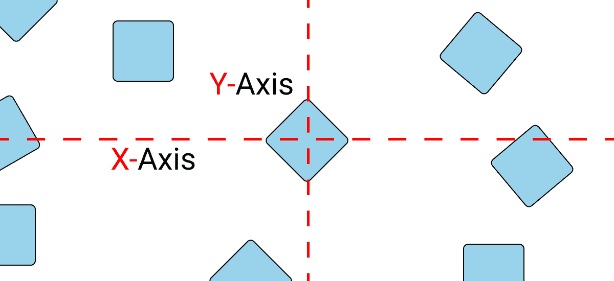

**Asymmetrical content layout showing elements placed irrespective of x and y axis.**

通过这种布局，你可以将盒子**放在任何你想放的地方**。👆换句话说，你可以让**在屏幕上自由移动**。

下面是使用 position 属性可以实现的另一个示例:

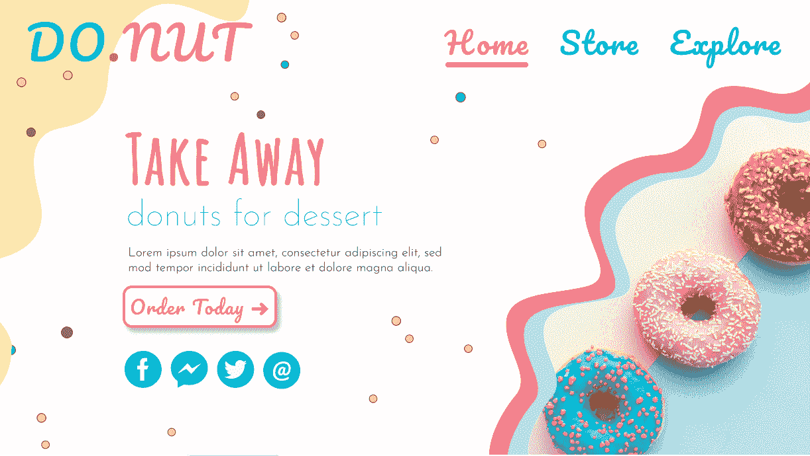

**An Asymmetrical Website**

使用 position 属性，你可以将这些小圆点、波浪图案和甜甜圈图像放置或移动到页面的任何地方。

# 项目设置

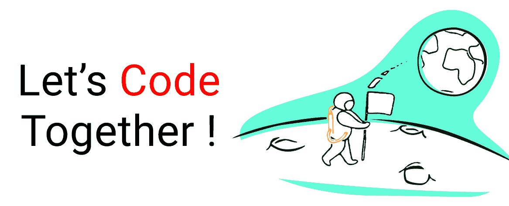

对于这个项目，您可以使用任何安装了 **emmet 插件**的代码编辑器。我要用 [CodePen.io](https://codepen.io) 。

### 超文本标记语言

在 body 标记内，编写以下代码:👇

```
<div class="box-1"> </div>
```

### 半铸钢ˌ钢性铸铁(Cast Semi-Steel)

清除您的默认浏览器设置并添加此 CSS:👇

```
*{
   margin: 0px;
   padding: 0px;
   box-sizing: border-box;
}
```

将 box-1 类的样式如下:👇

```
.box-1{
   width: 120px;
   height: 120px;
   background-color: skyblue;
   border: 2px solid black;
}
```

我们的位置属性有 5 个值:

1.  亲戚
2.  绝对的
3.  静电
4.  固定的；不变的
5.  粘的

要移动我们的盒子，我们将使用 4 个属性:

*   **顶部、底部**
*   **左，右**

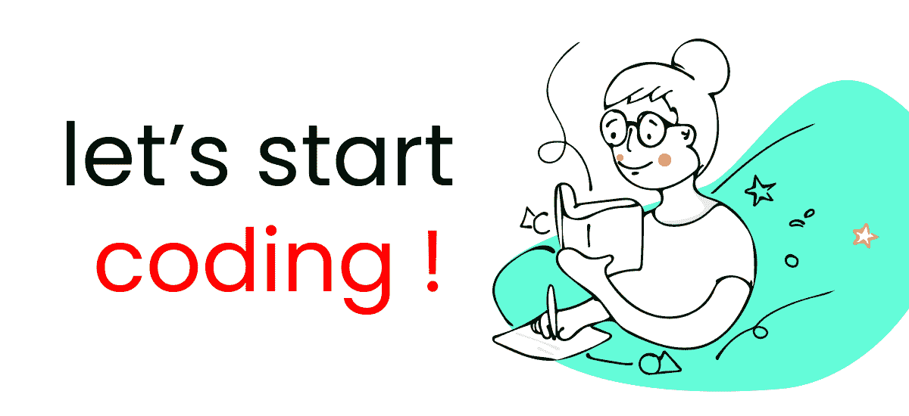

# CSS 中的静态位置是什么？

这有**没有用例**。这是每个元素的**默认值**。

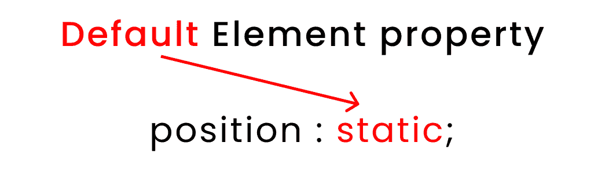

Default position of every element

# CSS 中的相对位置和绝对位置是什么？

除了一个区域外，**相对位置**和**绝对位置**的工作方式相同。我们使用`relative`来标识父类。我们使用`absolute`来标识子类。

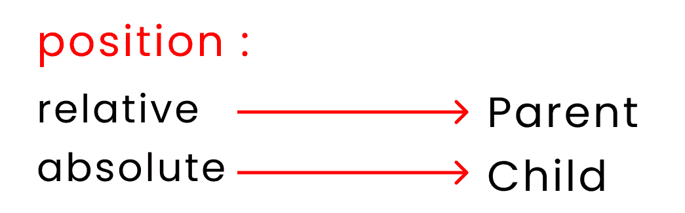

**Position VS relative position**

### 让我们看两个例子👇

首先，让我们用 **`relative`** 值进行实验。试试这段代码:

```
.box-1{
/* Other codes are here*/

   position: relative;
   left: 100px;
}
```

这是您将得到的结果:👇

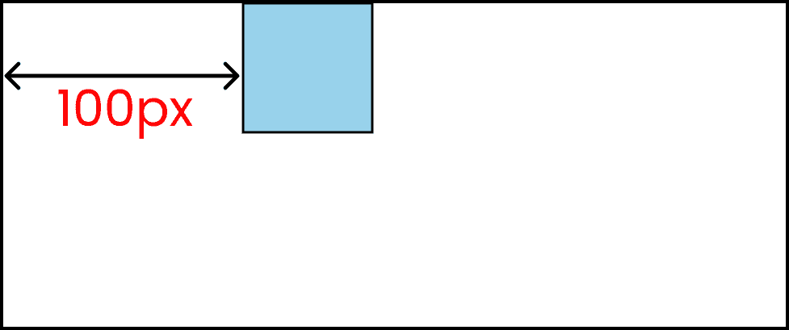

我们可以使用 **`absolute`** 值复制相同的结果，如下所示:👇

```
.box-1{
/* Other codes are here*/

   position: absolute;
   left: 100px;
}
```

让我们研究一下**相对位置和**绝对位置的主要区别。

### CSS 中的相对与绝对位置

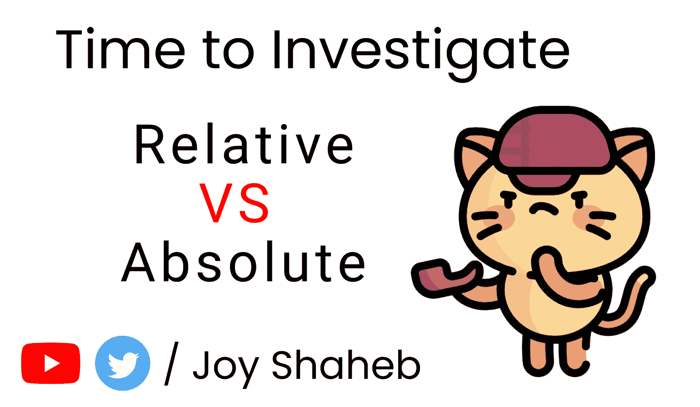

### 超文本标记语言

在 HTML 中编写以下代码:👇

```
<body>
   <div class="box-1">

       <div class="box-2"> </div>	

   </div>
</body>
```

### 半铸钢ˌ钢性铸铁(Cast Semi-Steel)

用下面的 CSS 样式框:👇

```
.box-1{
	width: 300px;
	height: 300px;
	background-color: skyblue;
	border: 2px solid black;
    margin: auto;
}

.box-2{
	width: 100px;
	height:100px;
	background-color: pink;
	border: 2px solid black;
}
```

它应该是这样的:👇

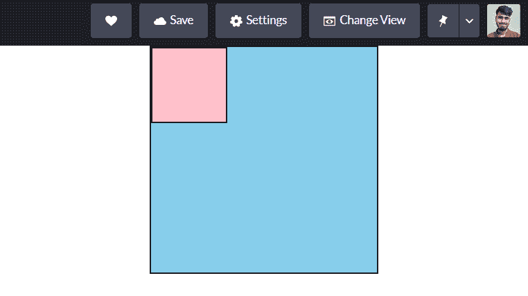

**The result is a blue box with a smaller pink box in the upper left**

现在，我们将像这样选择我们的类:👇

```
body{ }

.box-1{ }

.box-2{ }
```

现在，在您的 CSS 中编写以下代码:👇

```
body{

}

.box-1{
/* This is the  👇 parent */
	position: relative;
}
.box-2{
/* This is the  👇 child */
	position: absolute;
	left: 100px;
}
```

结果如下:👇

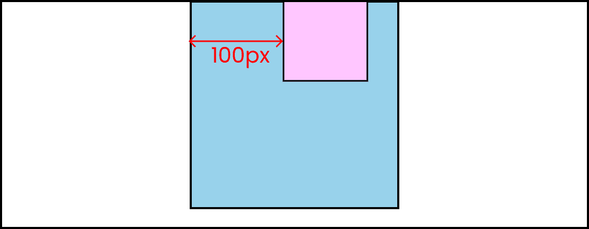

**The result is that the pink box has moved right 100px**

请注意。box-2 从移动了 **100px** 。方框 1。

这是因为。box-1 是**的父**和。盒子 2 是**的孩子**。

我们再换一个吧。在您的 CSS 中编写以下代码:

```
body{
/* This is the  👇 parent */
   position: relative;	
}

.box-1{

}
.box-2{
/* This is the  👇 child */
   position: absolute;
    left: 100px;
}
```

结果是这样的:👇

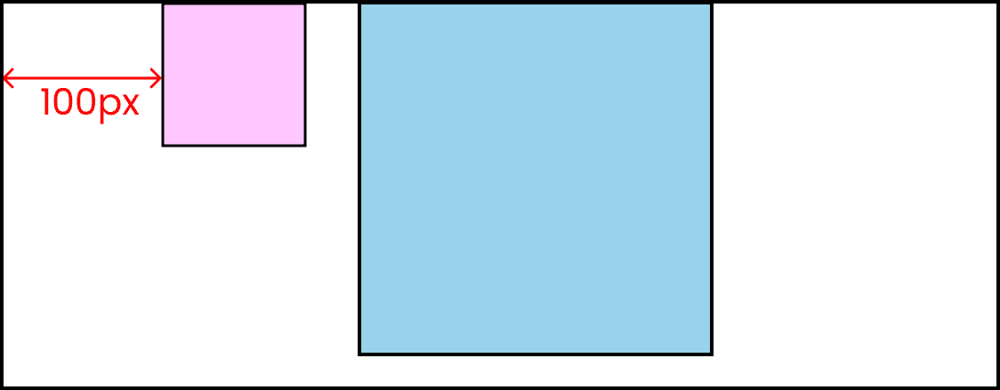

**The result is that the pink box has moved 100px from the body**

请注意。box-2 从**体**元素移动 **100px** 。

这是因为**体**是**父**体。盒子 2 是**的孩子**。

# CSS 中的固定位置是什么？

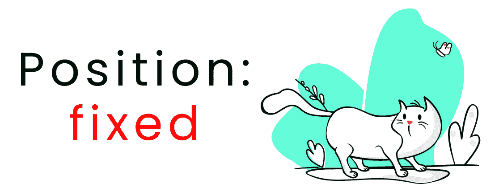

这个值将**固定你的元素在屏幕上的位置**，即使你在浏览器中**滚动**。让我们看一些例子来看看它是如何工作的。

### 固定位置示例

在你的 HTML 中写下这段代码。👇一旦你写了`lorem200`，确保按下键盘上的**键和**键:

```
<div class="container">

	<p>lorem200</p>

	<div class="box-1"> fixed </div>

	<p>lorem200</p>		

</div>
```

这是 CSS:

```
.container{
	height: 3000px;
}

.box-1{
	height: 120px;
	width: 120px;
	background-color: skyblue;
	border: 2px solid black;

	display: grid;
	place-content: center;
}
```

然后在底部添加这个 CSS:

```
.box-1{

	position: fixed;
	top: 100px;
	left: 200px;
} 
```

结果如下:👇

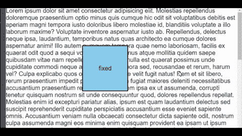

您可以看到，即使我们滚动浏览器，元素也保持不变。

# CSS 中的粘性位置是什么？

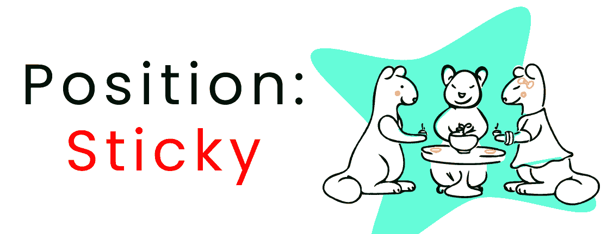

在滚动到我们屏幕上的某个点之后，这个值将**固定我们元素在屏幕上的位置**，所以它不会移动。

### 粘性位置示例

不要改变你当前的 HTML 和 CSS 中的任何东西，除了这个值:

```
.box-1{
/*  Play with  👇 this value */
   position: sticky;
   top: 30px;
   left: 200px;
} 
```

结果如下:👇

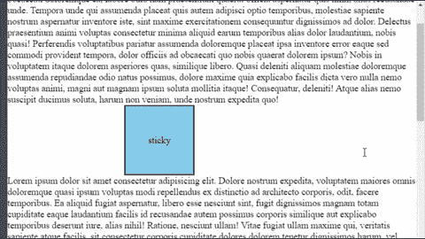

您可以看到，在某个滚动点之后，该元素仍然固定在浏览器屏幕的正上方。

你可以看看这些网站，看看粘性位置在实际网站上是如何工作的。

*   [唤醒板](https://awakeboards.com/)
*   闭嘴
*   [拉伤](https://www.ascensionlatorre.com/)

# 结论

现在，您可以自信地使用 position 属性创建漂亮的网站并解决简单的布局问题。

这是你阅读到最后的奖章。❤️

### 建议和批评得到了❤️的高度赞赏


**YouTube[/Joy Shaheb](https://youtube.com/c/joyshaheb)**

**LinkedIn[/JoyShaheb](https://www.linkedin.com/in/joyshaheb/)**

**推特[/JoyShaheb](https://twitter.com/JoyShaheb)**

**insta gram[/JoyShaheb](https://www.instagram.com/joyshaheb/)**

## 信用

*   [可爱少女插画](https://www.freepik.com/free-vector/young-girl-holding-pile-papers-cartoon-illustration_12566300.htm)
*   [Kitty 头像](https://www.flaticon.com/packs/kitty-avatars-3)