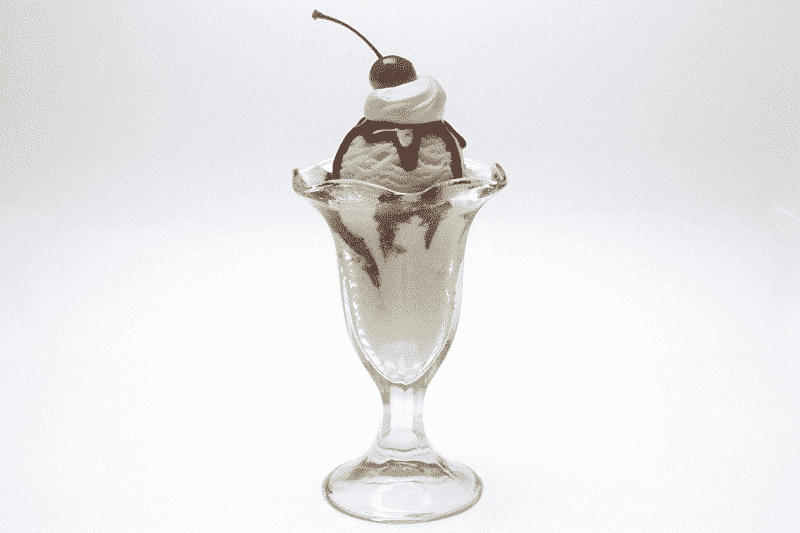
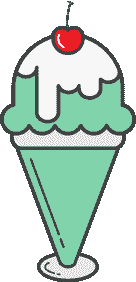
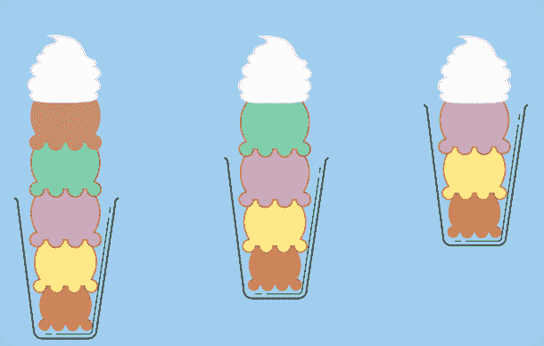
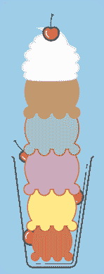

# 通过构建一个冰淇淋圣代来解释 CSS 定位

> 原文：<https://www.freecodecamp.org/news/css-positioning-explained-by-building-an-ice-cream-sundae-831cb884bfa9/>

凯文·科诺年科

# 通过构建一个冰淇淋圣代来解释 CSS 定位

#### 如果你以前做过冰淇淋圣代，那么你就能理解 CSS 的定位。

你的 div 像罗马蜡烛一样在屏幕上缩放。

它们潜入容器深处，然后像鲸鱼一样浮出水面。

他们把其他元素推开，然后完全像一个不耐烦的商人一样离开容器。

不知何故，每当你改变 CSS 中令人讨厌的一行代码时，这就会以一种新的令人兴奋的方式发生:位置属性。

每个学过 CSS 的人都去过那里。CSS 定位似乎是无意义的，直到几个小时的试错最终给你一个模糊的认识。

这篇文章将一劳永逸地结束这种困惑。位置属性似乎与任何现实世界的概念都没有明显的联系…直到你想到不起眼的冰淇淋圣代。

我们将介绍以下职位属性:

*   绝对的
*   静态(默认)
*   固定的；不变的
*   亲戚

为了清楚起见，冰淇淋圣代将由 4 个主要部分组成:

*   玻璃
*   冰淇淋勺
*   生奶油
*   樱桃

### 作为 HTML 的冰淇淋圣代

如果你必须用 HTML 解释冰淇淋圣代的结构，它可能看起来像这样。

或者，以图片形式:

在我们深入研究 CSS 之前，我们可以做一些观察:

1.  冰淇淋勺的数量受到玻璃杯高度的限制。我们不能永远堆冰淇淋勺。最终，整个美丽的结构将会倒塌。
2.  你可以把樱桃放在任何你想放的地方。樱桃不服从勺子的流动和堆叠。它们更小，可以放在你放不下冰淇淋勺的角落和缝隙里。而且，更多的樱桃不会打乱勺子的顺序。
3.  不管有多少勺，鲜奶油都放在上面。你见过冰淇淋圣代中间有鲜奶油，上面一点也没有吗？我也没有。

### 相对/静止位置:玻璃杯和勺子

如第一张图所示，我们的冰淇淋斜塔在倾倒之前只能盛 5 勺。假设这 5 个勺子的总高度为 500 像素，每个勺子都直接叠放在一起。在这种情况下，我们的 fullSundae div 将具有 500px 的高度，以表明它只能处理这 5 勺，不能再多了。这是**默认位置的一个例子，静态**。我们用这个来表明高度与任何容器 div 无关。

接下来要做的简单的事情就是给每个 iceCreamScoop 一个 100 像素的高度，这将匹配 fullSundae div 的高度。这一点也不好玩，因为玻璃格默认为 300 像素。让我们换个角度来看。

由于玻璃 div 包含五个勺子中的三个，并且所有勺子的高度相等，我们可以看到玻璃 div 是 fullSundae div 高度的 60%。这是一个**位置相对**的机会！您可以将玻璃格设置为相对位置，并赋予其 60%的高度。玻璃 div 将查看整个 fullSundae div 的高度，并占据 60%的空间。该百分比是相对于容器 div 的高度而言的，明确表示为 500px。

你可以走得更远。如果您将玻璃格内的每个 iceCreamScoop 设置为相对于的**位置，每个勺子将根据玻璃格的高度计算其高度。玻璃杯可以装三个勺子，所以每个勺子的高度应该是 33.3%。这是所有的代码。**

### 位置固定:鲜奶油

位置固定应该是最容易的。一个**位置固定的**元件将被卡在适当的位置，无论身体延伸多远。用冰淇淋的术语来说，就是上面的鲜奶油。无论你试着堆积多少冰淇淋勺，鲜奶油仍然会在上面，和冰淇淋勺的关系完全一样。它相对于主体定位，而不是相对于包含它的 div 定位。

鲜奶油独立于冰淇淋勺系列。鲜奶油的数量并不影响你在整个圣代中可以吃的最大勺数。它停留在页面上一致的位置。

你通常会看到页眉和页脚的位置是固定的。这些是固定不变的元素，即使当你滚动页面或 div 时。

### 绝对位置:樱桃

我把 Position Absolute 放在最后是有原因的:如果你太频繁地使用它，它会导致不可维护的代码。你已经被警告了。但是，在这个例子中，它非常适合樱桃。

你可以把樱桃放在冰淇淋圣代的任何地方。你可以放一堆在上面，它不会倒。你可以把它们楔入玻璃杯本身，你仍然可以放入同样数量的冰淇淋。它们不遵守与位置静态元素和位置相对元素相同的规则。此外，您可以在不干扰任何其他元素的情况下删除它们。

这些是**绝对位置**的关键部件。定位绝对元素不会干扰其他元素的位置，但是您必须明确地声明它们的位置。如果你不这样做，他们默认为身体的左上角。或者，如果他们的父母之一有相对位置，他们去那个 div 的左上角。

看看这个充满樱桃的圣代。在很多地方添加了樱桃，它们不会干扰其他元素的流动。但是，请记住，你不能像叠冰淇淋勺一样叠樱桃。樱桃不能堆积。您必须明确地放置每一个。

最后一点注意:绝对位置是基于最近的非位置静态父节点计算的。如果每个父对象都是位置静态的，则基于整个身体进行计算。因此，在上面的例子中，玻璃杯中的樱桃是基于玻璃杯 div 的高度定位的，而不是基于 fullSundae div 的高度。玻璃格有相对位置。

现在去练习吧，当你感觉稍微舒服一点的时候…你应该得到一些冰淇淋！

编辑:你现在可以在这个[互动教程](https://www.rtfmanual.io/csssundae/)里建立一个 CSS 定位的冰淇淋圣代了！

你喜欢这篇文章吗？给它一颗“心”，让它也能帮助别人！

[*这篇文章最初出现在 CodeAnalogies 博客*](https://blog.codeanalogies.com/2016/08/27/css-positioning-explained-by-building-an-ice-cream-sundae/) *上。*