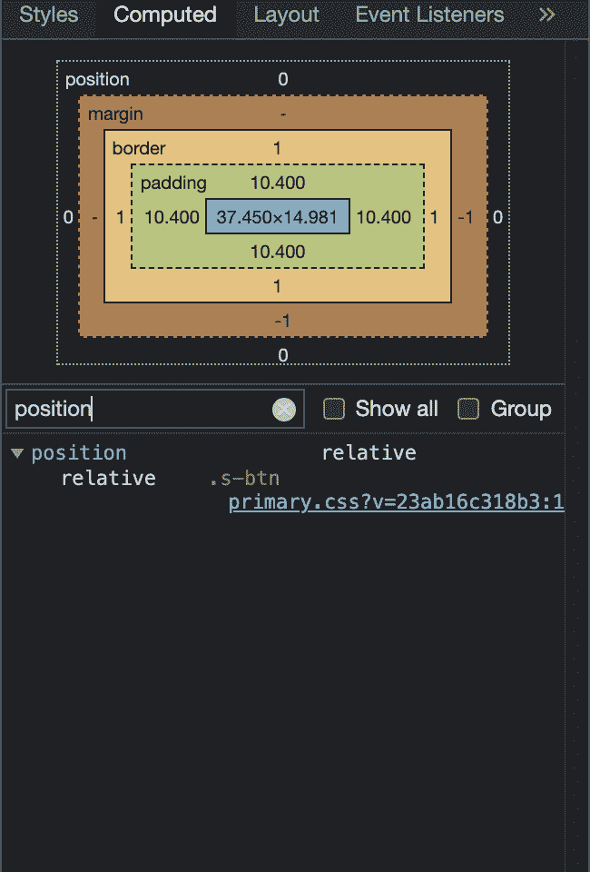
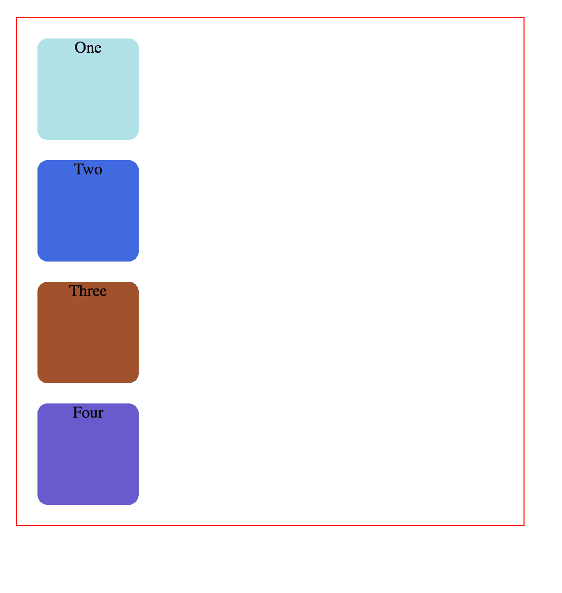
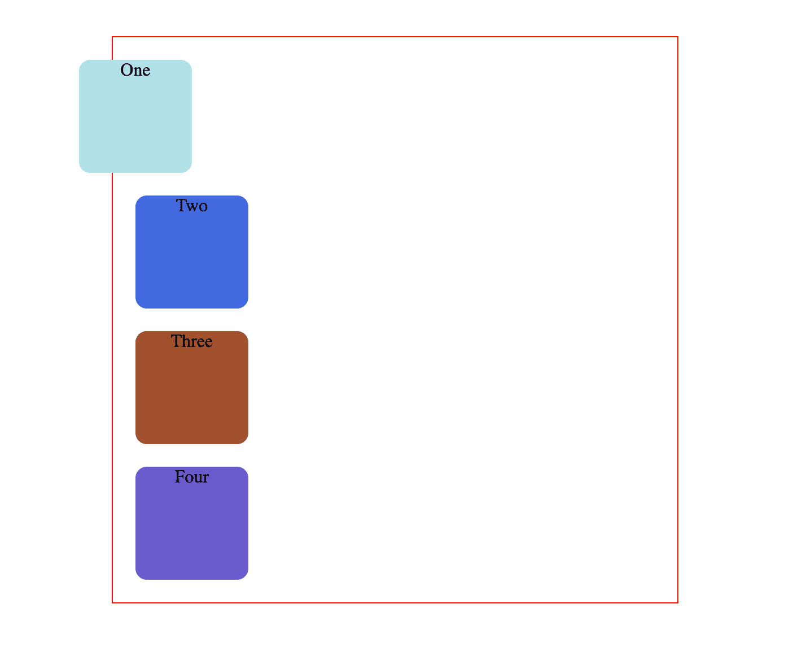
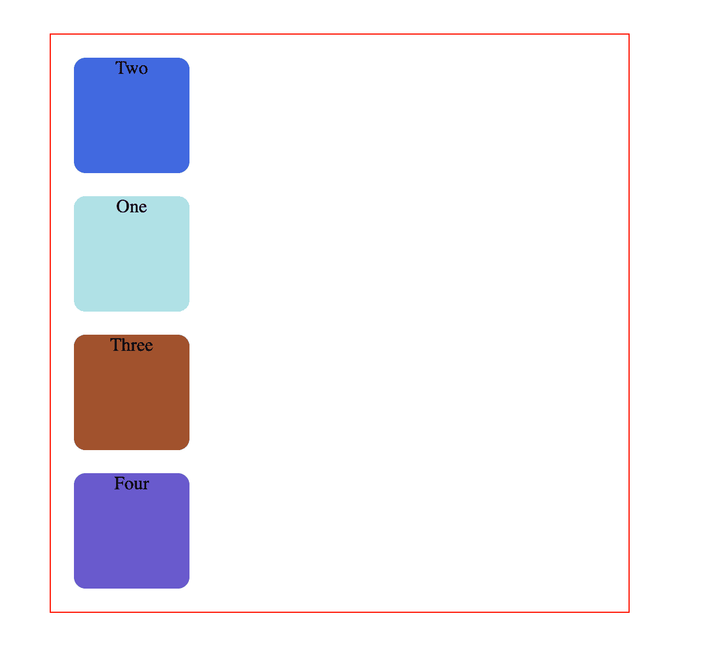
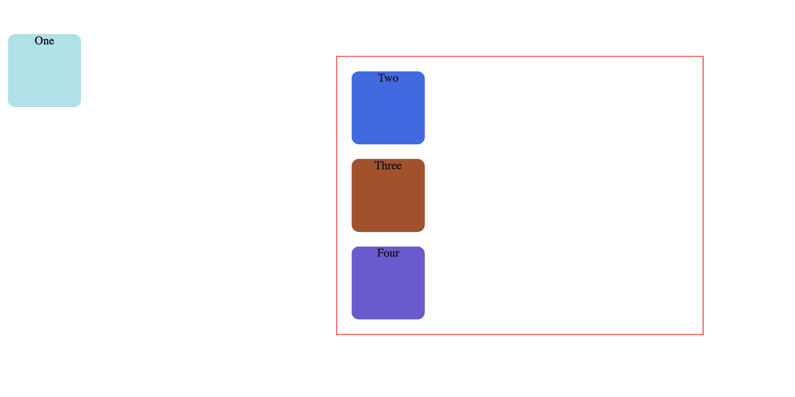
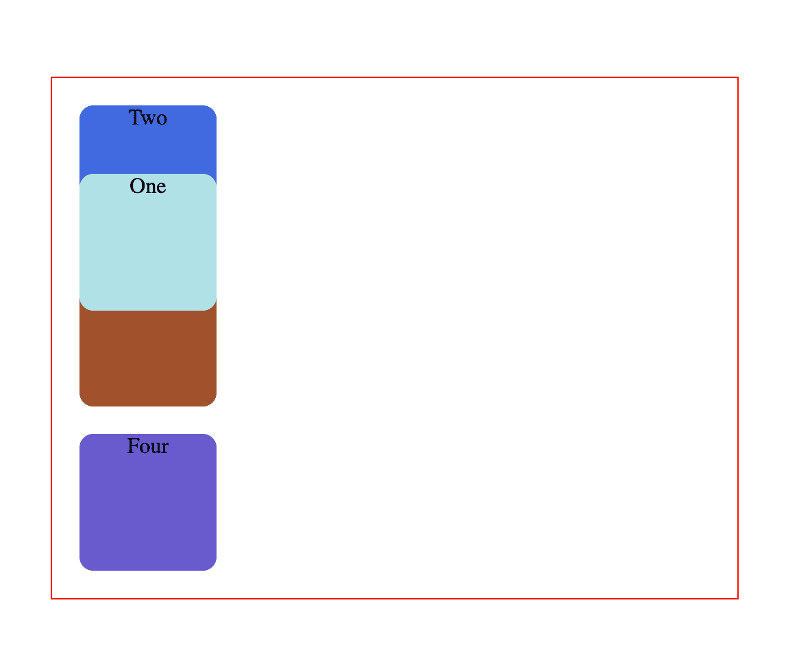

# CSS 定位–绝对和相对位置示例

> 原文：<https://www.freecodecamp.org/news/css-positioning-position-absolute-and-relative/>

当您想要设计复杂的布局时，您需要更改典型的文档流并覆盖默认的浏览器样式。

您必须控制元素在页面上的行为和位置。

例如，您可能希望以特定的方式将元素一个接一个地堆叠在一起或堆叠在另一个的顶部，或者让页眉“粘”在页面的顶部，并且在您上下滚动页面时不会移动。

为了做到以上以及更多，您将使用 CSS 的`position`属性。

该属性接受五个值:`static`、`relative`、`absolute`、`fixed`和`sticky`。

在本文中，我们将重点关注`relative`和`absolute`值。

我们将看到它们如何工作的概述，它们彼此之间的差异，以及它们如何最好地结合使用以获得最大效果。

我们开始吧！

## 如何使用 Chrome 开发者工具查看元素的位置

在你的前端 web 开发工作流程中，一个有用的工具是 Chrome 的开发者工具。

在许多事情中，你有能力查看任何网站的 HTML/CSS/JavaScript 代码，以了解不同风格是如何工作的。

要查看某个元素在 Mac 电脑的网页上的位置，请按下`Control`并同时点击所需的元素。在窗口的机器上，右键单击要选择的元素。

然后会出现一个菜单，从那里选择`Inspect`。

Chrome 开发者工具将会打开。

选择`Computed`选项卡，从那里向下滚动到`position`元素，或者在`filter`搜索框中输入`position`。



## CSS 中 HTML 元素的默认位置是什么？

默认情况下，CSS 中所有 HTML 元素的`position`属性被设置为`static`。这意味着如果你没有指定任何其他的`position`值或者如果`position`属性没有被显式声明，它将是`static`。

从视觉上看，所有元素都遵循 HTML 代码的顺序，这样就创建了典型的文档流。

根据 HMTL 代码的顺序，元素一个接一个地出现——直接在另一个的下面。

像`<div>`这样的块元素像这样一个接一个地堆叠:

```
<!DOCTYPE html>
<html lang="en">
  <head>
    <meta charset="UTF-8">
    <meta http-equiv="X-UA-Compatible" content="IE=edge">
    <meta name="viewport" content="width=device-width, initial-scale=1.0">
    <link rel="stylesheet" href="style.css">
    <title>CSS Positioning</title>
  </head>
  <body>
    <div class="parent">
      <div class="child one">One</div>
      <div class="child two">Two</div>
      <div class="child three">Three</div>
      <div class="child four">Four</div>
    </div>
  </body>
</html> 
```

```
body {
  margin: 100px auto;
}

.parent {
  width: 500px;
  border: 1px solid red;
  margin: auto;
  text-align: center;
}

.child {
  border-radius: 10%;
  width: 100px;
  height: 100px;
  margin: 20px;
}

.one {
  background-color: powderblue;
}

.two {
  background-color: royalblue;
}

.three {
  background-color: sienna;
}

.four {
  background-color: slateblue;
} 
```



在上面的代码中没有声明`position`属性，因此它恢复为默认的`position: static`。它遵循 HTML 代码的顺序。

HTML 中先出现的内容会先显示出来，每个元素都跟在下一个元素后面，这样就创建了我上面描述的文档流。

在我们的代码中，首先编写带有文本“One”的 div，因此它首先显示在页面上。在它的正下方，显示了带有文本“Two”的框，因为它也是 HTML 中的下一个，依此类推。

这种默认定位没有给灵活性或移动元素留下任何空间。

如果你想将第一个方块向左移动一点，你会怎么做？

有偏移属性可以这样做，如`top`、`bottom`、`right`和`left`。

但是，如果您尝试在正方形应用了默认静态位置时应用它们，这些属性将不起作用，正方形也不会移动。

这些属性对`position: static`没有影响。

## CSS 中的位置相对是什么？

`position: relative`的工作方式与`position: static;`相同，但是它允许你改变一个元素的位置。

但是仅仅编写这个 CSS 规则不会改变任何事情。

要修改位置，您需要应用前面提到的`top`、`bottom`、`right`和`left`属性，并以这种方式指定您想要移动元素的位置和量。

`top`、`bottom`、`right`和`left`偏移将标签*推离指定的位置*，反向操作。

实际上将元素移向元素父容器的底部。`bottom`将元素推向其父容器的顶部，依此类推。

现在，您可以通过更新 CSS 将第一个方块向左移动，如下所示:

```
.one {
  background-color: powderblue;
  position: relative;
  right: 50px;
} 
```



这里，方块已经从默认情况下应该在的左边移动了`50px`。

`position: relative;`更改元素*相对于*相对于父元素和自身的位置，以及它通常在页面常规文档流中的位置。这意味着它相对于它在父元素中的原始位置。

它根据标签的当前位置、相对于其通常位置以及相对于其周围的标签来移动标签，而不影响它们的布局。

使用这些偏移量和`position: relative`，您还可以改变元素在页面上出现的顺序。

第二个方块可以出现在第一个方块的上面:

```
.one {
  background-color: powderblue;
  position: relative;
  top: 150px;
}

.two {
  background-color: royalblue;
  position: relative;
  bottom: 120px;
} 
```



从视觉上看，顺序颠倒了，而 HTML 代码保持不变。

概括地说，相对定位的元素可以四处移动，同时仍然保留在常规的文档流中。

它们也不会影响周围元素的布局。

## CSS 中的位置绝对是什么？

如果将第一个方块的 CSS 规则更新为以下内容:

```
.one {
  background-color: powderblue;
  position: absolute;
} 
```

你会得到这样的结果:


这是意外的行为。第二个广场已经完全消失了。

如果您还添加了一些偏移属性，如下所示:

```
.one {
  background-color: powderblue;
  position: absolute;
  top: 50px;
  left: 0;
} 
```



现在这个广场已经完全抛弃了它的母体。

绝对定位的元素完全脱离了网页的常规流程。

它们的位置不是基于它们在文档流中的通常位置，而是基于它们祖先的位置。

在上面的例子中，绝对定位的正方形位于静态定位的父元素中。

这意味着它将相对于整个页面本身定位，也就是相对于页面的根元素`<html>`。

因此，坐标`top: 50px;`和`left: 0;`基于整个页面。

如果您想将坐标应用于其父元素，您需要通过更新`.parent`同时保持`.one`不变来相对定位父元素:

```
.parent {
  width: 500px;
  border: 1px solid red;
  margin: auto;
  text-align: center;
  position: relative;
}

.one {
  background-color: powderblue;
  position: absolute;
  top: 50px;
  left: 0;
} 
```

该代码创建了以下结果:



绝对定位将元素从常规文档流中移除，同时还会影响页面上其他元素的布局。

## 结论

希望现在你对相对和绝对定位的工作原理有了更好的理解。

如果你有兴趣了解更多关于 HTML 和 CSS 的知识，你可以在 freeCodeCamp 的 YouTube 频道上保存并浏览这个播放列表。

它包括帮助你从头开始的视频，它将帮助你很好地掌握基础知识。

freeCodeCamp 还提供基于免费互动项目的[响应式网页设计认证](https://www.freecodecamp.org/learn/responsive-web-design/)，这是开始你的前端网页开发之旅的好地方。

感谢阅读，快乐学习！