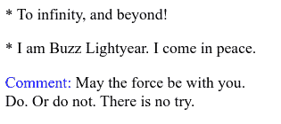
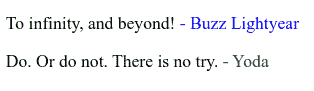

# CSS 伪元素-选择器之前和之后的解释

> 原文：<https://www.freecodecamp.org/news/css-pseudo-elements-before-and-after-selectors-explained/>

## **在选择器**之前

CSS `::before`选择器可用于在所选元素的内容之前插入内容。通过将`::before`附加到要使用它的元素上来使用它。

让我们看一些例子:

```
p::before { 
  content: "* ";
}

span.comment::before {
  content: "Comment: ";
  color: blue;
}
```

```
<p> To infinity, and beyond!</p>
<p> I am Buzz Lightyear. I come in peace.</p>

<span class="comment">May the force be with you.</span>
<br/>
<span> Do. Or do not. There is no try.</span>
```

在上面的例子中，我们在页面上的每个段落元素前添加了星号和空格。此外，我们在每个带有类`comment`的`span`元素前加上蓝色的“Comment:”。



## 后选择器

CSS `::after`选择器可用于在所选元素的内容之后插入内容。通过将`::after`附加到要使用它的元素上来使用它。

以下是一些例子:

```
.buzz::after { 
  content: " - Buzz Lightyear";
  color: blue;
}

.yoda::after { 
  content: " - Yoda";
  color: green;
}
```

```
<p class="buzz"> To infinity, and beyond!</p>
<p class="yoda"> Do. Or do not. There is no try.</p>
```

在上面的例子中，我们将蓝色的"-巴斯光年"添加到带有类`buzz`的元素中。此外，我们将绿色的“- Yoda”附加到带有类`yoda`的元素上。



## 单冒号与双冒号

有一些关于使用伪元素的正确方法的讨论——在 CSS 规范 1 和 2 中使用的旧式单冒号(`:before`)与 CSS3 推荐的双冒号(`::before`)，主要是为了*“建立伪类和伪元素之间的区别”*。

但是出于兼容性原因，单冒号方法仍然被接受。请记住，IE8 只支持单冒号符号。

## 更多信息:

*   《CSS 手册:开发人员使用 CSS 的便捷指南》
*   [最佳 CSS 示例和 CSS3 示例](https://www.freecodecamp.org/news/css-example-css3/#background-color-example)