# 通过构建背景模式学习 CSS 径向渐变

> 原文：<https://www.freecodecamp.org/news/css-radial-gradient/>

如果你是 CSS 渐变的新手，你可能听说过一个叫做`radial-gradient()`的东西。如果您以前从未使用过它，那么您正处于了解它的合适位置。

在本教程中，我将重点介绍一些真实实用的例子来解释`radial-gradient()`背后的秘密以及它是如何工作的。

CSS 渐变通常用于创建花哨的图案，所以我选择了几个只用`radial-gradient()`制作的。通过构建它们，我们将了解关于这些渐变的一切。

## 径向梯度模式#1

让我们从最基本的模式开始。


Pattern made with radial-gradient

到目前为止没有什么复杂的——我们只是在重复循环。圆、椭圆、半圆、四分之一圆等等...我们可以使用`radial-gradient()`创建不同的形状。

为了简单起见，我们可以把椭圆看作主要形状，因为圆是椭圆的一个特例。然后通过隐藏一些部分，我们得到半个圆，四分之一个圆，等等。

让我们放大这个模式来识别不同的值。

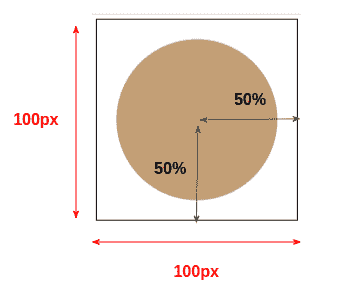

Illustration of the different values of the pattern

我们正在一个尺寸为`100px*100px`的区域内绘图，这是我们的`background-size`。我们将考虑一个等于`50%`的水平半径和一个等于`50%`的垂直半径，我们形状的中心将是该区域的中心。

椭圆由两个半径定义，称为“水平半径”和“垂直半径”。如果两者相等(就像我们的例子)，我们得到一个圆。

这将为我们提供以下代码:

```
html {
  background-image: radial-gradient(50% 50% at center, ???);
  background-size: 100px 100px   
}
```

我们已经定义了渐变的设置，现在我们需要定义颜色配置。我们将画一个不接触`background-size`区域边缘的圆。从`50%`开始，我们将拥有`80%`的主色，剩下的将是透明的。

```
html {
  background-image: radial-gradient(50% 50% at center, #c39f76 0% 80%,#0000 81% 100%);
  background-size: 100px 100px   
}
```

基本上，我们首先定义椭圆的中心和大小(T0)，然后用渐变填充它(T1)。在这种情况下，我们得到一个完整的圆，因为两个半径相等(`100px`的`50%`，并且因为我们在颜色之间没有过渡。

我们有从`0%`到`80%`的主色和从`81%`到`100%`的透明色。(我们应该使用`80%`而不是`81%`，但是我们保留了一个小的过渡以避免锯齿边缘。)

我们可以通过删除默认值来优化上面的代码，得到如下结果:

```
html {
  background-image: radial-gradient(50% 50%,#c39f76 80%,#0000 81%);
  background-size: 100px 100px   
}
```

默认位置是中心，我们可以从颜色配置中省略`0%`和`100%`。

以上并不是实现该模式的唯一语法。我们也可以使用:

```
html {
  background-image: radial-gradient(40% 40%,#c39f76 99%,#0000);
  background-size: 100px 100px   
}
```

我们减小圆的半径，增加主色的百分比。注意，我没有用透明颜色定义任何百分比，因为它应该是我们可以省略的`100%`(默认值)。

我们也可以使用:

```
html {
  background-image: radial-gradient(#c39f76 56%,#0000 57%);
  background-size: 100px 100px   
}
```

我们省略了半径，浏览器将使用默认设置，需要另一种颜色配置。

你不需要背下所有的案例，只要坚持一个简单的方法就可以了(我推荐第一个)。稍后，通过实践，您将发现实现相同结果的不同方法，并且您将能够优化您的语法以减少代码量，就像我在上一个示例中所做的那样。

## 径向梯度模式#2

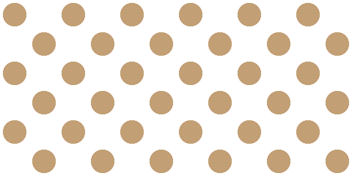

Pattern made with radial-gradient

对于这一个，我将使用 2 个`radial-gradient()` s。让我们不要忘记，我们可以有尽可能多的背景层。这是一个很棒的特性，它允许我们通过组合不同的渐变和不同的配置来构建复杂的图案。


我们在这里保持相同的`background-size`,但是我们为我们的圆使用不同的位置。代码如下所示:

```
html {
   background-image: 
     radial-gradient(?? at 25% 25%,??),
     radial-gradient(?? at 75% 75%,??);
   background-size: 100px 100px; 
}
```

对于半径配置，如果我们做一些数学计算，我们可以发现我们需要`25%`来使两个圆接触边缘。所以我们可以用这段代码:

```
html {
   background-image: 
     radial-gradient(25% 25% at 25% 25%,#c39f76 80%,#0000 81%),
     radial-gradient(25% 25% at 75% 75%,#c39f76 80%,#0000 81%);
   background-size: 100px 100px; 
}
```

我们也可以用`closest-side`代替`25% 25%`。我知道，这是一个奇怪的值，但它意味着“使用一个半径值，使圆接触到离其中心最近的一侧”。这个值很有用，可以让我们免于处理一些复杂的计算。

```
html {
   background-image: 
     radial-gradient(closest-side at 25% 25%,#c39f76 80%,#0000 81%),
     radial-gradient(closest-side at 75% 75%,#c39f76 80%,#0000 81%);
   background-size: 100px 100px; 
}
```

`radial-gradient()`为我们提供另外 3 个类似的值(`closest-corner`、`farthest-side`和`farthest-corner`)。我们要么为半径定义一个明确的大小，要么使用这些值，浏览器将根据特定的规则自动找到半径。

正如我之前说过的，你不需要记住所有的东西。我试着把重点放在`radial-gradient()`的基础上，同时提供尽可能多的信息，你以后可能会用到。

## 径向梯度模式#3

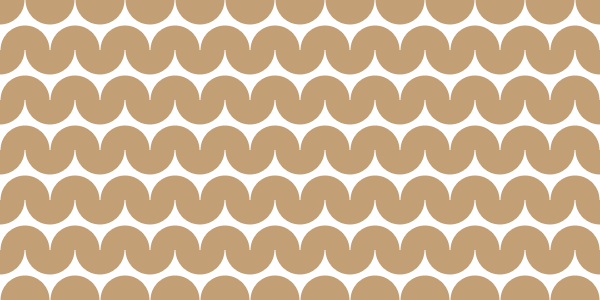

我在增加这个问题的难度。在第一个和第二个模式之后，我们现在可以尝试一个更复杂的模式。这个也是用两个渐变制作的，这里我们没有完整的圆，而是两个半圆的组合。

下面是一幅插图，帮助你理解这个难题。我使用不同的颜色来轻松识别每个渐变。

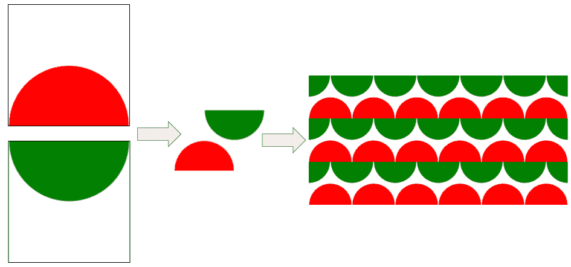

第一个梯度的中心位于`50% 100%`，而第二个梯度的中心位于`50% 0%`，但是我们也可以使用`top`和`bottom`作为它们的等效值。

```
html {
   background-image: 
     radial-gradient(?? at top   ,??),
     radial-gradient(?? at bottom,??);
   background-size: 100px 100px; 
}
```

对于半径，我们可以像以前一样使用`50% 50%`，但这次我将尝试一些不同的东西，考虑`50px`，它是`background-size`的一半。

当使用像素值或不同于百分比的任何单位时，我们可以只指定一个半径，浏览器将理解我们想要一个具有该半径的圆。这是除了百分比和特定值之外定义我们形状大小的另一种方式。

我们的圈子已经到了边缘，所以代码是:

```
html {
   background-image: 
     radial-gradient(50px at top   ,#c39f76 99%,#0000),
     radial-gradient(50px at bottom,#c39f76 99%,#0000);
   background-size: 100px 100px; 
}
```

是的，以上并没有给出我们想要的模式——我们仍然需要最后的润色。如果你检查前面的插图，你会注意到第二个渐变(绿色的)向右移动了一半的大小。换句话说，我们需要更新它的`background-position`:

```
html {
   background-image: 
     radial-gradient(50px at top   ,#c39f76 99%,#0000),
     radial-gradient(50px at bottom,#c39f76 99%,#0000);
   background-position: 0 0, 50px 0;
   background-size: 100px 100px; 
}
```

我们可以通过使用简写版本稍微优化一下代码:

```
html {
   background: 
     radial-gradient(50px at top   ,#c39f76 99%,#0000),
     radial-gradient(50px at bottom,#c39f76 99%,#0000) 50px 0;
   background-size: 100px 100px; 
}
```

由于我们处理的是像素值，我们可以添加一个 CSS 变量来使代码易于调整。

```
html {
   --s: 100px;
   background: 
     radial-gradient(calc(var(--s)/2) at top   ,#c39f76 99%,#0000),
     radial-gradient(calc(var(--s)/2) at bottom,#c39f76 99%,#0000) calc(var(--s)/2) 0;
   background-size: var(--s) var(--s); 
}
```

我们只改变一个值，而不是更新不同的值！

## 径向梯度模式#4

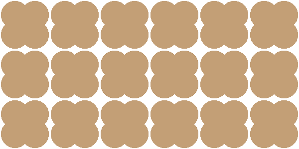

Pattern background made with radial-gradient

乍一看，这个背景有点复杂。但是如果我们能识别正确的模式，事情就变得简单了。

在处理这样的背景时，这是最困难的部分。有时不容易识别不同的背景层。我的建议是通过练习来提高这个练习。

凭直觉，你可能会认为模式是这样的，你会努力寻找梯度

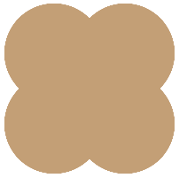

但事实并非如此。真正的模式是这样的

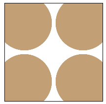

我们有 4 个圆圈放置在角落里，有一个小溢出。代码将是:

```
html {
   background: 
     radial-gradient(closest-corner at 20% 20%,#c39f76 98%,#0000),
     radial-gradient(closest-corner at 80% 20%,#c39f76 98%,#0000),
     radial-gradient(closest-corner at 20% 80%,#c39f76 98%,#0000),
     radial-gradient(closest-corner at 80% 80%,#c39f76 98%,#0000);
   background-size: 100px 100px;
}
```

用`closest-corner`定义半径很好。对于每一层，浏览器将绘制一个放置在特定位置的圆，并触摸最近的角。这个设置允许我们使用简单的颜色配置，同时具有所需的溢出。

我们也可以像下面这样使用`closest-side`:

```
html {
   background: 
     radial-gradient(closest-side at 20% 20%,#c39f76 140%,#0000 141%),
     radial-gradient(closest-side at 80% 20%,#c39f76 140%,#0000 141%),
     radial-gradient(closest-side at 20% 80%,#c39f76 140%,#0000 141%),
     radial-gradient(closest-side at 80% 80%,#c39f76 140%,#0000 141%);
   background-size: 100px 100px;
}
```

上面代码中唯一的新东西是颜色配置，我使用了大于`100%`的值。因为我使用了`closest-side`来定义半径，所以我需要比`100%`更大来创建溢出。

别忘了这样一个小技巧，它会很有帮助。颜色值不限于范围`[0% 100%]`–它们可以变得更大。

在这种情况下，我们还可以依靠 CSS 变量来避免颜色配置的重复:

```
html {
   --c: #c39f76 98%,#0000;
   background: 
     radial-gradient(closest-corner at 20% 20%,var(--c)),
     radial-gradient(closest-corner at 80% 20%,var(--c)),
     radial-gradient(closest-corner at 20% 80%,var(--c)),
     radial-gradient(closest-corner at 80% 80%,var(--c));
   background-size: 100px 100px;
}
```

## 径向渐变图案#5

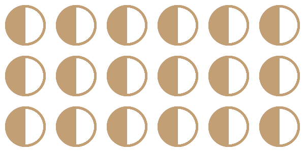

Pattern made with radial-gradient

这是另一个非直觉的模式，可能会让你们很多人感到困惑。你可能会认为它是一个半满的圆，你可能会想怎么可能做到这一点。实际上，它是两个半圆的组合，如下图所示:

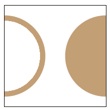

这是他们的代码:

```
html {
  background:
    radial-gradient(50% 50% at left ,#0000 70%,#c39f76 71% 80%,#0000 81%),
    radial-gradient(50% 50% at right,#c39f76 0 80%,#0000 81%);
  background-size: 100px 100px;
}
```

这一次，我们为每一个使用不同的颜色配置。第一个有 3 种颜色(透明，然后是主色，再透明)。第二个颜色配置与我们在前面的例子中使用的颜色配置相同。

这个图案是一个很好的例子，展示了不同的颜色配置可以是获得复杂背景图案的另一种方式。

## 径向梯度模式#6

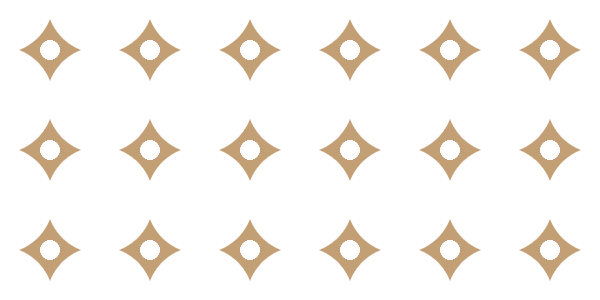

这是另一种不容易识别不同层的模式，但是如果我们仔细观察，我们可以看到两个圆圈

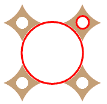

大圆圈是我们的第一层

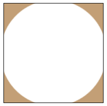

这是一个放置在区域中心的圆(像往常一样用`background-size`定义),但这次颜色配置不同寻常。我在里面部分使用透明色，在外面使用主色。应该注意的是，我们也有少量溢出。

```
html {
  background-image: radial-gradient(54% 54%,#0000 98%,#c39f76);
  background-size: 100px 100px;
}
```

如您所见，我使用了`54%`而不是`50%`来创建溢出。

第二层是较小的圆圈，以白色为主色调。整个代码将会是:

```
html {
  background: 
    radial-gradient(10% 10%,#fff 98%,#0000),
    radial-gradient(54% 54%,#0000 98%,#c39f76) 50px 50px;
  background-size:100px 100px;
}
```

注意`50px 50px`的用法。与第三种模式一样，我们需要将其中一层移动一半的大小，以获得正确的结果——否则两个圆将具有相同的中心，这不是预期的结果。

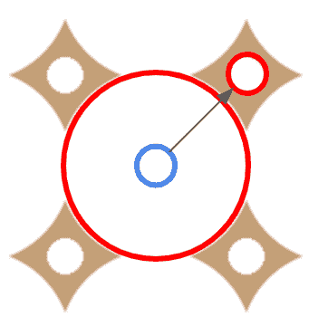

## 径向渐变模式#7

在我们结束之前，这里是最后一个模式:

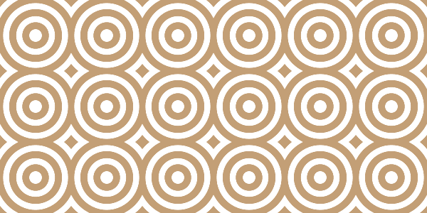

有了最后这个例子，我想介绍一下`repeating-radial-gradient()`，这是`radial-gradient()`的另一种写法。

我们的模式如下:

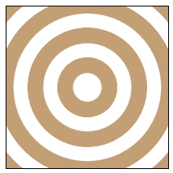

我们可以使用`radial-gradient()`实现上面的效果，但是颜色配置会变得太长(透明、主色、透明、主色等等)。

在这种情况下，颜色配置只不过是“透明、主色”的重复模式，而`repeating-radial-gradient()`就是为此目的而制作的。它允许我们定义图案颜色配置。

```
html {
  background-image: repeating-radial-gradient(#0000 0% 12%,#c39f76 13% 26% );
  background-size:100px 100px;
}
```

上面的意思是我们有透明色的`12%`，然后是主色的`13%`(`26 - 13 = 13`)，然后我们重复同样的操作，直到我们覆盖了所有的区域。

## 包扎

通过探索如何创建不同的背景图案，我们涵盖了`radial-gradient()`的基础知识。

文章到此结束，但这仅仅是个开始。`radial-gradient()`比我们刚刚看到的简单例子更复杂，但现在你有了练习和习惯它所需的工具。

继续尝试使用`radial-gradient()`构建您自己的模式。创建模式是掌握 CSS 渐变的最好练习。

以下是一些参考资料，以了解更多详细信息:

[radial-gradient() - CSS: Cascading Style Sheets | MDNThe radial-gradient() CSS function creates an image consisting of a progressive transition between two or more colors that radiate from an origin. Its shape may be a circle or an ellipse. The function’s result is an object of the <gradient> data type, which is a special kind of <image>.MDN](https://developer.mozilla.org/en-US/docs/Web/CSS/gradient/radial-gradient)[](https://drafts.csswg.org/css-images/#radial-gradients)[CSS Images Module Level 3Tab Atkins Jr.W3C](https://drafts.csswg.org/css-images/#radial-gradients)

感谢您的阅读！

更多 CSS 技巧，请关注我的 Twitter。
想支持我？你可以[请我喝咖啡](https://www.buymeacoffee.com/afif)或者[成为顾客](https://www.patreon.com/temani)。