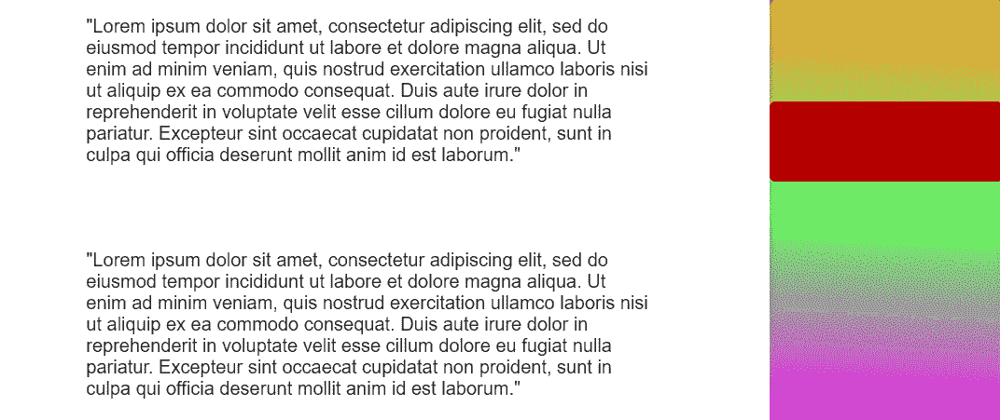
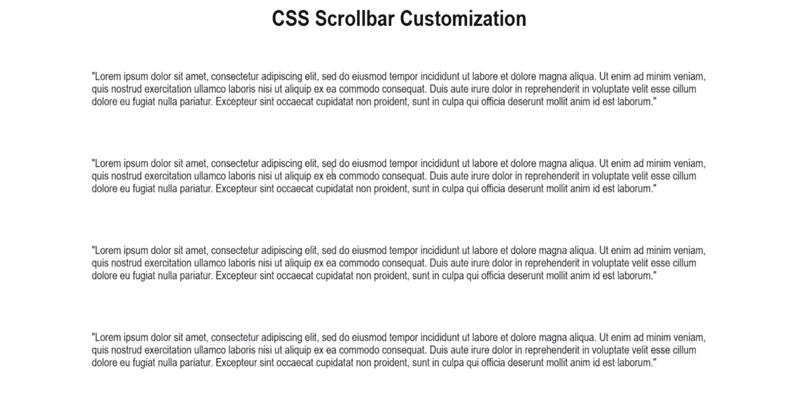
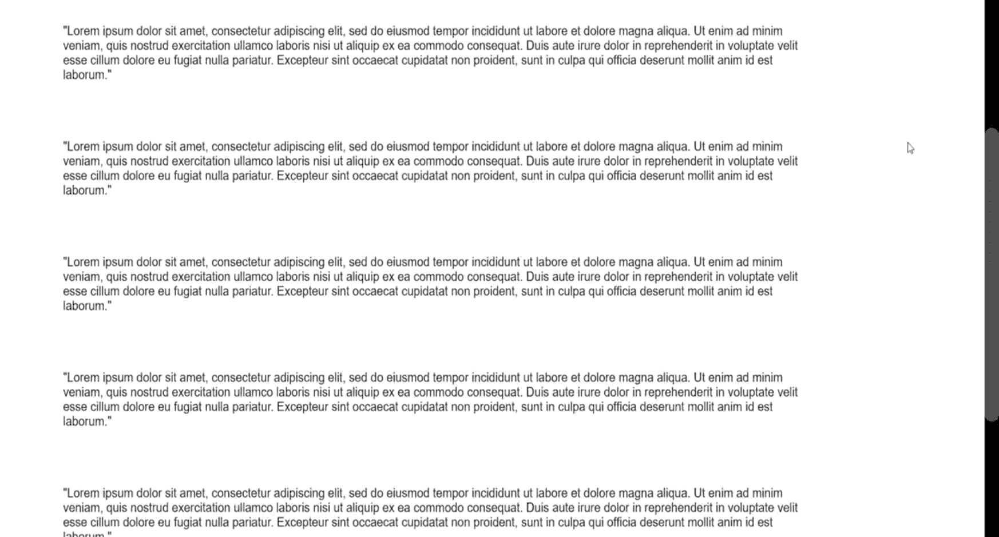
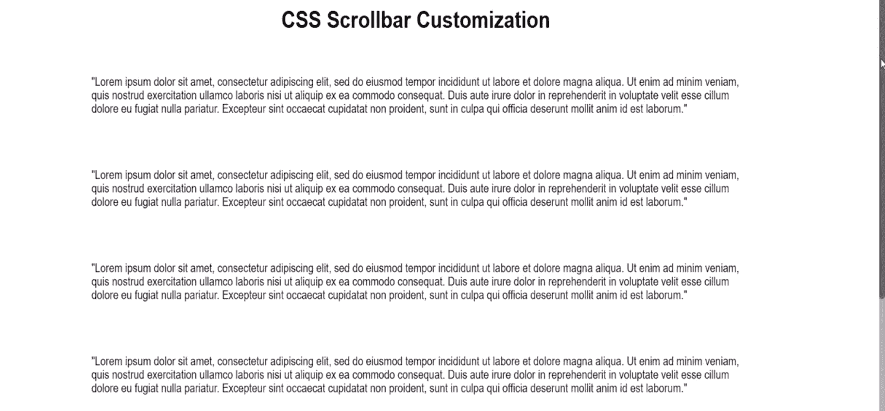
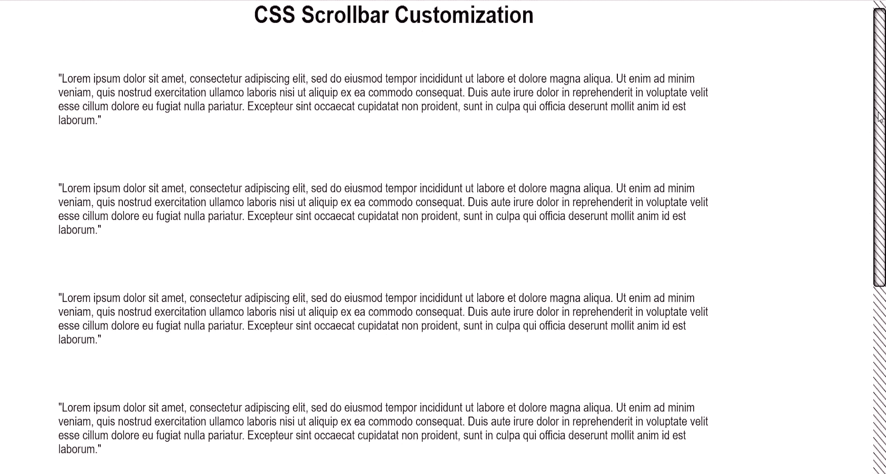
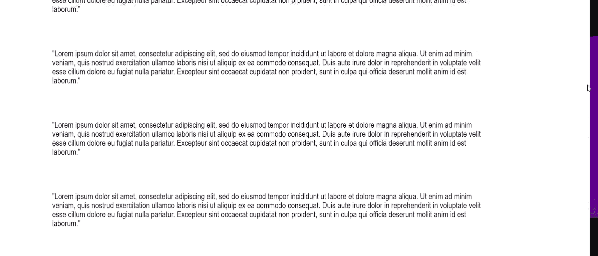
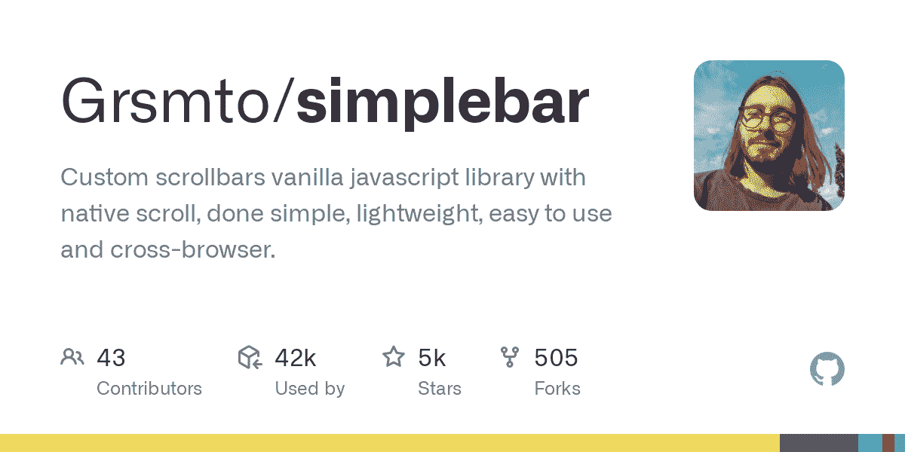
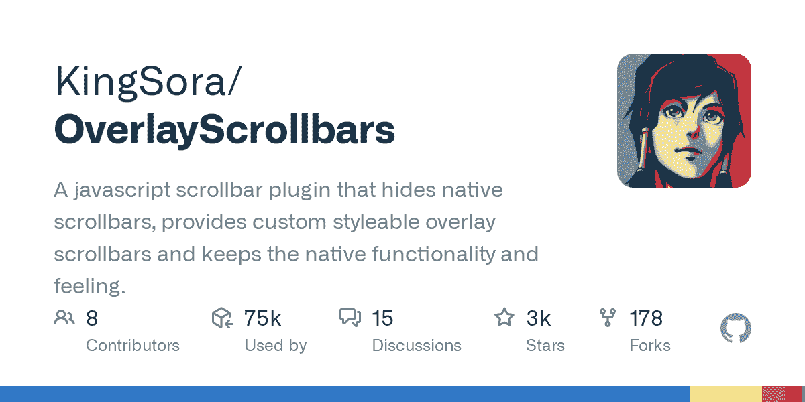

# CSS 滚动条样式教程——如何定制滚动条

> 原文：<https://www.freecodecamp.org/news/css-scrollbar-tutorial/>

你是否曾经访问过一个带有自定义滚动条的网站，并想知道他们是如何做到的？读完这篇文章后，你会明白关于使用 CSS 定制和设计滚动条的所有知识。

在本教程中，您将:

*   了解可用于在浏览器中设置滚动条样式的原生 CSS 属性
*   使用 CSS 创建四个独特的滚动条
*   了解一些为自定义滚动条提供跨浏览器支持的外部库



Peak scrollbar design

## 视频教程

如果你更喜欢视频教程而不是阅读，你可以看。你也可以使用视频留下评论/问题，并使用 CodePen 之类的东西发布链接到你自己的自定义滚动条，这样其他人就可以看到你的工作。

[https://www.youtube.com/embed/Gp6c9lJgPUI?feature=oembed](https://www.youtube.com/embed/Gp6c9lJgPUI?feature=oembed)

## 自定义滚动条的利与弊

在开始编写代码之前，我认为有必要考虑一下为你的网站或应用程序创建自定义滚动条的潜在利弊。

好处是，与数百万使用浏览器默认滚动条的网站相比，它可以让你的网站有机会脱颖而出。任何能让你的网站让访问者更加难忘的东西都会让你长期受益。

另一方面，许多用户界面设计者认为你不应该干涉像滚动条这样的“标准化”用户界面组件。如果你过多地修改滚动条，可能会让使用你的网站或应用的人感到困惑。

如果你正在为你自己的个人网站做这件事，只要你喜欢它的外观，你可能就不需要担心它。

另一方面，如果你正在考虑在工作中实现一个自定义滚动条或者一些你想赚钱的项目，你应该尝试 A/B 测试，并根据结果做出一个数据驱动的决定。

在一天结束的时候，我们中的大多数人都在编写代码来增加企业的收入，所以你需要时刻记住这一点。

## 入门指南

您需要做的第一件事是创建一个基本布局，使页面足够大，能够在 web 浏览器中显示滚动条:

```
<!DOCTYPE html>
<html lang="en">
<head>
    <meta charset="UTF-8">
    <meta http-equiv="X-UA-Compatible" content="IE=edge">
    <meta name="viewport" content="width=device-width, initial-scale=1.0">
    <link rel='stylesheet' href="styles.css">
    <title>Document</title>
</head>
<body>
    <div class="container">
        <h1>CSS Scrollbar Customization</h1>
        <p class="para">
        "Lorem ipsum dolor sit amet, consectetur adipiscing elit, sed do eiusmod tempor incididunt ut labore et dolore magna aliqua. Ut enim ad minim veniam, quis nostrud exercitation ullamco laboris nisi ut aliquip ex ea commodo consequat. Duis aute irure dolor in reprehenderit in voluptate velit esse cillum dolore eu fugiat nulla pariatur. Excepteur sint occaecat cupidatat non proident, sunt in culpa qui officia deserunt mollit anim id est laborum."
      </p>
      <p class="para">
        "Lorem ipsum dolor sit amet, consectetur adipiscing elit, sed do eiusmod tempor incididunt ut labore et dolore magna aliqua. Ut enim ad minim veniam, quis nostrud exercitation ullamco laboris nisi ut aliquip ex ea commodo consequat. Duis aute irure dolor in reprehenderit in voluptate velit esse cillum dolore eu fugiat nulla pariatur. Excepteur sint occaecat cupidatat non proident, sunt in culpa qui officia deserunt mollit anim id est laborum."
      </p>
      <p class="para">
        "Lorem ipsum dolor sit amet, consectetur adipiscing elit, sed do eiusmod tempor incididunt ut labore et dolore magna aliqua. Ut enim ad minim veniam, quis nostrud exercitation ullamco laboris nisi ut aliquip ex ea commodo consequat. Duis aute irure dolor in reprehenderit in voluptate velit esse cillum dolore eu fugiat nulla pariatur. Excepteur sint occaecat cupidatat non proident, sunt in culpa qui officia deserunt mollit anim id est laborum."
      </p>
      <p class="para">
        "Lorem ipsum dolor sit amet, consectetur adipiscing elit, sed do eiusmod tempor incididunt ut labore et dolore magna aliqua. Ut enim ad minim veniam, quis nostrud exercitation ullamco laboris nisi ut aliquip ex ea commodo consequat. Duis aute irure dolor in reprehenderit in voluptate velit esse cillum dolore eu fugiat nulla pariatur. Excepteur sint occaecat cupidatat non proident, sunt in culpa qui officia deserunt mollit anim id est laborum."
      </p>
      <p class="para">
        "Lorem ipsum dolor sit amet, consectetur adipiscing elit, sed do eiusmod tempor incididunt ut labore et dolore magna aliqua. Ut enim ad minim veniam, quis nostrud exercitation ullamco laboris nisi ut aliquip ex ea commodo consequat. Duis aute irure dolor in reprehenderit in voluptate velit esse cillum dolore eu fugiat nulla pariatur. Excepteur sint occaecat cupidatat non proident, sunt in culpa qui officia deserunt mollit anim id est laborum."
      </p>
      <p class="para">
        "Lorem ipsum dolor sit amet, consectetur adipiscing elit, sed do eiusmod tempor incididunt ut labore et dolore magna aliqua. Ut enim ad minim veniam, quis nostrud exercitation ullamco laboris nisi ut aliquip ex ea commodo consequat. Duis aute irure dolor in reprehenderit in voluptate velit esse cillum dolore eu fugiat nulla pariatur. Excepteur sint occaecat cupidatat non proident, sunt in culpa qui officia deserunt mollit anim id est laborum."
      </p>
      <p class="para">
        "Lorem ipsum dolor sit amet, consectetur adipiscing elit, sed do eiusmod tempor incididunt ut labore et dolore magna aliqua. Ut enim ad minim veniam, quis nostrud exercitation ullamco laboris nisi ut aliquip ex ea commodo consequat. Duis aute irure dolor in reprehenderit in voluptate velit esse cillum dolore eu fugiat nulla pariatur. Excepteur sint occaecat cupidatat non proident, sunt in culpa qui officia deserunt mollit anim id est laborum."
      </p>
      <p class="para">
        "Lorem ipsum dolor sit amet, consectetur adipiscing elit, sed do eiusmod tempor incididunt ut labore et dolore magna aliqua. Ut enim ad minim veniam, quis nostrud exercitation ullamco laboris nisi ut aliquip ex ea commodo consequat. Duis aute irure dolor in reprehenderit in voluptate velit esse cillum dolore eu fugiat nulla pariatur. Excepteur sint occaecat cupidatat non proident, sunt in culpa qui officia deserunt mollit anim id est laborum."
      </p>
      <p class="para">
        "Lorem ipsum dolor sit amet, consectetur adipiscing elit, sed do eiusmod tempor incididunt ut labore et dolore magna aliqua. Ut enim ad minim veniam, quis nostrud exercitation ullamco laboris nisi ut aliquip ex ea commodo consequat. Duis aute irure dolor in reprehenderit in voluptate velit esse cillum dolore eu fugiat nulla pariatur. Excepteur sint occaecat cupidatat non proident, sunt in culpa qui officia deserunt mollit anim id est laborum."
      </p>
      <p class="para">
        "Lorem ipsum dolor sit amet, consectetur adipiscing elit, sed do eiusmod tempor incididunt ut labore et dolore magna aliqua. Ut enim ad minim veniam, quis nostrud exercitation ullamco laboris nisi ut aliquip ex ea commodo consequat. Duis aute irure dolor in reprehenderit in voluptate velit esse cillum dolore eu fugiat nulla pariatur. Excepteur sint occaecat cupidatat non proident, sunt in culpa qui officia deserunt mollit anim id est laborum."
      </p>
      </div>
</body>
</html>
```

这里没有什么特别的，只有一个基本的 div 容器，类名为`container`用于我们的布局，一个 header 用于标题，一堆段落用类名`para`填充我们的页面。

下面的 CSS 让事情看起来更有趣一些:

```
body {
    font-family: Arial, Helvetica, sans-serif;
    margin: 0;

  }
  .para {
    font-size: 16px;
    padding: 20px;
    width: 70%;
  }

  .container {
    display: flex;
    flex-direction: column;
    justify-content: center;
    align-items: center;
  }
```

您的页面应该如下所示:



## 如何用 CSS 创建自定义滚动条

有了我们的设置，我们可以进入教程的有趣部分。本节的第一部分将学习可用于样式的各种 CSS 属性。

在第二部分，我们将实现四种不同类型的滚动条，给你一些制作自己的滚动条的想法。

### 可用于样式滚动条的 CSS 属性

不幸的是，我们仍然没有任何标准化的跨浏览器的 CSS 滚动条样式支持。基于 Firefox 和 Webkit 的浏览器，如 Chrome、Edge 和 Safari，具有不同的样式属性。

本教程将主要关注 Webkit 浏览器，因为它们提供了更多的样式选择，但我们也将简要介绍 Firefox。

### 滚动条的 Webkit CSS 样式属性

*   `::-webkit-scrollbar`–整个滚动条
*   `::-webkit-scrollbar-track`–滚动条的整个进度条区域
*   `::-webkit-scrollbar-thumb`–滚动条的可拖动部分

以下属性可用，但不常用:

*   `::-webkit-scrollbar-button`–滚动条两端的向上/向下按钮
*   `::-webkit-scrollbar-track-piece`–滚动条未被拇指覆盖的部分
*   `::-webkit-scrollbar-corner`–水平滚动条和垂直滚动条相交的底角

### 滚动条的 Firefox CSS 样式属性

目前在 Firefox 中有两个 CSS 属性可以用来设置滚动条的样式

*   `scrollbar-width`–控制滚动条的宽度，只有两个选项可用:`auto`或`thin`
*   `scrollbar-color`–采用两种颜色，分别用于滚动条的滚动块和轨道的颜色

现在你知道了自定义滚动条的选项，让我们用一些例子来实践它。

### 黑色主题滚动条

黑暗主题网站现在非常流行。坚持使用默认的浏览器滚动条可能会让用户感到不舒服，因为它不太适合黑色主题的网站。

让我们利用新学到的 CSS 知识，从 CSS Tricks 的网站上获得灵感，创建一个带有圆形边框的深色主题滚动条:

```
html::-webkit-scrollbar {
      width: 20px; 
   }

html::-webkit-scrollbar-track {
    background-color: black;
  }

html::-webkit-scrollbar-thumb {
    background: #4e4e4e;
    border-radius: 25px;
  }
```

结果在截图中有点看不出来，但是轨迹是黑色的，拇指是暗灰色的。



### 极简滚动条

在这个例子中，你将制作一个极简滚动条。如果你想为你的网站设计一个简单、优雅的风格，这种类型的滚动条会很好用。

需要注意的最重要的一点是，您可以使用 CSS 中的`hover`和`active`伪元素来进一步设计滚动条的样式。在这种情况下，当您悬停并拖动滑块时，滚动条将变成深灰色。

```
html::-webkit-scrollbar {
    width: 10px;
  }

html::-webkit-scrollbar-track {
    background: rgb(179, 177, 177);
    border-radius: 10px;
}

html::-webkit-scrollbar-thumb {
    background: rgb(136, 136, 136);
    border-radius: 10px;
  }

html::-webkit-scrollbar-thumb:hover {
    background: rgb(100, 100, 100);
    border-radius: 10px;
  }

html::-webkit-scrollbar-thumb:active {
    background: rgb(68, 68, 68);
    border-radius: 10px;
  }
```

结果是:



### 图案滚动条

在这一节中，重点是使用重复的线性渐变来创建滚动条轨道的图案效果。滚动条滑块也可以这样做。

另一件要注意的事情是，你可以用一个边框来设计滚动条的样式，你可以用它来创建一些很酷的效果。在这种情况下，我将缩略图的背景色设为透明，这样当我们滚动时，你就可以看到滚动条的轨迹。

```
html::-webkit-scrollbar {
   	width: 20px;
  }
html::-webkit-scrollbar-track {
  	background-image: repeating-linear-gradient(45deg, red 0, red 1px, transparent 0, transparent 50%);
  	background-size: 10px 10px;
	}
html::-webkit-scrollbar-thumb {
    background: transparent;
    border-radius: 5px;
    border: 2px solid black;
    box-shadow: inset 1px 1px 5px black ;
   }
```

结果是:



### “动画”渐变滚动条

这个例子使用了一个线性渐变和一个带阴影的技巧，让滚动条看起来像是随着你在页面上上下移动而改变颜色。真正发生的是滚动条轨道的背景显示在拇指下面。

它之所以有效，是因为阴影占据了滚动条的所有空间，除了缩略图所在的位置。因为缩略图是透明的，所以背景的渐变颜色会透过它显示出来。

```
html::-webkit-scrollbar {
    width: 20px; 
  }

html::-webkit-scrollbar-track {
    background:  linear-gradient(0deg, rgba(255, 0, 0, 1) 0%, rgba(7, 0, 211, 1) 100%);
  }

html::-webkit-scrollbar-thumb {
    background: transparent;
    box-shadow: 0px 0px 0px 100vh black;
  }
```

结果是:



## 自定义滚动条限制和替代选项

创建自定义滚动条显然存在一些问题。首先是缺乏跨浏览器支持。其他问题包括缺乏向滚动条添加过渡或动画的能力，以及你的自定义滚动条不会出现在移动设备上。

另一种方法是隐藏默认滚动条并使用一个库，但这可能会影响页面的主滚动条的性能。还有其他潜在的可用性问题，因为这些库依赖 JavaScript 来模仿本地滚动条行为。

下面我将介绍两个流行的用于制作滚动条的开源库。

### SimpleBar 库

[Grsmto/simplebarCustom scrollbars vanilla javascript library with native scroll, done simple, lightweight, easy to use and cross-browser. - Grsmto/simplebarGrsmtoGitHub](https://github.com/Grsmto/simplebar)

顾名思义，SimpleBar 就是让创建自定义滚动条变得容易。唯一真正的缺点是，它不支持作为你的网站或表格，文本区，或选择 HTML 元素的主滚动条使用。

SimpleBar 的主要用途是为动态聊天应用程序或任何其他类型的需要滚动的内部页面元素创建自定义滚动条。

### 覆盖滚动条库

[KingSora/OverlayScrollbarsA javascript scrollbar plugin which hides native scrollbars, provides custom styleable overlay scrollbars and keeps the native functionality and feeling. - KingSora/OverlayScrollbarsKingSoraGitHub](https://github.com/KingSora/OverlayScrollbars)

Overlay Scrollbars 非常类似于 SimpleBar，但是它具有支持 HTML body 元素的额外好处。这意味着你可以把它用在你网站的主滚动条上，除此之外，你还可以使用其他功能，比如跨浏览器和移动支持。

## 结论

希望这篇文章让你对 CSS 滚动条样式的工作原理有了一个坚实的理解。

如果你有任何问题，你可以在 YouTube 视频上留下评论，我会尽力帮助你。也可以随意留下你自己设计的链接，这样其他人就可以查看了。

链接到 GitHub repo:[https://GitHub . com/renaissance engineer/CSS-scroll bar-tutorial](https://github.com/renaissanceengineer/css-scrollbar-tutorial)