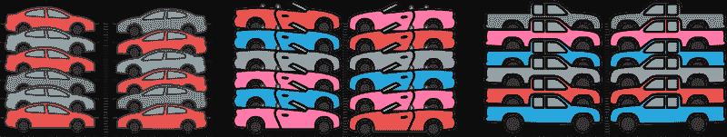
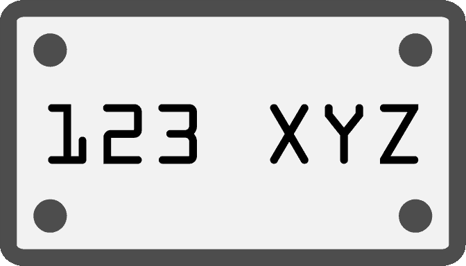
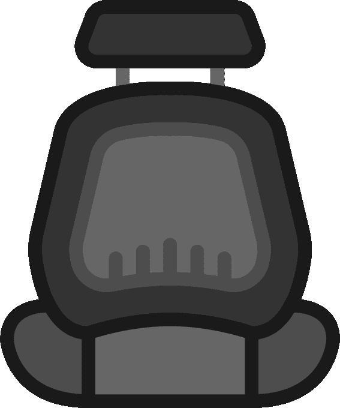

# 通过购车来解释 CSS 选择器

> 原文：<https://www.freecodecamp.org/news/css-selectors-explained-by-going-car-shopping-51a383f6eb4b/>

凯文·科诺年科

# 通过购车来解释 CSS 选择器

#### 如果你见过汽车经销商，那么你就能理解 CSS 选择器。

当你步入汽车经销商的停车场时，你会立刻被不同的汽车、颜色和年份所包围。

当然还有那个咄咄逼人的销售人员。但是让我们把它们排除在这个模拟之外。

汽车——以及汽车特征——可以使用与 CSS 选择器相同的系统进行分类。因此，如果你能理解在一个经销店市场中划分汽车的不同方法，那么你就能理解 CSS 选择器。

让我们从使用 HTML 来想象一个汽车经销商开始:

现在我们将介绍四种不同的 HTML 元素样式:

1.  根据元素类型，即
2.  按类别，即“蓝色”
3.  通过 id，即“123xyz”
4.  通过与其他元素的关系

#### 按元素类型

在我们上面的 HTML 中，每个

实际上都是某种汽车。可能是轿车，卡车，或者敞篷车。但这些只是汽车的变种。

如果我们想给每辆车增加造型，我们就必须考虑这个停车场上每辆车的共同点。

下面是一些 CSS 示例:

好吧，我先从这个开始，好吗？是的，我创造了一些 CSS 属性来实现这个功能。

无论如何，公平地说，这里的每辆车都是钢制的，有 4 个轮子，最大高度为 9 英尺。所以每次我们添加一个

到我们的 HTML，默认情况下它会有这些属性。

事实上，我们可以将这种汽车概念更进一步。我们也可以将汽车内部分解成 HTML:

座位和窗户可能具有哪些属性？它们必须由所有窗口和座位共享！我们将在本文的后面对此进行深入探讨。

#### 使用类

查看我们的第一个 HTML 片段，它涵盖了停车场上的所有汽车。你可以看到每辆车

都有一系列的类。这些类用于为所有类成员分配公共属性。

假设我们将“2005”这一类别分配给不同的轿车、卡车和敞篷车。那么，2005 年许多汽车的一个共同特点是什么？CD 播放器！所以让我们用伪 CSS 来实现它。

如果我们有“船员舱”呢？带驾驶室的卡车有 2 排座位，总共 5 个座位。因此，我们可能希望将该类专门分配给卡车。我们可以通过将类串在一起来合并它们。

类是引用 HTML 元素的一种更具体的方式。所以，让我们假设所有的车辆都是钢制的，默认情况下。但是你希望有些车辆是铝制的。您可以创建一个“aluminum”类，它将覆盖该类所有成员的 material 属性。

#### 使用 ID

HTML 元素可以有一个 ID。这是引用单个元素的最具体的方式，它覆盖所有其他样式。这个惟一的标识符有点像元素的牌照。

假设你有一辆车，车牌是“123 XYZ”。这辆车有独特的紫色，因为出于某种原因，车主要求它。这是 CSS 中的一个元素。

元素与 id 有一对一的关系。就像汽车和车牌一样，没有两辆车可以有相同的车牌。这也是识别一个元素的最强大的方法，因此您可以为一个元素应该遵守的所有其他规则创建唯一的例外。

#### 元素之间的关系

假设您想确保“皮革座椅”类的汽车有皮革制成的座椅。查看“元素类型”部分的第二个 HTML 代码片段。

你也可以给每个有职业“座位”的

一个职业“皮革”。但问题是:这并不允许你选择整体上只有真皮座椅的汽车。你只能自己选择座位。

所以，我们想给整辆车一个“皮革座椅”类，以确保我们可以选择整个

和它的孩子。

上面的 CSS 将在一个“leatherSeats”容器中选择所有类为“seat”的元素。

现在，假设您想确保前排乘客座椅有座椅取暖器。您可以使用“~”选择器，它被称为同级选择器。它允许您相对于相邻元素为元素指定样式。

所以你可以说:

这是最后一个例子。让我们说一个特定的品牌和型号有一个奇怪的，随机的特征。例如，一辆 2008 年的雪佛兰卡车可能在后座上有 DVD 播放器。

下面是如何将其转化为 CSS 的方法:

1.  你需要从多个类开始，因为这是一个非常特殊的汽车类型。这可能是“div.truck.chevy.year2008”。
2.  然后，想想你将如何选择后座，特别是。你可以给这一行增加一个额外的类，比如。后排”。或者，您可以使用[:最后一个孩子选择器](http://www.w3schools.com/cssref/css_selectors.asp)。
3.  最后，你需要选择座位本身。

回答:

如果你喜欢这篇文章，你可能也会喜欢我对挑战 CSS 和 JavaScript 主题的其他解释，比如定位、模型-视图-控制器和回调。

如果你认为这可能会帮助和你处境相同的人，那就给它一颗“心”吧！