# CSS Shapes 解释:如何使用纯 CSS 绘制圆形、三角形等

> 原文：<https://www.freecodecamp.org/news/css-shapes-explained-how-to-draw-a-circle-triangle-and-more-using-pure-css/>

在我们开始之前。如果你想要更多的视频格式的免费内容。不要错过我的 Youtube 频道，我在那里发布关于前端编码的每周视频。

-

你是 web 开发和 CSS 的新手吗？你有没有想过你在网上看到的那些好看的形状是怎么做出来的？不再好奇了。你来对地方了。

下面我将解释用 CSS 创建形状的基础知识。关于这个话题有很多东西要告诉你！因此，我不会涵盖所有的工具和形状，但这应该给你一个基本的概念，形状是如何用 CSS 创建的。

有些形状比其他形状需要更多的“修理和技巧”。用 CSS 创建形状通常是使用**宽度、高度、顶部、右侧、左侧、边框、底部、变换**和类似**:前**、**:后的伪元素的组合。**我们还有更现代的 CSS 属性来创建类似**形状外**和**剪辑路径的形状。我也会在下面写下它们。**

## **CSS 形状-基本方式**

通过使用 CSS 中的一些技巧，我们总是能够创建基本的形状，如正方形*、*、圆形*、*和具有常规 CSS 属性的三角形。现在让我们来看看其中的几个。

### 正方形和长方形

正方形和长方形可能是最容易实现的形状。默认情况下，div 总是正方形或矩形。

如下面的代码所示，设置宽度和高度。然后就是给元素一个背景色的问题了。您可以在元素上拥有您想要的任何其他属性。

```
#square {
    background: lightblue;
    width: 100px;
    height: 100px;
}
```


A CSS square

### 
圈子

创造一个圈子几乎一样容易。要创建一个圆，我们可以在元素上设置边界半径。这将在元素上创建弯曲的角。

如果我们将它设置为 50%，它将创建一个圆。如果你设置不同的宽度和高度，我们将得到一个椭圆形。

```
#circle {
    background: lightblue;
    border-radius: 50%;
    width: 100px;
    height: 100px;
}
```

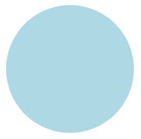

A CSS Circle

### 三角形

三角形有点复杂。我们必须设置元素的边界来匹配一个三角形。通过将元素的宽度和高度设置为零，元素的实际宽度将是边框的宽度。

请记住，元素上的边界边缘是彼此成 45 度角的对角线。这就是为什么这个方法可以创建一个三角形。通过将一个边框设置为纯色，另一个边框设置为透明，它将呈现三角形的形状。

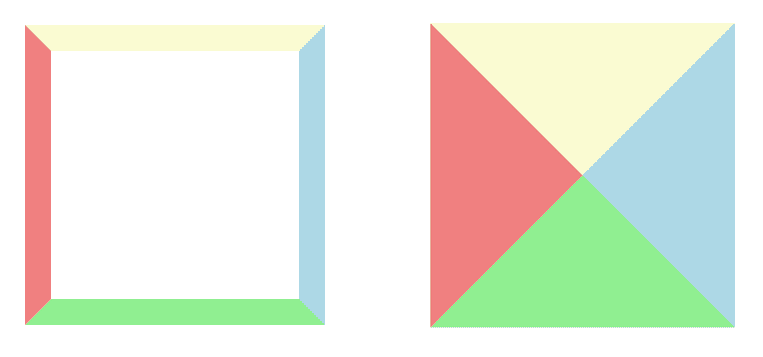

CSS Borders have angled edges

```
#triangle {
    width: 0;
    height: 0;
    border-left: 40px solid transparent;
    border-right: 40px solid transparent;
    border-bottom: 80px solid lightblue;
}
```

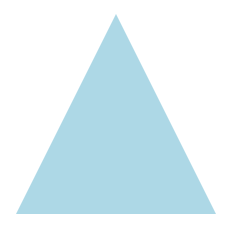

A CSS Triangle

如果您想要一个指向另一个方向的三角形/箭头，您可以根据您想要显示的边来更改边框值。或者你可以用 *transform* 属性旋转元素，如果你想变得更有趣的话。

```
 #triangle {
     width: 0;
     height: 0;
     border-top: 40px solid transparent;
     border-right: 80px solid lightblue;
     border-bottom: 40px solid transparent;
 }
```

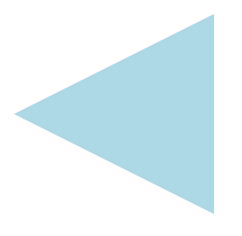

Another CSS Triangle

好了——这是对 CSS 基本形状的介绍。你可能会想出无穷无尽的形状来创造。这些只是基础，但是只要有一点创造力和决心，你就可以用基本的 CSS 属性实现很多。

在某些情况下，对于更高级的形状，使用:after 和:before 伪选择器也是一个好主意。这超出了本文的范围，因为我的目的是介绍一些基础知识，帮助您入门。

### 不足之处

上述方法有一个很大的缺点。例如，如果您想要文本环绕您的形状。用背景和边框组成形状的常规 HTML div 不允许这样做。文本将不会适应并环绕您的形状。相反，它将围绕 div 本身流动(div 是正方形或矩形)。

下图显示了三角形以及文本的排列方式。

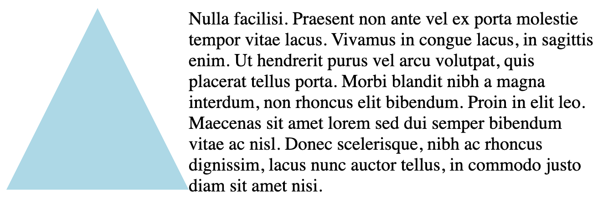

幸运的是，我们有一些现代的 CSS 属性可以使用。

## CSS 形状-反过来

现在我们有一个叫做 **shape-outside** 的属性可以在 CSS 中使用。此属性允许您定义文本将环绕的形状。

伴随着这个属性我们有了一些基本的形状:

**插入()**
**圆形()
椭圆形()
多边形()**

**这里有一个提示**:你也可以使用**剪辑路径**属性。您可以用同样的方法创建您的形状，但它不会像 shape-outside 那样让文本环绕您的形状。

我们要对其应用具有 shape-outside 属性的形状的元素必须是浮动的。它还必须具有确定的宽度和高度。知道这一点非常重要！

你可以在这里阅读更多关于为什么[的内容。下面也是我从提供的 developer.mozilla.org 链接中摘录的一段文字。](https://developer.mozilla.org/en-US/docs/Web/CSS/shape-outside)

> 使用下面列表中的值来指定`shape-outside`属性，这些值定义了浮动元素的浮动区域。浮动区域确定内联内容(浮动元素)环绕的形状。

### 插图()

inset()类型可用于创建一个矩形/正方形，带有可选的环绕文本偏移量。它允许您提供希望环绕文本与形状重叠多少的值。

您可以为所有四个方向指定相同的偏移量，如下:**插入(20px)。**也可以每个方向单独设置:**插图(20px 5px 30px 10px)** 。

也可以使用其他单位来设置偏移，例如百分比。值是这样对应的:**插图(右上左下)** ***。***

查看下面的代码示例。我已经指定了上 20px，右 5px，下 30px，左 10px 的插入值。如果你想让你的文字环绕你的正方形，你可以跳过使用 inset()来代替。相反，像往常一样设置 div 的背景并指定大小。

```
 #square {
     float: left;
     width: 100px;
     height: 100px;
     shape-outside: inset(20px 5px 30px 10px);
     background: lightblue;
 }
```

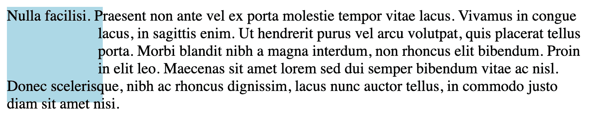

The text is offset by the specified values. In this case 20px at top, 5px to the right, 30px at the bottom and 10 px to the left

也可以给 insert()第二个值，指定插入的边框半径。像下面这样:

```
 #square {
     float: left;
     width: 100px;
     height: 100px;
     shape-outside: inset(20px 5px 30px 10px round 50px);
     background: lightblue;
 }
```

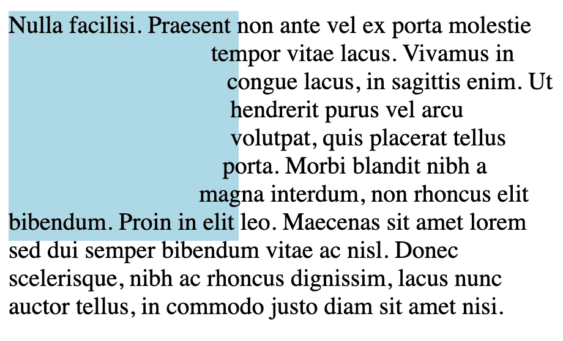

border-radius set to 50px on the inset

### 圆圈()

在这个例子中，使用 **shape-outside** 属性创建了一个圆。你还必须应用一个带有相应属性的**剪辑路径**来显示这个圆。

**clip-path** 属性可以取与 shape-outside 属性相同的值，所以我们可以给它标准的 **circle()** 形状，我们用它来表示 **shape-outside** 。另外，请注意，我在这里的元素上应用了 20px 的边距，以给文本留出一些空间。

```
#circle {
    float: left;
    width: 300px;
    height: 300px;
    margin: 20px;
    shape-outside: circle();
    clip-path: circle();
    background: lightblue;
}
```

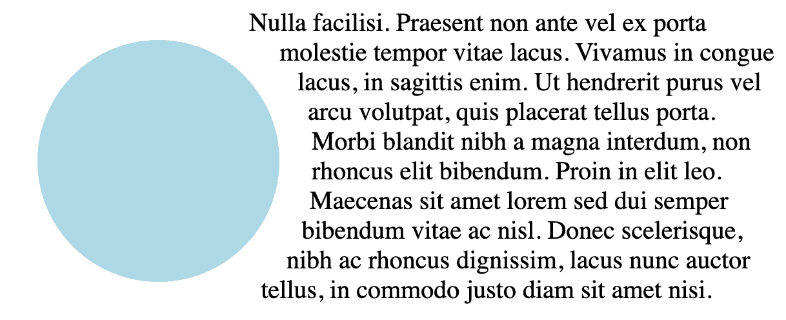

Text flows around the shape!

在上面的例子中，我没有指定圆的半径。这是因为我希望它和 div 一样大(300px)。如果您想为圆指定不同的大小，您可以这样做。

圆圈()有两个值。第一个值是半径，第二个值是位置。这些值将指定圆心。

在下面的例子中，我将半径设置为 50%。然后我将圆心移动了 30%。请注意，在半径和位置值之间必须使用单词“at”。

我还在剪辑路径上指定了另一个位置值。这将剪辑圆的一半，因为我移动位置到零。

```
 #circle {
      float: left;
      width: 150px;
      height: 150px;
      margin: 20px;
      shape-outside: circle(50% at 30%);
      clip-path: circle(50% at 0%);
      background: lightblue;
    }
```

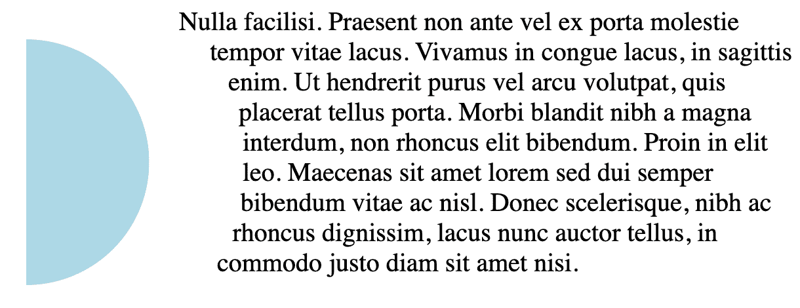

### 椭圆()

椭圆的工作方式与圆相同，只是它们创建一个卵形。可以同时定义 X 值和 Y 值，像这样:**椭圆(25px 50px)。**

和圆一样，也是取一个位置值作为最后一个值。

```
 #ellipse {
      float: left;
      width: 150px;
      height: 150px;
      margin: 20px;
      shape-outside: ellipse(20% 50%);
      clip-path: ellipse(20% 50%);
      background: lightblue;
    }
```

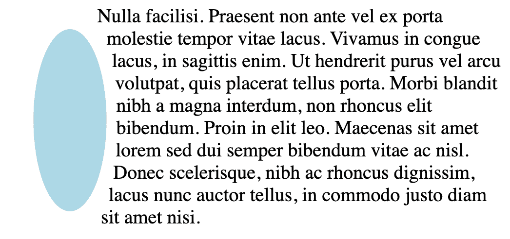

### 多边形()

多边形是定义了不同顶点/坐标的形状。下面我创建了一个“T”形，这是我名字的第一个字母。我从坐标 0，0 开始，从左到右创建“T”形。

```
#polygon {
      float: left;
      width: 150px;
      height: 150px;
      margin: 0 20px;
      shape-outside: polygon(
        0 0,
        100% 0,
        100% 20%,
        60% 20%,
        60% 100%,
        40% 100%,
        40% 20%,
        0 20%
      );
      clip-path: polygon(
        0 0,
        100% 0,
        100% 20%,
        60% 20%,
        60% 100%,
        40% 100%,
        40% 20%,
        0 20%
      );
      background: lightblue;
    }
```

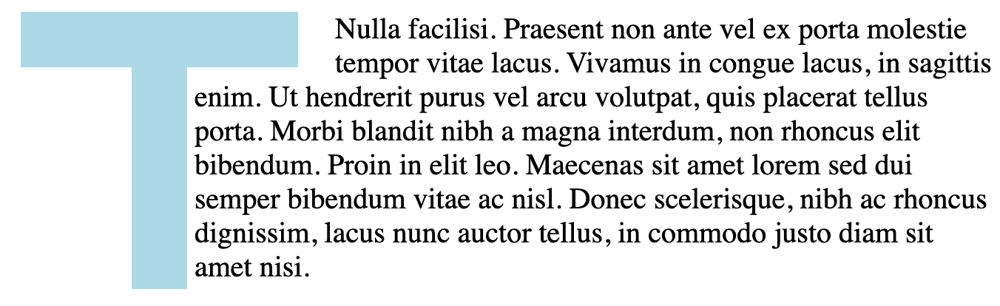

### 形象

您也可以使用带有透明背景的图像来创建您的形状。就像下面这轮美丽的月亮。

这是一个带有透明背景的. png 图像。

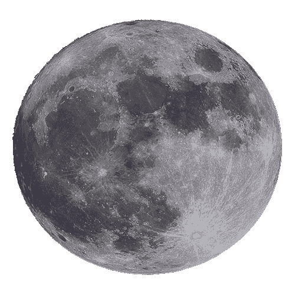

```

```

```
#moon {
      float: left;
      width: 150px;
      height: 150px;
      shape-outside: url("./src/moon.png");
    }
```

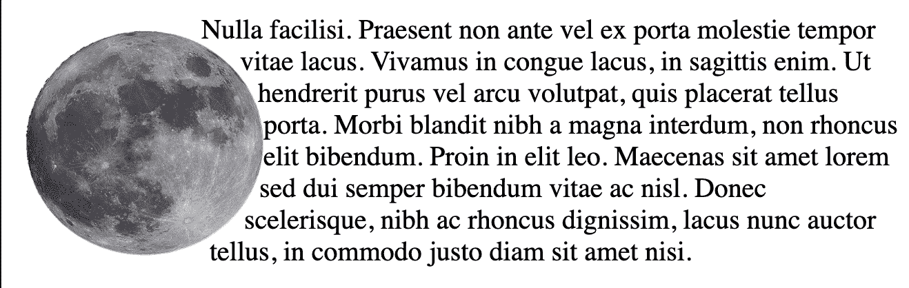

就是这样！感谢您的阅读。

## 关于本文作者

我叫 Thomas Weibenfalk，是一名来自瑞典的开发人员。我定期在我的 Youtube 频道上创建免费教程。React 和 Gatsby 上也有一些高级课程。欢迎通过以下链接联系我:

Twitter — [@weibenfalk](https://twitter.com/weibenfalk) ，
Weibenfalk on [Youtube](https://www.youtube.com/c/weibenfalk) ，
Weibenfalk [课程网站](https://www.weibenfalk.com)。