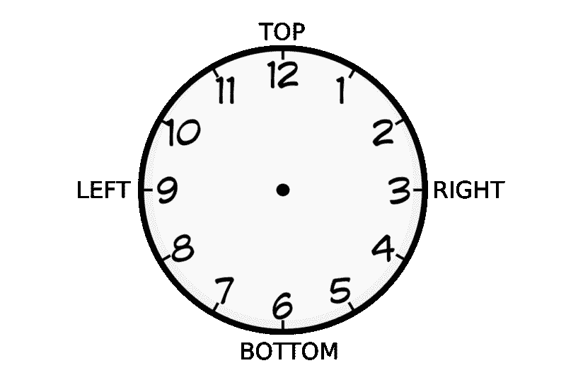
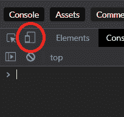
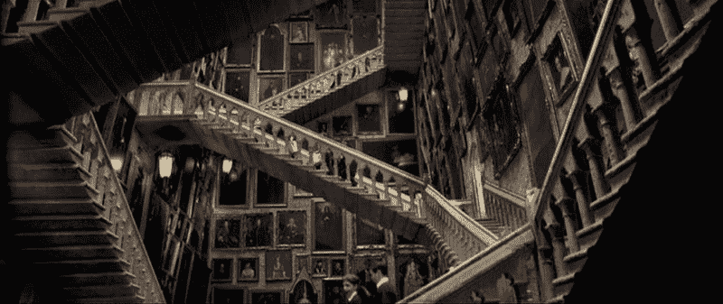
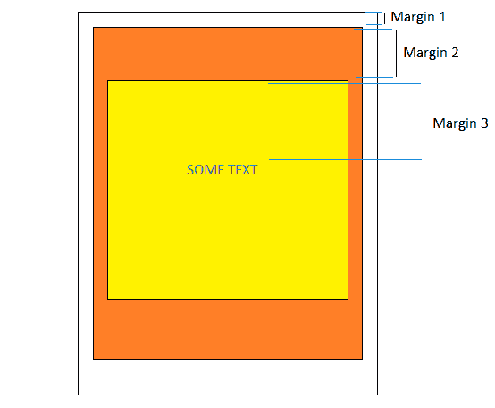
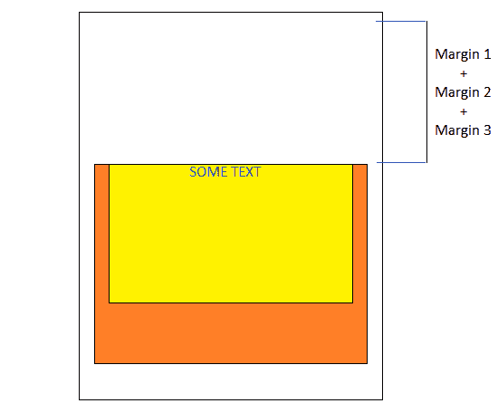

# 你可能在任何教程中看不到的 CSS 技巧

> 原文：<https://www.freecodecamp.org/news/css-tips-that-you-likely-wont-see-in-any-tutorial-3af201315a76/>

克里斯蒂安·特雷纳

# 你可能在任何教程中看不到的 CSS 技巧


你可以在任何教程中找到 CSS 规则。

还有一些 CSS 规则是你在教程中找不到的，但是当你开始编码时，你会立即面对它们。我相信你已经谷歌过如何垂直对齐一个元素，以及如何创建复杂的布局。我们不谈这个。

最后，有些 CSS 规则你在任何教程中都没有遇到过，你也不可能知道。随着时间的推移，我收集了这些技巧，现在我决定写一篇文章，希望它们能对其他人有用。

以下是 CSS 教程没教过我的。

### 顶部填充相对于父级的宽度

你在 CSS 中使用过多少次相对单位？我是他们的忠实粉丝，因为他们可以让你建立一个响应迅速的网站，而不用过多地处理媒体的询问。如果你想设置一个元素的高度为父元素高度的一半，写`height: 50%`就够了。

你可以在任何地方使用相对单位。如果你想在两个垂直元素之间增加一些距离，你可以写`margin-top: 15%`，它会产生边距。距离将是父高度的 15%。我想你已经知道这些了，我不想浪费你的时间。但也许你不知道，这并不是那么微不足道的。

在某些情况下，如果你用填充来代替页边空白(T2)会更好。但是当你设置`padding-top: 15%` …管它呢？

它不像预期的那样工作。这和父母的身高没有关系。发生什么事了？

#### **解决方案**

它相对于父项的宽度。

你想要实际的示范吗？这是:

只需改变父对象的宽度，看看子对象的填充是如何受到影响的。

起初看起来可能很奇怪，但实际上这是有意义的原因的。你可以通过阅读 [CSS 规范](https://www.w3.org/TR/CSS2/box.html#propdef-padding-top) …

不，我在开玩笑——没有解释为什么会发生这种情况。或者说，至少，我哪儿也没找到。它就是这样工作的，所以记住它。

即使我们可能不理解工程师们这样做的原因，我们也可以利用这个特性。如果我们有一个元素，我们设置如下:

```
.parent {  height: auto;  width: 100px;}
```

```
.child {  padding-top: 100%;}
```

然后，元素的高度将和子元素的高度一样多，因为我们设置了`height: auto`。另一方面，孩子的高度将与父母的宽度相同，因为我们设置了`padding-top: 100%`。结果是一个正方形，并且该元素在任何大小下都将保持相同的比例。

下面是一个工作示例:

如果你用任何其他百分比改变`padding-top: 100%`，你将得到一个矩形。此外，如果您更改宽度，比率将始终保持不变。

### 转换可以堆叠规则

如果你学过计算机科学，你肯定记得那只丑陋的乌龟和它的可伸缩笔。这种教育理念更正式的说法是[海龟图形](https://en.wikipedia.org/wiki/Turtle_graphics)，它的目标是通过简单的指令，一步一步地引导海龟走上一条路径，比如“前进 20 步”、“旋转 90 度”。

如果使用 CSS，你可以让一个块相对于它的当前位置，而不是起始位置，向右移动 20 个像素，那会怎么样？如果我说你可以用`transform`属性来做呢？

很多开发者不知道`transform`可以堆出不止一个规则，`n+1` th 规则会相对于`n` th 规则时达到的位置，而不是它的起始位置。

你困惑吗？

也许这支笔能让你清醒一下:

注意，我们没有使用任何 JavaScript 变量来存储当前位置或当前旋转。这些信息不会保存在任何地方！解决方法很简单，如果你写:

```
transform: translateX(20px);
```

然后你再添加一条规则:

```
transform: translateX(20px) translateX(40px)
```

第二个规则不会覆盖第一个规则，但它们会按顺序一个接一个地应用。它们被顺序应用的事实是重要的。旋转元素时，也旋转了参考系统，进一步的规则将与新的参考系统相关。所以:

```
transform: rotateZ(20deg) translateX(30px)
```

将不同于:

```
transform: translateX(30px) rotateZ(20deg)
```

也可以组合不同的单位。例如，您可以通过以下方式使 600 像素的大 div 居中:

```
transform: translateX(50vw) translateX(-300px)
```

但是如果你不打算制作动画，也许`calc()`是一个更好的选择。

如果你对乌龟有疑问，我创建了另一个片段来重现动态:

不幸的是，它还没有画出来。但是如果你愿意，你可以随时实现*笔*功能。

### 边距和划距从中午持续到午夜

这很容易，你们中的许多人会认为这是微不足道的，但我看到这么多人与四足动物作斗争，我不再认为这是理所当然的。

许多开发人员不知道，几乎每个 CSS 属性都有一个简写替代。其他开发人员知道这一点，但是他们一直使用特定的属性，因为他们从来不记得顺序。

让我给你一个提示:

页边距和边框从中午到午夜。

我可以解释得更清楚。您当然可以使用:

```
padding-top: 3px;padding-left: 6px;padding-right: 6px;padding-bottom: 3px;
```

但是，你也可以使用简单的替代方法:

```
padding: 3px 6px 3px 6px;
```

记住顺序的规则很简单——看看这个钟就知道了:



从 12 点开始，顺时针方向进行。你会得到正确的顺序。

相反，如果只使用两个值:

```
padding: 2px 4px;
```

浏览器引擎将扩展它，重复这一对:

```
padding: 2px 4px 2px 4px;
```

最后，如果你使用三个值:

```
padding: 2px 4px 6px;
```

浏览器引擎将使用左和右的中间值，就像您写的那样:

```
padding: 2px 4px 6px 4px;
```

### 背景支持多幅图像

这是最不为人知的属性之一，尽管它得到了广泛的支持。

您知道您可以在`background`属性中指定一个图像 URL，但是如果您需要的话，您实际上可以插入任意多的图像。您需要做的是用逗号将它们分开:

```
background: url('first-image.jpeg') top left,            url('second-image.jpeg') bottom right;
```

为什么这会有用？在 CSS 生成的日出前，你如何看待 Linus Torvalds？

你也可以把一个矩形的图片做成方形，加上那些在 Instagram 中非常有名的阴影边框。为了实现这一点，我需要重复相同的图像两次，并将背景图像放大 5 倍:

### 检测触摸屏设备

由于媒体的询问，我们可以使我们的网站反应灵敏，并让布局适应许多屏幕尺寸。但这还不够！

智能手机、平板电脑、经典个人电脑本质不同。无论屏幕大小。

在触摸屏设备上，你可以点击、滑动和挤压，像 [HammerJS](https://hammerjs.github.io/) 这样的工具可以帮助你。用鼠标你只能点击，但精确度更高。如果你让你的网站适应不同的屏幕尺寸，也许你可以考虑让它在其他方向也有反应，并支持不同的输入类型！

您不需要复杂的 JavaScript 代码来检测用户代理。你所需要的就是 CSS:

```
@media (any-pointer: fine) {  /*    These rules will be applied to not-touchscreen devices  */}
```

```
@media (any-pointer: coarse) {  /*    These rules will be applied to touchscreen devices only  */}
```

这里有一个例子:

**专业提示:**你不需要智能手机来测试规则，只需点击这个图标，你就可以在谷歌 Chrome dev 工具上模拟一个触摸屏设备:



我发现它非常有用，我不知道为什么它没有传播开来，尽管它得到了体面的支持。例如，我在一个旋转木马中使用它来隐藏触摸屏设备中的*人字形*图标，以便提供更自然的体验。

最后，您还可以提供一个文件`touchscreen.css`并有条件地导入它:

```
@import url('touchscreen.css') screen and (any-pointer: coarse);
```

**注意:**这个目前不被火狐支持，你可以在 caniuse.com[上看到](https://caniuse.com/#search=any-pointer)

### 利润会崩溃



> 注意楼梯。他们喜欢改变。

> 珀西·韦斯莱——哈利·波特

我喜欢 CSS:它是一种清晰、规范、优雅的语言——开发人员所能要求的一切。

你应用一个规则，它就起作用了。但是当我以为我懂 CSS 的时候，发生了这样的事情:

这里到底发生了什么？您可能希望文本在标题内有一个边距**，但是它试图将标题拉下。这不是我想要的。**

后来，我发现利润率喜欢崩溃。

那是什么意思？假设我们想要创建以下嵌套布局:



因此，我们为三个元素创建了标记，并为每个元素设置了不同的高度和边距。应该管用吧？不对。

如果你这样做了，你的浏览器将会注意到三个相邻的边距块，它将会把它们连接成一个唯一的大边距块。

因此，结果将如下所示:



为什么会这样？我不知道。这是 CSS 的一个历史特点。我认为，当 CSS 最初被标准化时，边距不是一个大问题，布局也不像现在这样复杂。所以工程师们可能认为这是一个有用的特性。现在完全说不通了。

如果你从事 CSS 开发多年，但从未遇到过这个问题，原因是只有在以下情况下页边距才会缩小:

*   页边距是垂直的(水平页边距不会出现这种情况)
*   外部元素不包含文本或其他内容
*   没有设置填充或边框
*   显示为“阻塞”
*   溢出不同于“初始”
*   毛利不是负数

这个清单还在继续。如果你遇到这个问题，你可以只否定其中的一个条件(除了第一个)，边距就会被驯服。也可以避免使用`margin-top`，改用`top`和`padding-top`。

注意，这也可能发生在兄弟元素上。如果你有两个兄弟元素，一个在另一个的上面，你设置第一个元素为`margin-bottom: 30px`，第二个元素为`margin-top: 60px`，最小的元素将会折叠。结果边距不会是 30+60=90px，但会是 max(30，60) = 60px。

### 最后的想法

仅此而已！我希望这篇文章没有浪费你的时间，并且你学到了一些有价值的东西。

如果你喜欢这篇文章，你可以点击出现在你左边的“鼓掌”按钮。你可以给我 50 次掌声，:D

如果你有疑问，问题，或者你只是想告诉我教程没有教你什么，只需在下面的部分留下评论，你的关注将受到感谢！

克里斯蒂安·温琴佐·特雷纳