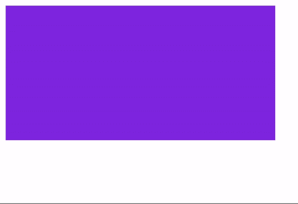
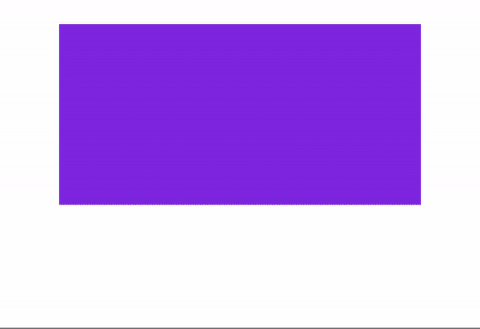
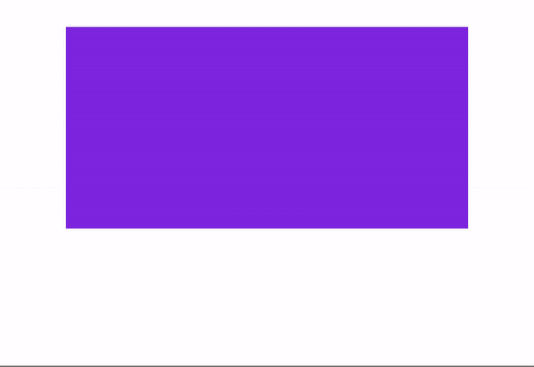

# CSS 过渡示例–如何使用悬停动画、改变不透明度等等

> 原文：<https://www.freecodecamp.org/news/css-transition-examples/>

如果您正在使用 CSS、HTML 和 JavaScript 等 web 技术，了解一些关于 CSS 动画和过渡的基本知识是很重要的。

在这篇文章中，我们将学习如何使用 CSS 制作一些基本的过渡动画。

[https://codesandbox.io/embed/background-transition-hcosp?file=/index.html:0-1294](https://codesandbox.io/embed/background-transition-hcosp?file=/index.html:0-1294)

## 如何在悬停时使用基本过渡来制作元素动画

在这个例子中，当用户将鼠标悬停在元素上时，我们将改变元素的不透明度。

```
<!DOCTYPE html>
<html lang="en">
  <head>
    <meta charset="UTF-8" />
    <meta name="viewport" content="width=device-width, initial-scale=1.0" />
    <meta http-equiv="X-UA-Compatible" content="ie=edge" />
    <title>Static Template</title>
  </head>
  <style>
    .elem {
      background: blueviolet;
      width: 300px;
      height: 150px;
    }
    .elem:hover {
      opacity: 0.5;
    }
  </style>
  <body>
    <div class="elem"></div>
  </body>
</html>
```



这是一个简单的转换，当我们将鼠标悬停在元素上时可以触发它。我们可以添加多个同时运行的转换。

让我们添加一个 scale transform 属性，为元素添加 scale transition。

```
 .elem:hover {
      transform: scale(1.1);
    }
```



但过渡似乎并不顺利，因为我们没有定义过渡的持续时间，也没有使用任何计时功能。

如果我们加上`transition`属性，会让元素移动的更流畅。

```
 .elem {
      background: blueviolet;
      width: 300px;
      height: 150px;
      margin: 20px auto;
      transition: 500ms linear; 
    }
```



让我们来分析一下过渡属性的工作原理:

```
 transition: 500ms linear;
```

*   `500ms`:以毫秒为单位的过渡持续时间
*   `linear`:计时功能

```
div {
    transition: <property> <duration> <timing-function> <delay>;
}
```

我们可以添加更多选项，如下所示(示例来自 [MDN](https://developer.mozilla.org/en-US/docs/Web/CSS/CSS_Transitions/Using_CSS_transitions) ):

```
#delay {
  transition-property: font-size;
  transition-duration: 4s;
  transition-delay: 2s;
}
```

那么这段代码在做什么呢？

*   transition-property:要制作动画的属性。它可以是任何 CSS 元素，如`background`、`height`、`translateY`、`translateX`等等。
*   过渡持续时间:过渡的持续时间
*   过渡延迟:过渡开始前的延迟

你可以在这里了解更多关于 CSS [中`transition`的不同用法。](https://developer.mozilla.org/en-US/docs/Web/CSS/CSS_Transitions/Using_CSS_transitions)

## 如何使用 animation 属性和关键帧使过渡更具交互性

我们可以做更多的 CSS 转换，使这个动画更有创造性和互动性。

### 如何移动带有关键帧的元素

让我们看一个例子，元素从 A 点移动到 b 点。我们将使用 translateX 和 translateY。

```
<!DOCTYPE html>
<html lang="en">
  <head>
    <meta charset="UTF-8" />
    <meta name="viewport" content="width=device-width, initial-scale=1.0" />
    <meta http-equiv="X-UA-Compatible" content="ie=edge" />
    <title>Static Template</title>
  </head>
  <style>
    .elem {
      background: orange;
      width: 300px;
      height: 150px;
      animation: moveToRight 2s ease-in-out;
      animation-delay: 1000ms;
    }

    @keyframes moveToRight {
      0% {
        transform: translateX(0px);
      }
      100% {
        transform: translateX(300px);
      }
    }
  </style>
  <body>
    <div class="elem"></div>
  </body>
</html>
```

这是我们得到的结果:


这一次我们使用了新的属性，比如动画和关键帧。我们使用`animation`属性来定义动画名称和持续时间，关键帧让我们描述元素应该如何移动。

```
 animation: moveToRight 2s ease-in-out;
```

在这里，我将动画命名为`moveToRight`——但是你可以使用任何你喜欢的名字。持续时间为`2s`，`ease-in-out`为计时功能。

你还可以使用其他计时功能，比如`ease-in`、`linear`、`ease-out`，这些功能基本上可以让动画更加流畅。你可以在这里了解更多关于[计时功能的信息。](https://developer.mozilla.org/en-US/docs/Web/CSS/animation-timing-function)

`@keyframes`取动画的名称。这种情况下是`moveToRight`。

```
 @keyframes moveToRight {
      0% {
        transform: translateX(0px);
      }
      100% {
        transform: translateX(300px);
      }
    }
```

`keyframes`将分多个步骤执行动画。上面的示例使用百分比来表示过渡的范围或顺序。我们也可以使用`from`和`to`方法。如下图”

```
 @keyframes moveToRight {
     from {
        transform: translateX(0px);
      }
     to {
        transform: translateX(300px);
      }
    }
```

`from`代表动画的起点或第一步。

`to`是要执行的动画的结束点或最后一步。

在某些情况下，您可能希望使用百分比。例如，假设您想要添加两个以上将按顺序执行的转换，如下所示:

```
 @keyframes moveToRight {
     0% {
        transform: translateX(0px);
      }
     50% {
        transform: translateX(150px);
      }
       100% {
        transform: translateX(300px);
      }
    }
```

我们可以更有创意，同时制作许多属性的动画，如下例所示:


您可以在这里的沙盒中体验属性和动画技术:

[https://codesandbox.io/embed/css-transition-examples-how-to-use-a-hover-animation-change-opacity-and-mor-forked-lcblf?fontsize=14&hidenavigation=1&theme=dark](https://codesandbox.io/embed/css-transition-examples-how-to-use-a-hover-animation-change-opacity-and-mor-forked-lcblf?fontsize=14&hidenavigation=1&theme=dark)

我们可以用关键帧做更多的事情。首先，让我们添加更多的过渡到我们的动画。

### 如何制作更多属性的动画并将它们包含在过渡中

这一次，我们将动画背景，我们将使元素在一个正方形的模式移动。我们将使用`infinite`属性作为计时函数，让动画永远运行。

[https://codesandbox.io/embed/background-transition-hcosp?file=/index.html](https://codesandbox.io/embed/background-transition-hcosp?file=/index.html)

```
<!DOCTYPE html>
<html lang="en">
  <head>
    <meta charset="UTF-8" />
    <meta name="viewport" content="width=device-width, initial-scale=1.0" />
    <meta http-equiv="X-UA-Compatible" content="ie=edge" />
    <title>Static Template</title>
  </head>
  <style>
    .elem {
      background: orange;
      width: 250px;
      height: 250px;
      border-radius: 10px;
      animation: moveToLeft 5s linear infinite;
      animation-delay: 1000ms;
    }

    @keyframes moveToLeft {
      0% {
        transform: translateX(0px);
        background: linear-gradient(
          to right,
          #ff8177 0%,
          #ff867a 0%,
          #ff8c7f 21%,
          #f99185 52%,
          #cf556c 78%,
          #b12a5b 100%
        );
      }
      25% {
        transform: translateX(400px);
        background: linear-gradient(120deg, #84fab0 0%, #8fd3f4 100%);
      }
      50% {
        transform: translateY(200px) translateX(400px);
        background: linear-gradient(to top, #30cfd0 0%, #330867 100%);
      }

      75% {
        transform: translateX(0px) translateY(200px);
        background: linear-gradient(120deg, #f6d365 0%, #fda085 100%);
      }
      100% {
        transform: translateY(0px);
      }
    }
  </style>
  <body>
    <div class="elem"></div>
  </body>
</html> 
```

我们来分解一下。首先我们添加`infinite`让动画永远运行。

```
animation: moveToLeft 5s linear infinite;
```

然后我们把动画分成四个步骤。在每一步，我们将运行不同的过渡，所有的动画将按顺序运行。

*   第一步:将元素水平设置为`translateX(0px)`，背景改为渐变。

```
 0% {
        transform: translateX(0px);
        background: linear-gradient(
          to right,
          #ff8177 0%,
          #ff867a 0%,
          #ff8c7f 21%,
          #f99185 52%,
          #cf556c 78%,
          #b12a5b 100%
        );
      }
```

*   第二个动画将元素从左向右移动，并更改背景颜色。

```
 25% {
        transform: translateX(400px);
        background: linear-gradient(120deg, #84fab0 0%, #8fd3f4 100%);
      }
```

*   第三个动画将使用`translateY`向下移动元素，并再次改变背景颜色。
*   在第四步中，元素将移回左侧，并更改背景颜色。
*   在第五个动画中，元素应该回到原来的位置。

## 包扎

在本文中，我们讨论了 CSS 转换可以做的各种事情。您可以在应用程序中以多种方式使用 CSS 过渡来创建更好的用户体验。

在学习了 CSS 动画的基础之后，你可能想超越它，制作需要用户交互的更复杂的东西。为此，你可以使用 JavaScript 或任何第三方动画库。

> 嗨，我叫 Said Hayani，我创建了 [subscribi.io](https://subscribi.io/) 来帮助创作者、博客作者和有影响力的人通过时事通讯增加他们的受众。