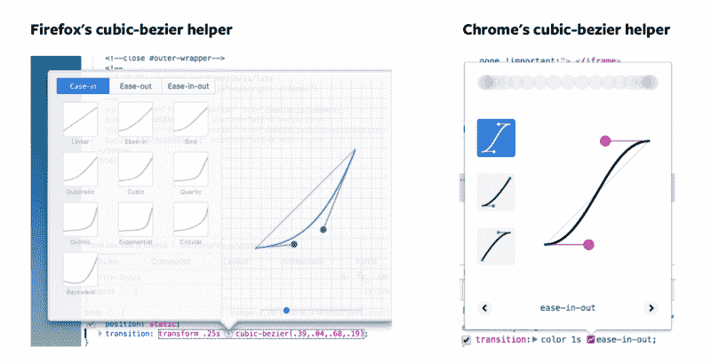

# CSS 转换解释

> 原文：<https://www.freecodecamp.org/news/css-transitions-explained-d67ab9a02049/>

最简单(也是最直接)的动画组件的方法是通过 CSS 转换。在本文中，您将了解 CSS 转场是如何工作的，以及如何用它制作动画。

当 CSS 属性在一段时间内从一个值更改为另一个值时，就会发生转换。

您可以使用`transition`属性创建 CSS 过渡:

```
.selector { 
  transition: property duration transition-timing-function delay; 
}
```

`transition`属性是四个 CSS 属性的简写，`transition-property`、`transition-duration`、`transition-timing-function`、`transition-delay`。

```
.selector { 
  transition-property: property; 
  transition-duration: duration; 
  transition-timing-function: timing-function; 
  transition-delay: delay 

  /* The transition property is the shorthand for the above four properties */ 
  transition: property duration timing-function delay; 
}
```

`transition-property`是指您希望转换的 CSS 属性。在`transition`速记中需要。

`transition-duration`指过渡的持续时间。你希望过渡期持续多长时间？该值以秒为单位，带有`s`后缀(如`3s`)。在`transition`速记中也有要求。

`transition-timing-function`指如何过渡发生。稍后您将了解到更多这方面的内容。

`transition-delay`指开始持续时间之前您希望等待的时间。该值以秒为单位，带有`s`后缀(如`3s`)。`transition-delay`在`transition`速记中是可选的。

### 触发转换

您可以使用类似于`:hover`(当鼠标经过一个元素时激活)`:focus`(当用户点击一个元素时激活，或者当用户点击一个输入元素时激活)，或者`:active`(当用户点击元素时激活)的伪类直接触发 CSS 转换。

```
/* creating transitions directly in CSS */ 
.button { 
  background-color: #33ae74; 
  transition: background-color 0.5s ease-out; 
} 

.button:hover { 
  background-color: #1ce; 
}
```

[//codepen.io/zellwk/embed/Qqzzxd/?height=265&theme-id=0&default-tab=css,result](//codepen.io/zellwk/embed/Qqzzxd/?height=265&theme-id=0&default-tab=css,result)

See the Pen [CSS Transition](https://codepen.io/zellwk/pen/Qqzzxd/) by Zell Liew ([@zellwk](https://codepen.io/zellwk)) on [CodePen](https://codepen.io).

您还可以通过添加或删除一个类来触发 CSS 转换。

```
/* CSS */
.button { 
  background-color: #33ae74; 
  transition: background-color 0.5s ease-out; 
} 

.button.is-active { color: #1ce; }

// JavaScript
const button = document.querySelector('.button') button.addEventListener('click', _ => button.classList.toggle('is-active'))
```

[//codepen.io/zellwk/embed/GMPPBg/?height=265&theme-id=0&default-tab=css,result](//codepen.io/zellwk/embed/GMPPBg/?height=265&theme-id=0&default-tab=css,result)

See the Pen [CSS Transition with JavaScript](https://codepen.io/zellwk/pen/GMPPBg/) by Zell Liew ([@zellwk](https://codepen.io/zellwk)) on [CodePen](https://codepen.io).

### 理解过渡-定时-功能

`transition-timing-function`决定了过渡如何发生。默认情况下，所有过渡都有一个值`linear`，这意味着属性均匀变化，直到过渡结束。

```
.selector { 
  transition: transform 1s linear; 

  /* OR */ 
  transition-property: transform; 
  transition-duration: 1s; 
  transition-timing-function: linear; 
}
```

问题是，生活中很少有事情是直线运动的。真实物体不是这样运动的。有时候，我们加速；有时，我们减速。`transition-timing-function`允许你捕捉所有这些。

想象你把一个网球扔进一片空地。球以最大速度离开你的手。当它移动时，它失去能量，减速并最终停下来。这叫`ease-out`。它有一个计时功能。

```
.selector { 
  transition-timing-function: ease-out; 
}
```

现在想象你在一辆车里。它现在不动了。当你移动汽车时，它会加速并达到最高速度。这叫`ease-in`。它还有一个计时功能。

```
.selector { 
  transition-timing-function: ease-in; 
}
```

既然有了`ease-in`和`ease-out`，那么还有一个将两者结合在一起的计时函数`ease-in-out`。(我建议不要在你的过渡中使用`ease-in-out`，除非你的过渡持续时间超过一秒。没有什么能在一秒钟内进出自如。它看起来很奇怪。)

```
.selector { 
  transition-timing-function: ease-in-out; 
}
```

查看这支笔，了解到目前为止您所学的计时功能的演示:

[//codepen.io/zellwk/embed/Oxrqpo/?height=265&theme-id=0&default-tab=css,result](//codepen.io/zellwk/embed/Oxrqpo/?height=265&theme-id=0&default-tab=css,result)

See the Pen [CSS Transition Timing Functions (no cubic)](https://codepen.io/zellwk/pen/Oxrqpo/) by Zell Liew ([@zellwk](https://codepen.io/zellwk)) on [CodePen](https://codepen.io).

最后，如果你不喜欢以上任何一个选择，可以用`cubic-bezier`创建自己的计时功能。

### 用三次贝塞尔曲线创建你自己的计时函数

三次贝塞尔曲线是一组四个值，它们决定了你的过渡时间函数。看起来是这样的:

```
.selector { 
  transition-timing-function: cubic-bezier(x1, y1, x2, y2); 
}
```

不用担心`x1`、`y1,`、`x2`和`y2`。你永远也不会通过自己写数字来创建三次贝塞尔曲线(除非你已经知道它们的意思，并且正在调整你的计时功能以达到完美)。

你可以依靠 Chrome 和 Firefox 的可靠开发工具来帮助你创建你的曲线。要使用它，您需要在一个元素中添加一个`transition-timing-function`，然后打开 devtools 并点击 timing 函数。



参见 [CodePen](https://codepen.io/) 上 Zell Liew ( [@zellwk](https://codepen.io/zellwk) )的笔 [CSS 过渡计时功能](https://codepen.io/zellwk/pen/gGZqNo/)。

深入探讨如何为动画创建自己的贝塞尔曲线超出了今天文章的范围。如果你感兴趣，你可以在由[斯蒂芬·格雷格](https://twitter.com/Stephen_Greig)撰写的“[理解 CSS 计时函数](https://www.smashingmagazine.com/2014/04/understanding-css-timing-functions/)”中找到更多关于三次贝塞尔曲线的信息。

### 转换两个或多个属性

您可以转换两个(或更多)CSS 属性，方法是在您的`transition`或`transition-property`属性中用逗号分隔它们。

你也可以对持续时间、计时功能和延迟做同样的事情。如果值相同，只需指定其中一个。

```
.selector { 
  transition: background-color 1s ease-out, color 1s ease-out; 

  /* OR */  
  transition-property: background, color; 
  transition-duration: 1s; 
  transition-timing-function: ease-out; 
}
```

您可能想用`all`来转换每个 CSS 属性。永远不要这样做。这对性能不好。始终指定您尝试转换的属性。

```
/* DON'T EVER DO THIS */ 
.selector { 
  transition-property: all;
} 

/* ALWAYS DO THIS */ 
.selector { 
  transition-property: background-color, color, transform; 
}
```

### 转入与转出

有时，您希望属性以不同的速度过渡入和过渡出。您希望持续时间、计时功能或延迟不同。

为此，您编写另一组`transition-`属性。

```
.button { 
  background-color: #33ae74; 
  transition: background-color 0.5s ease-out; 
} 

.button:hover { 
  background-color: #1ce; 
  transition-duration: 2s; 
}
```

当您在触发(伪)类中编写转换属性时，触发类中的转换属性会覆盖您在基类中声明的原始转换属性。

因此，在上面的例子中，当你悬停在按钮上时，背景颜色需要 2 秒钟从`#33ae74`变为`#1ce`。

当你从按钮上悬停出来时，背景色只需要 0.5s 就变回`#1ce`，因为 2s 的`transition-duration`已经不存在了。

[//codepen.io/zellwk/embed/GOLLyR/?height=265&theme-id=0&default-tab=css,result](//codepen.io/zellwk/embed/GOLLyR/?height=265&theme-id=0&default-tab=css,result)

See the Pen [CSS Transition (different transition speeds when transitioning in and out)](https://codepen.io/zellwk/pen/GOLLyR/) by Zell Liew ([@zellwk](https://codepen.io/zellwk)) on [CodePen](https://codepen.io).

### 包扎

CSS 过渡是执行动画的最简单的方法。您可以使用`transition`简写或`transition-`属性来创建过渡。

要创建一个转换，您需要覆盖一个类(或伪类)中的属性，并在`transition`或`transition-property`中指定要转换的属性。

记得改变你的`transition-timing-function`，让你的动画看起来更真实！

如果你喜欢这篇文章，你会喜欢 Learn[Learn JavaScript](https://zellwk.com/learnjs/)——这是一门帮助你学习用 JavaScript 从零开始**构建真正的组件**的课程。

(哦，对了，如果你喜欢这篇文章，如果你能[分享一下](http://twitter.com/share?text=CSS%20Transitions%20explained%20by%20%40zellwk%20?%20&url=https://zellwk.com/blog/css-transitions/&hashtags=)，我会很感激。)

*最初发表于[zellwk.com](https://zellwk.com/blog/css-transitions/)。*