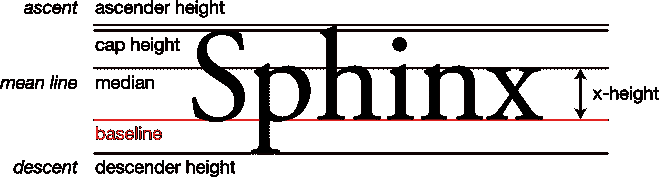
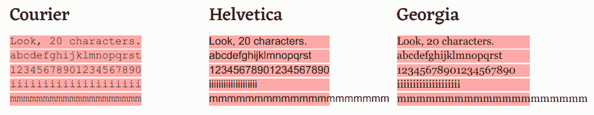

# CSS 单位指南:CSS em，rem，vh，vw，和更多，解释

> 原文：<https://www.freecodecamp.org/news/css-unit-guide/>

许多 CSS 属性像`width`、`margin`、`padding`和`font-size`都需要一个长度，CSS 有许多不同的方式来表示长度。

在 CSS 中，长度是一个没有空格的数字。比如`5px`、`0.9em`等等。

CSS 中有两种通用的长度和大小单位:绝对和相对。

## 绝对长度单位

绝对长度单位基于实际的物理单位，通常被认为是设备间的相同大小。但是，根据您的屏幕大小和质量，或者您的浏览器或操作系统的设置，可能会有一些例外。

以下是 CSS 中一些常见的绝对长度单位:

### `px`

像素是 CSS 中最常见的长度单位之一。

在 CSS 中，1 像素被正式定义为 1/96 英寸。所有其他绝对长度单位都是基于像素的这一定义。

但是当最初制定该标准时，大多数显示器的分辨率为 1024 x 768，DPI(每英寸点数)为 96。

现代设备的屏幕具有更高的分辨率和 dpi，因此 96 像素长的线可能不会精确到 1 英寸，这取决于设备。

尽管不同设备的像素大小不同，但通常认为屏幕使用像素更好。

如果您知道您的页面将在高质量的打印机上打印，那么您可以考虑使用另一个单元，如`cm`或`mm`。

在本文中，你可以阅读更多关于像素单位的历史以及为什么 CSS 英寸并不总是与物理英寸[相匹配。](https://www.smashingmagazine.com/2021/07/css-absolute-units/)

### `cm`

厘米。

在 CSS 中，`1cm`大约是 37.8 像素，或大约 25.2/64 英寸。

### `mm`

毫米。

在 CSS 中，`1mm`大约是 3.78 像素，或者 1/10 厘米。

### `in`

英寸。

在 CSS 中，`1in`大致为 96 像素，约合 2.54cm。

### `pt`

分。

在 CSS 中，`1pt`大约是 1.3333 像素，或者 1/72 英寸。

### `pc`

异食癖。

在 CSS 中，`1pc`大约是 16 个像素，或者 1/6 英寸。

## 相对长度单位

相对长度单位是相对于另一个元素的大小或设置。例如，可以使用父元素的字体大小来计算元素的相对字体大小。

以下是一些常见的相对长度单位:

### `em`

CSS `em`单元的名字来源于一个印刷单元。在印刷术中，术语 em " [最初是指字体中大写字母 M 的宽度和所用的大小](https://en.wikipedia.org/wiki/Em_(typography)) *。*

当与`font-size`属性一起使用时，`em`从其父元素继承`font-size`:

```
.container {
  font-size: 16px;
}

.container p {
  font-size: 1em;
}

.container h2 {
  font-size: 3em;
}

.container h3 {
  font-size: 2em;
} 
```

在这个例子中，`p`的`font-size`是`16px` (16 * 1)。同时，`h2`的`font-size`为`48px` (16 * 3)，`32px`为`h3` (16 * 2)。

如果`em`与另一个类似`width`的属性一起使用，`em`将使用目标元素的大小来计算。

### `rem`

根`em`。这个相对单元不受父元素的大小或设置的影响，而是基于文档的根。对于网站来说，文档的根是`html`元素。

```
p {
  font-size: 1.25rem;
} 
```

在大多数浏览器中，默认的字体大小是 16，所以`html`元素的`font-size`是`16px`。所以在这种情况下，`p`就是`20px` (16 * 1.25)。

但是如果用户改变了浏览器的默认字体大小，那么`p`的`font-size`就会相应地放大或缩小。

### `%`

百分比，或相对于父项大小的百分比大小:

```
div {
  width: 400px;
}

div p {
  width: 75%;
}
```

由于父段宽度为`400px`，内段宽度为 be `300px` (400 * .75)。

### `vw`

视图宽度。`1vw`是视口宽度的 1%。

例如:

```
body {
  width: 100vw;
} 
```

由于`body`元素被设置为`100vw`，或 100%的视口宽度，它将占据可用的全部宽度。因此，如果你将浏览器的宽度调整为 690 像素，那么`body`将占据所有 690 像素的宽度。

### `vh`

查看高度。`1vh`是视口高度的 1%。

例如:

```
div {
  height: 50vh;
} 
```

`div`将填充视口高度的 50%。所以如果浏览器窗口是 900 像素高，`div`的`height`将是 450 像素。

### `ex`

CSS `ex`单元的名字来源于印刷术中的 x-height，或者字体中字母 *x* 的高度。在许多字体中，小写的 x 字符通常是最大字符高度的一半。



[Source](https://en.wikipedia.org/wiki/X-height)

在 CSS 中，`1ex`是字体的 x 高度，或者是`1em`的一半。

但是由于小写 x 字符的大小会根据字体的不同而有很大的不同，所以很少使用 CSS `ex`单元。

### `ch`

角色单元。CSS `ch`单位定义为字体的字符 0(零，或 U+0030)的宽度。

虽然`ch`单位可作为 Courier 等等宽/固定宽度字体的精确度量，但对于 Arial 等比例字体，它可能是不可预测的。

例如，如果您的字体是 Courier，并且您将元素的宽度设置为`60ch`，那么该元素的宽度将正好是 60 个字符。

但是如果你的字体是 Arial，并且你设置了一个元素的宽度为`60ch`,就不知道这个元素会有多宽——字符可能会溢出容器，或者不足。



[Source](https://meyerweb.com/eric/thoughts/2018/06/28/what-is-the-css-ch-unit/)

查看[这篇文章](https://meyerweb.com/eric/thoughts/2018/06/28/what-is-the-css-ch-unit/)，获得对`ch`单元的深入解释，并查看一些示例。

### `vmin`和`vmax`

视口最小(`vmin`)和视口最大(`vmax`)单位基于`vw`和`vh`的值。

`1vmin`是视窗最小尺寸的 1%,`1vmax`是视窗最大尺寸的 1%。

例如，想象一个 1200 像素宽、600 像素高的浏览器窗口。在这种情况下，`1vmin`就是`6px`(是`vh`的 1%，在 600 像素时较小)。同时，`1vmax`为`12px`(为`vh`的 1%，为 1200 像素时的较大值)。