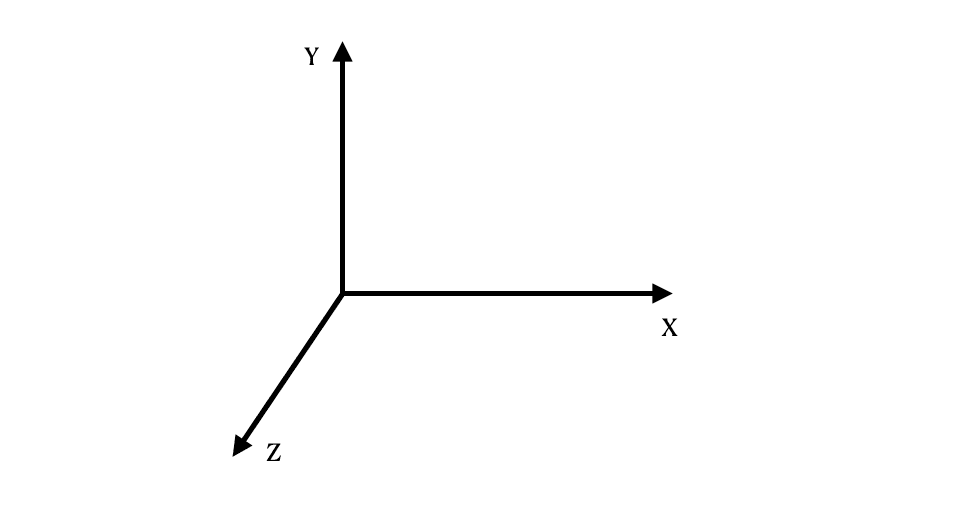
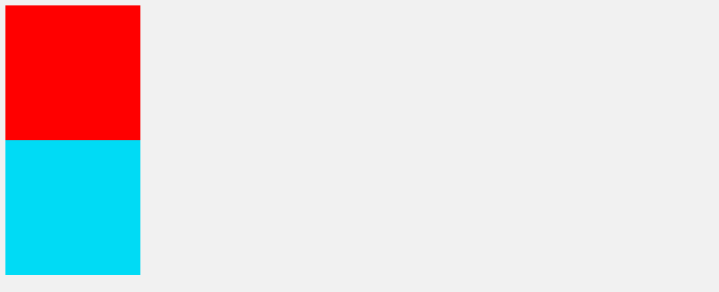
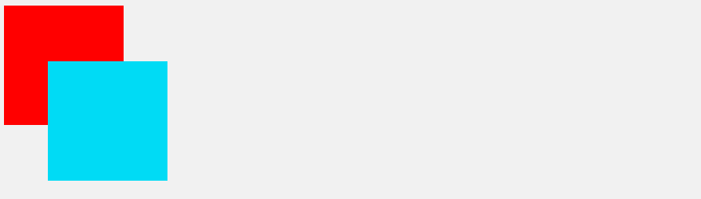
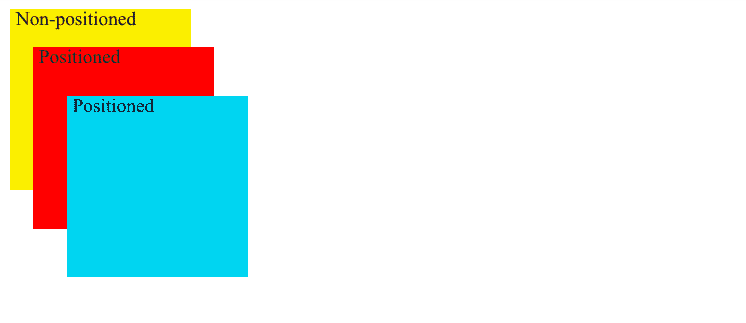
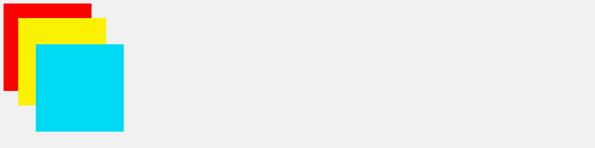

# CSS Z 索引不起作用？如何使用堆栈顺序修复它

> 原文：<https://www.freecodecamp.org/news/css-z-index-not-working/>

CSS 的`z-index`属性是一个棘手的问题。如果你不知道如何正确使用它，它自己不会很容易工作。

所以在这篇文章中，我将解释什么是`z-index`属性，什么是堆叠顺序，以及如何正确地使用它们。

我还会给出一些常见的例子来说明为什么`z-index`属性可能不起作用，并向您展示解决方案。

## 什么是 Z 索引？

首先，字符 Z 来自三维 x、y 和 Z 的表示。x 和 y 代表宽度和高度，第三维 Z 代表深度:



CSS 提供了一个名为`z-index`的属性，这样我们就可以用它来确定元素的深度。随着元素的`z-index`值的增加，它将在第三维度上被定位在其他元素的前面。

让我们继续看一些例子，看看如何正确使用`z-index`。

## 没有定义的位置或位置:静态，Z-Index 不起作用

首先要知道，网页上的每个元素都有一个默认位置，换句话说，一个静态定义的位置(默认)。假设我们的页面上有一个红色和一个蓝色的框:

```
<div class="box box-red"></div>
<div class="box box-blue"></div>
```



如果你直接把`z-index`应用到盒子上，你会发现它不起作用。这是因为他们还没有明确的定位:

```
.box {
  height: 150px;
  width: 150px;
}

.box-red {
  background: red;
  z-index: 1;
}

.box-blue {
  background: #00d5f1;
  bottom: 80px;
  left: 55px;
  z-index: 2;
}
```

这是`z-index`不能正常工作的最常见的例子之一。为了解决这个问题，我们可以将一个[位置属性](https://www.freecodecamp.org/news/how-to-use-the-position-property-in-css-to-align-elements-d8f49c403a26/)应用到 box 类，这样就可以了:

```
.box {
  height: 150px;
  width: 150px;
  position: relative;
}
```



您也可以观看我的教程视频，了解 z-index 的示例用法:

[https://www.youtube.com/embed/vo1JBj-OAa8?feature=oembed](https://www.youtube.com/embed/vo1JBj-OAa8?feature=oembed)

## 堆叠顺序是什么？

如果我们从两个框中移除`z-index`属性，即使不再有`z-index`属性，蓝框仍将位于红框的前面:

```
.box {
  height: 150px;
  width: 150px;
  position: relative;
}

.box-red {
  background: red;
}

.box-blue {
  background: #00d5f1;
  bottom: 80px;
  left: 55px;
}
```

这将呈现以下内容:


因此，当元素都在同一水平面上时，一个元素仍然会在另一个元素的前面，因为它们在 Z 轴上也有默认的顺序。这称为堆叠顺序。

就像上面的例子一样，当没有将`z-index`应用于元素时，浏览器使用默认的堆叠顺序来堆叠页面上的元素:

> 1.根元素
> 2 的背景和边框。后代[非定位](https://developer.mozilla.org/en-US/docs/Web/CSS/position#static)块，在 HTML
> 3 中出现的顺序。后代[定位的](https://developer.mozilla.org/en-US/docs/Web/CSS/position#Types_of_positioning)元素，在 HTML 中出现的顺序
> 
> 来源:[没有 z-index 属性的堆叠](https://developer.mozilla.org/en-US/docs/Web/CSS/CSS_Positioning/Understanding_z_index/Stacking_without_z-index)

注意，根元素指的是`<html>`元素，而非定位元素是那些具有缺省值`position: static`的元素，定位元素是将`position`设置为另一个值的元素。

如果我们添加另一个框，但将其`position`属性设置为默认的`static`，它将出现在蓝色和红色框的后面:

```
<div class="box box-red"><p>Positioned</p></div>
<div class="box box-blue"><p>Positioned</p></div>
<div class="box box-yellow"><p>Non-positioned</p></div> 
```

```
.box {
  height: 150px;
  width: 150px;
  position: absolute;
}

p {
  color: #0a0a23;
  margin: 0;
  padding-left: 5px;
}

.box-red {
  background: red;
  top: 40px;
  left: 27px;
}

.box-blue {
  background: #00d5f1;
  top: 80px;
  left: 55px;
}

.box-yellow {
  background: rgb(251, 239, 0);
  position: static;
} 
```

这会产生以下内容:



虽然我们确实修改了蓝色和红色框以使用`position: absolute`而不是`relative`，并稍微调整了它们的位置，这有助于显示浏览器的默认堆叠顺序——位于同一层的元素将总是出现在未定位(或`position: static`)的元素之上。

现在您可能想知道当元素不在同一层时会发生什么。现在让我们深入研究一下。

## 堆叠上下文:父元素的 Z 索引如何应用于子元素

假设我们在红色和蓝色盒子之间放一个黄色盒子:

```
<div class="box box-red">
  <div class="box box-yellow"></div>
</div>
<div class="box box-blue"></div>
```

```
.box-red {
  background: red;
  z-index: 1;
}

.box-blue {
  background: #00d5f1;
  bottom: 80px;
  left: 55px;
  z-index: 2;
}

.box-yellow {
  background: rgb(251, 239, 0);
  left: 25px;
  top: 25px;
  z-index: 3;
}
```

这将呈现以下内容:



正如您在代码中看到的，即使黄色框的`z-index`值比蓝色框高，它也位于蓝色框的后面。

这是因为黄色框是红色框的子元素，父元素的`z-index`也总是应用于其子元素。因为父元素具有较低的 z 索引，所以它的子元素也继承了相同的`z-index`值。

这是由于一个叫做**的堆栈上下文**造成的。简而言之，堆叠上下文就像之前的堆叠顺序列表的新实例:

1.  根 HTML 元素
2.  非定位元素(`position: static`)按它们出现的顺序排列
3.  按照元素出现的顺序定位元素(`position`设置为另一个值)

要记住的主要事情是，除了缺省值`auto`之外还有一个`z-index`值的定位元素将创建一个新的堆栈上下文。

所以看我们上面的 HTML，因为红盒子的`z-inxex`为 1，它为它的子盒子，黄盒子，创建了一个新的堆栈上下文。在这个堆栈上下文中，红色的框充当根 HTML 元素，黄色的框是它内部的一个定位元素。

然后，因为蓝框和红框是同一个堆栈上下文的一部分(其中`<html>`元素作为根元素)，所以它将总是出现在黄框的上方。

如果您看到这种问题，您可以通过从父元素中取出子元素或者删除父元素的 position 属性来解决，这样`z-index`就不会影响其子元素:

```
<div class="box box-red"></div>
<div class="box box-yellow"></div>
<div class="box box-blue"></div> 
```

```
.box {
  height: 150px;
  width: 150px;
  position: relative;
}

.box-red {
  background: red;
  z-index: 1;
}

.box-blue {
  background: #00d5f1;
  bottom: 240px;
  left: 55px;
  z-index: 2;
}

.box-yellow {
  background: rgb(251, 239, 0);
  bottom: 120px;
  left: 25px;
  z-index: 3;
} 
```

这给了我们:


请注意，还有许多其他属性会影响元素的堆叠上下文。你可以在这里阅读更多关于他们的信息。

因为有点不直观，这是`z-index`不起作用最常见的原因之一。

## 不要给 Z 索引分配大的数字

`z-index`可能不工作的另一个常见原因是，有时人们会给`z-index`属性分配非常高的数字:

```
.box-blue {
  z-index: 9999;
}
```

在我过去参与的几个项目中，我经常看到人们给一个元素的`z-index`赋值像 9999 这样非常大的数字。

这当然有用，但是这就像当你真的需要螺丝刀的时候用锤子一样。

想象一下——你进入一个大型项目，正在处理一些 HTML，但是无论你怎么努力，你都不能让元素以正确的顺序出现。因此，在网上进行了大量的挖掘和搜索之后，您发现有人在某个时候将一个全局`z-index`属性设置为 9999，这一直在覆盖您的`z-index`。

既然您已经知道如何正确使用`z-index`，并且理解了堆栈上下文，您就不应该像这样使用大值:)

我希望这篇文章能帮助你更好地理解如何使用`z-index`属性，以及堆叠顺序和堆叠上下文。如果你想了解更多关于网络开发的知识，别忘了订阅我的频道。

感谢您的阅读！