# csv 格式–如何打开. CSV 文件并将其导出

> 原文：<https://www.freecodecamp.org/news/csv-format-how-to-open-a-csv-file-and-export-it/>

你可能听说过 CSV 文件，但它是什么意思呢？

在本文中，我们将学习什么是 CSV 文件，以及如何使用 Microsoft Excel 和 Google Sheets 打开和导出它们。

## 什么是 CSV 文件？

CSV 代表逗号分隔值。这是一个包含用逗号分隔的数据的文件，通常用于电子表格和数据库。

这是一个 CSV 文件的例子。我们有全名和专业两个类别，数据用逗号分隔。

```
Full Name,Major
Dave Wilson,Computer Science Major
Kelly Clarks,Music Major
James Anderson,Business Major
```

有时数据的分隔不一定是逗号。它可以是空格或分号。

这种分隔符称为分隔符，但最常用的是逗号。

CSV 文件非常有用，因为只要不同的程序可以打开该文件，就可以在它们之间共享信息。

例如，我可以在 Microsoft Excel 中创建一个 CSV 文件，并将该数据导入到我的联系人中。

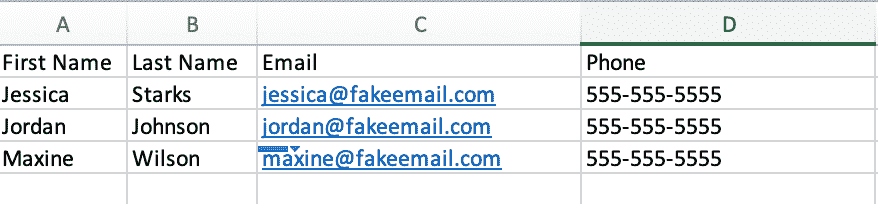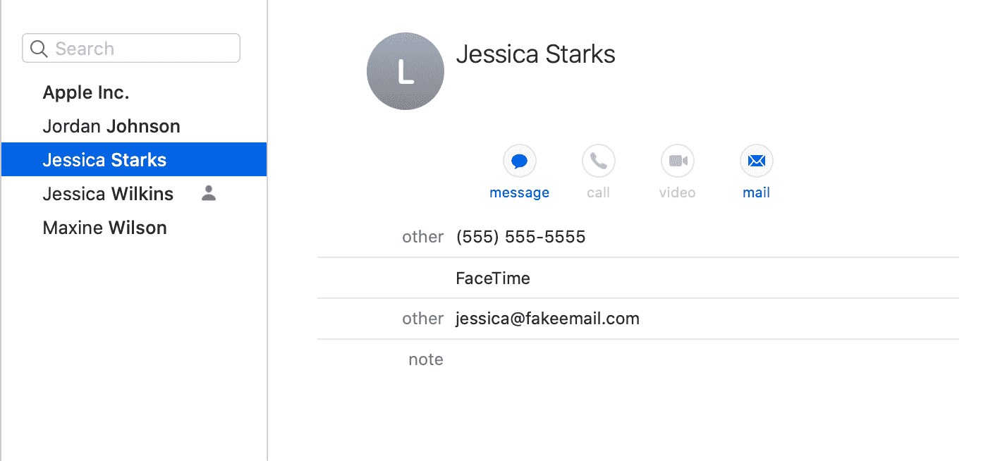

## 如何在 Microsoft Excel 中创建和导出 CSV 文件

Microsoft Excel 是一个强大的工具，它允许您以电子表格的形式组织数据。Excel 最常见的用例是创建预算、排序和存储数据，以及创建图表或图形。

以下是在 Excel 中创建和导出 CSV 文件的步骤。

1.  单击打开 Microsoft Excel，然后转到文件>新建

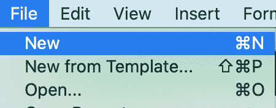

2.在电子表格中添加数据

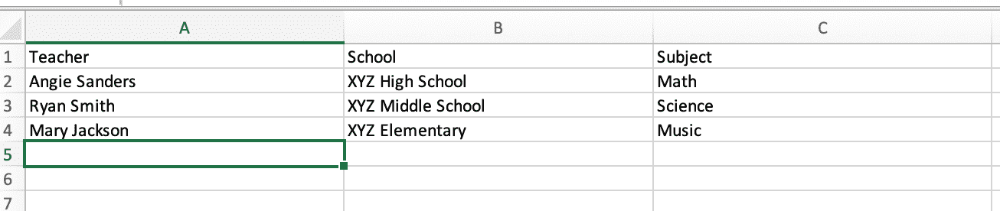

3.转到文件>保存

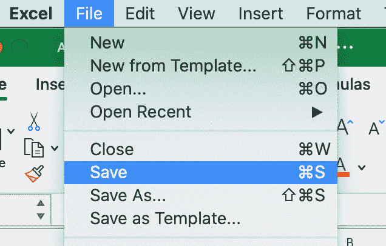

4.对于文件格式，选择`.csv`并点击保存

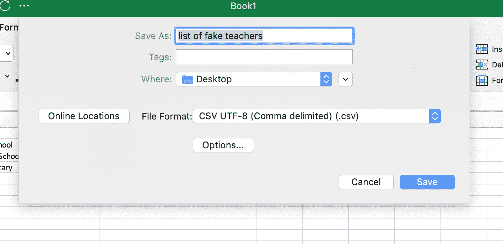

## 如何在 Microsoft Excel 中打开 CSV 文件

1.  打开 Excel，进入文件>打开...

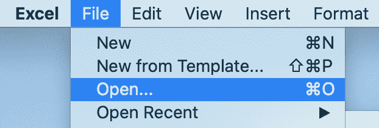

2.找到 CVS 文件并点击打开

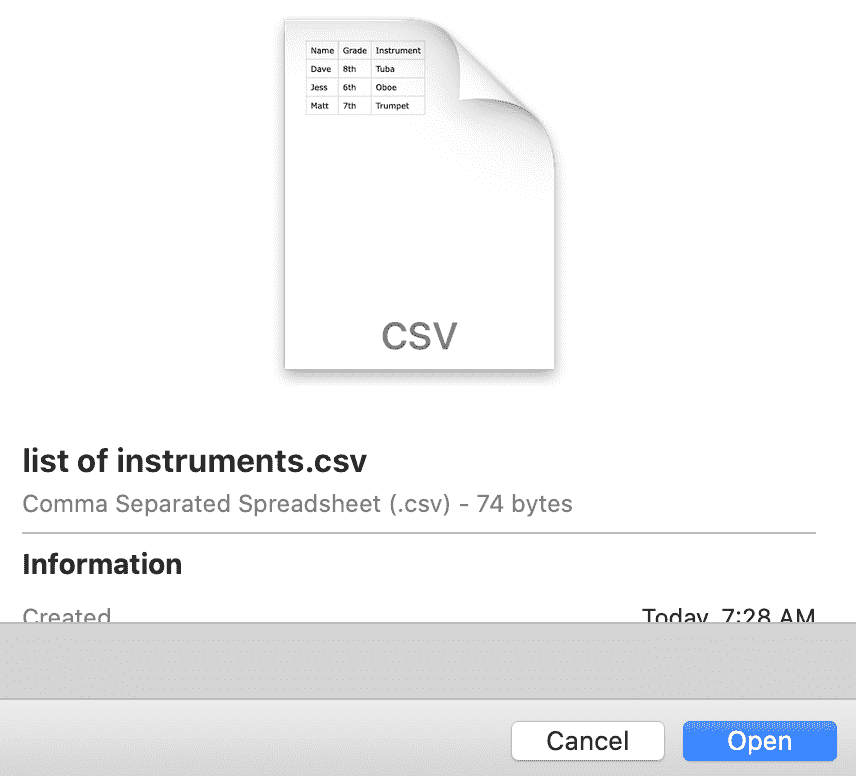

然后，您应该会看到您的数据在电子表格中打开:


## 如何在 Google Sheets 中创建和导出 CSV 文件

如果您有 Google 帐户，您可以使用 Google Sheets 创建和导出 CSV 文件。

1.  登录您的 Google 帐户

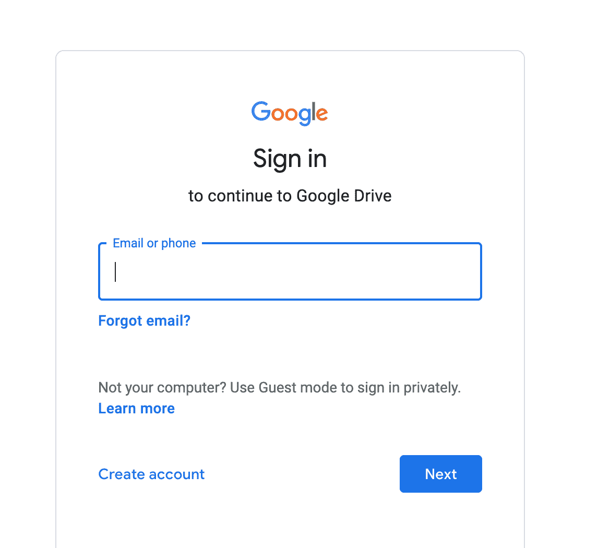

2.在 Google Apps 下，向下滚动并点击工作表

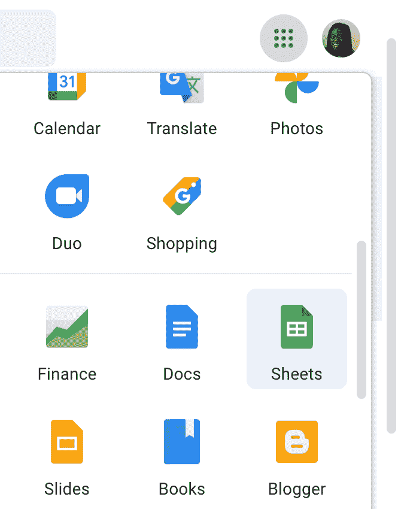

3.要创建新的 Google 工作表，请单击空白

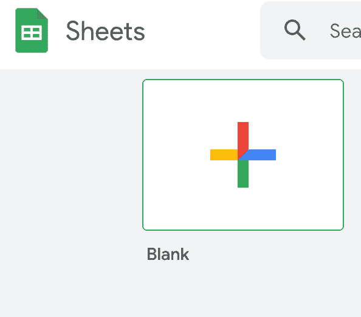

4.添加数据并命名您的电子表格

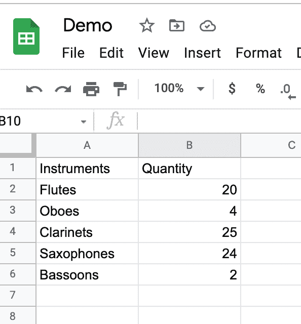

5.单击文件>下载，然后选择逗号分隔值选项

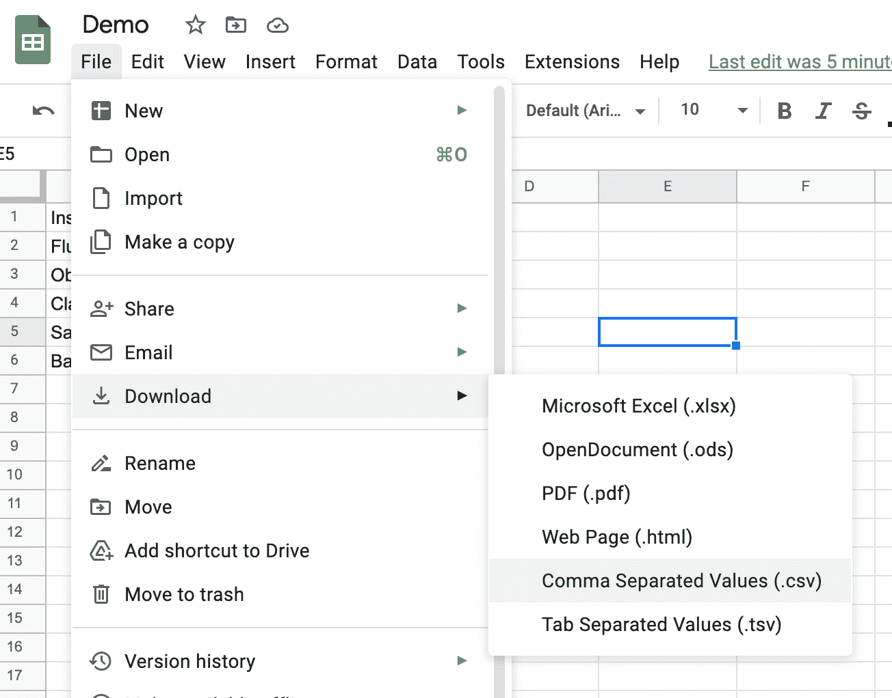

该文件应该下载到您的计算机上，您可以在任何打开 CSV 文件的程序中打开它。

## 如何在 Google Sheets 中打开 CSV 文件

1.  打开一个空白的谷歌电子表格

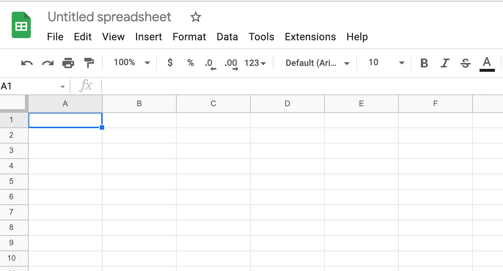

2.点击文件>导入

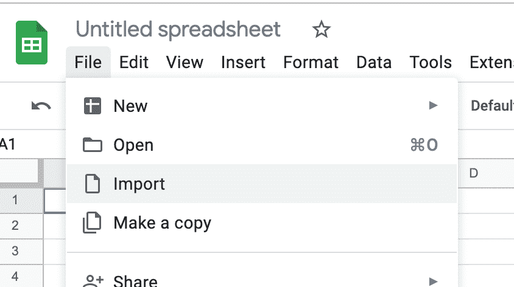

你有四种选择。

*   从 Google Drive 导入文件
*   导入与您共享的文件
*   导入最近的文件
*   从您的计算机导入文件

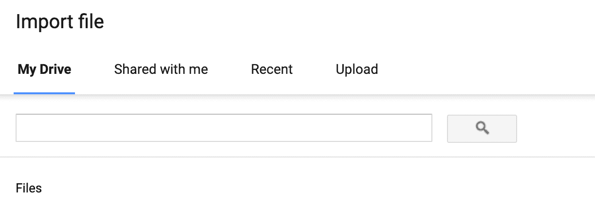

3.要从您的计算机导入文件，请单击上传

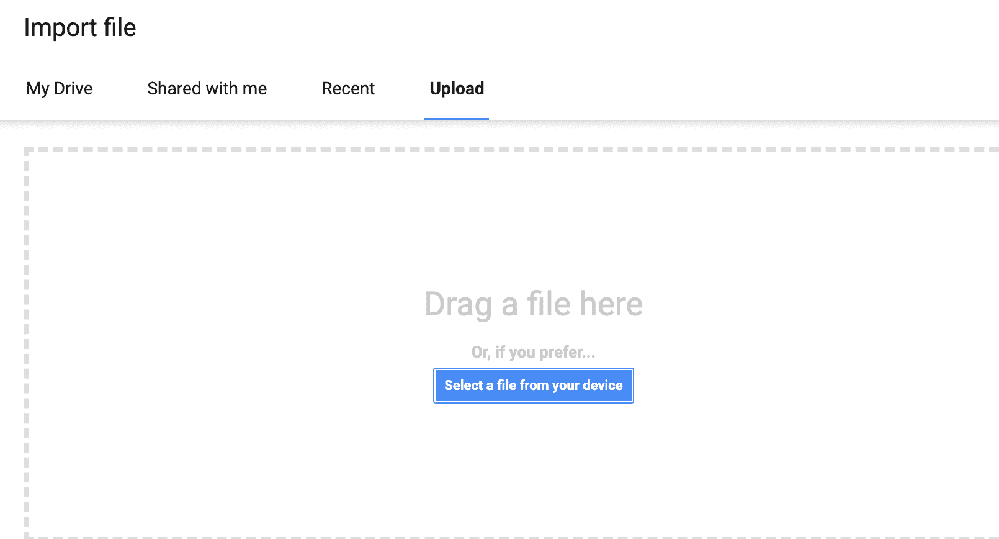

4.从您的计算机中选择一个文件。然后，您应该会看到一个弹出窗口，如下所示:

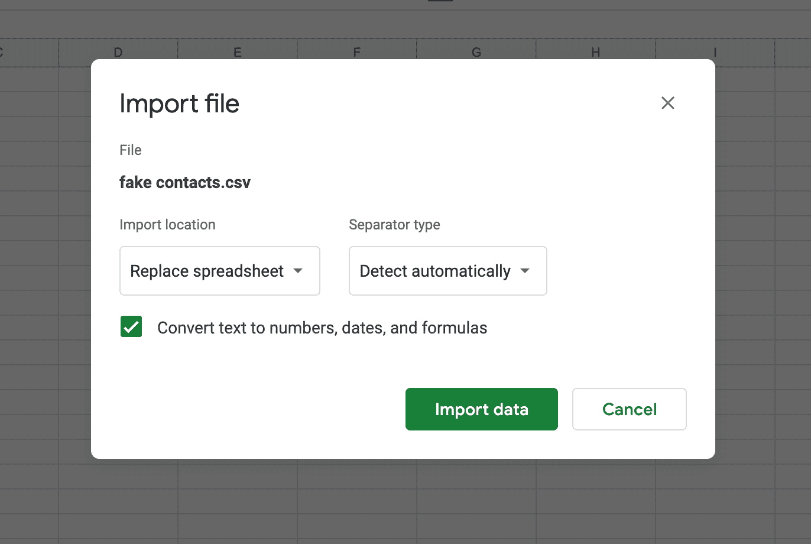

您可以选择保留默认选项或更改分隔符类型。

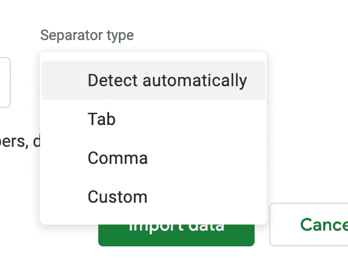

您也可以选择保留默认选项或更改导入位置。

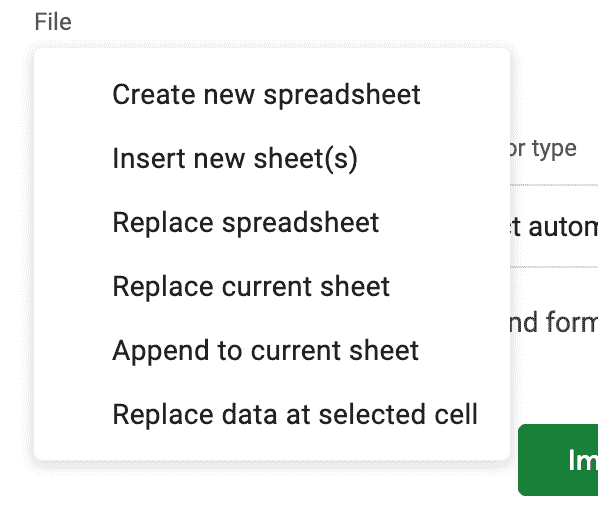

完成后，单击导入数据按钮。


现在，您应该看到导入的信息出现在您的 Google 电子表格中。


这就是如何在 Microsoft Excel 和 Google Sheets 中创建、打开和导出 CSV 文件。