# 哦，我的 Zsh

> 原文：<https://www.freecodecamp.org/news/d-oh-my-zsh-af99ca54212c/>

罗比·拉塞尔

# 哦，我的 Zsh

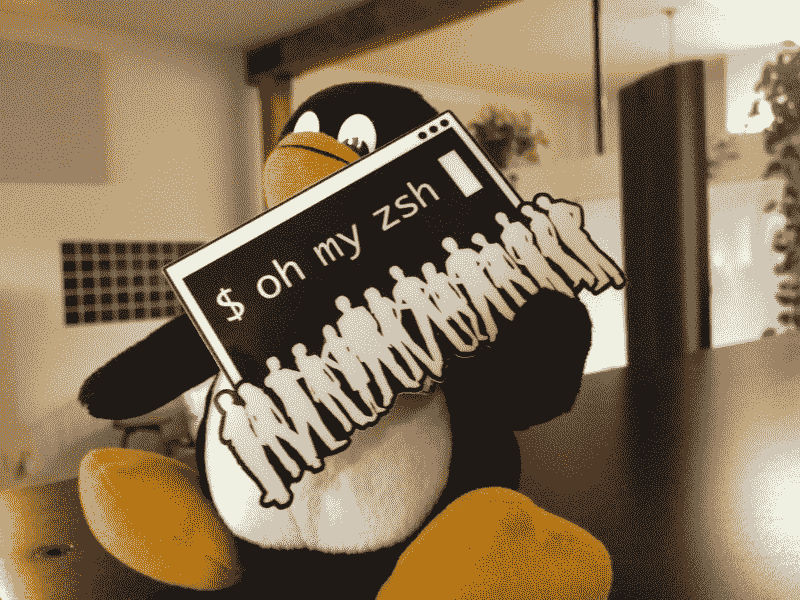

First photo when we got stickers

#### 我如何出人意料地构建了一个庞大的开源项目

这不是我第一次涉足开源软件；也不是我最后一次。

那是 2009 年的夏天。我发现自己在帮助一位同事调试他们终端中的一些东西。当我试图键入几个命令行时，我注意到提示对我的大脑已经习惯的快捷键没有反应。我沮丧地叫道，*“你什么时候才能转到 Zsh？!"*

(是的，我是那种讨厌的同事，一有机会就会不断指出 X 比 Y 好。事后看来，我不知道他们是如何忍受我的…但在你我之间，我有一个观点。)

> “你什么时候才能最终切换到 Zsh？!"

那时，我已经是 Zsh 的日常用户三年多了。

我的一些车尾朋友分享了他们的一些。我们 IRC 频道中的 zshrc 配置。几年后，我的。zshrc 文件长成了一个乱糟糟的老鼠窝。老实说，我不知道~30%的配置做了什么。不过，我足够信任我的朋友们来处理这件事。我所知道的是，我有一些 git 分支和状态细节，一些工具的颜色高亮显示(例如 grep)，SSH 连接上的自动完成文件路径，以及一些 [Rake](https://github.com/ruby/rake) 和 [Capistrano](http://capistranorb.com/) 的快捷方式。在默认 Bash 配置文件的机器上工作感觉非常过时；我变得依赖这些捷径。

Corinne is a front-end developer at Planet Argon

一些同事很乐意复制/粘贴。我共享了 zshrc 文件并开始使用它。其他几个人不会，因为他们知道我不知道它的一些功能。很公平。

在几次试图改变它们但毫无进展后，我选择了一种不同的方法。

首先，我重组了我的。zshrc 配置，这涉及到将它分解成一组更小的文件。我在这里的想法是，这将 a)帮助我更好地理解所有这些位是如何工作的，同时 b)帮助我的同龄人在阅读代码时受到教育。

抢先提出他们的下一个问题，*“我如何让它在我的机器上工作？”，*我起草了第一个[设置指令](https://github.com/robbyrussell/oh-my-zsh/blob/5da20b9dddb1f7a9110675ded5df59c4c3ed1b83/README.textile)。

最重要的是，我将所有这些文件打包到一个崭新的 git 存储库中。我想，如果我把它放到 Github 上，我的同事们就能和我一起改进它。

虽然这不是一个巨大的飞跃，但这比邀请人们从 [Pastie](http://pastie.org/) 复制/粘贴文本文件更进了一步。

2009 年 8 月 28 日，[我的 Zsh 出生了](https://github.com/robbyrussell/oh-my-zsh/tree/5da20b9dddb1f7a9110675ded5df59c4c3ed1b83)。

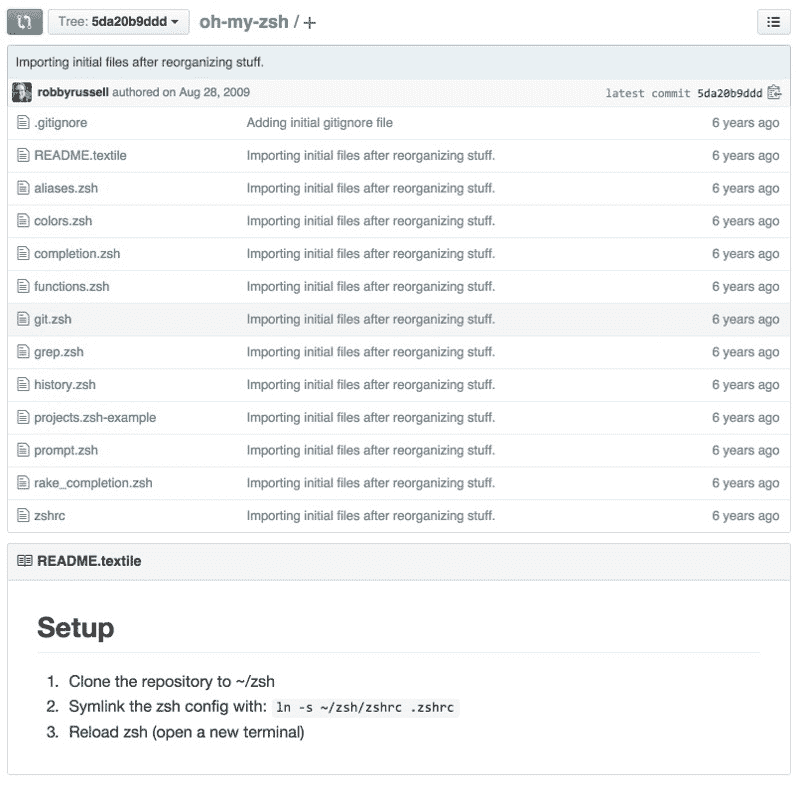

One of the first public versions of Oh My Zsh. ([view on github](https://github.com/robbyrussell/oh-my-zsh/tree/5da20b9dddb1f7a9110675ded5df59c4c3ed1b83))

#### …但是，等一下！！主题在哪里？插件在哪里？安装脚本？Logo？

这可能会让大多数 Oh My Zsh 用户感到惊讶，但这些都不是我考虑过的特性。我的项目目标是*而不是*构建一个维护 Zsh 配置的框架，而是与我的同事分享我自己的配置，这样他们就可以使用 Zsh。

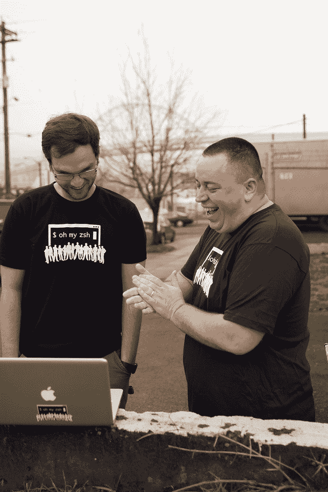

Patrick (left) and Travis (right)

在与我所有的同事分享它的一天之内，[Argon](http://www.planetargon.com/)星球的每个人都从 Bash 迁移到 Zsh。

***胜利！…至少我是这么认为的。***

第二天，第一个功能请求就来了。

> "如何定制我的提示？"

两个同事问我他们如何定制他们的提示。他们想改变显示的颜色和信息。

*什么鬼！？我的提示对他们来说还不够有吸引力吗？*如此吹毛求疵。；-)

我指着 prompt.zsh 文件说他们可以修改它。

很快，这就成了一个问题，因为他们现在有了自己版本的文件。因此，如果我们都想分享一些快捷方式和功能，这会增加一些复杂性，因为我们会有冲突要处理。

嗯…

因此，在我的博客上首次宣布 Oh My Zsh 的第二天，我开始介绍主题的最初概念。

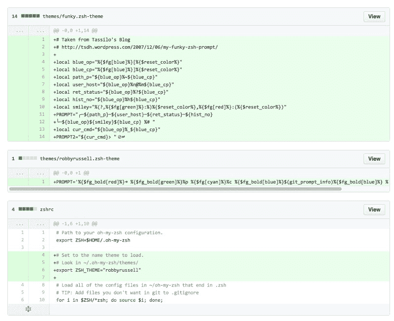

Introducing the ‘famous’ robbyrussell theme to the world.

与此同时，我收到了 Geoff Garside 的第一个外部拉式请求，为 TextMate 添加了几个别名。(注意它是如何直接进入一个包罗万象的 aliases.zsh 文件的)

一天后，[另一个主题](https://github.com/robbyrussell/oh-my-zsh/commit/f704193fd2732207c158aa3413e2ef9634e7b17f)发了过来。Groovy，我[最好在 README](https://github.com/robbyrussell/oh-my-zsh/commit/ebc6ce25aa2aa2c8957724b916711ceee3bb15ce) 上加一个链接，看看维基上的一些[截图。](https://github.com/robbyrussell/oh-my-zsh/wiki/themes)

一个月之内，我们就有十几个主题贡献给了这个项目。

这开始成为 Oh My Zsh 的一个非常受欢迎的方面，一旦我们超过 100，我们就不得不开始刹车接受主题。(我们目前约有 140 名员工，*很少*接受新员工)

### 使用安装程序简化设置

我想到最初的设置需要人们运行一些命令。比起让人们重新输入和/或复制/粘贴一些命令，我觉得这样对双方都更有效率(因为这样可以减少我的同事遇到问题和/或跳过某个步骤时的疑问)。

一个安装工诞生了。

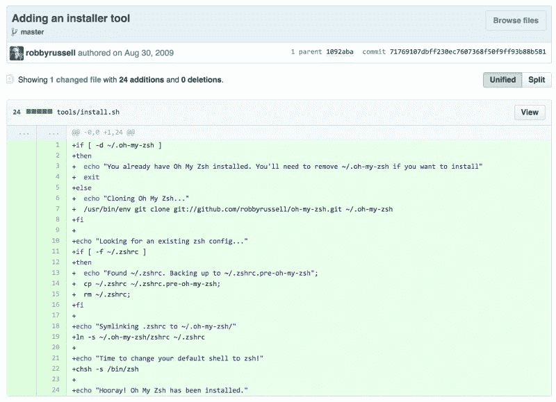

The initial installer script ([view on github](https://github.com/robbyrussell/oh-my-zsh/commit/71769107dbff230ec7607368f50f9ff93b88b581))

我最初的想法是通过自动化安装程序来节省一些步骤。如果每个人都运行相同的命令，那么我们可以减少人为错误(跳过一个命令，打字错误等)。).我还希望注意，人们可能会从 Bash 或现有的拼凑起来的 Zsh 配置进行切换。为了帮助他们切换回以前的 shell，我们备份了他们的原始配置文件。最后，我们将他们的默认 shell 切换到 Zsh。

> “万岁！哦我的 Zsh 已经安装好了。”

哦，对了。人们如何能够跟上项目的新变化？

第二天，我添加了一个升级脚本，它会漫游到 Oh My Zsh 目录，从 git 存储库中获取更新，然后返回到之前的工作目录。

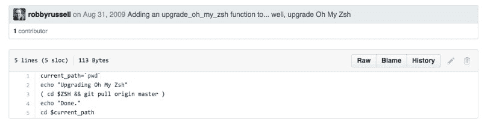

The initial upgrade script ([view on github](https://github.com/robbyrussell/oh-my-zsh/blob/1ec8a8848e5fa8f733af92f2c09387719e57e0d5/tools/upgrade.sh))

远离火箭科学。

大约三个星期后，很明显我的同事没有手动跟上项目的所有新更新。我没有时不时地提醒他们这样做，而是添加了定期提示用户检查更新的功能。

到目前为止，这似乎是项目中最复杂的代码。我希望我能记得是谁给了我在这里使用纪元值的好主意。

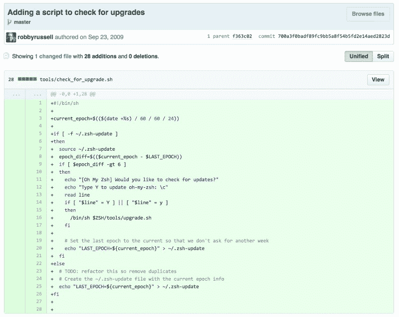

The initial auto-updater ([view on github](https://github.com/robbyrussell/oh-my-zsh/commit/700a3f0badf89fc9bb5a8f54b5fd2e14aed2823d))

在我看来，这也是这个项目的转折点。

虽然只有少数人在使用它，但这一功能可以让几乎每个用户了解最新的项目变化，更重要的是，保持参与。当他们运行更新程序时，他们会看到一个文件列表发生了变化，这将微妙地向他们介绍新的功能… a la，*“我想知道这个主题是什么样子的。”*

可悲的是，并不是每个人都是粉丝。

尽管这些年来有一些直言不讳的反对者，我还是坚持我的决定，将它作为默认设置。

早在 2012 年，我们就做出了改变，将自动更新提示的频率降低了 50%。

自动更新允许我们发布新功能、性能改进和错误修复，而不需要依赖每个人手动完成。我相信这个特性有助于保持社区的参与度。

#### 这个松饼需要糖果

虽然这个项目吸引了很多主题，但我真的觉得这个项目可以从品牌化中获益。

**我的解决方案？Ascii 艺术作品**

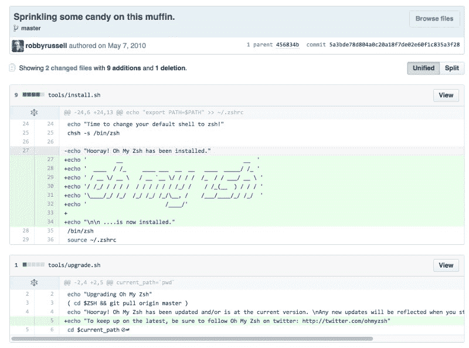

I have no idea what prompted the git commit message.

我在这里的想法是…当然，当你开始使用 Oh My Zsh 时，你会得到一堆有用的快捷方式和主题，但我真的觉得安装程序运行后的第一印象是一个取悦新用户的机会。

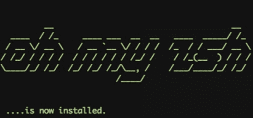

糖果撒在松饼上……可以这么说。(我不记得当时为什么要写提交消息。我不记得参考文献了。)

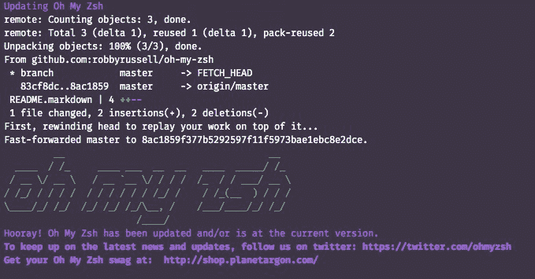

What the update script currently displays.

人们要求我用 ascii 艺术印刷衬衫已经有一段时间了。(我们可能会在今年夏天这样做— [在 twitter 上关注我们](https://twitter.com/ohmyzsh))

Becca Ward designed the logo

#### 插件

在开源项目十个月之后，用户开始要求不加载所有内容的能力。例如，Python 开发人员可能不需要像 Ruby 开发人员那样加载 Rake 和 Capistrano 相关的别名。

所以，我们[实现了一个基本的插件系统](https://github.com/robbyrussell/oh-my-zsh/commit/3cf9ab722e7c0829727f548c7d05a0d96055f707)，它允许人们通过改变. zshrc 中的值来决定在初始化时加载哪个。

当这个特性发布时，捆绑了五个插件。

几个月后，我开始收到新插件想法的请求。

一年之内，[我已经接受了超过 40 个插件](https://github.com/robbyrussell/oh-my-zsh/tree/9b63a03bcfb7a6c34281d7d905575c5647e9c8d2/plugins)。

两年内？[70 多个插件](https://github.com/robbyrussell/oh-my-zsh/tree/8b69c7f6a0c80c1c53505e17d356387b83e18efc/plugins)。

目前，我们有 adb、ant、apache2-macports、archlinux、autoenv、autojump、autopep8、aws、battery、bbedit、bgnotify、boot2docker、bower、branch、brew、brew-cask、bundler、bwana、cabal、cake、cakephp3、capistrano、cask、catimg、celery、chruby、chucknorris、cloudapp、codeclimate、coffee、colemak、coloured-man-pages、colorize、command-not-found、common-aliases、compleat、composer glassfish、gnu-utils、go、golang、gpg-agent、gradle、grails、grunt、gulp、heroku、history、history-substring-search、httpie、iwhois、jake-node、jhbuild、jira、jruby、jsontools、jump、kate、kitchen、knife、knife_ssh、laravel、laravel4、laravel5、last-working-dir、lein、lighthouse、lol、macports、man、marked2、mercurial、meteor、mix、mix-fast、mosh scd、screen、scw、sfffe、singlechar、spring、sprunge、ssh-agent、stack、sublime、sudo、supervisor、suse、svn、svn-fast-info、symfony、symfony2、systemadmin、systemd、taskwarrior、terminalapp、terminitor、terraform、textastic、textmate、thefuck、themes、thor、tmux、tmux-cssh、tmuxinator、torrent、tug、ubuntu、urltools、vagger、vault、vi-mode、vim-interaction

总共… [214 个插件](https://github.com/robbyrussell/oh-my-zsh/tree/master/plugins)。诚然，并不是每个人都对此印象深刻。

我确实同意这可以大大改进。

我考虑了几次，发现提议的方法对于不熟悉和/或不习惯终端的人来说太复杂了。也许对于框架的第 2 版来说，这是一个更复杂的方法。(稍后将详细介绍)

我也有一部分感觉这个项目只会让人们感兴趣几年。随着用户获得更多的经验和/或技术的发展，这个框架将会被解决问题比我们好得多的闪亮的新项目所抛弃。

我从来没有想过，哦，我的 Zsh 将仍然在近七年后建立势头。

现在是 2016 年 3 月 22 日，Github 上的[热门 shell 库是](https://github.com/trending/bash)？(觉得有趣的是，网址上写着“bash”…咳咳)

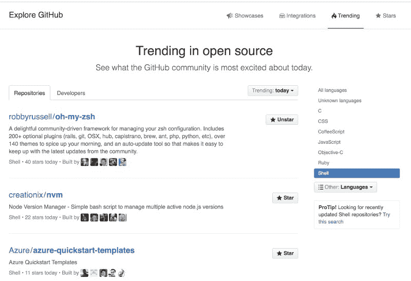

*“the (40 new) stars look very different today…”*

这些新用户都是从哪里来的？我❤你们这些人！

虽然我有很多故事要分享(并打算在这个主题上写更多)，但我想和那些一直在争论开源项目想法的人谈谈。

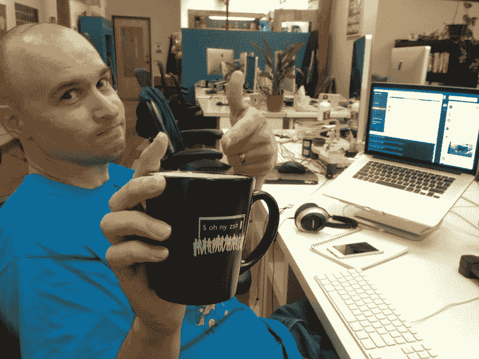

Brian Middleton

#### 您的开源项目的八个考虑事项

不要从雄心勃勃的目标开始。从一个简单可行的目标开始你的项目。成功是什么样子的？在我的场景中，我希望团队中有 1-2 个人使用我的脚本。这个项目在不到 24 小时内就成功了。

从那以后的一切都是加分的。

不要试图解释每一种情况。如果我被这个项目的一些长期细节所困扰，哦，我的 Zsh 就不会发生了。几乎所有添加到项目中的东西都是在初始发布之后有机地产生的。

开源项目的一个好处是你的用户群可以帮助塑造它。

不要试图让它变得完美。担心别人会对你的代码有什么反应不应该是你最关心的事情。有用吗？当他们与它互动时，他们的感受应该是一个更高的问题。在我的例子中，这些年来我有一些伟大的贡献者，他们帮助整理和提高了我最初发布的代码的质量。

很少有人对我的旧代码提出批评——也许他们应该这么做。；-)

不要试图成为每个人的一切。在这个项目的历史上，我们遇到过几次十字路口。特别是，有一次提出了一个巨大的重建计划，我对此非常兴奋，直到我能够理解其中的一些变化。

[**简化 OH-MY-ZSH 问题的建议# 377 robbyrussell/OH-MY-ZSH**](https://github.com/robbyrussell/oh-my-zsh/issues/377#issuecomment-4204013)
[*OH-MY-zsh——一个令人愉快的社区驱动的框架，用于管理您的 zsh 配置。包括 200 多个可选插件…*github.com](https://github.com/robbyrussell/oh-my-zsh/issues/377#issuecomment-4204013)

结果，一个分叉被重新命名，我们同意走不同的路。并不是每个人都对我的决定感到满意，但是在这段时间里，我清楚地意识到，我想把我的注意力放在那些对终端和/或 git 不太适应的人身上。

不要停止感谢贡献者。如果有人帮助你的项目，请让他们知道你有多感谢他们的努力。我对我的贡献者感激不尽。关于这个项目，我最大的自我批评之一是我没有始终如一地表达我的欣赏。

在撰写本文时，有来自世界各地的 910 人的代码被 Oh My Zsh 的 master 分支接受。

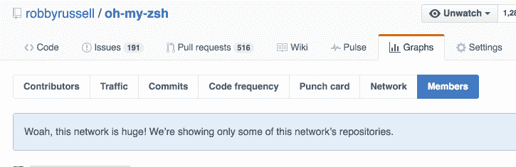

It’s such a long list that Github can’t even list them all.

特别感谢**你**。(你知道你是谁)

不要忘记文档。多年来，插件和功能的文档对于帮助用户了解如何利用该框架至关重要。

我希望我们几年前就通过了这项公约。

自述文件是最常被看到的……所以要让它有价值。就我而言，我选择向人们介绍我的个性和枯燥的幽默感。

老实说，看到这样的推文对我来说意味着一切。

不要忘记你的余生。同样，我从未预料到这个项目会变成今天这个样子。

你熟悉关于[一锅沸水中的青蛙](https://en.wikipedia.org/wiki/Boiling_frog)的轶事吗？

我花了 3-4 年的时间，太长了，才最终引入另一个人来帮助维护这个项目。我一直认为我可以赶上所有开放的拉取请求和问题。我一直告诉自己的是，知道如何分叉项目的人可以做出他们想要的改变，并以此为基础开展工作，因此审查和批准拉式请求是一件好事，而不是必须要做的事。

实际上，它介于两者之间。我确实对老的拉请求挥之不去感到有点不好，但是我也不把 Oh My Zsh 作为我的盘子里的几个顶级项目之一。

除了 Oh My Zsh，我还经营着一家 19 人的经纪公司，在一个后摇滚乐队里弹吉他，在当地一个非盈利的无家可归者收容所担任董事，经常带着我的相机旅行，骑我的摩托车，骑我的自行车，试着和我的朋友保持社交生活。哦，我的 Zsh 适合所有这些的某个地方。

这不是我的首要任务。它不在底部。介于两者之间。这并不是你不能跟上社区的借口，而是提醒你，如果你要开始自己的项目，那些其他的事情也应该对你很重要。

#### (我将在另一篇文章中写更多关于与维护者一起领导开源项目的话题……❤[你明白我的意思吗？](https://medium.com/@robbyrussell) ❤

别忘了找点乐子。当你开始你的项目时，决定这是严肃的工作时间还是娱乐时间。也许它可以在中间的某个地方。

哦，我的 Zsh 对我来说一直是一个游戏时间的活动项目。

知道我的一个有趣的项目已经并继续被人们所喜爱是一种非常美妙的感觉。

有些人可能会称之为一个*激情*项目*。* **我称之为*游戏时间*。**

#### 对我有趣的开源项目感兴趣吗？

可以在 [http://ohmyz.sh](http://ohmyz.sh/) 了解更多。

Robby Russell 是工程副总裁，也是位于俄勒冈州波特兰市的一家名为 Argon 的 [Ruby on Rails 开发公司](https://www.planetargon.com/services/ruby-on-rails-development)的[星球的合伙人。](https://www.planetargon.com/)

### 如果你喜欢这篇文章，请推荐和/或分享它。❤

已经在用哦我的 Zsh 了？我很想知道你是怎么听说的。