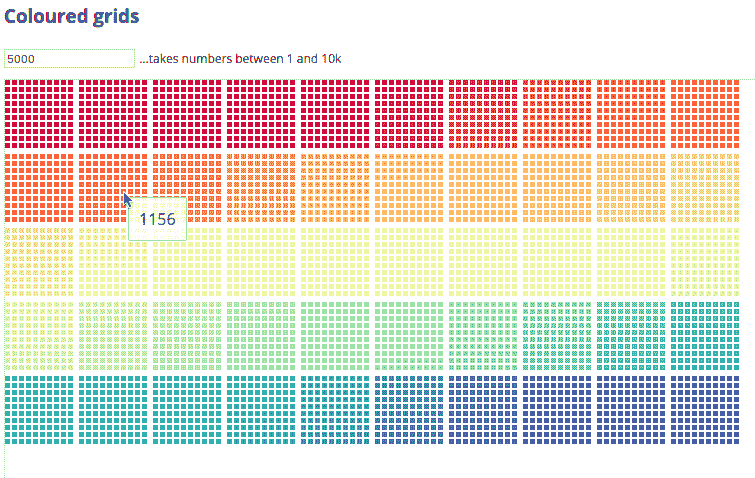
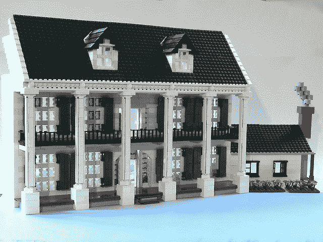
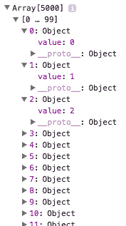
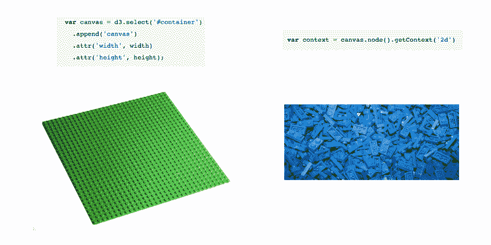
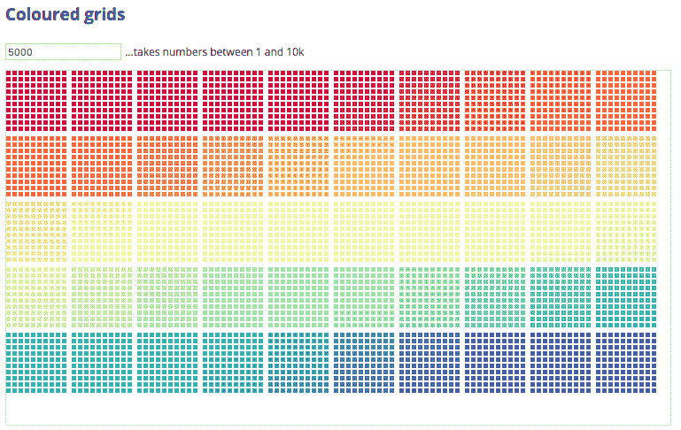
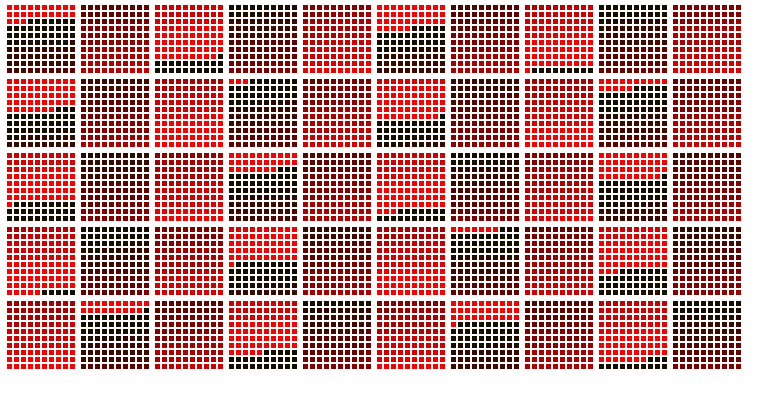
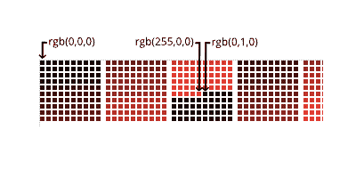
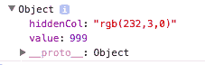
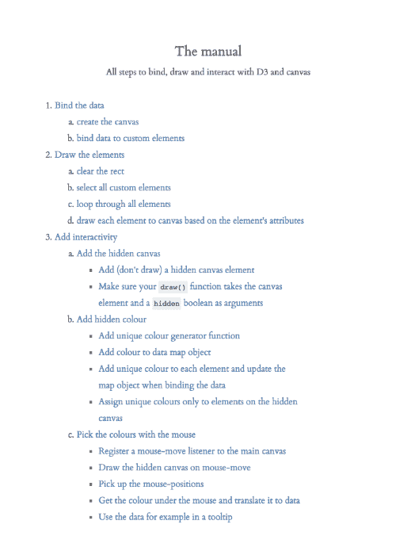
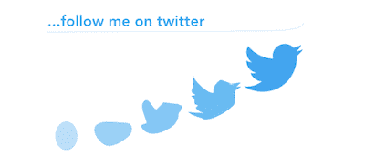

# D3 和画布分 3 步完成

> 原文：<https://www.freecodecamp.org/news/d3-and-canvas-in-3-steps-8505c8b27444/>

作者拉尔斯·弗斯波尔

# D3 和画布分 3 步完成

#### 捆绑、吸引和互动


假设您正在使用 [D3](https://d3js.org/) 和 [SVG](https://en.wikipedia.org/wiki/Scalable_Vector_Graphics) 构建一个数据可视化。当你试图同时显示几千个元素时，你可能会碰到天花板。在所有这些 [DOM 元素](https://css-tricks.com/dom/)的重压下，你的浏览器可能会开始膨胀。

好了，HTML5 Canvas 来拯救我们了！速度快多了，所以可以解决你浏览器的膨化问题。

但是你可能会很快发现自己被吓到了。因为 D3 和 Canvas 的工作方式与 D3 和 SVG 有点不同——尤其是在绘图和添加交互性方面。

但是不要害怕——这并没有那么复杂。任何用 D3 和 SVG 构建视觉效果的经验——或者用不同的渲染器处理 D3 的经验——都会给你极大的帮助。

本教程建立在已经很好地覆盖了 Canvas 的巨人的肩膀上。我记住了这三个教程，我建议你也这样做:

*   [使用 D3.js 和 Canvas:何时和如何](https://bocoup.com/weblog/d3js-and-canvas)来自 Irene Ros
*   来自 Yannick Assogba 的针、干草堆和画布 API
*   [从一个 D3.js 迷身上学到的从 Nadieh Bremer 的画布开始](http://www.visualcinnamon.com/2015/11/learnings-from-a-d3-js-addict-on-starting-with-canvas.html)

那么，为什么还要继续读下去呢？嗯，当我想学习新的东西时，从稍微不同的角度看同一个主题对我帮助很大。而这个教程*是*稍微不同的角度。

此外，本教程涵盖了三个关键步骤:**绑定数据**、**绘图元素**和**添加交互性**——它一步到位地完成所有这些，并添加了一个**分步手册**来设置您。

### 我们建造什么？



A grid of pretty colours

(许多)正方形的网格。它们的颜色没有什么深刻的含义，但是它们看起来不漂亮吗？重要的一点是，您可以更新它(包括绑定和更新数据)，它有许多元素(最多 10，000 个元素，以便 canvas 支付)，并且您可以将鼠标悬停在每个方块上以显示特定于方块的信息(交互性)。你可以在这里全屏玩或者在这里玩[所有代码](http://blockbuilder.org/larsvers/d187337850d58a444082841c739985ca)

### 心理模型

在我们真正开始之前，让我们快速后退一步，从概念上理解当我们用 D3 创建元素并将它们绘制到屏幕上时，我们做了什么。如果你只是想做东西，跳过这个。

使用 D3 的第一步通常不涉及绘画——它涉及准备所有你想画的元素。这有点像建造一些乐高积木。你可以撕开盒子，开始建造一些东西，或者你可以先看看手册，然后根据蓝图来建造。手册是你的心智模型，是你想要构建的蓝图或配方。



A mental model turned material (Mike, 2009 [https://creativecommons.org/licenses/by/2.0/](https://creativecommons.org/licenses/by/2.0/))

D3 的型号是什么？除了大量有帮助的函数和方法来计算位置，重塑数据集(布局)并生成函数来为我们绘制路径，D3 还有一个元素在屏幕上应该如何演变的模型。它有一种特定的方式来思考每个元素的生命周期。

不太巧妙的是，您将数据注入到一个尚不存在的 DOM 中，D3 根据您注入的数据创建您选择的新元素。通常每个数据点一个元素。如果你想向 DOM 中注入新的数据，你可以这样做，D3 识别出哪些元素是新创建的，哪些元素可以保留，哪些元素应该打包离开屏幕。

D3 通常与 SVG 结合使用，有时也与 HTML 元素结合使用。在这种传统的情况下，例如，当您选择通过控制台查看数据时，您可以看到 DOM 中的数据。你可以抓取它，你可以在 DOM 中上下移动它，重要的是，你可以为你想要显示的每个元素添加交互性，比如工具提示。

但是，不利的是，你不能展示很多元素。为什么？因为放入 DOM 的元素越多，浏览器就越难显示它们。让它们也四处移动，浏览器需要不断地重新计算它们。浏览器越疲惫，你的帧速率或 FPS(每秒帧数)就越低，FPS 衡量浏览器每秒可以绘制多少帧。60 的帧速率很好，只要没有帧丢失，就能实现流畅的体验——任何低于 30 的帧速率都相当于颠簸。所以当你想显示更多的元素时，你可以恢复到 canvas。

为什么是画布？Canvas 是一个 HTML5 元素，它有自己的 API 在上面绘画。canvas 元素上绘制的所有元素都不会在 DOM 中显示，这为浏览器节省了大量工作。它们以[即时模式](https://en.wikipedia.org/wiki/Immediate_mode_%28computer_graphics%29)绘制。这意味着呈现的元素不会保存在 DOM 中，但是您的指令会将它们直接绘制到特定的帧中。DOM 只知道一个 canvas 元素；上面的一切都只存在于记忆中。如果你想改变你的画布元素，你必须为下一帧重画场景。

这其中的问题当然是你无法与这些生活在记忆中的非物质元素直接交流。你必须想办法间接地和他们交谈。这就是 D3 模型以及定制或“虚拟”DOM 元素的用武之地。原则上你要做的是:

1.  将数据绑定到自定义 DOM 元素。它们不存在于 DOM 中，而只存在于内存中(在一个“虚拟”DOM 中)，并以一种已知的 D3 方式描述这些元素的生命周期。
2.  用画布画出这些元素。
3.  用一种叫做“挑选”的技术增加互动性。

让我们开始吧。

### 数据

在我们开始编码之前，让我们产生一些数据。假设您想要 5000 个数据点。因此，让我们创建一个包含 5000 个元素的数组，每个元素都是一个对象，只有一个属性值携带元素的索引。下面是你如何用`d3.range()`创建它。`[d3.range()](https://github.com/d3/d3-array/blob/master/README.md#range)`是一个 D3 实用函数，根据它的参数创建一个数组:

```
var data = [];
```

```
d3.range(5000).forEach(function(el) {
```

```
 data.push({ value: el }); 
```

```
});
```

下面是数据在控制台中的样子



惊险刺激！

### 画布容器及其工具

canvas 元素是一个 HTML 元素。它在概念上非常类似于任何 SVG-parent-element，我通常至少会将它添加到一个简单的容器 div 中，如下所示:

```
<div id=“container”></div>
```

所以，让我们用 D3 将它添加到您的容器中，如…

```
var width = 750, height = 400;
```

```
var canvas = d3.select('#container')  .append('canvas')  .attr('width', width)  .attr('height', height);
```

```
var context = canvas.node().getContext('2d');
```

您还需要添加上下文，这是画布工具箱。从现在开始，上下文变量是携带所有属性和方法的对象，是您需要在画布上绘制的画笔和颜色。如果没有上下文，画布元素将保持空白和白色。这就是你需要设置的一切——画布及其工具…



Base by Stilfehler — Own work, CC BY-SA 3.0, [https://commons.wikimedia.org/w/index.php?curid=5899171](https://commons.wikimedia.org/w/index.php?curid=5899171); blue Lego by David Lofink, 2008 [https://creativecommons.org/licenses/by/2.0/](https://creativecommons.org/licenses/by/2.0/)

### HTML

…很简单。您网站的主要 HTML 结构将是:

```
<!-- A title --><h3>Coloured grids</h3>
```

```
<!-- An input field with a default value. --> <input type="text" id="text-input" value="5000">
```

```
<!-- An explanation... --> <div id="text-explain">...takes numbers between 1 and 10k</div>
```

```
<!-- ...and a container for the canvas element. --> <div id="container"></div>
```

### Javascript 结构

在顶层，您只需要 2 个函数:

```
databind(data) {
```

```
 // Bind data to custom elements.
```

```
}
```

```
draw() {
```

```
 // Draw the elements on the canvas.
```

```
}
```

到目前为止很简单。

### 结合元素

要将数据绑定到元素，首先要为所有要生成和绘制的自定义元素创建一个基本元素。如果您非常了解 D3，可以把它看作是 SVG 元素的替代物:

```
var customBase = document.createElement('custom');
```

```
var custom = d3.select(customBase); // This is your SVG replacement and the parent of all other elements
```

然后为你的网格添加一些设置。简而言之，这些设置允许你画一个正方形网格。100 个方块构成一个“地块”，10 个地块后(或 1000 个方块后)有一个换行符。您可以针对不同的方块“包装”或不同的换行进行调整。或者只是不担心它。我建议后者…

```
// Settings for a grid with 10 cells in a row, // 100 cells in a block and 1000 cells in a row.
```

```
var groupSpacing = 4; var cellSpacing = 2; var offsetTop = height / 5; var cellSize = Math.floor((width - 11 * groupSpacing) / 100) - cellSpacing;
```

现在让我们开始数据绑定任务。让我们先把必需品拿出来，然后创建一个色标，稍后你将把它应用到你的方格中。

```
function databind(data) {
```

```
// Get a scale for the colours - not essential but nice.
```

```
colourScale = d3.scaleSequential(d3.interpolateSpectral)                      .domain(d3.extent(data, function(d) { return d; }));
```

现在让我们将您的数据加入到您上面调用的“replacement-SVG”中，并用类`.rect`添加尚不存在的定制元素

```
var join = custom.selectAll('custom.rect')  .data(data);
```

您输入自定义元素(记住没有东西进入 DOM，这些都在内存中)。

```
var enterSel = join.enter()  .append('custom')  .attr('class', 'rect')  .attr("x", function(d, i) {    var x0 = Math.floor(i / 100) % 10, x1 = Math.floor(i % 10);         return groupSpacing * x0 + (cellSpacing + cellSize) * (x1 + x0 * 10); })  .attr("y", function(d, i) {  var y0 = Math.floor(i / 1000), y1 = Math.floor(i % 100 / 10);   return groupSpacing * y0 + (cellSpacing + cellSize) * (y1 + y0 * 10); })  .attr('width', 0)  .attr('height', 0);
```

当一个元素进入你的模型时，你只需要给它一个 x 和 y 位置，宽度和高度为 0，这将在接下来的更新选择中改变…

将输入选择合并到更新选择中，并为更新和输入选择定义所有属性。这包括宽度和高度值，以及您之前构建的色标中的颜色:

```
join   .merge(enterSel)  .transition()  .attr('width', cellSize)  .attr('height', cellSize)  .attr('fillStyle', function(d) { return colourScale(d); });
```

关于这最后一行有两点需要注意。当您使用 SVG 时，这一行应该是

```
.style('color', function(d) { return colourScale(d); })
```

但是用 canvas 你用`.attr()`。为什么？在这里，您的主要兴趣是找到一种无痛苦的方式来传递一些特定于元素的信息。这里你想把一个颜色串从`databind()`传递到`draw()`函数。您只需将元素作为一个容器，将数据传输到要在画布上呈现的位置。

这是一个非常重要的区别:当使用 SVG 或 HTML 时，您可以将数据绑定到元素，并在一个步骤中绘制或应用样式到元素。在画布上你需要两步。首先绑定数据，然后绘制数据。绑定时不能设置元素的样式。它们只存在于内存中，canvas 不能通过 CSS 样式属性来设置样式，这正是使用`.style()`时可以访问的内容。

起初，这可能看起来有限制，因为您可以在一个步骤中做得更少，但是它在概念上几乎更干净，并且还给您一些自由。`.attr()`允许我们在旅途中发送任何键-值对。你可以使用其他方法，比如 HTML `.dataset`属性，但是`.attr()`也可以。

注意我们不说`color`而是说`fillStyle`。老实说，你可以在这里使用`color`或者`chooChooTrain`。您只需要在以后绘图期间获取信息时记住这一点。然而，由于 canvas 使用一个名为`fillStyle`的属性来设置元素的样式，所以在这种情况下似乎更合适。

最后，您还要定义退出选择，决定应该如何处理退出的元素。

```
var exitSel = join.exit()  .transition()  .attr('width', 0)  .attr('height', 0)  .remove();
```

就是这样！您可以关闭`databind()`功能，继续前进...

```
} // databind()
```

这不是真的可怕来自 D3，因为它几乎完全相同。现在，您已经成功地创建了数据模型，这是应用程序考虑数据的方式。每个元素将通过`.attr()`函数获得需要绘制的属性，每个元素将根据注入的数据被分配一个生命周期状态。我们的标准 D3 模型。

### 绘制元素


By Kristina Alexanderson, 2011 [https://creativecommons.org/licenses/by-nc-nd/2.0/](https://creativecommons.org/licenses/by-nc-nd/2.0/)

现在您需要编写 draw 函数来获取屏幕上的元素。让我们在这里注意到还没有发生任何事情。您还没有调用`databind()`,因为您需要先找到一种方法将它绘制到画布上。所以我们开始吧...在这种情况下,`draw()`函数不需要任何参数:

```
function draw() {
```

正如上面快速提到的，每次你重新画画的时候，你都需要清理画布。DOM 是物质的，因为当你在它上面画一个 rect 元素并改变它的 x 值时，它会在 x 方向移动，DOM 会自动处理这个移动(或重新绘制)。

如果你在某个时间点将矩形从 x = 0 移动到 x = 1(例如按下按钮后)，浏览器将在一个 tick 或 frame-paint(大约 16ms 长)内将矩形从 0 移动到 1。如果你将它从 0 移动到 10，它会在一段时间内这样做，这取决于你要求这种转变发生的持续时间，可能是每滴答 1 个像素，可能是每滴答 8 个像素。

但它会告诉 0 处的像素 rect 已经消失，告诉 1 处的像素现在有 rect。画布不会这样做。你需要告诉 canvas 画什么，如果你画了新的东西，你需要告诉它去掉之前的颜料。

所以在你画画之前，让我们从清理画布上的任何东西开始。方法如下:

```
context.clearRect(0, 0, width, height); // Clear the canvas.
```

简单。

现在你…

1.  …掌握所有要素，以便
2.  循环遍历所有元素，并
3.  利用您存储在`databind()`函数中的信息来绘制元素:

```
// Draw each individual custom element with their properties.
```

```
var elements = custom.selectAll('custom.rect');// Grab all elements you bound data to in the databind() function.
```

```
elements.each(function(d,i) { // For each virtual/custom element...
```

```
 var node = d3.select(this);   // This is each individual element in the loop.     context.fillStyle = node.attr('fillStyle');   // Here you retrieve the colour from the individual in-memory node and set the fillStyle for the canvas paint
```

```
 context.fillRect(node.attr('x'), node.attr('y'), node.attr('width'), node.attr('height'));  // Here you retrieve the position of the node and apply it to the fillRect context function which will fill and paint the square.
```

```
}); // Loop through each element.
```

就是这样！您可以关闭`draw()`功能

```
} // draw()
```

当我在一段时间后开始尝试画布时，这种简单性真的振奋了我的精神。

但是，浏览器中还没有发生任何事情。我们在`databind()`和`draw()`函数中有工具，但是还没有画出任何东西。你是怎么做到的？如果你只是想画一个静态的视觉或图像，你只需调用:

```
databind(data);
```

```
draw();
```

这将把数据绑定到自定义元素，自定义元素将驻留在内存中，然后绘制它——一次！

但是你有转变。请记住上面的内容:当您编写`databind()`函数时，您将单元格的宽度和高度从 0 转换为它们的大小，并将颜色从黑色(默认)转换为相应元素的颜色。一个默认的 D3 过渡持续 250 毫秒，所以你需要在这 250 毫秒内多次重画方块，以便得到一个平滑的过渡。你是怎么做到的？

这也很简单。您只需调用`databind(data)`来创建我们的定制元素，然后只要转换运行，就反复调用`draw()`。所以在我们的例子中，至少有 250 毫秒。你可以使用`setInterval()`来达到这个目的，但是我们真的应该使用`requestAnimationFrame()`来尽可能地提高性能(更多的[请看这个](https://css-tricks.com/using-requestanimationframe/))。有几个方法可以使用它，但是保持在 D3 的精神之内，我建议使用实现了`requestAnimationFrame()`的`d3.timer()`，并且直接使用。所以我们开始吧:

```
// === First call === //
```

```
databind(d3.range(value)); // Build the custom elements in memory.
```

```
var t = d3.timer(function(elapsed) {
```

```
 draw();
```

```
 if (elapsed > 300) t.stop();
```

```
}); // Timer running the draw function repeatedly for 300 ms.
```

`d3.timer()`重复调用回调，直到`elapsed`(从实例化开始经过的毫秒数)超过 300，然后计时器停止。在这 300 毫秒中，它在每个节拍(大约每 16 毫秒)运行`draw()`。`draw()`然后查看每个元素的属性并相应地绘制它们。

这就是画布中转场的工作方式。你可以在绑定函数之后多次调用绘图函数。无论你的 D3 模型如何设置过渡(位置、颜色、尺寸)，都会被多次重绘，每次重绘都会有小的增量变化

注意`draw()`需要紧跟在`databind()`函数之后。你不能让机器运行`databind()`，然后做一秒钟别的事情，然后调用`draw()`。因为 1 秒钟后，由你的`databind()`函数计算出的转移状态已经全部转移了。结束了，尘封了，忘记了。

就是这样！您已经将数据绑定到自定义元素，并将其绘制到画布上。

#### 让用户更新方块的数量

为了让用户有机会使用自定义数量的元素(好的，最多 10，000 个元素的半自定义元素)来重复这一壮举，您可以向文本输入框中添加以下侦听器和处理程序:

```
// === Listeners/handlers === //
```

```
d3.select('#text-input').on('keydown', function() {
```

```
if (d3.event.keyCode === 13) { // Only do something if the user hits return (keycode 13).
```

```
 if (+this.value < 1 || +this.value > 10000) {   // If the user goes lower than 1 or higher than 10k...         d3.select('#text-explain').classed('alert', true);     // ... highlight the note about the range and return.
```

```
 return;
```

```
 } else {   // If the user types in a sensible number...
```

```
 d3.select('#text-explain').classed('alert', false);     // ...remove potential alert colours from the note...
```

```
 value = +this.value; // ...set the value...
```

```
 databind(d3.range(value)); // ...and bind the data.
```

```
 var t = d3.timer(function(elapsed) {
```

```
 draw();        if (elapsed > 300) t.stop();
```

```
 }); // Timer running the draw function repeatedly for 300 ms.     } // If user hits return.
```

```
}); // Text input listener/handler
```

这又是我们彩色的画布方格，随时可以更新和重绘:


### 交互性

与 SVG 或 HTML 相比，canvas 最大的“痛苦”是 DOM 中没有物质元素。如果有的话，你可以只向元素注册侦听器，并向侦听器添加处理程序。例如，您可以在 SVG `rect`元素上触发鼠标，每当监听器触发时，您可以对 rect 做一些事情。比如在工具提示中显示用`rect`存储的数据值。

有了 canvas，你必须找到另一种方式让事件在我们的 canvas 元素上被听到。幸运的是，有许多聪明人想到了一个间接但符合逻辑的方法。

那么我们想要什么样的交互性呢？如上所述，让我们去找一个工具提示，让我们假设你想在工具提示中显示方块的索引，只要你把鼠标悬停在元素上。不太令人激动，但关键是您可以通过将鼠标悬停在元素上来访问绑定到元素的数据。

#### 采摘

这涉及到几个步骤(尽管都是合乎逻辑的)。但简而言之，你将建立两个画布来实现这一点。一个**主画布**产生我们的视觉，一个**隐藏画布**(因为我们看不到它)产生同样的视觉。这里的关键是，与第一个画布相比，第二个画布上的所有元素相对于画布原点的位置完全相同。所以正方形 1 从主画布和隐藏画布上的 0，0 开始。正方形 2 从主画布和隐藏画布上的 8，0 开始，依此类推。

只有一个重要的区别。隐藏画布上的每个元素都会有独特的颜色。我们将创建一个对象(或者更确切地说是一个[关联数组](https://en.wikipedia.org/wiki/Associative_array)或*映射*)，将每种独特的颜色链接到每个元素的数据。

为什么？因为接下来我们要在主画布上附加一个鼠标移动监听器来获取鼠标位置流。在每个鼠标位置，我们可以使用画布自己的方法在这个精确的位置“挑选”颜色。然后我们在关联数组中查找颜色，我们就有了数据！我们在飞…


By Kenny Louie, 2010 [https://creativecommons.org/licenses/by/2.0/](https://creativecommons.org/licenses/by/2.0/)

你可以说“嗯，我的方块已经有了独特的颜色，我可以用吗？”事实上，你可以使用它们。然而，一旦你决定让你的方块失去颜色，你的互动性就会荡然无存。因此，你应该确保始终有一个画布——隐藏的画布——保证有一组独特的正方形颜色。

让我们一步一步地应用这个技巧。到目前为止，您已经构建的代码可以保持原样——您只需在进行过程中添加代码。

#### 1.准备隐藏的画布

首先，让我们创建一个隐藏的画布，它将为我们的视觉提供独特的颜色。

1.1 创建隐藏的画布元素，并将其 CSS 设置为`{ display: none; }`。

```
// Rename the main canvas and add a 'mainCanvas' class to it.
```

```
var mainCanvas = d3.select('#container')  .append('canvas')  .classed('mainCanvas', true)  .attr('width', width) .attr('height', height); // new ----------------------------------- 
```

```
// Add the hidden canvas and give it the 'hiddenCanvas' class.
```

```
var hiddenCanvas = d3.select('#container')  .append('canvas')  .classed('hiddenCanvas', true)   .attr('width', width)   .attr('height', height);
```

事实上，在这个例子中，我不会将画布设置为 hidden 来显示正在发生的事情。但是要做到这一点，只需将`.hiddenCanvas { display: none; }`添加到您的 CSS 中，契约就完成了。

1.2 在`draw()`函数中构建上下文变量，并向该函数传递两个参数:画布以及一个名为“hidden”的布尔值，它决定我们构建哪个画布(hidden = true || false)，如下所示:

```
function draw(canvas, hidden) {
```

1.3 现在你需要修改所有的绘图函数来包含两个新的`draw()`参数。所以从现在开始，你不要只叫`draw()`，你要叫`draw(mainCanvas, false)`或者`draw(hiddenCanvas, true)`

#### 2.应用独特的颜色隐藏的元素，并映射它们

亲爱的读者，我们行动的关键部分来了，我们卡车的引擎，我们汤里的调味品。


By Andrew Becraft, 2007 [https://creativecommons.org/licenses/by-nc-sa/2.0/](https://creativecommons.org/licenses/by-nc-sa/2.0/)

2.1 包含一个函数，在每次被调用时生成一个新的唯一颜色(通过[堆栈溢出](http://stackoverflow.com/a/15804183)

```
// Function to create new colours for the picking.
```

```
var nextCol = 1;
```

```
function genColor(){     var ret = [];
```

```
 if(nextCol < 16777215){         ret.push(nextCol & 0xff); // R     ret.push((nextCol & 0xff00) >> 8); // G     ret.push((nextCol & 0xff0000) >;> 16); // B
```

```
 nextCol += 1;     }
```

```
var col = "rgb(" + ret.join(',') + ")";
```

```
return col;
```

```
}
```

`genColour()`产生 rgb(0，0，0)格式的颜色定义字符串。每调用一次，R 值就加 1。一旦达到 255，它就将 G 值增加 1，并将 R 值重置为 0。一旦达到 r(255，255，0)，它会将 B 值增加 1，将 R 和 G 重置为 0，依此类推。

因此，总共有 256*256*256 = 16.777.216 个元素来保持独特的颜色。然而，我可以向你保证你的浏览器会提前死亡。即使是用 canvas (webGL 教程跟随)。

2.2 创建映射对象，该对象将跟踪哪个自定义元素具有哪个唯一的颜色:

```
var colourToNode = {}; // Map to track the colour of nodes.
```

您可以在脚本中的任何地方添加`genColour()`函数，只要它在`databind()`和`draw()`函数范围之外。但是请注意，您的 map 变量需要在`databind()`函数的范围之前和之外创建。

2.3 为每个自定义元素添加独特的颜色，例如`.attr('fillStyleHidden')`和
2.4 在元素创建期间构建地图对象

在这里，您将在我们的`databind()`函数中使用您的【色彩佳能】`genColour()`来为我们的元素分配`fillStyle`。当数据点绑定到每个元素时，您也可以访问每个数据点，因此您可以在`colourToNode`地图中将颜色和数据结合在一起。

```
join   .merge(enterSel)   .transition()   .attr('width', cellSize)   .attr('height', cellSize)   .attr('fillStyle', function(d) {     return colorScale(d.value);   });
```

```
 // new -----------------------------------------------------         .attr('fillStyleHidden', function(d) { 
```

```
 if (!d.hiddenCol) {
```

```
 d.hiddenCol = genColor();       colourToNode[d.hiddenCol] = d;
```

```
 }
```

```
 // Here you (1) add a unique colour as property to each element     // and(2) map the colour to the node in the colourToNode-map.
```

```
 return d.hiddenCol;
```

```
});
```

2.5 现在你可以根据`draw()`函数正在渲染的画布给元素上色。你在`draw()`函数中的`fillStyle`上添加一个条件，将我们视觉的颜色应用到主画布上，将独特的颜色应用到隐藏的画布上。这是一个简单的一行程序:

```
context.fillStyle = hidden ? node.attr('fillStyleHidden') : node.attr('fillStyle');
```

```
// The node colour depends on the canvas you draw.
```

当然，主画布看起来还是一样的:



最后，让我们添加一些交互性，每当我们将鼠标移动到主画布上时，从绘制隐藏的画布开始。

#### 3.用鼠标选择颜色

3.1 首先，简单地在主画布上注册一个监听器，监听鼠标移动事件。

```
d3.select('.mainCanvas').on('mousemove', function() {
```

```
});
```

为什么鼠标移动？由于您不能用单个方块注册侦听器，而是必须使用整个画布，因此您将无法使用 mouseover 或-out 事件，因为它们只会在进入画布而不是元素时触发。为了获得鼠标在画布上的位置，你可以做 mousemove 或 click/mousedown。

```
d3.select('.mainCanvas').on('mousemove', function() {
```

```
 draw(hiddenCanvas, true); // Draw the hidden canvas.
```

```
});
```

这样，当鼠标悬停在主画布上时，用户触发的第一件事就是不知不觉地创建隐藏的画布。如前所述，在生产过程中，该画布是隐藏的，但出于教学目的，我们希望看到它，并且当鼠标移动到主画布上时，触发隐藏的画布被绘制出来，如下所示:

主画布上的颜色范围从黑色到红色，从 rgb(0，0，0)到 rgb(255，0，0)，然后看起来好像从黑色到红色的相同范围在重复。然而，现在的颜色范围从稍绿的黑色，确切地说是从 rgb(0，1，0)到 rgb(255，1，0):



放大前 200 个方块，下面是第一个、第 256 个和第 257 个方块的颜色:



3.3 由于我们的隐藏画布在结构上是我们的主画布的复写纸，所有隐藏的画布元素将与我们的主画布上的元素处于相同的位置。因此，您现在可以使用从主画布上的监听器收集的鼠标的 x 和 y 位置，在隐藏的画布上建立相同的位置。回到监听器，您添加:

```
d3.select('.mainCanvas').on('mousemove', function() {       // Draw the hidden canvas.  draw(hiddenCanvas, true);
```

```
 // Get mouse positions from the main canvas.  var mouseX = d3.event.layerX || d3.event.offsetX;   var mouseY = d3.event.layerY || d3.event.offsetY; });
```

注意，这里我们采用了返回鼠标位置(包括滚动)的`event.layerX`和`event.layerY`属性。[这可能会破坏](https://developer.mozilla.org/en/docs/Youb/API/UIEvent/layerX)，所以使用 offsetX 作为后备(或者只使用 offsetX)。

3.4 picking:Canvas 通过`getImageData()`函数及其`.data`属性极大地允许访问鼠标悬停的像素数据。盛开的时候会是这样:

`getImageData(posX, posY, 1, 1).data` 。

它将返回一个包含四个数字的数组:R，G，B 和 alpha 值。由于您努力构建了将元素数据分配给每种隐藏颜色的`colourToNode`地图，现在您只需在地图中查找颜色即可访问该元素的数据！

```
d3.select('.mainCanvas').on('mousemove', function() {
```

```
 // Draw the hidden canvas.  draw(hiddenCanvas, true);
```

```
 // Get mouse positions from the main canvas.  var mouseX = d3.event.layerX || d3.event.offsetX;   var mouseY = d3.event.layerY || d3.event.offsetY;
```

```
// new -----------------------------------------------
```

```
 // Get the toolbox for the hidden canvas.  var hiddenCtx = hiddenCanvas.node().getContext('2d');
```

```
 // Pick the colour from the mouse position.   var col = hiddenCtx.getImageData(mouseX, mouseY, 1, 1).data; 
```

```
 // Then stringify the values in a way our map-object can read it.  var colKey = 'rgb(' + col[0] + ',' + col[1] + ',' + col[2] + ')';
```

```
 // Get the data from our map!   var nodeData = colourToNode[colKey];
```

```
 console.log(nodeData);
```

```
});
```

事实上，将`nodeData`记录到控制台会在每次鼠标悬停在一个方块上时返回一个对象:

每个节点的数据现在显示构成原始数据的`value`以及显示隐藏画布的该节点颜色的键`hiddenCol`:



3.5 最后——这是一种形式——你添加工具提示

```
d3.select('.mainCanvas').on('mousemove', function() {
```

```
 // Draw the hidden canvas.  draw(hiddenCanvas, true);
```

```
 // Get mouse positions from the main canvas.  var mouseX = d3.event.layerX || d3.event.offsetX;   var mouseY = d3.event.layerY || d3.event.offsetY;
```

```
 // Get the toolbox for the hidden canvas.  var hiddenCtx = hiddenCanvas.node().getContext('2d');
```

```
 // Pick the colour from the mouse position.   var col = hiddenCtx.getImageData(mouseX, mouseY, 1, 1).data;
```

```
 // Then stringify the values in a way our map-object can read it.  var colKey = 'rgb(' + col[0] + ',' + col[1] + ',' + col[2] + ')';
```

```
 // Get the data from our map!   var nodeData = colourToNode[colKey];     console.log(nodeData);
```

```
 // new -----------------------------------------------
```

```
 if (nodeData) {   // Show the tooltip only when there is nodeData found by the mouse
```

```
 d3.select('#tooltip')       .style('opacity', 0.8)       .style('top', d3.event.pageY + 5 + 'px')       .style('left', d3.event.pageX + 5 + 'px')         .html(nodeData.value); 
```

```
 } else {   // Hide the tooltip when the mouse doesn't find nodeData.      d3.select('#tooltip').style('opacity', 0);     }
```

```
}); // canvas listener/handler
```

就是这样！您已经在画布上可视化了大量的元素——比您使用 SVG 所能享受到的更多。您仍然使用 D3 的生命周期模型，并且添加了一些交互性来访问附加到每个元素的数据。这三个步骤应该使您能够做几乎任何事情，或者至少比您习惯使用 D3 和 SVG 时做的更多。

我的博客上有一个从零开始到交互式 D3/canvas 的一步一步的手册，它允许内部页面链接。这样，您可以在一个视图中看到整个过程，并轻松点击浏览:



Click to get to the manual

…这里是完整的代码。

我希望你喜欢读这篇文章，请一定要说[你好](http://www.datamake.io/contact)和/或…



*拉尔斯·弗斯波尔[www . data make . io](http://www.datamake.io)@拉尔斯 _ 弗斯[https://www.linkedin.com/in/larsverspohl](https://www.linkedin.com/in/larsverspohl)*

永远感激一个喜欢的人？或者追随他回来。