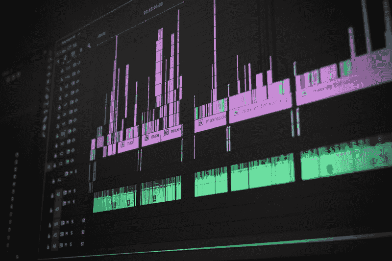
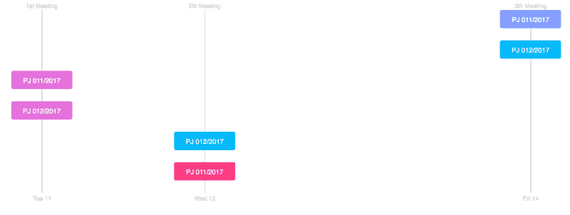

# 如何使用 D3 可视化数据集来构建类似甘特图的图表

> 原文：<https://www.freecodecamp.org/news/d3-visualizations-with-datasets-how-to-build-a-gantt-like-chart-9c9afa9b8d9d/>

作者德博拉·梅斯基塔

# 如何使用 D3 可视化数据集来构建类似甘特图的图表



当你学习完 D3.js 的基础知识后，通常下一步是用你的数据集构建可视化。因为 D3 的工作方式，我们组织数据集的方式可以让我们的生活变得非常简单或者非常困难。

在本文中，我们将讨论这个构建过程的不同方面。为了说明这些方面，我们将构建一个类似于甘特图的可视化。

我学到的最重要的一课是**你需要建立一个数据集，其中每个数据点等于你的图**的一个数据单位。让我们深入我们的案例研究，看看这是如何工作的。

目标是建立一个类似于下图的甘特图:



The visualization we want to build

如您所见，这不是甘特图，因为任务在同一天开始和完成。

### 创建数据集

我提取了分钟的数据。对于每个文本文件，我从会议中收到了关于项目及其状态的信息。起初，我是这样组织我的数据的:

```
{    "meetings": [{            "label": "1st Meeting",            "date": "09/03/2017",            "projects_presented": [],            "projects_approved": ["002/2017"],            "projects_voting_round_1": ["005/2017"],            "projects_voting_round_2": ["003/2017", "004/2017"]        },        {            "label": "2nd Meeting",            "date_start": "10/03/2017",            "projects_presented": ["006/2017"],            "projects_approved": ["003/2017", "004/2017"],            "projects_voting_round_1": [],            "projects_voting_round_2": ["005/2017"]        }    ]}
```

让我们仔细看看数据。

每个项目有四种状态:`presented`、`voting round 1`、`voting round 2` 和`approved`。在每次会议中，项目的状态可以更改，也可以不更改。我通过按会议分组来组织数据。当我们构建可视化时，这种分组给我们带来了很多问题。这是因为我们需要用 D3 将数据传递给节点。在我看到杰斯·彼得在这里制作的[甘特图](https://codepen.io/jey/full/jmClJ/)后，我意识到我需要改变我的数据。

我想显示的最少信息是什么？最小节点是什么？看图，是项目的资料。所以我把数据的结构改成了如下:

```
{  "projects": [                  {                    "meeting": "1st Meeting",                    "type": "project",                    "date": "09/03/2017",                    "label": "Project 002/2017",                    "status": "approved"                  },                  {                    "meeting": "1st Meeting",                    "type": "project",                    "date": "09/03/2017",                    "label": "Project 005/2017",                    "status": "voting_round_1"                  },                  {                    "meeting": "1st Meeting",                    "type": "project",                    "date": "09/03/2017",                    "label": "Project 003/2017",                    "status": "voting_round_2"                  },                  {                    "meeting": "1st Meeting",                    "type": "project",                    "date": "09/03/2017",                    "label": "Project 004/2017",                    "status": "voting_round_2"                  }               ]}
```

从那以后一切都变得更好了。有趣的是，在这个简单的改变之后，挫败感消失了。

### 创建可视化

现在我们有了数据集，让我们开始构建可视化。

#### 创建 x 轴

每个日期都应该显示在 x 轴上。为此，定义`d3.timeScale()`:

```
var timeScale = d3.scaleTime()                .domain(d3.extent(dataset, d => dateFormat(d.date)))                .range([0, 500]);
```

数组`d3.extent()`中给出了最小值和最大值。

现在有了`timeScale`，就可以调用轴了。

```
var xAxis = d3.axisBottom()                .scale(timeScale)                .ticks(d3.timeMonth)                .tickSize(250, 0, 0)                .tickSizeOuter(0);
```

刻度应该是 250 像素长。你不想要外面的虱子。显示轴的代码是:

```
d3.json("projects.json", function(error, data) {            chart(data.projects);});
```

```
function chart(data) {    var dateFormat = d3.timeParse("%d/%m/%Y");
```

```
 var timeScale = d3.scaleTime()                   .domain(d3.extent(data, d => dateFormat(d.date)))                   .range([0, 500]);
```

```
 var xAxis = d3.axisBottom()                  .scale(timeScale)                  .tickSize(250, 0, 0)                  .tickSizeOuter(0);
```

```
 var grid = d3.select("svg").append('g').call(xAxis);}
```

如果你画出这个图，你可以看到有很多刻度。事实上，一个月中的每一天都有刻度。我们只想显示有会议的日子。为此，我们将显式设置刻度值:

```
let dataByDates = d3.nest().key(d => d.date).entries(data);let tickValues = dataByDates.map(d => dateFormat(d.key));
```

```
var xAxis = d3.axisBottom()                .scale(timeScale)                .tickValues(tickValues)                .tickSize(250, 0, 0)                .tickSizeOuter(0);
```

使用`d3.nest()`你可以将所有的项目按日期分组(看看按项目组织数据有多方便？)，然后获取所有的日期并传递给轴。

#### 放置项目

我们需要沿着 y 轴放置项目，所以让我们定义一个新的比例:

```
yScale = d3.scaleLinear().domain([0, data.length]).range([0, 250]);
```

域是项目的数量。范围是每个分笔成交点的大小。现在我们可以放置矩形:

```
var projects = d3.select("svg")                   .append('g')                   .selectAll("this_is_empty")                   .data(data)                   .enter();
```

```
var innerRects = projects.append("rect")              .attr("rx", 3)              .attr("ry", 3)              .attr("x", (d,i) => timeScale(dateFormat(d.date)))              .attr("y", (d,i) => yScale(i))              .attr("width", 200)              .attr("height", 30)              .attr("stroke", "none")              .attr("fill", "lightblue");
```

`selectAll()`、`data()`、`enter()`和`append()`总是变得棘手。为了使用`enter()`方法(为了从一个数据点创建一个新的节点)，我们需要一个选择。这就是为什么我们需要`selectAll("this_is_empty)"`，即使我们还没有任何`rect`。我用这个名字来说明我们只需要空的选择。换句话说，我们使用`selectAll("this_is_empty)"`来获得一个我们可以处理的空选择。

变量`projects`有绑定到数据的空选择，所以我们可以用它来绘制`innerRects`中的项目。

现在，您还可以为每个项目添加标签:

```
var rectText = projects.append("text")                .text(d => d.label)                .attr("x", d => timeScale(dateFormat(d.date)) + 100)                .attr("y", (d,i) => yScale(i) + 20)                .attr("font-size", 11)                .attr("text-anchor", "middle")                .attr("text-height", 30)                .attr("fill", "#fff");
```

#### 给每个项目着色

我们希望每个矩形的颜色反映每个项目的状态。为此，让我们创建另一个标尺:

```
let dataByCategories = d3.nest().key(d => d.status).entries(data);let categories = dataByCategories.map(d => d.key).sort();
```

```
let colorScale = d3.scaleLinear()             .domain([0, categories.length])             .range(["#00B9FA", "#F95002"])             .interpolate(d3.interpolateHcl);
```

然后我们可以用这个比例的颜色填充矩形。将我们到目前为止看到的所有内容放在一起，下面是代码:

```
d3.json("projects.json", function(error, data) {            chart(data.projetos);        });
```

```
function chart(data) {    var dateFormat = d3.timeParse("%d/%m/%Y");    var timeScale = d3.scaleTime()                   .domain(d3.extent(data, d => dateFormat(d.date)))                   .range([0, 500]);      let dataByDates = d3.nest().key(d => d.date).entries(data);    let tickValues = dataByDates.map(d => dateFormat(d.key));      let dataByCategories = d3.nest().key(d => d.status).entries(data);    let categories = dataByCategories.map(d => d.key).sort();    let colorScale = d3.scaleLinear()                 .domain([0, categories.length])                 .range(["#00B9FA", "#F95002"])                 .interpolate(d3.interpolateHcl);      var xAxis = d3.axisBottom()                .scale(timeScale)                .tickValues(tickValues)                .tickSize(250, 0, 0)                .tickSizeOuter(0);    var grid = d3.select("svg").append('g').call(xAxis);      yScale = d3.scaleLinear().domain([0, data.length]).range([0, 250]);      var projects = d3.select("svg")                   .append('g')                   .selectAll("this_is_empty")                   .data(data)                   .enter();      var barWidth = 200;      var innerRects = projects.append("rect")                  .attr("rx", 3)                  .attr("ry", 3)                  .attr("x", (d,i) => timeScale(dateFormat(d.date)) - barWidth/2)                  .attr("y", (d,i) => yScale(i))                  .attr("width", barWidth)                  .attr("height", 30)                  .attr("stroke", "none")                  .attr("fill", d => d3.rgb(colorScale(categories.indexOf(d.status))));      var rectText = projects.append("text")                  .text(d => d.label)                  .attr("x", d => timeScale(dateFormat(d.date)))                  .attr("y", (d,i) => yScale(i) + 20)                  .attr("font-size", 11)                  .attr("text-anchor", "middle")                  .attr("text-height", 30)                  .attr("fill", "#fff"); }
```

这样我们就有了视觉化的原始结构。

干得好。

### 创建可重复使用的图表

结果显示没有边距。此外，如果我们想在另一个页面上显示这个图表，我们需要复制整个代码。为了解决这些问题，让我们构建一个可重用的图表并导入它。要了解更多关于图表的信息，请点击[这里](https://bost.ocks.org/mike/chart/)。要看我以前写的关于可重用图表的教程，点击[这里](https://medium.freecodecamp.org/a-gentle-introduction-to-d3-how-to-build-a-reusable-bubble-chart-9106dc4f6c46)。

创建可重用图表的结构总是相同的。我创造了一个工具来产生一个。在这个图表中，我想设定:

*   数据(当然)
*   宽度、高度和边距的值
*   矩形的 x 值的时间刻度
*   矩形 y 值的刻度
*   颜色的比例
*   `xScale`、`yScale`和`colorScale`的值
*   每个任务的开始和结束值以及每个条形图的高度

然后，我将它传递给我创建的函数:

```
chart: ganttAlikeChartwidth: 800height: 600margin: {top: 20, right: 100, bottom: 20, left:100}xScale: d3.scaleTime()yScale: d3.scaleLinear()colorScale: d3.scaleLinear()xValue: d => d.datecolorValue: d => d.statusbarHeight: 30barWidth: 100dateFormat: d3.timeParse("%d/%m/%Y")
```

这给了我这个:

```
function  ganttAlikeChart(){width = 800;height = 600;margin = {top: 20, right: 100, bottom: 20, left:100};xScale = d3.scaleTime();yScale = d3.scaleLinear();colorScale = d3.scaleLinear();xValue = d => d.date;colorValue = d => d.status;barHeight = 30;barWidth = 100;dateFormat = d3.timeParse("%d/%m/%Y");function chart(selection) { selection.each(function(data) {   var svg = d3.select(this).selectAll("svg").data([data]).enter().append("svg");   svg.attr("width", width + margin.left + margin.right).attr("height", height + margin.top + margin.bottom);  var gEnter = svg.append("g");  var mainGroup = svg.select("g").attr("transform", "translate(" + margin.left + "," + margin.top + ")");})}
```

```
[...]
```

```
return chart;}
```

现在我们只需要用之前创建的代码填充这个模板。我还对 CSS 做了一些修改，并添加了一个工具提示。

仅此而已。

你可以在这里查看完整的代码。

感谢阅读！？

你觉得这篇文章有帮助吗？我尽力每个月写一篇深度文章，当我发表一篇新的文章时，你可以收到一封电子邮件。