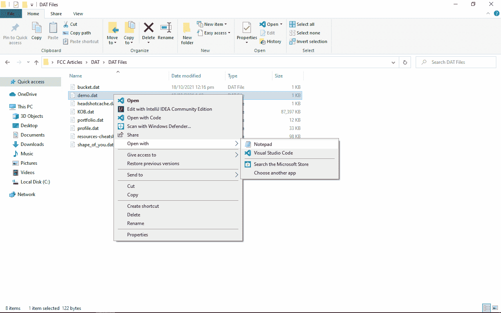
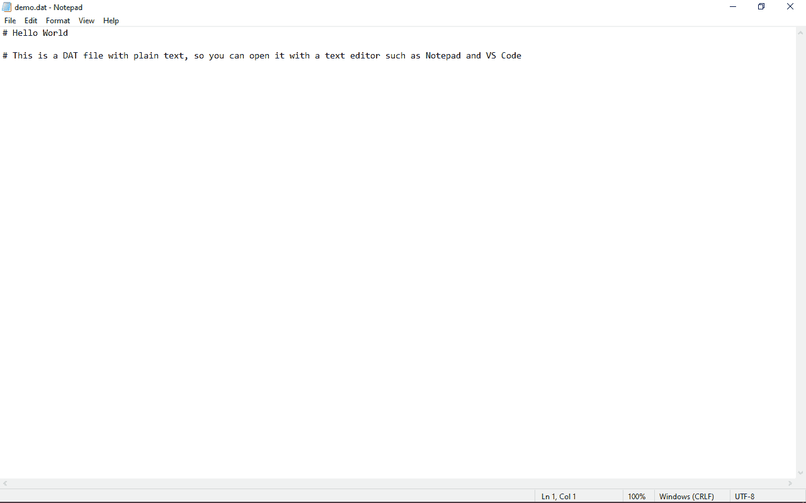
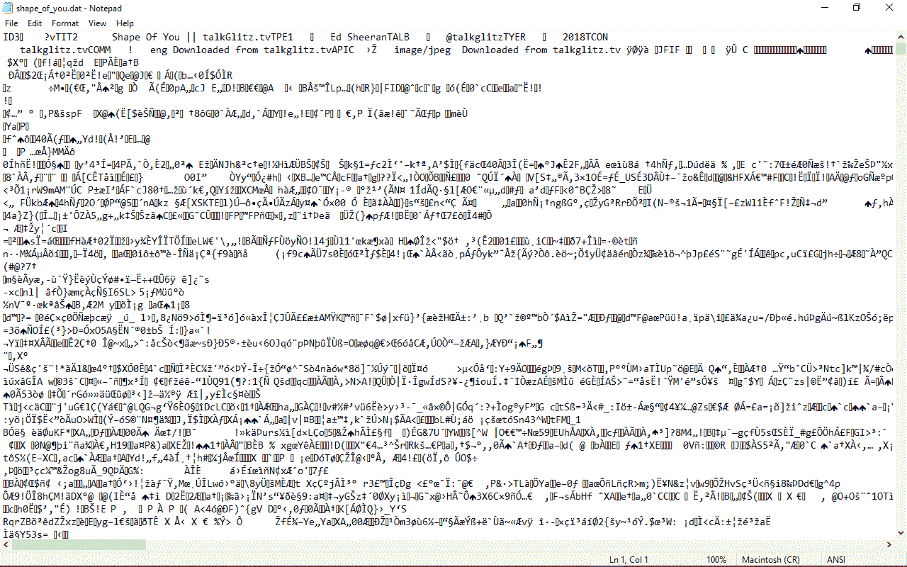
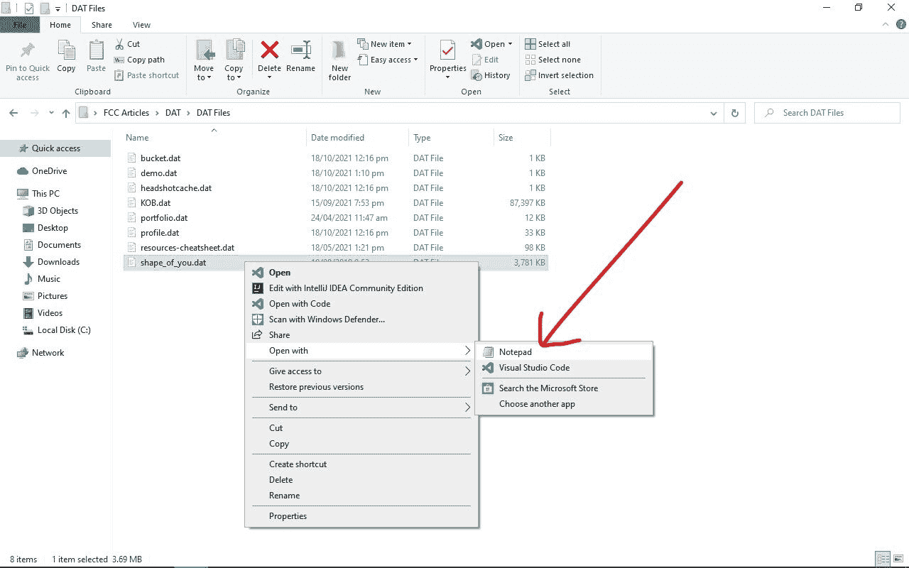
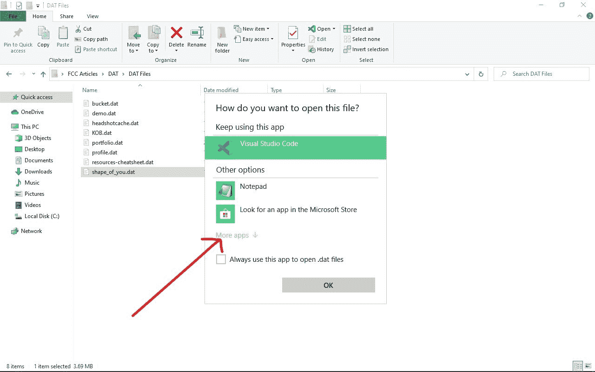
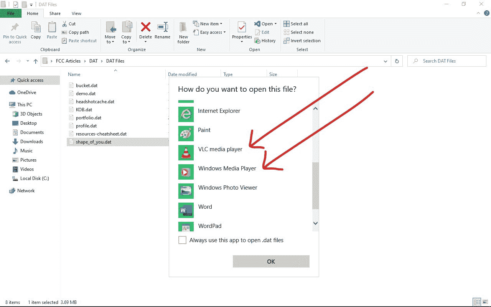
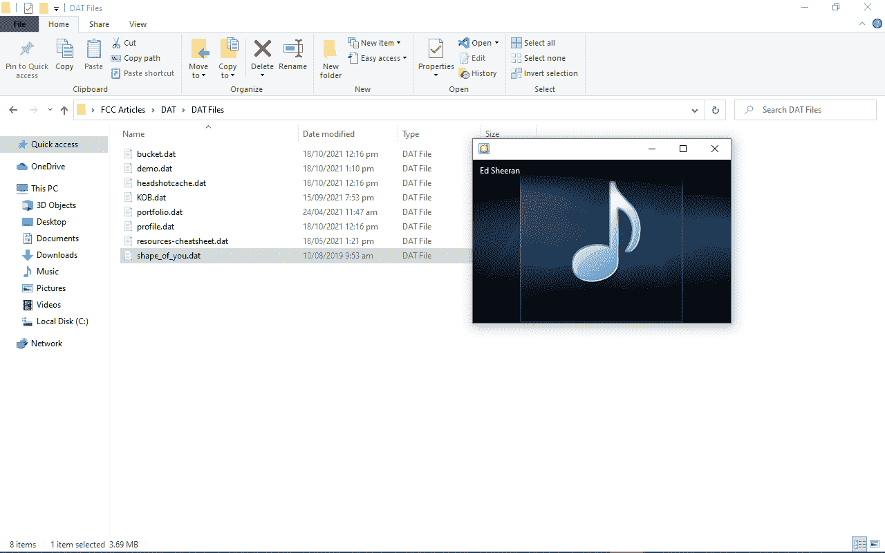

# DAT 文件-如何打开？dat 文件格式扩展名

> 原文：<https://www.freecodecamp.org/news/dat-file-how-to-open-the-dat-file-format-extension/>

DAT 文件是一种数据文件，包含创建它的程序的特定信息。

该文件的扩展名始终为`.dat`,这是一种通用格式，可以包含任何信息——视频、音频、PDF 以及几乎任何其他类型的文件。

许多桌面和移动应用程序引用 DAT 文件，因此这些文件将具有。dat 扩展名。在许多其他情况下，您可能会遇到这些文件。

对于视频、音频、PDF 和其他类型的文件，您需要使用媒体播放器、Adobe Reader 等相关应用程序打开它们。但是如何打开扩展名为`.dat`的文件呢？这就是我将在本文中向您展示的内容。

## 如何打开？dat 文件格式扩展名

用打开文件。dat 扩展，首先您需要确定它包含什么样的信息。例如，它是视频还是音频文件？那么你需要一个媒体播放器。这是一幅画吗？然后你的照片 app 就可以打开了。

大多数 DAT 文件都包含文本，所以可以用文本编辑器打开它们，比如记事本、Notepad++和 VS Code 等等。

但是它不会直接发生，所以你需要右击文件，将鼠标悬停在“打开方式”选项上:

选择记事本，或安装在计算机上的任何其他文本编辑器:

如果 DAT 文件中包含的信息不是纯文本，而你用文本编辑器打开它，那么你会得到一些不规则的不可读的文本，就像这样:

如果您确定 DAT 文件中包含的信息是视频或音频，那么您的媒体播放器可以打开它。如果是 PDF，那么 Adobe Reader 就可以打开，以此类推。

在下面的例子中，我要打开的文件是一个 MP3 文件。右击文件，悬停在“打开方式”上，然后点击“选择另一个应用程序”:

点击“更多应用程序”:

检查列表并选择您的媒体播放器，然后选择“确定”:

文件将由您选择的媒体播放器打开:

如果您确定 DAT 文件包含的信息，请重复该过程。如果是. jpg 文件，那么你的照片 app 就能打开，如果是. pdf 文件，那么 Adobe Reader 或者其他一些相关 app 就能打开。

### 不知道里面有什么，怎么打开 DAT 文件？

如果您想打开一个不知道包含什么内容的 DAT 文件，您可以通过仔细检查其包含文件夹的名称来发现潜在的信息。

例如，如果您在“媒体”文件夹中找到 DAT 文件，那么它可能是视频或音频文件，因此您的媒体播放器可以帮助您。

如果 DAT 文件位于系统文件夹中，您不应尝试打开它，因为它可能被您的某个应用程序用作配置文件。

您也可以通过尝试用几个应用程序打开它来使用试错法，或者您可以联系文件的创建者。

### 您应该转换 DAT 文件吗？

如果您不确定 DAT 文件包含什么，那么您不应该尝试转换它。

如果您确定文件包含的内容以及扩展名，那么您可以使用转换应用程序进行转换，或者只需将文件扩展名更改为相关的扩展名。

## 结论

在本文中，您学习了如何打开 DAT 文件。但是请记住，您不需要打开每个 DAT 文件，例如您可能会在程序文件夹中遇到的文件。这类文件存储了程序使用的特定信息，因此您不需要手动打开它们。

感谢您的阅读，祝您愉快。