# 数据新闻初学者指南:让我们从零开始构建一个故事

> 原文：<https://www.freecodecamp.org/news/data-journalism-isnt-for-the-select-let-s-work-out-a-story-together-from-scratch-dd85b3017f4a/>

米娜·德米安

# 数据新闻初学者指南:让我们从零开始构建一个故事

Courtesy of the Data Journalism Handbook

这是一个关于如何产生一篇数据新闻的开端的介绍性指南。我们将一起走一遍，因为我概述了开始之前要考虑的关键事项。我们将涵盖:

*   如何组织你的工作
*   要遵循的基本流程
*   一个真实世界的案例研究来展示这个过程是如何工作的

### 数据新闻仍然是关于故事的

数据新闻的浮华和魅力(动画[T1、](http://www.slate.com/articles/life/the_history_of_american_slavery/2015/06/animated_interactive_of_the_history_of_the_atlantic_slave_trade.html)[醒目的地图](http://www.wired.com/2013/12/the-best-maps-of-2013/)和那些伟大的[信息图表](https://yalantis.com/media/content/ckeditor/2014/06/poster_coffee_2-01.jpg))遍布互联网。那么，很容易认为这是关于数据以及你能让它看起来、唱起来或跳起来有多酷。我在 [OpenUp](http://openup.org.za/) 、 [Raymond](http://twitter.com/rayjoe) 和 [Adi](http://twitter.com/SoapSudTycoon) 的明智朋友不断提醒我(以及垂涎已久的网络普通用户),重点应该是数据*新闻*，而不是*数据*新闻。

数据新闻和我们每天了解和消费的新闻没有什么不同。传统新闻依赖于人力资源(例如，内部人士、专家、学者和科学家)，而数据新闻以记者对待人力资源的严谨和审查来对待数据源(例如，电子表格、网站和数据库)。

动画和时髦的作品有助于传达最终产品——故事——但它们永远不会取代真实的故事。

### 盛大的开始

数据新闻报道可以从一个重要事件开始，也可以只是一个问题。你可能会看到一个爆炸性的头条新闻，想知道 *y* 发生了多少次 *x* ？或者，你在想食物，想知道一般购物者在狗粮上花多少钱。当评估一篇数据新闻时，这两个问题都是有效的和很好的起点。

到目前为止，我在工作中所学到的是，做基础科学的工作和做数据新闻的工作几乎没有区别。你做一个观察，提出一个问题(纯粹主义者的假设)，然后你试图回答这个问题。你的工作将会证明你最初的假设是不正确的，或者，是的，它是正确的。

所以，正如我之前提到的，这不是关于花哨的图形或你搜罗了多少数据，而是关于知道*你的问题是什么*和*你回答了吗*？

不要相信炒作。

#### "[你的资料是谁的，他是做什么的](https://youtu.be/imqapaYAPbY?t=17)？"

该指南基于南非统计机构的数据。(2015 年夏季发布的季度调查结果显示，官方失业率高达 25%。)该机构好心地用 Excel 电子表格发布了这些数据。我将写一些文章来解决如何管理那些没有以易于使用的格式发布的数据源。

[你可以在这里](https://drive.google.com/drive/folders/1sh0UOYoJm2G_O7JbyXnMQCH2kp5LRlaI)探索数据集，这里有足够的工作表来保证探索。这种探索很重要，因为如果不知道它是关于什么的，它涵盖了什么，等等，你可能会看到错误的数据。它可能会让你回答错误的问题，或者——每个数据记者的噩梦——浪费时间却收效甚微。

所以，在我们谈论过程之前，让我们看看数据，看看它告诉我们什么。我们通常不会处理所有的数据(除非我们最初的想法或问题需要这样)。最好先看一下所有的数据，然后把注意力集中在引起你注意的特定部分。

统计局的电子表格着眼于劳动力的不同特征(按省份、年龄、性别和人口统计细分)。即使这是你的第一次，也要快速浏览每一页。这将有助于培养有条不紊的职业道德，这对数据新闻业来说是无价的。

一个重要的旁注:你只需要一个基本的 Excel 工作知识。我不会在工作表中施展魔法，所以任何人都可以遵循它们。为了简洁起见(这样你就不会进入紧张性昏迷状态)，我将让你去弄清楚如何在 Excel 中进行基本的操作。

### 现在旅程开始了

我们已经讨论了制作一部数据新闻作品意味着什么，如何评估一个想法是否会导致一篇文章，以及如何看待一个数据集。最后。我们得到了过程，好的东西。它是如何工作的？

#### 第一步:从数据中提取一部分

对于本指南，我想了解南非各省的劳动力规模，以及 2013 年至 2015 年第二季度的情况。该数据显示在第一个工作表中。(欢迎您浏览其他电子表格，看看您能从中挖掘出什么有趣的见解。)

所以我们从最初的电子表格开始，它有 20 多个工作表，如下所示:

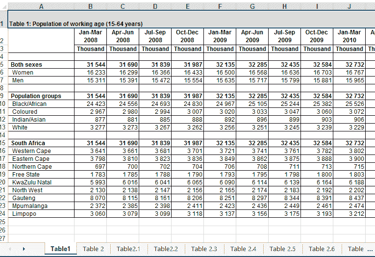

只使用一个标题为“表 1:工作年龄人口(15-64 岁)”的工作表，如下所示。

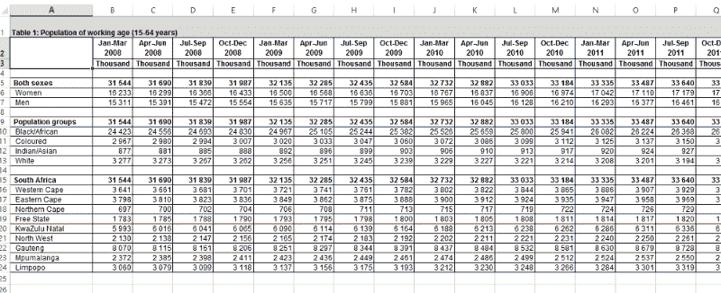

现在，让我们复制工作表底部的数据，因为这是我们需要的数据，并将其粘贴到一个新的工作表中。要创建干净的数据集，请删除带有千位标题的行，并删除标有南非的单元格。此外，删除总计行，这样我们以后就不会混淆了。(我会在一分钟内调整所有值以反映百万。)

它现在应该是这样的:

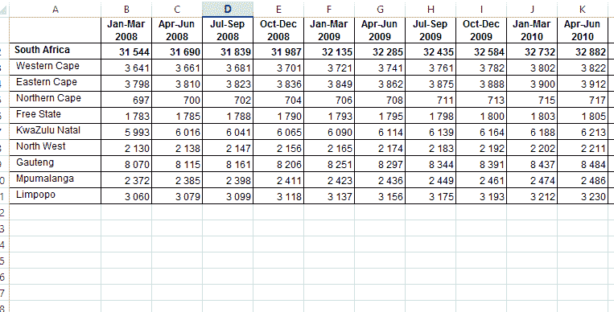

现在，让我们更改所有单元格，以百万为单位显示值。在每个现有列旁边创建一个新列，并将该值乘以 1000。现在看起来是这样的:

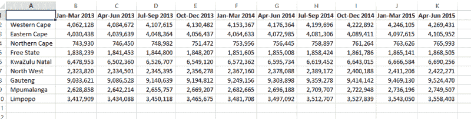

删除所有边框和小数位，并将千位分隔符改为逗号。这有助于使我们的图表更容易阅读和访问。此时，该表应该可以进行分析了。

还没有。虽然更干净，但是我们需要的数据结构不在。为什么这很重要？因为数据需要以一种我们可以聚合或分组的方式来组织。数据新闻的老圣人说，如果你的数据没有被总结(或汇总)，它就没有准备好被分析。

#### 步骤 2:将数据转换成可用于分析/可视化的结构

我们希望从这个数据集中揭示哪些因素？它们是省、年和工人总数。但在此之前，我们将创建包含以下各列的新数据结构:

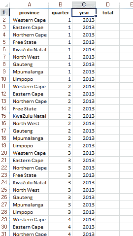

如果你学的是数据库设计，你会因为展示这个数据集设计而在数据库设计测试中失败。或者，如果你是一名程序员，你的老板会责备你提出这个数据集设计。你的讲师或老板有权这样做。它不是一个标准化的数据集。然而，这是一篇数据新闻的数据分析，所以你可能会蔑视那些规则！我们需要有重复的行，以便以后聚合数据(还记得吗？).

#### 步骤 3:生成最终数据集

在上面的截图中，我在结构中输入了相关的年份。接下来，粘贴 2013 年、2014 年和 2015 年的总数。现在的数据集[看起来像这个](https://docs.google.com/spreadsheets/d/1_9TAVYVXGOhAsfr3rXSUwJndOAmW-MOyOQtZ2MpBtWY/pubhtml?gid=1928330136&single=true&widget=true&headers=false)。(Medium 不允许内嵌 iframe，所以我提供了一个到数据集的链接。)它应该有 91 行，并且只显示了 2015 年的第 1 季度和第 2 季度。

我们快到了！

最后一步是汇总数据。所以，深呼吸，在新的工作表中创建一个数据透视表。我们的汇总数据如下所示:

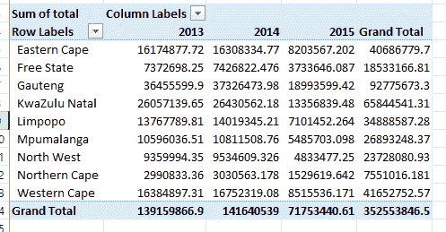

收拾桌子。输入千位分隔符，删除小数位，并删除标有“行标签合计”的单元格。该表现在看起来像这样:

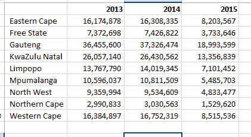

#### 步骤 4:制作可视化效果

恭喜你！您已经有了一个可以可视化的数据集。

我们将使用 [Infogr.am](http://www.infogram.com) 制作一个信息图。本指南不包括如何注册和使用 Infogr.am，所以(和 Excel 一样)您需要自己熟悉这个工具。我向你保证，这是直截了当和直观的！你很快就会像专业人士一样使用它！你会明白的。

要创建新的信息图，请选择您喜欢的任何模板。空白工作区如下所示:

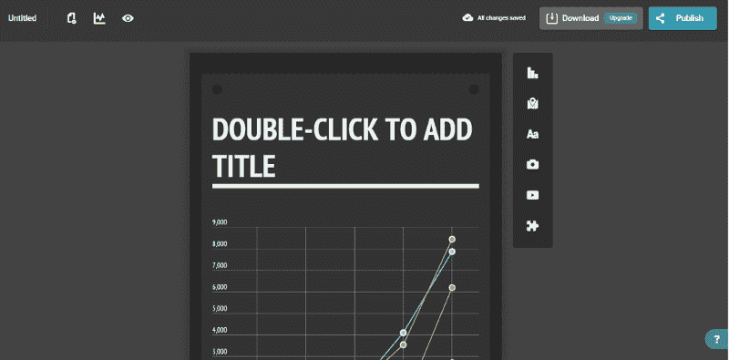

给信息图起一个标题，如“2013-2015 年各省劳动力总数”或类似的标题，视情况而定。然后从弹出向导中添加一个分组条形图。您应该会在工作区看到新的图表。(删除模板附带的现有图表，它现在出现在您刚刚创建的图表的下方。)

双击新图表，屏幕上会出现一个类似 Excel 的界面。从该屏幕中删除数据，从数据透视表中使用的 Excel 工作表中复制数据，并将其粘贴到 Infogr.am 电子表格界面中。它应该是这样的:

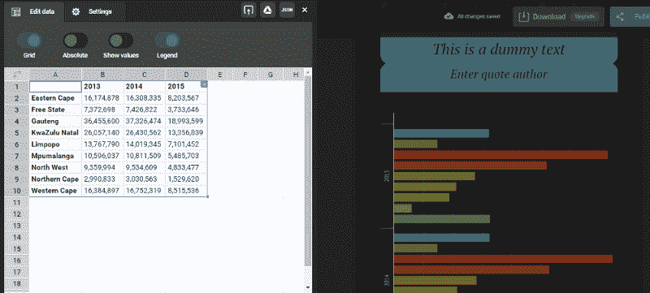

粘贴数据时，图形会自动更新。

开始好看了！

看一下信息图。所有的东西都在里面，但是你可能不能马上理解信息图。你必须向下滚动阅读图例才能看到哪个颜色代表哪个省。因此，点击电子表格右上角的双向箭头图标，而不是重新格式化数据。这个漂亮的特性将切换行和列，这样省现在出现在行中，年份出现在列中。

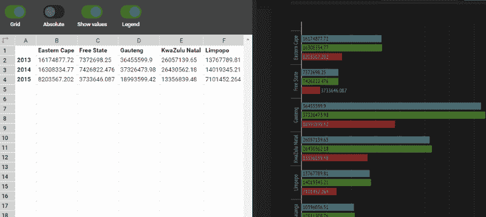

在适当的情况下，始终致力于在图表上显示数值。因此，单击显示值开关，总计将反映在图表上。另外，点击设置按钮，向下滚动，在 X 轴文本框中添加“总计(百万)”。这有助于读者(和你)更好地理解图表。

单击发布按钮为您的图形命名。然后决定图形是交互式的还是图像式的。这是最终图像的样子:

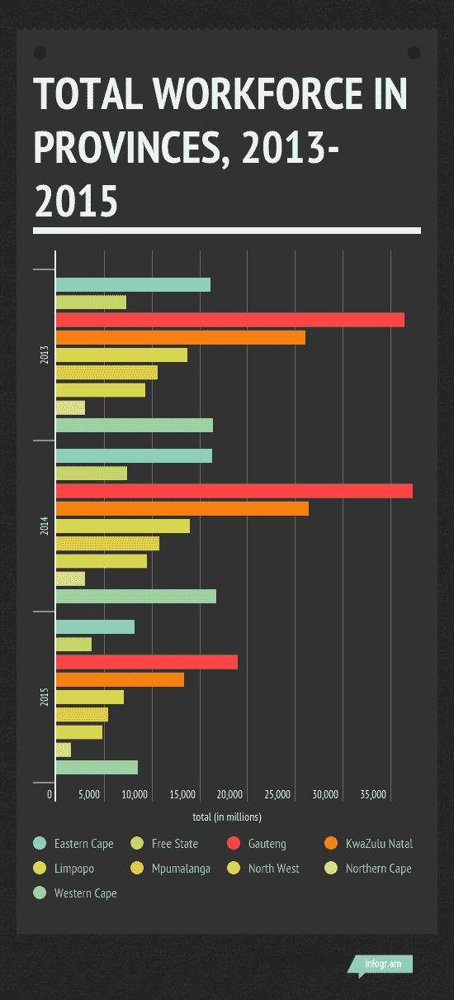

你已经产生了你的第一个可视化。拍拍自己的背，喝杯咖啡或啤酒，做好准备，因为你刚刚开始这个过程。

在我们看其余的工作之前，让我们回顾一下我们已经做了什么:

1.  我们查看了一个数据源，并提取了我们想要的数据。在这种情况下，我们问，“2013 年至 2015 年间，南非的劳动力规模是多少？”
2.  我们遵循清理、格式化、转换和汇总数据的基本流程，直到生成一个显示我们需要的数据的表格。
3.  然后，我们将数据插入到可视化工具中，并生成了一个信息图，如上所示。

在这一点上，你是如此兴奋，以至于你跳到 Twitter 或你的电子邮件上，把你的作品发给你认识的每一个人。

坚持住！还没有。

### 你的发现到底意味着什么？

是的，你分析了数据，你回答了你的问题。在我们选择的时间段内，豪登省拥有最大的劳动力，但自 2013 年以来一直在减少。自 2013 年以来，北开普省的劳动力一直低于 500 万。但是*为什么是*？

这就是为什么这篇文章的第一段有这个顽皮的限定——“一个故事的开始”——因为现在开始了你所知道的或者被训练去做的新闻。此时，请执行以下操作:

*   联系分析师、专家或学者来解释和评论数据。
*   根据故事的范围或编辑的指示，查看其他数据集或请专家解释研究结果的背景。
*   分析/可视化其他数据集，以测试和完善您的发现。
*   做任何需要做的事情，以确保这件作品是平衡和公平的。

完成这些步骤中的一个或多个后，撰写最后一篇文章。包括上面制作的信息图，并提交发布。如果你有自己的博客或网站，发布它。

### 没有一个地方像尽头一样！

结束了。我希望你已经走了这么远，并且你的胃口已经被激起来做更多(和复杂的)数据新闻工作。

如果有些事情对你不起作用，或者你需要某个部分的帮助，请在 Twitter 上关注我，我们可以一起解决这个问题。

### 资源

我在下面列出了所有的电子表格、工具和链接，这样你可以随时拿起这个指南，看看我是如何得到最终的信息图的。

*   来自南非国家统计局的原始[电子表格](https://drive.google.com/file/d/0B4RhkUC9QKOnV1pXbUlCY2diSlE/view?usp=sharing)
*   我的[电子表格](https://docs.google.com/spreadsheets/d/1_9TAVYVXGOhAsfr3rXSUwJndOAmW-MOyOQtZ2MpBtWY/edit?usp=sharing),上面截图中显示了每个步骤的工作表
*   [Infogr.am](http://www.infogr.am/)

米娜·德米安是一名生活在瑞典斯德哥尔摩的前端工程师。这篇文章最初发表在他的个人博客上，当时他是一名工作记者和事实审查员。他仍然涉足数据分析和可视化。