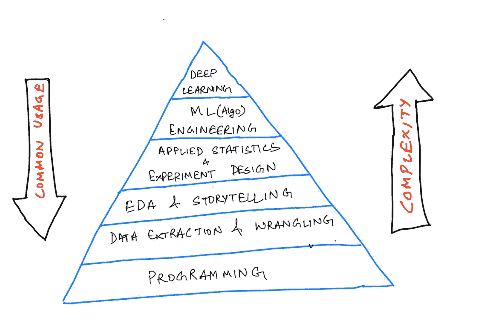

# 2021 年数据科学学习路线图

> 原文：<https://www.freecodecamp.org/news/data-science-learning-roadmap/>

虽然除了日期之外什么都不会改变，但是新的一年让每个人都充满了重新开始的希望。如果你加入一点计划，一些设想良好的目标，和一个学习路线图，你会有一个充满成长的一年的好食谱。

这篇文章旨在通过为您提供一个**学习框架、资源和项目想法**来帮助您建立一个展示数据科学专业知识的坚实的工作组合，从而加强您的计划。

注意:我根据我在数据科学方面的个人经验准备了这个路线图。这不是最重要的学习计划。您可以调整这个路线图，以更好地适应您感兴趣的任何特定领域或研究领域。此外，这是用 Python 创建的，因为我个人更喜欢它。

## 什么是学习路线图？

学习路线图是课程的延伸。它绘制了一个多层次的技能图，详细说明了**你想要磨练哪些**技能、**你将如何**衡量每个层次的结果，以及**进一步掌握每项技能的技巧**。

我的路线图根据其在现实世界中应用的复杂性和共同性为每个级别分配权重。我还增加了初学者完成每个级别的练习和项目的估计时间。

下面是一个金字塔，按照复杂性和在行业中的应用顺序描述了高级技能。

Data science tasks in the order of complexity

这将标志着我们框架的基础。我们现在必须深入到这些层中的每一层，以更具体、可测量的细节来完成我们的框架。

特异性来自于检查每一层中的关键主题和掌握这些主题所需的资源。

我们将能够通过将所学的主题应用到许多现实世界的项目中来衡量所获得的知识。我添加了一些项目想法、门户和平台，您可以用它们来衡量您的熟练程度。

> 重要提示:一天一次，一天一个视频/博客/章节。它涵盖的范围很广。不要压倒自己！

让我们从底部开始，深入研究每一层。

## 1.如何学习编程或软件工程

**(预计时间:2-3 个月)**

首先，确保你有良好的编程技能。每个数据科学职位描述都要求至少一种语言的编程专业知识。

### 需要了解的具体编程主题包括:

*   常见的数据结构(数据类型、列表、字典、集合、元组)、编写函数、逻辑、控制流、搜索和排序算法、面向对象编程以及使用外部库。
*   SQL 脚本:使用连接、聚合和子查询查询数据库
*   舒适地使用终端，Git 中的版本控制，以及使用 GitHub

### 学习 Python 的资源:

*   learnpython.org【免费】——初学者的免费资源。它从头开始涵盖了所有基本的编程主题。您将获得一个交互式 shell 来并排练习这些主题。
*   [Kaggle 【T1【免费】——一个学习 python 的免费互动指南。这是一个简短的教程，涵盖了数据科学的所有重要主题。](https://www.kaggle.com/learn/python)
*   [freeCodeCamp 上的 Python 认证](https://www.freecodecamp.org/learn/scientific-computing-with-python/python-for-everybody/)【免费】——freeCodeCamp 提供了几种基于 Python 的认证，比如科学计算、数据分析、机器学习等。
*   YouTube 上由 freecodecamp 提供的 Python 课程【免费】—这是一个 5 小时的课程，你可以跟随它练习基本概念。
*   中级 python 【T1【免费】Patrick 在 freecodecamp.org 推出的另一门免费课程。
*   [**Coursera python for Everybody 专业化**](https://www.coursera.org/specializations/python) **【费】** —这是一个专业化，包含初级概念、Python 数据结构、从 web 收集数据，以及使用数据库和 Python。

### 学习 Git 和 GitHub 的资源

*   Git 和 [GitHub](https://lab.github.com/) 指南[【免费】:完成这些教程和实验，发展对版本控制的牢固掌控。这将有助于您进一步为开源项目做出贡献。](https://www.atlassian.com/git)
*   这里有一个免费的 YouTube 频道上的 Git 和 GitHub 速成班

### 学习 SQL 的资源

*   这里有一个关于 SQL 和数据库的[课程](https://www.freecodecamp.org/news/sql-and-databases-full-course/)在免费代码营 YouTube 频道上
*   Kaggle 上的[SQL 简介](https://www.kaggle.com/learn/intro-to-sql)和[高级 SQL](https://www.kaggle.com/learn/advanced-sql) 。
*   freeCodeCamp 现在有一个[免费的 interactive SQL 课程](https://www.freecodecamp.org/learn/relational-database/)。

### 通过解决大量问题和建立至少两个项目来衡量你的专业能力:

*   这里解决了很多问题: [HackerRank](https://www.hackerrank.com/) (初学者友好型)和 [LeetCode](https://leetcode.com/) (解决简单或中级问题)
*   从网站/API 端点提取数据——尝试从允许像*soundcloud.com 那样抓取的网页中提取数据来编写 Python 脚本。*将提取的数据存储到 CSV 文件或 SQL 数据库中。
*   像石头剪刀布，旋转纱线，刽子手，骰子滚动模拟器，井字游戏，等等。
*   简单的 web 应用程序，如 YouTube 视频下载器、网站拦截器、音乐播放器、剽窃检查器等等。

将这些项目部署在 GitHub 页面上，或者简单地将代码托管在 GitHub 上，以便您学习使用 Git。

## 2.如何了解数据收集和争论(清理)

**(预计时间:2 个月)**

数据科学工作的一个重要部分是围绕着寻找可以帮助你解决问题的恰当数据。您可以从不同的合法来源收集数据——抓取(如果网站允许)、API、数据库和公开可用的存储库。

一旦你手头有了数据，分析师会发现自己经常清理数据框架，处理多维数组，使用描述性/科学计算，并操纵数据框架来汇总数据。

数据很少是干净的和格式化的，以便在“真实世界”中使用。Pandas 和 NumPy 是两个库，您可以随意使用它们从脏数据转换成可供分析的数据。

当你开始对编写 Python 程序感到舒适时，可以开始学习使用库，比如 **pandas** 和 [**numpy**](https://towardsdatascience.com/numpy-essentials-for-data-science-25dc39fae39) 。

### 了解数据收集和清理的资源:

*   关于学习 Numpy、Pandas、matplotlib 和 seaborn 的免费代码营课程【免费】。
*   来自 HackerEarth 的关于使用 NumPy 和 Pandas 进行数据操作的实用教程。
*   Kaggle pandas 教程【免费】—一个简短的实践教程，将带你了解常用的数据操作技巧。
*   [ka ggle 的数据清洗过程](https://www.kaggle.com/learn/data-cleaning)。
*   [Coursera 关于 Python 数据科学介绍的课程](https://www.coursera.org/learn/python-data-analysis?specialization=data-science-python)——这是[应用数据科学的第一门 Python 专业课程。](https://www.coursera.org/specializations/data-science-python)

### 数据收集项目理念:

*   从您选择的网站/API(向公众开放)收集数据，并将数据从不同来源转换存储到聚合文件或表(DB)中。示例 API 包括 [TMDB](https://developers.themoviedb.org/3) 、 [quandl](https://www.quandl.com/tools/python) 、 [Twitter API](https://developer.twitter.com/en/docs) 等等。
*   挑选[任何公开可用的数据集](https://towardsdatascience.com/data-repositories-for-almost-every-type-of-data-science-project-7aa2f98128b)，并定义一组你在查看数据集和领域后想要探究的问题。使用熊猫和 NumPy 讨论数据，找出这些问题的答案。

## 3.如何学习探索性数据分析、商业头脑和讲故事

**(预计时间:2-3 个月)**

下一个需要掌握的层次是数据分析和讲故事。从数据中提取洞察力，然后用简单的术语和可视化的方式与管理层交流，这是数据分析师的核心职责。

讲故事的部分要求你精通数据可视化和优秀的沟通技巧。

### 要学习的具体探索性数据分析和讲故事主题包括:

*   **探索性数据分析** —定义问题、处理缺失值、异常值、格式化、过滤、单变量和多变量分析。
*   数据可视化—使用 matplotlib、seaborn 和 plotly 等库绘制数据。知道如何选择正确的图表来传达数据中的发现。
*   开发仪表盘——相当多的分析师只使用 Excel 或 Power BI 和 Tableau 等专业工具来构建仪表盘，汇总/汇总数据以帮助管理层做出决策。
*   商业敏锐度:努力提出正确的问题来回答，这些问题实际上是针对商业指标的。练习撰写清晰简洁的报告、博客和演示文稿。

### 了解数据分析更多信息的资源:

*   在 freeCodeCamp YouTube 频道的这个[免费课程中，学习使用 Python 进行数据分析。](https://www.freecodecamp.org/news/learn-data-analysis-with-python-course/)
*   [用 Python 进行数据分析](https://www.coursera.org/learn/data-analysis-with-python) —由 IBM 在 Coursera 上发布。本课程涵盖争论、探索性分析和使用 python 的简单模型开发。
*   [数据可视化](https://www.kaggle.com/learn/data-visualization) —由 Kaggle 完成。另一个互动课程，让你练习所有常用的情节。
*   用这些书打造产品感和商业敏锐性: [**衡量什么重要**](https://www.amazon.com/Measure-What-Matters-Google-Foundation/dp/0525536221/ref=sr_1_1?crid=1A9SIXXP7S2P8&dchild=1&keywords=measure+what+matters&qid=1610323490&s=books&sprefix=measure%2Cstripbooks%2C365&sr=1-1)**[解码征服](https://www.amazon.com/Decode-Conquer-Answers-Management-Interviews/dp/0615930417/ref=sr_1_1?s=books&ie=UTF8&qid=1530848101&sr=1-1&keywords=decode+and+conquer)[破解 PM 面试](https://www.amazon.com/Cracking-PM-Interview-Product-Technology/dp/0984782818/ref=sr_1_1?s=books&ie=UTF8&qid=1530848116&sr=1-1&keywords=cracking+the+pm+interview) **。****

### **数据分析项目想法**

*   **对[电影数据集进行探索性分析，找出制作盈利电影](https://towardsdatascience.com/hitchhikers-guide-to-exploratory-data-analysis-6e8d896d3f7e)的公式(以此为灵感)，使用来自医疗保健、金融、世卫组织、以往人口普查、电子商务等领域的数据集。**
*   **使用上面提供的资源构建仪表板(jupyter 笔记本、excel、 [tableau](https://public.tableau.com/en-gb/gallery/?tab=viz-of-the-day&type=viz-of-the-day) )。**

## **4.如何学习数据工程**

****(预计时间:4-5 个月)****

**数据工程通过让大数据驱动型公司的研究工程师和科学家可以访问干净的数据来支撑 R&D 团队。它本身就是一个领域，如果你想专注于问题的统计算法方面，你可以决定跳过这一部分。**

**数据工程师的职责包括构建高效的数据架构、简化数据处理和维护大规模数据系统。**

**工程师使用 Shell (CLI)、SQL 和 Python/Scala 来创建 ETL 管道、自动化文件系统任务，并优化数据库操作，使其具有高性能。**

**另一个关键技能是实现这些数据架构，这需要精通云服务提供商，如 AWS、Google Cloud Platform、Microsoft Azure 等。**

### **学习数据工程的资源:**

*   **Udacity 的数据工程纳米学位(Data Engineering nano degree)——就已编辑的资源列表而言，我还没有遇到过结构更好的数据工程课程，它从头开始涵盖了所有主要概念。**
*   **[GCP 专业化认证上的数据工程、大数据和机器学习](https://www.coursera.org/specializations/gcp-data-machine-learning) —你可以在 Coursera 上完成谷歌提供的专业化认证，该认证将带你浏览 GCP 提供的所有主要 API 和服务，以构建一个完整的数据解决方案。**

### **要准备的数据工程项目想法/认证:**

*   **[AWS 认证机器学习(300 美元)](https://aws.amazon.com/certification/certified-machine-learning-specialty/) —由 AWS 提供的监考考试，为您的个人资料增加一些权重(但不保证任何东西)，需要对 AWS 服务和 ML 有相当的了解。**
*   **[专业数据工程师](https://cloud.google.com/certification/data-engineer)—GCP 认证。这也是一个监考考试，评估您设计数据处理系统、在生产环境中部署机器学习模型以及确保解决方案质量和自动化的能力。**

## **5.如何学习应用统计学和数学**

****(预计时间:4-5 个月)****

**统计方法是数据科学的核心部分。几乎所有的数据科学面试都主要关注描述性和推断性统计。**

**人们经常在没有清楚理解解释这些算法工作的底层统计和数学方法的情况下开始编写机器学习算法。当然，这不是最好的方式。**

### **应用统计学和数学中您应该关注的主题:**

*   **描述性统计数据(descriptional Statistics)——能够总结数据是强大的，但并不总是如此。了解描述数据的位置估计值(平均值、中值、众数、加权统计值、修剪统计值)和可变性。**
*   ****推断统计** —设计假设检验、A/B 检验、定义业务指标、使用置信区间、p 值和 alpha 值分析收集的数据和实验结果。**
*   ****线性代数、单变量和多变量微积分**理解机器学习中的损失函数、梯度和优化器。**

### **学习统计和数学的资源:**

*   **在免费的 8 小时课程中，学习大学水平的统计数据**
*   **[【书】数据科学实用统计](https://www.amazon.com/Practical-Statistics-Data-Scientists-Essential/dp/149207294X/ref=sr_1_1?crid=QOOZP96ISCU4&dchild=1&keywords=practical+statistics+for+data+scientists&qid=1610247485&s=books&sprefix=practical+stat%2Cstripbooks%2C362&sr=1-1) **(强烈推荐)——**对所有重要统计方法的全面指导，以及简洁明了的应用/示例。**
*   **[【Book】](https://www.amazon.com/Naked-Statistics-Stripping-Dread-Data/dp/1480590185)——一个非技术性但详细的指南，帮助理解统计对我们日常事件、运动、推荐系统以及更多实例的影响。**
*   **一门 8 小时的大学水平的统计学课程——帮助你开始统计学思维的基础课程。**
*   **[描述性统计简介](https://www.udacity.com/course/intro-to-descriptive-statistics--ud827) —由 Udacity 提供。由视频讲座组成，解释广泛使用的位置和可变性测量(标准差、方差、中位数绝对偏差)。**
*   **[推论统计学，Udacity](https://www.udacity.com/course/intro-to-inferential-statistics--ud201) —该课程由视频讲座组成，教你从可能不会立即显而易见的数据中得出结论。它侧重于发展假设，并使用常见的测试，如 t 测试，方差分析和回归。**
*   **这里有一个[数据科学统计指南](https://www.freecodecamp.org/news/statistics-for-data-science/)来帮助你走上正确的道路。**

### **统计项目理念:**

*   **解答以上课程中提供的练习，然后尝试浏览大量公共数据集，以便应用这些统计概念。问类似“在 0.05 的显著性水平上，是否有足够的证据得出波士顿产妇的平均年龄超过 25 岁的结论”？**
*   **尝试与你的同龄人/小组/班级一起设计和运行小实验，让他们与应用程序互动或回答一个问题。一段时间后，一旦有了大量数据，就对收集的数据运行统计方法。这可能很难实现，但应该非常有趣。**
*   **分析股票价格、加密货币，并围绕平均回报或任何其他指标设计假设。确定你是否可以拒绝零假设，或者使用临界值拒绝零假设。**

## **6.如何学习机器学习和人工智能**

****(预计时间:4-5 个月)****

**在拷问了自己并浏览了前面提到的所有主要概念之后，你现在应该准备好开始使用有趣的 ML 算法了。**

**有三种主要的学习方式:**

1.  ****监督学习**——包括回归和分类问题。学习简单线性回归、多元回归、多项式回归、朴素贝叶斯、逻辑回归、KNNs、树模型、集合模型。了解评估指标。**
2.  ****无监督学习** —聚类和降维是无监督学习的两个广泛应用。深入研究 PCA、K 均值聚类、层次聚类和高斯混合。**
3.  ****强化学习**(可以跳过*)——帮助你建立自我奖励系统。学习优化奖励，使用 TF-Agents 库，创建深度 Q 网络，等等。**

**大多数 ML 项目需要你掌握一些任务，我已经在这个博客中解释过了。**

### **了解机器学习的资源:**

*   **这里有一个免费的完整课程，关于用 ScikitLearn 在 YouTube 频道上学习 Python 中的机器学习。**
*   **[book] [用 Scikit-Learn、Keras 和 TensorFlow 实践机器学习，第二版](https://www.amazon.com/Hands-Machine-Learning-Scikit-Learn-TensorFlow/dp/1492032646/ref=sr_1_1?dchild=1&keywords=Hands-On+Machine+Learning+with+Scikit-Learn%2C+Keras%2C+and+TensorFlow%2C+2nd+Edition&qid=1610253356&sr=8-1)——我一直最喜欢的机器学习书籍之一。不仅涵盖了理论上的数学推导，还通过例子展示了算法的实现。你应该解答每章末尾的练习题。**
*   **吴恩达的《机器学习教程》——任何试图学习机器学习的人的入门课程。把手放下。**
*   **[机器学习介绍](https://www.kaggle.com/learn/intro-to-machine-learning)—ka ggle 的互动课程。**
*   **[游戏人工智能和强化学习简介](https://www.kaggle.com/learn/intro-to-game-ai-and-reinforcement-learning)——ka ggle 上另一个关于强化学习的互动课程。**

### **[Deep Learning . ai 的深度学习专业化](https://www.deeplearning.ai/deep-learning-specialization/)**

**对于那些有兴趣进一步深入深度学习的人，你可以从完成 deeplearning.ai 和动手书提供的这个专业开始。从数据科学的角度来看，这并不重要，除非您计划解决计算机视觉或 NLP 问题。**

**深度学习应该有自己的专用路线图。我很快会用所有的基本概念来创建它。**

## **跟踪你的学习进度**

**我还为你创建了一个学习跟踪器。您可以根据自己的需要定制它，并使用它来跟踪您的进度，轻松访问所有资源和您的项目。**

**[在这里找到学习追踪器](https://www.notion.so/Data-Science-learning-tracker-0d3c503280d744acb1b862a1ddd8344e)。**

**另外，这是这篇博客的视频版本:**

### **[数据科学与 Harshit](https://www.youtube.com/c/DataSciencewithHarshit?sub_confirmation=1)**

 **[https://www.youtube.com/embed/nM_wZIzKEhc?feature=oembed](https://www.youtube.com/embed/nM_wZIzKEhc?feature=oembed)** 

**这只是对广泛的数据科学的高度概括。您可能希望深入研究这些主题，并为每个类别创建一个基于概念的低级计划。**

**如果这个教程有帮助，你应该看看我在 [Wiplane Academy](https://www.wiplane.com/) 上的数据科学和机器学习课程。它们全面而紧凑，帮助您建立一个坚实的工作基础来展示。**