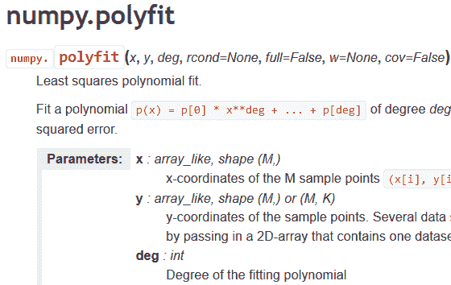
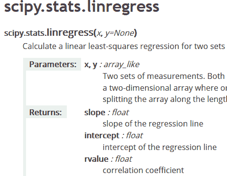
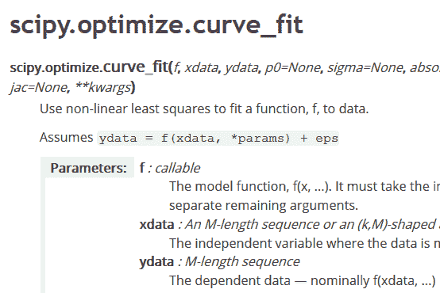
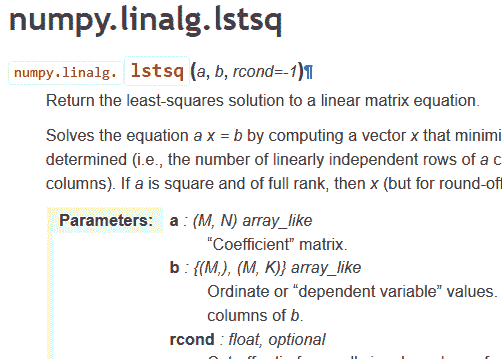
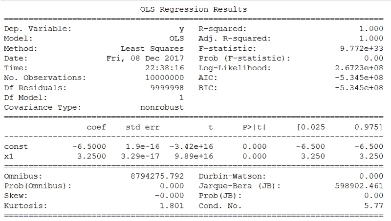
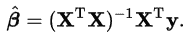
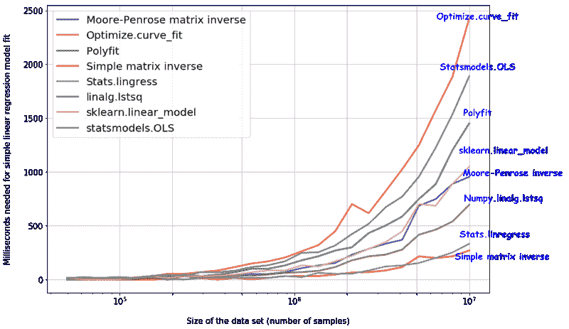

# 使用 Python 的数据科学:进行线性回归并测量其速度的 8 种方法

> 原文：<https://www.freecodecamp.org/news/data-science-with-python-8-ways-to-do-linear-regression-and-measure-their-speed-b5577d75f8b/>

作者:Tirthajyoti Sarkar

在本文中，我们讨论了使用 Python 代码/包执行简单线性回归的 8 种方法。我们掩饰了它们的优缺点，并展示了它们的相对计算复杂度。

对于许多数据科学家来说，[线性回归](https://en.wikipedia.org/wiki/Linear_regression)是许多统计建模和预测分析项目的起点。将线性模型(准确而快速地)拟合到大型数据集的重要性怎么强调都不为过。[本文中指出的](https://towardsdatascience.com/machine-learning-with-python-easy-and-robust-method-to-fit-nonlinear-data-19e8a1ddbd49)、*线性*术语在线性回归模型中是指系数，而不是指次数特征。

特征(或独立变量)可以是任何次数，甚至是超越函数，如指数、对数、正弦。因此，即使输出和特征之间的函数关系是高度非线性的，也可以使用这些变换和线性模型对大量自然现象进行(近似)建模。

另一方面，Python 正迅速成为数据科学家选择的事实上的编程语言。因此，对于数据科学家来说，了解所有不同的方法至关重要，他/她可以快速将线性模型拟合到相当大的数据集，并评估每个特征在过程结果中的相对重要性。

> 但是，Python 中是否只有一种方法可以进行线性回归分析？在有多种选择的情况下，如何选择最有效的方法？

由于[机器学习库 scikit-learn](http://scikit-learn.org/stable/) 的广泛流行，一种常见的方法通常是从该库中调用[线性模型类](http://scikit-learn.org/stable/modules/linear_model.html)并拟合数据。虽然这可以提供应用机器学习的其他[管道功能的额外优势(例如，数据标准化、模型系数正则化、将线性模型馈送到另一个下游模型)，但当数据分析师只需要快速简单的方法来确定回归系数(和一些基本的相关统计数据)时，这通常不是最快或最干净的方法。](http://scikit-learn.org/stable/modules/pipeline.html)

有更快更干净的方法。但是它们可能不提供相同的信息量或建模灵活性。

请继续读下去。

各种线性回归方法[的完整 boiler plate 代码可以在我的 GitHub 库](https://github.com/tirthajyoti/PythonMachineLearning/blob/master/Linear_Regression_Methods.ipynb)中找到。大多数都是基于[的 SciPy 包](https://docs.scipy.org/doc/scipy/reference/tutorial/general.html)。

SciPy 是建立在 Python 的 [Numpy](http://www.numpy.org/) 扩展之上的数学算法和便利函数的集合。它通过为用户提供用于操作和可视化数据的高级命令和类，为交互式 Python 会话增添了强大的功能。

让我简单讨论一下每种方法，

#### 方法:Scipy.polyfit()或 numpy.polyfit()

这是一个非常通用的最小二乘多项式拟合函数,它接受数据集和任意次多项式函数(由用户指定),并返回最小化平方误差的系数数组。[这里给出了该功能的详细描述](https://docs.scipy.org/doc/numpy-1.13.0/reference/generated/numpy.polyfit.html)。对于简单的线性回归，可以选择 1 次。如果要拟合更高次的模型，可以从线性要素数据中构造多项式要素并拟合到模型中。

#### 方法:stats . Lin regressive()

这是一个高度专业化的[线性回归函数](https://docs.scipy.org/doc/scipy/reference/generated/scipy.stats.linregress.html)，可在 Scipy 的 stats 模块中获得。它的灵活性相当有限，因为它只对两组测量值计算线性最小二乘回归进行了优化。因此，您不能使用它来拟合广义线性模型或多变量回归。但是，由于其专业性质，它是简单线性回归中最快的方法之一。除了拟合系数和截距项，它还返回基本统计数据，如 [*R* 系数和标准误差](http://blog.minitab.com/blog/adventures-in-statistics-2/regression-analysis-how-do-i-interpret-r-squared-and-assess-the-goodness-of-fit)。

#### 方法:Optimize.curve_fit()

这与 Polyfit 方法是一个思路，但本质上更通用。scipy.optimize 模块的这个[强大的函数可以通过最小二乘最小化将任何用户定义的函数拟合到数据集。](https://docs.scipy.org/doc/scipy/reference/generated/scipy.optimize.curve_fit.html)

对于简单的线性回归，我们可以写一个线性 mx+c 函数，并调用这个估计量。不用说，它也适用于多元回归。它返回最小平方测量值最小化的函数参数数组和关联的协方差矩阵。

#### 方法:numpy.linalg.lstsq

这是通过矩阵分解计算线性方程组最小二乘解的[基本方法。它来自 numpy 包中方便的线性代数模块。在引擎盖下，它通过计算向量 *x* 来求解方程 *a x = b* ，该向量最小化欧几里德 2 范数 *|| b — a x ||* 。](https://docs.scipy.org/doc/numpy-1.13.0/reference/generated/numpy.linalg.lstsq.html#numpy.linalg.lstsq)

该等式可以是欠定的、良好的或过定的(即， *a* 的线性独立行的数量可以小于、等于或大于其线性独立列的数量)。如果 *a* 是平方且满秩，那么 *x* (除了舍入误差)就是方程的“精确”解。

你可以用它进行简单或多变量回归，并得到计算出的系数和残差。一个小技巧是，在调用这个函数之前，你必须在 x 数据后面附加一列 1 来计算截距项。事实证明，这是解决线性回归问题的最快方法之一。

#### 方法:统计模型。OLS()

[Statsmodels 是一个很棒的小 Python 包](http://www.statsmodels.org/dev/index.html)，它为许多不同的统计模型的估计，以及进行统计测试和统计数据探索提供了类和函数。每个估计器都有一个结果统计的详细列表。根据现有的统计软件包对结果进行测试，以确保正确性。

对于线性回归，可以使用该软件包中的 OLS 或[普通最小二乘](https://en.wikipedia.org/wiki/Ordinary_least_squares)函数，获得关于估计过程的完整统计信息。

需要记住的一个小技巧是，您必须手动向 x 数据添加一个常数来计算截距，否则默认情况下它将只报告系数。以下是 OLS 模型的完整结果摘要。它像 R 或 Julia 这样的函数式统计语言一样丰富。

#### 方法:用矩阵逆矩阵法进行解析求解

对于条件良好的线性回归问题(至少在数据点数量>特征数量的情况下)，存在一个简单的封闭形式的矩阵解来计算保证最小平方最小化的系数。它是由，

关于该解决方案的详细推导和讨论在此讨论[。](https://en.wikipedia.org/wiki/Linear_least_squares_(mathematics))

这里有两个选择:

(一)利用简单的乘法矩阵求逆。

(b)首先计算 x 数据的 [Moore-Penrose 广义伪逆矩阵](https://en.wikipedia.org/wiki/Moore%E2%80%93Penrose_inverse)，随后与 y 数据进行点积。因为这第二个过程涉及[奇异值分解(SVD)](https://en.wikipedia.org/wiki/Singular-value_decomposition) ，所以它较慢，但是它可以很好地处理条件不佳的数据集。

#### 方法:sklearn.linear_model。线性回归( )

这是大多数机器学习工程师和数据科学家使用的[典型方法](http://scikit-learn.org/stable/modules/generated/sklearn.linear_model.LinearRegression.html)。当然，对于现实世界的问题来说，它可能从来不怎么使用，取而代之的是交叉验证和正则化的算法，如[套索回归](https://en.wikipedia.org/wiki/Lasso_(statistics))或[岭回归](https://en.wikipedia.org/wiki/Tikhonov_regularization)。但是那些高级功能的本质核心就在于这个模型。

#### 测量这些方法的速度和时间复杂度

作为一名数据科学家，应该总是寻找准确而快速的方法/函数来完成数据建模工作。如果该方法本来就很慢，那么它将为大型数据集造成执行瓶颈。

确定可伸缩性的一个好方法是运行增加数据集大小的模型，提取所有运行的执行时间并绘制趋势图。

这里是这个的锅炉板代码。这是结果。由于它们的简单性，stats . Lin regression 和简单矩阵求逆方法是最快的，甚至可以达到 1000 万个数据点。

#### 摘要

作为一名数据科学家，一个人必须总是探索解决同一分析或建模任务的多个选项，并选择最适合他/她的特定问题的选项。

在本文中，我们讨论了执行简单线性回归的 8 种方法。它们中的大多数也可扩展到更一般的多变量和多项式回归建模。我们没有列出这些方法的 R 值，因为它们都非常接近 1。

对于单变量回归，有数百万人工生成的数据点，回归系数估计得非常好。

本文的目标主要是讨论这些方法的相对速度/计算复杂度。我们通过在一个不断增长的合成数据集(多达 1000 万个样本)上进行测试，展示了每种方法的计算复杂度。令人惊讶的是，与 scikit-learn 广泛使用的线性模型相比，简单的矩阵逆解析解工作得非常快。

如有问题或想法分享，请联系作者[**tirthajyoti【AT】Gmail . com**](mailto:tirthajyoti@gmail.com)。你也可以查看作者的 [**GitHub 资源库**](https://github.com/tirthajyoti) 中其他有趣的 Python、R 或 MATLAB 代码片段和机器学习资源。如果你和我一样，对机器学习/数据科学/半导体充满热情，请随时[在 LinkedIn 上添加我](https://www.linkedin.com/in/tirthajyoti-sarkar-2127aa7/)或[在 Twitter 上关注我。](https://twitter.com/tirthajyotiS)