# 数据结构 101:数组——初学者的直观介绍

> 原文：<https://www.freecodecamp.org/news/data-structures-101-arrays-a-visual-introduction-for-beginners-7f013bcc355a/>

### 了解你每天使用的数据结构。

👋欢迎光临！让我们从一些重要的背景开始。让我问你这个问题:
✅你用智能手机听音乐吗？
✅你会在手机上保存联系人名单吗？
✅你见过比赛中的排行榜吗？

****如果你对其中任何一个问题的回答是“是”，那么几乎可以肯定你已经使用过数组，而你甚至不知道！😃**** 数组是存储 ****元素列表的非常强大的数据结构。**** 它们有无穷无尽的用途。它们在计算机科学领域非常重要。

在本文中，您将了解数组的优缺点、它们的结构、操作和用例。

让我们开始吧！**👍**

### 🔎深入探究数组的基本结构

为了理解它们是如何工作的，把你的计算机的内存想象成一个网格是非常有帮助的，就像下面的这个。每条信息都存储在构成网格的一个小元素(方块)中。

**数组**利用这种“网格”结构**将相关信息的** **列表存储在** **相邻的内存位置**中，以保证找到这些值的极高效率。🔳🔳🔳🔳

**你可以这样想数组:**

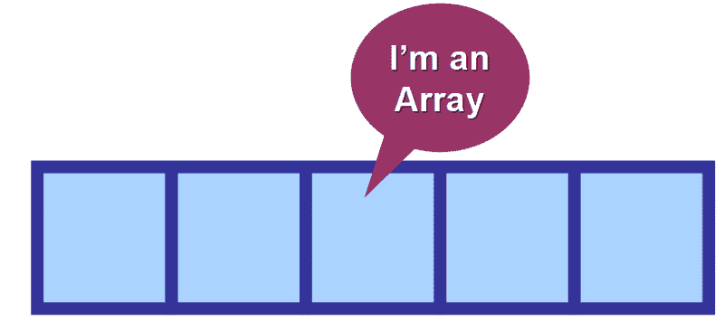

它们的元素在内存中是相邻的。如果你需要访问不止一个，这个过程是非常优化的，因为你的计算机已经知道值的位置。

太棒了，对吧？让我们了解一下这在幕后是如何工作的！😃

#### 📚分类

数组被归类为**同构数据结构**，因为它们存储相同类型的**元素。**

它们可以存储数字、字符串、布尔值(真和假)、字符、对象等等。但是**一旦你定义了你的数组将要存储的值的类型，** **它的所有元素都必须是相同的类型。你不能“混合”不同类型的数据。**

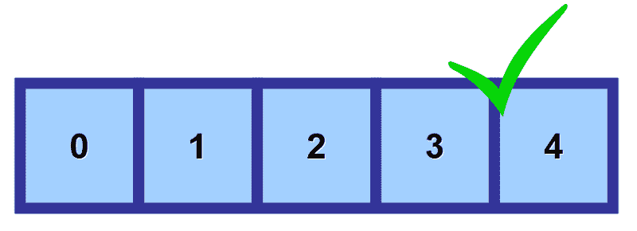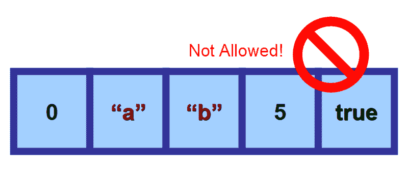

### 👀阅读价值观——奇迹开始了！

数组的惊人威力来自于它们访问值的效率。这得益于它的网格状结构。让我们更详细地看看这个。🔍

**当你创建一个数组时，你:**
——把它赋给一个变量。👈
-定义它将存储的元素类型。🎈
-定义其大小(元素的最大数量)。📚

****💡**** **注意:**您分配给这个变量的名称非常重要，因为您将在代码中使用它来访问值和修改数组。

但是你怎么能告诉计算机你想要访问哪个特定的值呢？这就是指数发挥重要作用的地方！

#### 1️⃣指数

**你使用所谓的“索引”**(复数的“索引”)来访问数组中的值。这是一个数字，表示值的存储位置。

如下图所示，数组中的第一个元素是使用索引 0 引用的。随着您进一步向右移动，内存中的每个空间的索引都会增加 1。

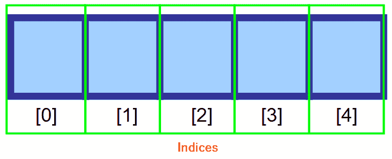

****💡**** **注:**我知道一开始从 0 而不是 1 开始计数看起来很奇怪，但这叫做[从零开始计数](https://en.wikipedia.org/wiki/Zero-based_numbering)。这在计算机科学中很常见。

****访问一个元素的一般语法是:**** `****<ArrayVariable>[<index>]****`

****例如:****
如果你的数组存储在变量`****myArray****`中，你想访问第一个元素(在索引 0 处)，你可以使用`****myArray[0]****`

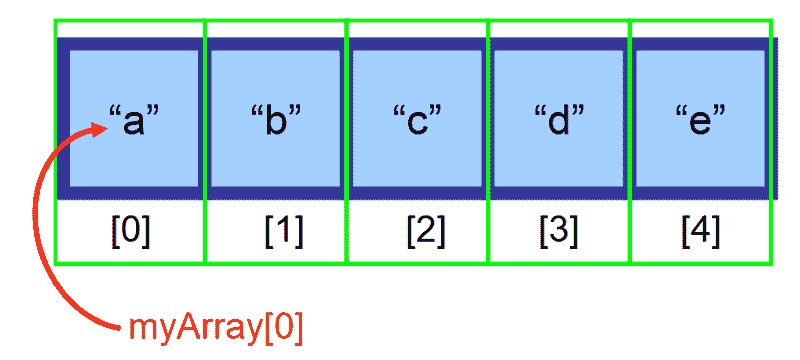

#### 2️⃣记忆

现在你知道了如何访问值，让我们看看数组是如何存储在你的计算机内存中的。**当你定义数组的大小时，从**开始，内存中的所有空间都被“保留”给将来你可能想要插入的值。

****💡注意:**** 如果你没有用值填充数组，那么这个空间将一直保留为空，直到你填充为止。

**例如:**
假设你定义了一个大小为 5 的数组，但是只插入了一个值。所有剩余的空间将被清空并“保留”在内存中，等待将来的分配。

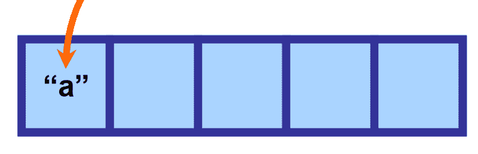

这很关键，因为数组在访问值时效率极高，因为所有元素都存储在内存中的连续空间中。这样，计算机就知道在哪里可以找到你需要的信息。

****但是……****这也有不好的一面😞因为这是**的**而不是**的**。您正在为将来可能不会发生的操作保留内存。这就是为什么当你事先知道你要存储多少元素时，数组是被推荐的。

### 🔧运营—幕后！

现在你已经知道了数组在使用时是什么，以及它们是如何存储元素的，我们将深入研究它们的操作，比如插入和移除。

#### 1️⃣插入——欢迎！

假设我们有一个大小为 6 的数组，还有一个空的空间。我们想在数组的开头(索引 0)插入一个元素“e”，但是这个位置已经被元素“a”占据了，我们该怎么办？

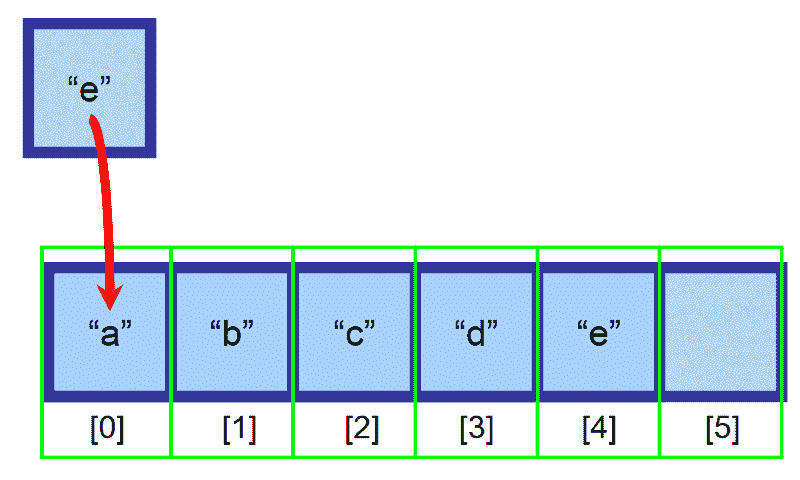

**为了插入数组**，我们将位于插入位置右侧的所有元素向右移动一个索引。元素“a”现在将位于索引 1，元素“b”将位于索引 2，依此类推…

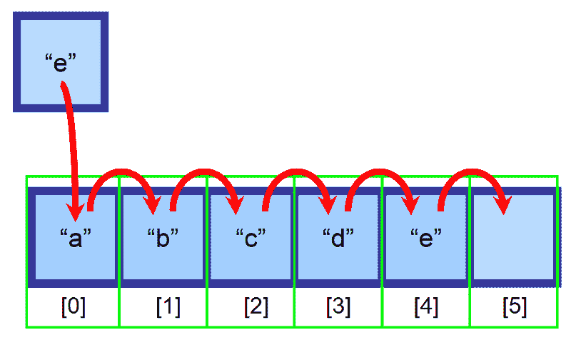

****💡**** **注意:**您需要创建一个变量来跟踪包含元素的最后一个索引。在上图中，数组在插入前被填充到索引 4。这样，您可以确定数组是否已满，以及应该使用什么索引在末尾插入一个元素。

这样做之后，我们的元素就成功插入了。👏

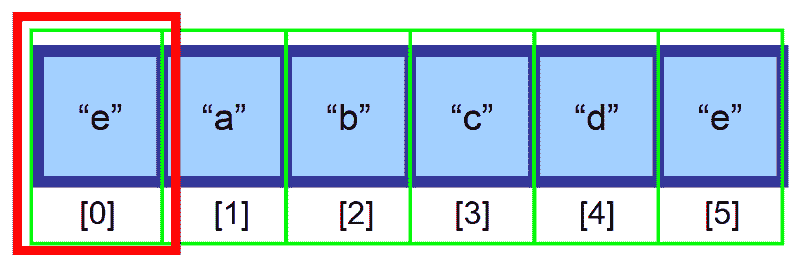

#### ⚠️，等一下！如果数组满了会怎么样？

如果**数组已满，而你试图插入**一个元素，你认为会发生什么？😱

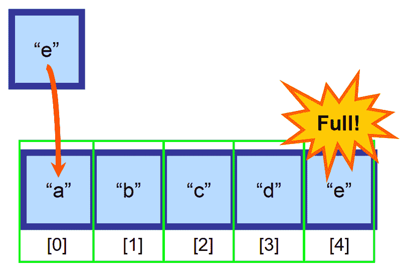

在这种情况下，您需要创建一个新的更大的数组，并将所有元素手动复制到这个新数组中。这个手术是**非常昂贵，时间方面。**想象一下，如果你有一个包含数百万个元素的数组，会发生什么！这可能需要很长时间才能完成。⏳

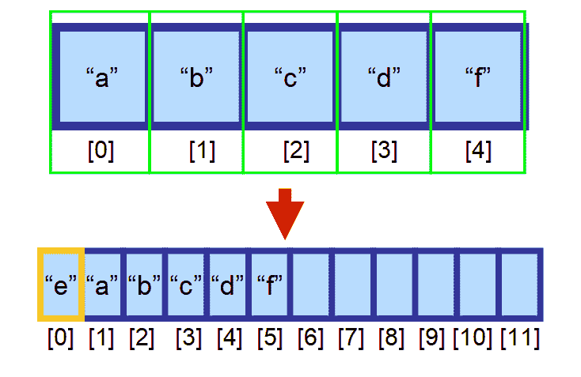

****💡**** **注意:**这个规则的唯一例外是，当插入非常快时，在数组的**端**插入一个元素(在最后一个元素右边的索引处)并且还有可用空间。这是在常数时间 O(1)内完成的。

#### 2️⃣删除—再见，再见！

现在假设你想从数组中删除一个元素。

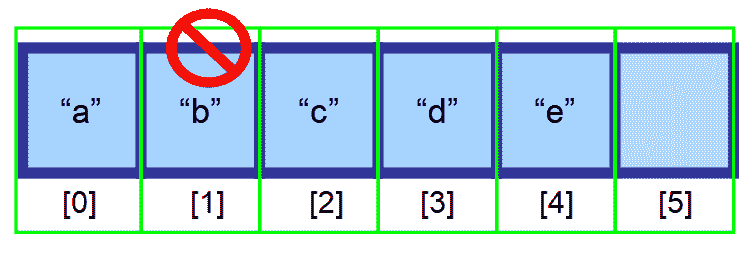

为了保持随机存取的效率(能够以极快的速度通过索引访问数组)，元素必须存储在连续的内存空间中。你不能只删除元素而留下空白。

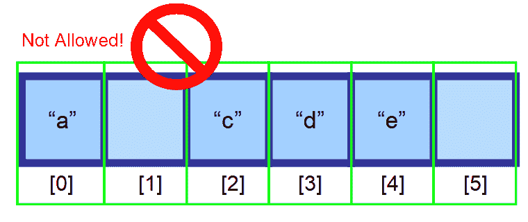

您应该将想要删除的元素后面的元素向左移动一个索引。

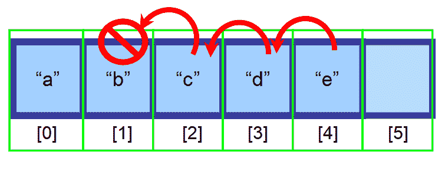

最后，你得到了这个数组👇。如你所见，“b”已被成功删除。

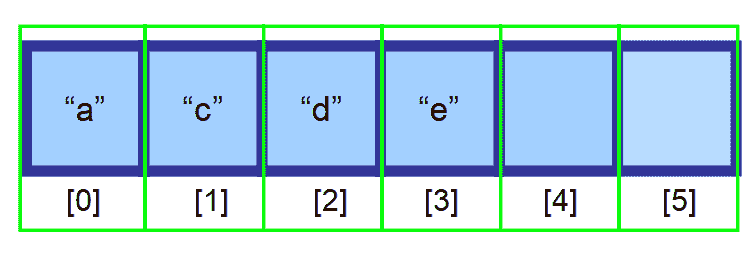

****💡注意:**** 删除是非常高效的，当你删除了 ****最后一个**** 元素。因为您需要创建一个变量来跟踪包含元素的最后一个索引(在上图中，索引 3)，所以您可以使用该索引直接删除该元素。

#### 3️⃣发现了一种元素

在数组中查找元素有三种选择:

*   **如果你知道它的位置**，使用索引。
*   **如果你不知道它在哪里，而你的数据是经过排序的**，你可以使用算法来优化你的搜索，比如二分搜索法。
*   **如果您不知道它的位置，并且您的数据没有排序**，您将需要搜索数组中的每个元素，并检查当前元素是否是您正在寻找的元素(请参见下图的顺序)。

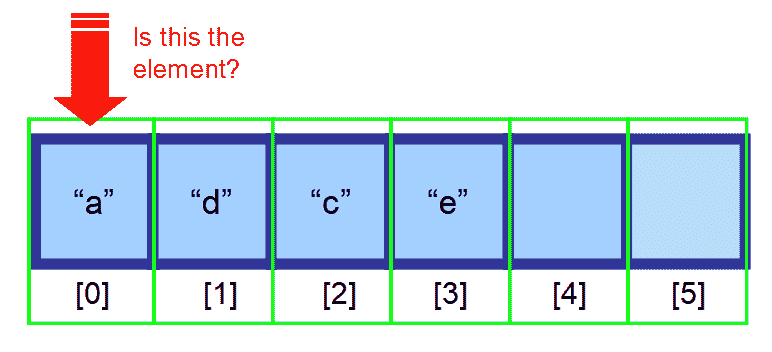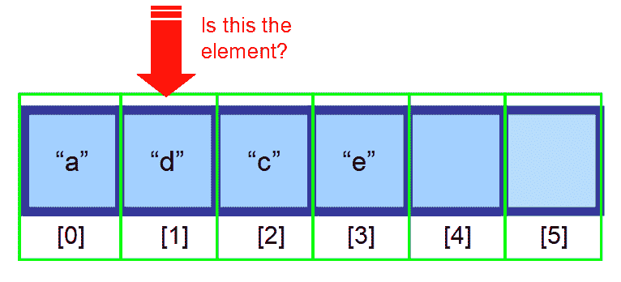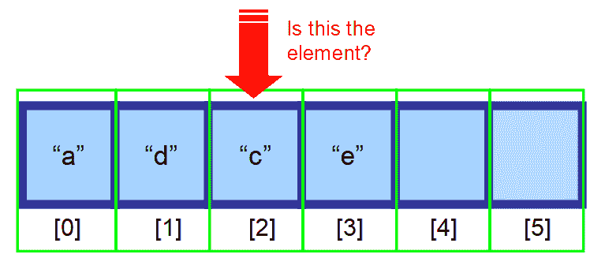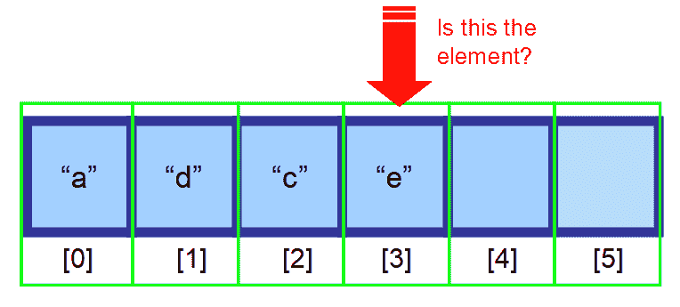

### 👋总之…

*   数组是非常强大的数据结构,它存储相同类型的元素。元素的类型和数组的大小是固定的，并在创建时定义。
*   **数组创建后，内存立即被分配**，在赋值之前，内存一直是空的。
*   它们的**元素位于内存**中的连续位置，因此可以使用**索引**非常有效地访问它们(随机访问，O(1) =常数时间)。
*   **指数从 0** 开始，而不是我们习惯的 1。
*   **在数组的开头或中间插入元素**包括将元素向右移动。如果数组已满，则创建一个新的更大的数组(效率不是很高)。在数组末尾插入是非常高效的，常数时间 O(1)。
*   从数组的开始或中间移除元素包括将所有元素向左移动，以避免在内存中留下空白空间。这保证了元素存储在内存中的连续空间中。移除数组末尾的元素非常有效，因为您只删除了最后一个元素。
*   **要找到一个元素**，需要检查整个数组，直到找到为止。如果数据已排序，您可以使用二分搜索法等算法来优化该过程。

> *“学习昨天，活在今天，希望明天。重要的是不要停止质疑。”*
> 
> *—爱因斯坦*

#### 👋谢谢大家！

我真的希望你喜欢我的文章。❤️
**在** [推特](https://twitter.com/Estefania_CN_)上关注我，找到更多像这样的文章。😃