# 数据结构 101:图表——初学者的直观介绍

> 原文：<https://www.freecodecamp.org/news/data-structures-101-graphs-a-visual-introduction-for-beginners-6d88f36ec768/>

#### 了解您每天使用的数据结构

👋欢迎光临！让我们从一些重要的背景开始。让我问你一件事:✅，你用谷歌搜索吗？
**✅你用谷歌地图吗？**
**✅你使用社交媒体网站吗？**

如果你对这些问题中的任何一个回答是肯定的，那么你肯定使用过图表，而你甚至不知道！惊讶吗？**😲**我也是！本文将向您直观地介绍图形世界、它们的用途、元素和类型。

这些数据结构因其惊人的能力而真正吸引了我的注意力。它们如此强大，以至于你甚至无法想象它们在现实世界中的应用有多么多样化。**我们开始吧！**😁

### 🌐真实世界的应用——奇迹开始了！

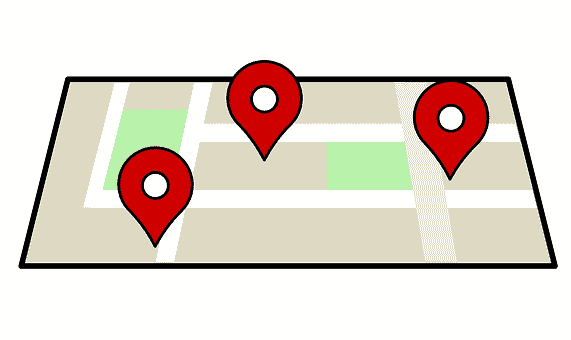

**图表应用于不同的行业和领域:**

*   GPS 系统和谷歌地图使用图表找到从一个目的地到另一个目的地的最短路径。
*   **社交网络**用图来表示用户之间的联系。
*   **谷歌搜索**算法使用图形来确定搜索结果的相关性。
*   **运筹学**是一个使用图形来寻找最佳路径以降低货物和服务的运输和交付成本的领域。
*   **连化学**都用图形来表示分子！！！❤️

他们的应用很神奇吧？让我们开始穿越这个世界的旅程吧！😄

### 🔵满足图表！

现在您已经有了一些背景，让我们从谈论它们的主要目的和元素开始。

**图形用于表示、查找、分析和优化元素(房屋、机场、位置、用户、物品等)之间的联系。).**

这是一个图表的示例:

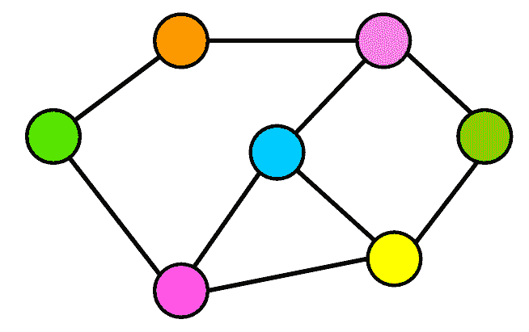

Graph.

#### 💠积木

我相信你注意到了上图中的两个主要元素:圆圈和连接它们的粗线。它们分别被称为**节点**和**边**。

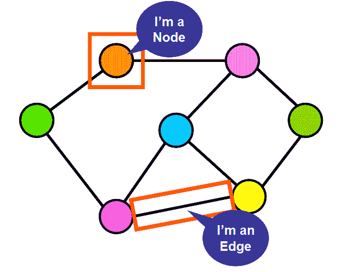

让我们更详细地看看它们吧！**👍**

*   **节点:**它们是创建网络的**元素**。它们可以代表**房屋、地点、机场、港口、公交车站、建筑、用户、**基本上任何你可以代表的与网络中其他类似元素相连的事物。
*   **边:**它们是节点之间的**连接**。它们可以代表**街道、航班、公交路线、社交网络中两个用户之间的联系、**或者任何可能代表你正在处理的上下文中节点之间的联系的东西。

#### 😱如果没有联系会怎么样？

如果两个节点没有通过边连接，这意味着它们之间没有直接连接。但是不要慌！😩沿着一系列的边，你可能仍然能够通过 f **从一个节点到另一个节点，类似于穿过几条街道到达你的最终目的地。🚛️ 🚛 🚛**

比如下图中，即使**紫色节点**(左)和**黄色节点**(右)之间没有**直接**连接(**边**，也可以从紫色节点到橙色节点，到粉色节点，到绿色节点，最后到达黄色节点。🏁

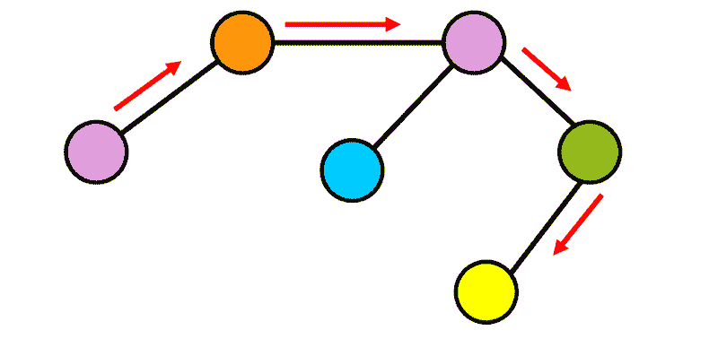

No direct connection between the purple and yellow node.

这是图的一个关键方面，您可以通过遵循可用的路径来搜索您正在寻找的元素。

### 🌟符号和术语

学习使用图形的正式“语言”非常重要:

*   `**|V|**` =图中顶点总数**(**节点**)。**
*   **`**|E|**` =图中连接总数**(**边**)。****

****在下面的例子中，`**|V| = 6**`是因为有六个节点(圆)
`**|E| = 7**` 是因为有七条边(线)。****

****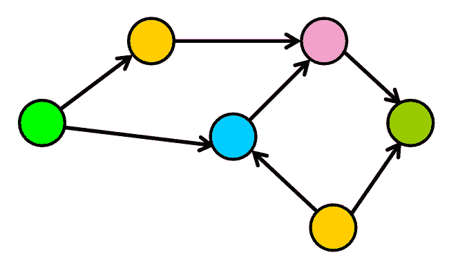

Graph.**** 

### ****📚图形的类型****

****图是根据它们的边(连接)的特征来分类的。**让我们来详细看看它们吧！**😃********

#### **1️⃣有向图**

**在有向图中，边是有方向的。它们从一个节点到另一个节点，没有办法通过那个边回到初始节点。**

**如下图所示，**边(连接)现在有了指向特定方向的箭头。** **把这些边缘想象成单行道。**你可以朝一个方向走，到达目的地，但你不能通过同一条街道返回，所以你需要找到一条替代路径。**

**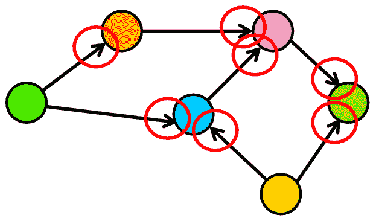

Directed Graph.** 

**🍕例如，如果我们为一个比萨饼送货服务创建一个图，代表一个城市，两个房子(节点)可能由一条单行道(边)连接。你可以通过这条街从房子 A 到房子 B，但是你不能回去，所以你必须走另一条路。**

**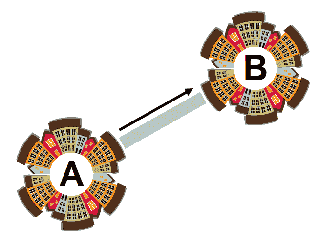**

******💡**注意:**在一个有向图中，y **ou 可能根本无法返回到你的初始位置 i** 如果没有适当方向的路径。😞在下图中，您可以看到您可以成功地从紫色节点到绿色节点，但是请注意，没有办法从绿色节点返回到紫色节点，因为边是“单行道”**

**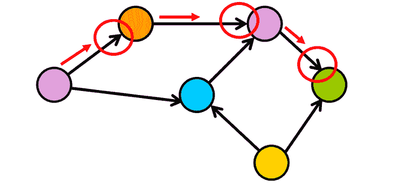

Point of No Return.** 

#### **2️⃣无向图**

**在这种类型的图形中，边是无方向的(它们没有特定的方向)。把无向边想象成双向街道。您可以从一个节点到另一个节点，并通过相同“路径”返回。**

******💡**注意:**当你看到一个图的边没有指向特定方向的箭头时，你可以假设这个图是无向的。**

**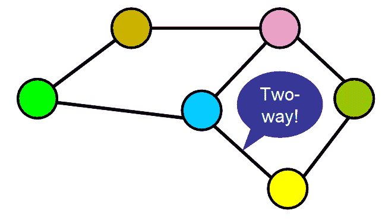**

**🍕对于我们的比萨饼送货服务，这将意味着送货摩托车可以通过同一条街道或路径从源头到达目的地。😇).**

**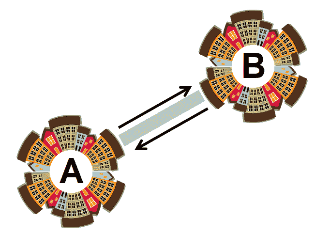**

**在下图中，你可以从紫色节点**到绿色节点，然后通过相同的路径**返回，所以你不会到达一个不可返回的点。😌**

**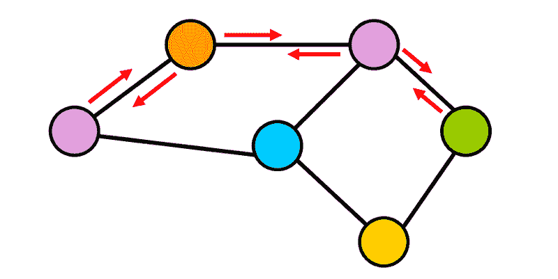

You can go back!** 

### **🏋重量？—没错，重量！**

#### **1️⃣加权图**

****在加权图中，每条边都有一个与之相关的值(称为权重)**。该值用于表示它们连接的节点之间的某种可量化的关系。**

**例如，权重可以代表**距离、时间、社交网络中两个用户之间共享的连接数量、**或任何可以用来描述您正在处理的上下文中节点之间的连接的内容。**

**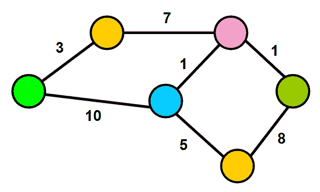

Weighted Graph.** 

**这些权重由 [**Dijkstra 的算法**](https://www.cs.usfca.edu/~galles/visualization/Dijkstra.html) 使用，通过寻找网络中节点之间的最短或最便宜的路径来优化路线。(敬请关注一篇关于 Dijkstra 算法的文章！😃).**

#### **2️⃣未加权图**

**相比之下，未加权的图**没有与其边相关联的权重。**这种类型的图的一个例子可以在社交网络中找到，其中边代表两个用户之间的联系。这种联系无法量化。因此，边缘没有重量。**

**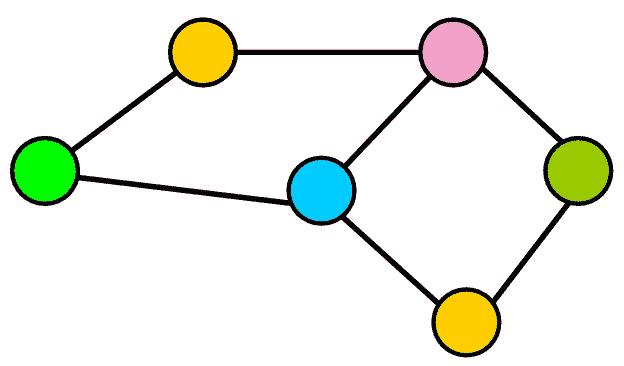

Unweighted Graph.** 

******💡**注意:**你可能已经注意到，到目前为止，我们的图只有一条边连接每对节点。人们很自然地会问，一对节点之间是否可能有不止一条边。**答**事实上，这在 M**ulti graph 上是可能的！它们可以有多条边连接同一对节点。****

**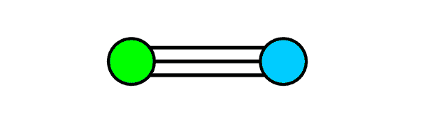

Multigraph.** 

### **🏆边数！—一个重要因素**

**知道一个图的边是多还是少是非常重要的，因为这是决定如何在代码中表示这个数据结构的关键因素。让我们看看不同的类型！**👍****

#### **1️⃣稠密图**

**稠密图有很多边。但是，等等！⚠️ 我知道你一定在想什么，你如何确定什么是“多边缘”？这有点太主观了吧？😇我同意你的观点，所以让我们稍微量化一下:**

**👉**让我们找出一个有向图中边的最大数量。**如果有向图中有`****|V|****`个节点(在下面的例子中，有六个节点)，这意味着每个节点最多可以有`****|v|****`个连接(在下面的例子中，有六个连接)。**

**为什么？因为 ****每个节点都有可能与所有其他节点以及自身**** (参见下面的“循环”) ****。**** 因此， ****图可以拥有的** **最大边数为**** `****|V|*|V|****`，即节点总数乘以每个节点可以拥有的最大连接数。**

****当图中的边数接近最大边数时，图是稠密的。**😉******

**

Graph.** 

**💡 ****注:**** “回路”发生在一个节点有一条边将它连接到自己的时候。奇怪又有趣，对吧？😄**

**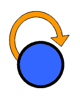

“Loop” representation.** 

#### **2️⃣稀疏图**

****稀疏图的边很少。**如下图所示，节点之间没有太多的连接。**

******当图中的边数明显少于最大边数时，图是稀疏的。😉******

**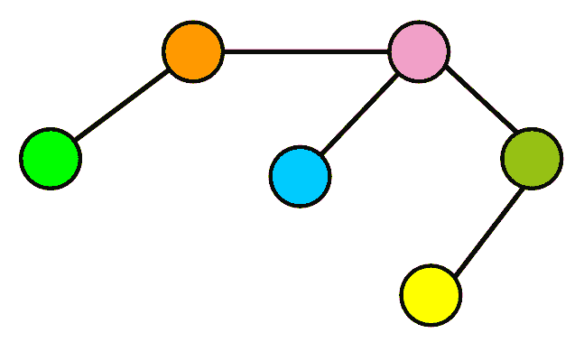

Sparse Graph.** 

### **⭕️满足周期！**

**现在让我们来看一个理解图形的重要概念，循环。**

**您可能已经注意到，如果您沿着图中的一系列连接，您可能会找到一条**路径，它会将您带回到同一个节点。**这就像“绕圈行走”，就像你在你的城市里开车，你选择了一条可以带你回到最初位置的路。**

**在图中，这些“圆形”路径被称为“圈”。它们是在同一个节点开始和结束的**有效路径。**例如，在下图中，你可以看到，如果你从任何一个节点开始，你可以沿着边返回到同一个节点。**

**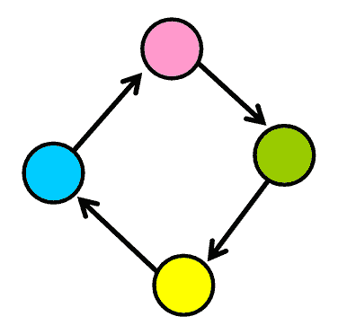

Sample cycle.** 

**周期并不总是“孤立的”,因为它们可能是更大图形的一部分。您可以通过在特定节点上开始搜索并找到将您带回到相同节点的路径来检测它们。**

**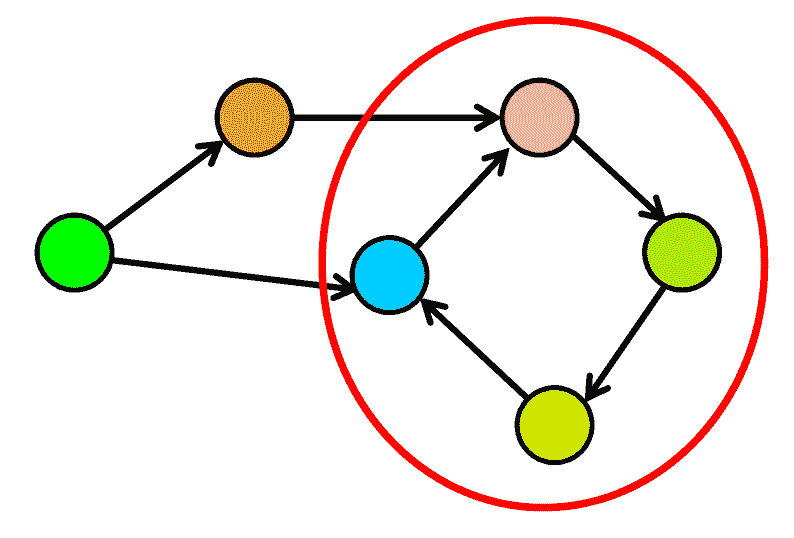

Cycle in a graph.** 

### **👋总之…**

*   ****图是令人敬畏的数据结构**，你每天都在通过谷歌搜索、谷歌地图、全球定位系统和社交媒体使用它。**
*   **它们用于**表示共享连接**的元素。**
*   **图中的元素被称为**节点**，它们之间的连接被称为**边**。**
*   **图可以是**有向的，**当它们的边有特定的方向时，类似于单行道，或者**无向的，**当它们的边没有特定的方向时，类似于双行道。**
*   **边可以有一个与之关联的值，称为**权重**。**
*   **如果一个图有许多条边，那么它被称为**稠密**图。否则，如果它有很少的边，它被称为**稀疏**图。**
*   **一系列的连接可以形成一个**循环**，如果它们创建了一条路径让你返回到同一个节点。**

****继续学习这些惊人的数据结构！** **作为一名开发者，这对你的未来是完全值得的。**我现在正在学习数据结构，我发现它们非常吸引人。😃 🎆 ❤️**

> **重要的是不要停止提问。好奇心有它存在的理由。—阿尔伯特·爱因斯坦**

#### **👋谢谢大家！**

**我真的希望你喜欢我的文章。❤️
在[推特](https://twitter.com/EstefaniaCassN)上关注我。😃**