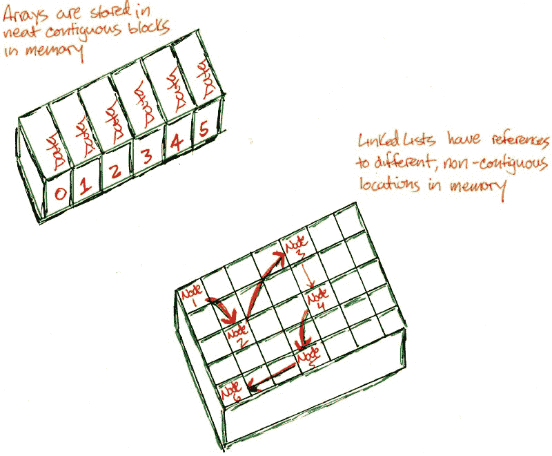

# 数据结构 101:链表

> 原文：<https://www.freecodecamp.org/news/data-structures-101-linked-lists-254c82cf5883/>

凯文·特尼

像[栈](https://medium.freecodecamp.org/data-structures-101-stacks-696b3282980)和[队列](https://medium.freecodecamp.org/data-structures-101-queues-a6960a3c98)一样，链表也是一种顺序集合的形式。不一定要按顺序。链表由独立的节点组成，这些节点可以包含任何类型的数据。每个节点都有对链接中下一个节点的引用。


我们可以用链表来模拟堆栈和队列。我们也可以把它作为创建或扩充其他数据结构的基础。对于链表，我们主要关心的是**快速插入和删除，**这比数组更有效。

这个结构的构建块是一个节点。

```
const Node = function(value) {  this.value = value;  this.next = null;};
```

我们的节点由两个属性构建，一个是保存数据的`value`，另一个是最初设置为 null 的引用`next`。`next`属性用于“指向”链接中的下一个节点。链表的缺点之一是每个引用比数组需要更大的内存开销。

### 履行

```
const LinkedList = function(headvalue) {  // !! coerces a value to a Boolean  if (!!headvalue) {    return "Must provide an initial value for the first node"  } else {    this._head = new Node(headvalue);    this._tail = this.head;  }};
```

在我们的第二个构造函数中，我们测试了为第一个节点提供的值。如果为真，我们继续用传递的值创建一个新节点，并最初将头设置为尾。

#### 插入

```
LinkedList.prototype.insertAfter = function(node, value) {  let newNode = new Node(value);  let oldNext = node.next;  newNode.next = oldNext;  node.next = newNode;  if (this._tail === node) {    this._tail = newNode;  }  return newNode;};
```

对于这种方法，我们创建一个新节点并调整引用。原始节点的前一个 next 引用现在指向 newNode。新节点的下一个引用“指向”前一个节点的下一个引用。最后，我们检查并重置 tail 属性。

```
LinkedList.prototype.insertHead = function(value) {  let newHead = new Node(value);  let oldHead = this._head  newHead.next = oldHead;  this._head = newHead;  return this._head;};
```

```
LinkedList.prototype.appendToTail = function(value) {  let newTail = new Node(value);  this._tail.next = newTail;  this._tail = newTail;  return this._tail;};
```

在链表的开头或结尾插入是快速的，在常数时间内操作。为此，我们创建一个带有值的新节点，并重新排列我们的引用变量。我们用`insertHead`重置现在是头部的节点，或者用`appendToTail`重置现在是尾部的节点。

这些操作代表集合的快速插入、堆栈的推入和队列的入队。人们可能会想到，数组的非移位也是如此。不会，因为使用 unshift 时，集合的所有成员都必须移动一个索引。这使得它成为线性时间操作。

#### 删除

```
LinkedList.prototype.removeAfter = function(node) {  let removedNode = node.next;  if (!!removedNode) {    return "Nothing to remove"  } else {    let newNext = removedNode.next    node.next = newNext;    removedNode.next = null; // dereference to null to free up memory    if (this._tail === removedNode) {      this._tail = node;    }  }  return removedNode;};
```

从测试要删除的节点开始，我们继续调整引用。取消对`removedNode`的引用并将其设置为 null 非常重要。这可以释放内存，并避免多次引用同一个对象。

```
LinkedList.prototype.removeHead = function() {  let oldHead = this._head;  let newHead = this._head.next;  this._head = newHead;  oldHead.next = null;  return this._head;};
```

在 removeAfter 中删除一个头和一个指定节点是常量时间删除。另外，如果尾部的值是已知的，那么可以在 O(1)中进行尾部去除。否则我们必须线性移动到末端来移除它，O(N)；

#### 循环和 forEach

我们使用下面的代码来遍历一个链表或者对每个节点值进行操作。

```
LinkedList.prototype.findNode = function(value) {  let node = this._head;  while(node) {    if (node.value === value) {      return node;    }    node = node.next;  }  return `No node with ${value} found`;};
```

```
LinkedList.prototype.forEach = function(callback) {  let node = this._head;  while(node) {    callback(node.value);    node = node.next;  }};
```

```
LinkedList.prototype.print = function() {  let results = [];  this.forEach(function(value) {    result.push(value);  });  return result.join(', ');};
```



链表的主要优点是快速插入和删除，而无需重新排列项目或重新分配空间。当我们使用数组时，内存空间是连续的，这意味着我们把它们放在一起。有了链表，我们可以到处都有内存空间，通过使用引用来实现非连续存储。对于数组来说，引用的局部性意味着数组可以更好地缓存值，从而加快查找速度。对于链表，缓存没有得到优化，访问时间也更长。

链表的另一个方面是不同类型的配置。两个主要的例子是**循环**链接，其中尾部引用头部，头部引用尾部。**双重**链接是指当一个节点除了引用下一个节点外，还引用前一个节点。

### 时间复杂度

插入

*   insertHead，appendToTail — O(1)
*   如果特定节点是已知的，insertAfter-O(1)

删除

*   remove head—O(1)；
*   如果一个特定的节点是已知的，remove after-O(1)
*   如果节点未知— O(N)

横越

*   findNode，forEach，print-O(N)

### 资源

[引用地点](https://en.wikipedia.org/wiki/Locality_of_reference)
[精彩答案此处](https://stackoverflow.com/questions/166884/array-versus-linked-list)
[和此处](https://stackoverflow.com/questions/166884/array-versus-linked-list)
[链表](https://en.wikipedia.org/wiki/Linked_list)

感谢阅读。在实践中，尝试用链表实现堆栈或队列，或者在每个节点中存储数组并提取数据。当我使用数组时，问问自己，它实际上是满足我需求的最佳选择吗？