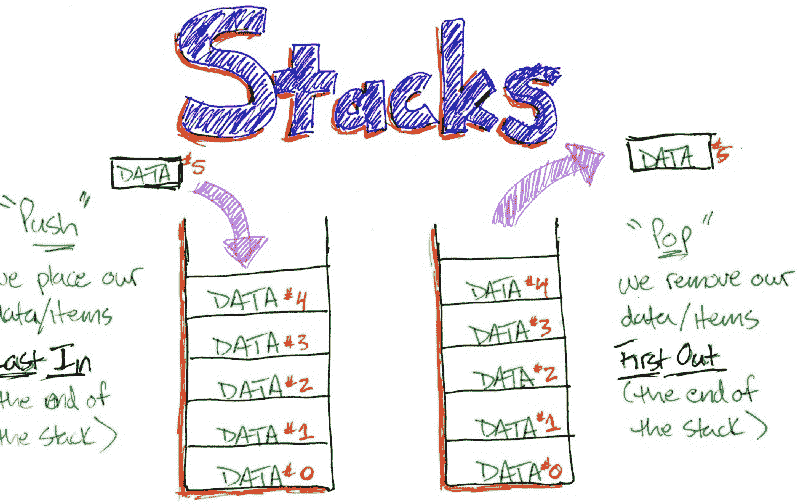

# 数据结构 101:堆栈

> 原文：<https://www.freecodecamp.org/news/data-structures-101-stacks-696b3282980/>

凯文·特尼

# 数据结构 101:堆栈


Photo by [Mathieu Turle](https://unsplash.com/@nbmat?utm_source=medium&utm_medium=referral) on [Unsplash](https://unsplash.com?utm_source=medium&utm_medium=referral)

### 栈是计算机科学中最基本的数据结构。

数据结构是组织信息的一种方式。它们提供了一种以独特的方式和方法存储不同类型数据的手段，以访问数据的全部或不同部分。

### 从堆栈开始

你用过堆栈吗？当然啦！你的电子邮件是一个堆栈，新邮件进来，放在最上面。当你读完最新的邮件时，你把它从顶部移除。在开发中，每当您调用一个函数时，该函数就被放在处理代码的引擎的堆栈中。

我们如何使用堆栈是一个**后进先出**的处理系统。

一个类比将是一个处方。假设我们想做一碗意大利面条。有哪些步骤？

1.  拿个壶来
2.  加水
3.  将水烧开
4.  向水中加盐
5.  加入意大利面
6.  将意大利面煮至变软

现在当意大利面做好了，我们必须回到我们开始的地方，一个干净的厨房。我们需要一种方法来组织我们的任务列表，并帮助我们回到我们离开的地方。

JavaScript 是一种单线程语言。用最简单的话来说，就是它一次只能做一件事，就像我们一样。那么我们选择的语言是如何有条理地处理这个问题的呢，斯塔克斯？



如您所见，堆栈是处理任务、删除任务并最终回到起点的一种干净的方式。

栈是有代价的:内存。对于我们放入堆栈的每个项目，我们都为其分配一个堆栈框架。想象一个数组索引。每个索引都被分配了空间来保存一些东西。如果我们不断增加堆栈，我们就有可能耗尽空间，就像停车场已经满了一样。当这种情况发生时，我们有一个溢出，因此，术语“堆栈溢出”。这可能导致崩溃和进程停滞。


我们如何回收内存？当从堆栈中移除一个项目时，JavaScript 使用“垃圾收集”来释放资源并回收以前使用的存储空间。

### 履行

首先，我们如何存储数据？在 JavaScript 中我们可以用什么来保存数据？我们可以使用像数组这样的原生对象，我们熟悉并使用内置的方法，push 和 pop。好了，我想我们结束了，回头见…

不，为了理解堆栈是如何工作的，我们使用基本对象形式。

我们需要一个构造函数在调用时建立存储机制和属性。

```
const Stack = function(capacity) {  this.storage = {};  this.capacity = capacity || Infinity;  this._count = 0;}
```

这构成了堆栈存储机制。如何以后进先出的方式将数据推入堆栈？将 push 添加到 Stack 的原型中。

```
Stack.prototype.push = function(value) {  if (this._count < this._capacity){    this.storage[this._count++] = value;    return this._count;  }  return "Max capacity reached, please remove a value before inserting a new value";}
```

推送方法检查我们的容量。如果为真，我们将值添加到存储中，并返回堆栈中有多少项。

【这个。_count++]首先被计算为 0，我们使用后缀运算符++来增加计数。我们的堆栈在 this.storage['0']处有一个值，我们返回 1，因为我们的堆栈中有一个项目。

让我们从堆栈中移除项目或“弹出”它们。

```
Stack.prototype.pop = function() {  let value = this.storage[--this._count];  delete this.storage[this._count];  if (this._count < 0) {    this._count = 0;  }  return value;}
```

使用 pop，我们将最后一个值存储在堆栈中。如果我们先移除它，我们就不会有它作为返回值。由于前缀运算符，我们找到 this.count 的值，并在对其求值之前先将其递减。如果我们有 this.count === 1，this.storage[ — this.count]被评估为 this.storage['0']。

看看栈顶是什么呢？它的接口是“peek”。

```
Stack.prototype.peek = function() {  return this.storage[this._count -1]}
```

最后，数数…

```
Stack.prototype.count = function(){  return this._count;}
```

具有类堆栈的完整实现 ES6 风格:

```
class Stack {  constructor(capacity) {    this.storage = {};    this._count = 0;    this.capacity = capacity || Infinity;  }
```

```
 push(value) {    if (this._count < this.capacity){    this.storage[this._count++] = value;    return this._count;    }    return "Max capacity reached, please remove a value before inserting a new value";  }
```

```
 pop() {    let value = this.storage[--this._count];    delete this.storage[this._count];    if (this._count < 0) {      this._count = 0;    }    return value;  }  peek() {    return this.storage[this._count - 1];  }  count() {    return this._count;  }};let stack = new Stack();stack; // Stack { storage: {}, _count: 0, capacity: Infinity }stack.push('yea')stack.push('oh yea');
```

```
stack; // Stack {storage: { 0: 'yea', 1: 'oh yea' },  _count: 2,  capacity: Infinity }
```

```
stack.pop(); // 'oh yea'stack; // Stack { storage: { 0: 'yea' }, _count: 1, capacity: Infinity }
```

```
stack.push('nope');stack.push('yup');stack; // Stack {storage: { 0: 'yea', 1: 'nope', 2: 'yup' },  _count: 3,  capacity: Infinity }
```

```
stack.count(); // 3stack.peek(); // 'yup'stack; // Stack {storage: { 0: 'yea', 1: 'nope', 2: 'yup' },  _count: 3,  capacity: Infinity }
```

感谢您阅读这篇文章。我的目标是对栈、它们的用途以及我们为什么需要它们给出一个清晰整洁的解释。[接下来:队列](https://medium.freecodecamp.org/data-structures-101-queues-a6960a3c98)。