# JavaScript 中的数据结构——代码示例

> 原文：<https://www.freecodecamp.org/news/data-structures-in-javascript-with-examples/>

大家好！在这篇文章中，我们将关注计算机科学和软件开发的一个关键话题:数据结构。

对于任何在软件开发领域工作的人来说，这肯定是一个必须知道的话题，但是当你开始时，它可能很难理解，甚至有点吓人。

在这篇文章中，我将试着简单解释一下数据结构，它们是什么，它们什么时候有用，以及我们如何用 JavaScript 实现它们。

我们走吧！

## 目录

*   [什么是数据结构？](#what-is-a-data-structure)
*   [数组](#arrays)
*   [对象(哈希表)](#objects-hash-tables-)
*   [堆栈](#stacks)
*   [队列](#queues)
*   [链表](#linked-lists)
    *   [单链表](#singly-linked-list)
    *   [双向链表](#doubly-linked-lists)
*   [树木](#trees)
    *   [二叉树](#binary-trees)
    *   [堆](#heaps)
*   [图表](#graphs)
    *   [无向图和有向图](#undirected-and-directed-graphs)
    *   [加权和未加权的图形](#weighted-and-unweighted-graphs)
    *   [如何表示图形](#how-to-represent-graphs)
*   [综述](#roundup)

# 什么是数据结构？

在计算机科学中，数据结构是一种组织、管理和存储数据的格式，允许 T2 有效地访问和修改数据。

更准确地说，数据结构是由 **数据** **值**、它们之间的**关系**以及可应用于该数据的函数或**操作**组成的**集合。**

这些定义一开始可能听起来有点抽象，但是仔细想想。如果你编码已经有一段时间了，你一定以前使用过数据结构。

你用过数组和对象吗？那些都是数据结构。它们都是相互关联的值的集合，你可以对它们进行操作。😉

```
// A collection of the values 1, 2 and 3
const arr = [1, 2, 3]

// Each value is related to one another, in the sense that each is indexed in a position of the array
const indexOfTwo = arr.indexOf(2)
console.log(arr[indexOfTwo-1]) // 1
console.log(arr[indexOfTwo+1]) // 3

// We can perform many operations on the array, like pushing new values into it
arr.push(4)
console.log(arr) // [1,2,3,4]
```

JavaScript 有**原语(内置)**和**非原语(非内置)**数据结构。

默认情况下，编程语言自带基本数据结构，您可以开箱即用地实现它们(如数组和对象)。非原始数据结构不是默认的，如果你想使用它们，你必须对它们进行编码。

不同的数据结构之所以存在，是因为它们中的一些更适合某种操作。您可能能够用内置数据结构处理大多数编程任务，但是对于一些非常特殊的任务，非原语数据结构可能会派上用场。

现在让我们浏览一下最流行的数据结构，看看它们是如何工作的，它们在什么情况下有用，以及我们如何用 JavaScript 编写它们。

# 数组

一个**数组**是存储在连续内存位置的项目集合。

每个项目都可以通过其**索引**(位置)号来访问。数组总是从索引 0 开始，所以在一个 4 个元素的数组中，我们可以使用索引号 2 访问第 3 个元素。

```
const arr = ['a', 'b', 'c', 'd']
console.log(arr[2]) // c
```

数组的**长度**属性被定义为它包含的元素数量。如果数组包含 4 个元素，我们可以说数组的长度为 4。

```
const arr = ['a', 'b', 'c', 'd']
console.log(arr.length) // 4
```

在一些编程语言中，用户只能在一个数组中存储相同类型的值，数组的长度必须在创建时定义，并且以后不能修改。

在 JavaScript 中并非如此，因为我们可以在同一个数组中存储任何类型的**值，并且它的**长度**可以是动态的**(它可以根据需要增长或收缩)。****

```
`const arr = ['store', 1, 'whatever', 2, 'you want', 3]`
```

**任何数据类型都可以存储在数组中，这也包括数组。内部包含其他数组的数组称为**多维数组**。**

```
`const arr = [
    [1,2,3],
    [4,5,6],
    [7,8,9],
]`
```

**在 JavaScript 中，数组带有许多内置的属性和方法，我们可以将它们用于不同的目的，例如从数组中添加或删除项、对数组排序、过滤数组值、知道数组的长度等等。你可以在这里找到数组方法的完整列表。😉**

**正如我提到的，在数组中，每个元素都有一个由它在数组中的位置定义的索引。当我们在数组的末尾添加一个新项时，它只取数组中前一个最后一项后面的索引号。**

**但是当我们在数组的开始或中间添加/删除一个新的项目**时，在添加/删除的元素**之后的所有元素的**索引**都必须改变**。这当然有计算成本，并且是这种数据结构的弱点之一。****

当我们必须存储单个值和从数据结构的末尾添加/删除值时，数组是很有用的。但是，当我们需要添加/删除它的任何部分时，还有其他数据结构执行起来更有效(我们稍后将讨论它们)。

# 对象(哈希表)

在 JavaScript 中，**对象**是**键值对**的集合。这种数据结构在其他编程语言中也被称为**映射**、**字典**或**哈希表**。

典型的 JS 对象如下所示:

```
const obj = {
    prop1: "I'm",
    prop2: "an",
    prop3: "object"
}
```

我们用花括号来声明对象。然后声明每个键，后跟一个冒号和相应的值。

值得一提的是，每个键在对象中必须是唯一的。你不能有两把同名的钥匙。

对象可以存储值和函数。说到对象，值叫做属性，函数叫做方法。

```
const obj = {
    prop1: "Hello!",
    prop3: function() {console.log("I'm a property dude!")
}}
```

要访问属性，你可以使用两种不同的语法，或者是`object.property`或者是`object["property"]`。我们称之为`object.method()`的访问方法。

```
console.log(obj.prop1) // "Hello!"
console.log(obj["prop1"]) // "Hello!"
obj.prop3() // "I'm a property dude!"
```

分配新值的语法非常相似:

```
obj.prop4 = 125
obj["prop5"] = "The new prop on the block"
obj.prop6 = () => console.log("yet another example")

console.log(obj.prop4) // 125
console.log(obj["prop5"]) // "The new prop on the block"
obj.prop6() // "yet another example"
```

像数组一样，在 JavaScript 中，对象带有许多内置方法，允许我们执行不同的操作，并从给定的对象中获取信息。完整列表可在[这里](https://developer.mozilla.org/en-US/docs/Web/JavaScript/Reference/Global_Objects/Object)找到。

对象是将有共同点或有某种关联的数据组合在一起的好方法。此外，由于属性名是惟一的，所以当我们必须根据惟一的条件分离数据时，对象就派上了用场。

一个例子是计算有多少人喜欢不同的食物:

```
const obj = {
    pizzaLovers: 1000,
    pastaLovers: 750,
    argentinianAsadoLovers: 12312312312313123
}
```

# 大量

栈是一种以列表形式存储信息的数据结构。它们只允许在 **LIFO 模式(后进先出)**下添加和删除元素。在堆栈中，元素不能无序地添加或删除，它们必须遵循 LIFO 模式。

为了理解这是如何工作的，想象一下你的桌子上有一堆文件。你只能将更多的文件放在所有其他文件的上面，才能将它们添加到堆栈中。你可以从纸堆中拿走放在所有其他纸上面的那张纸。后进先出。后进先出。😉


A stack of papers

当我们需要确保元素遵循 **LIFO 模式**时，堆栈是有用的。堆栈使用的一些示例如下:

*   JavaScript 的调用堆栈。
*   管理各种编程语言中的函数调用。
*   许多程序提供的撤销/重做功能。

实现堆栈的方法不止一种，但最简单的可能是使用带有 push 和 pop 方法的数组。如果我们只使用 pop 和 push 来添加和删除元素，我们将总是遵循 LIFO 模式，并像操作堆栈一样操作它。

另一种方法是像列表一样实现它，它可能看起来像这样:

```
// We create a class for each node within the stack
class Node {
    // Each node has two properties, its value and a pointer that indicates the node that follows
    constructor(value){
        this.value = value
        this.next = null
    }
}

// We create a class for the stack
class Stack {
    // The stack has three properties, the first node, the last node and the stack size
    constructor(){
        this.first = null
        this.last = null
        this.size = 0
    }
    // The push method receives a value and adds it to the "top" of the stack
    push(val){
        var newNode = new Node(val)
        if(!this.first){
            this.first = newNode
            this.last = newNode
        } else {
            var temp = this.first
            this.first = newNode
            this.first.next = temp
        }
        return ++this.size
    }
    // The pop method eliminates the element at the "top" of the stack and returns its value
    pop(){
        if(!this.first) return null
        var temp = this.first
        if(this.first === this.last){
            this.last = null
        }
        this.first = this.first.next
        this.size--
        return temp.value
    }
}

const stck = new Stack

stck.push("value1")
stck.push("value2")
stck.push("value3")

console.log(stck.first) /* 
        Node {
        value: 'value3',
        next: Node { value: 'value2', next: Node { value: 'value1', next: null } }
        }
    */
console.log(stck.last) // Node { value: 'value1', next: null }
console.log(stck.size) // 3

stck.push("value4")
console.log(stck.pop()) // value4 
```

堆栈方法的主要部分如下:

*   插入- O(1)
*   移除- O(1)
*   搜索- O(n)
*   访问- O(n)

# 行列

队列的工作方式与堆栈非常相似，但是元素的添加和移除遵循不同的模式。队列只允许一种 **FIFO 模式(先进先出)**。在队列中，元素不能无序地添加或删除，它们总是必须遵循 FIFO 模式。

为了理解这一点，想象一下人们排队买食物。这里的逻辑是，如果你先排队，你将是第一个被服务的。如果你先到那里，你将是第一个出去的。先进先出。😉


A queue of clients

队列使用的一些示例如下:

*   后台任务。
*   打印/任务处理。

与队列一样，实现堆栈的方法不止一种。但是最简单的方法可能是使用带有 push 和 shift 方法的数组。

如果我们只使用 push 和 shift 来添加和删除元素，我们将总是遵循 FIFO 模式，并像处理队列一样处理它。

另一种方法是像列表一样实现它，它可能看起来像这样:

```
// We create a class for each node within the queue
class Node {
    // Each node has two properties, its value and a pointer that indicates the node that follows
    constructor(value){
        this.value = value
        this.next = null
    }
}

// We create a class for the queue
class Queue {
    // The queue has three properties, the first node, the last node and the stack size
    constructor(){
        this.first = null
        this.last = null
        this.size = 0
    }
    // The enqueue method receives a value and adds it to the "end" of the queue
    enqueue(val){
        var newNode = new Node(val)
        if(!this.first){
            this.first = newNode
            this.last = newNode
        } else {
            this.last.next = newNode
            this.last = newNode
        }
        return ++this.size
    }
    // The dequeue method eliminates the element at the "beginning" of the queue and returns its value
    dequeue(){
        if(!this.first) return null

        var temp = this.first
        if(this.first === this.last) {
            this.last = null
        }
        this.first = this.first.next
        this.size--
        return temp.value
    }
}

const quickQueue = new Queue

quickQueue.enqueue("value1")
quickQueue.enqueue("value2")
quickQueue.enqueue("value3")

console.log(quickQueue.first) /* 
        Node {
            value: 'value1',
            next: Node { value: 'value2', next: Node { value: 'value3', next: null } }
        }
    */
console.log(quickQueue.last) // Node { value: 'value3, next: null }
console.log(quickQueue.size) // 3

quickQueue.enqueue("value4")
console.log(quickQueue.dequeue()) // value1 
```

最主要的队列方法如下:

*   插入- O(1)
*   移除- O(1)
*   搜索- O(n)
*   访问- O(n)

# 链接列表

**链表**是一种数据结构，以**列表**的形式存储值。在列表中，每个值都被认为是一个**节点**，并且每个节点都通过一个**指针**与列表中的下一个值相连接(如果该元素是列表中的最后一个，则为空)。

链表有两种，**单链表**和**双链表。**两者的工作非常相似，但不同之处在于在单链表中，每个节点都有一个**单指针**，指示链表中的下一个节点**。而在双向链表中，每个节点**有两个指针**，一个指向**的下一个节点**，另一个指向**的上一个节点**。**

**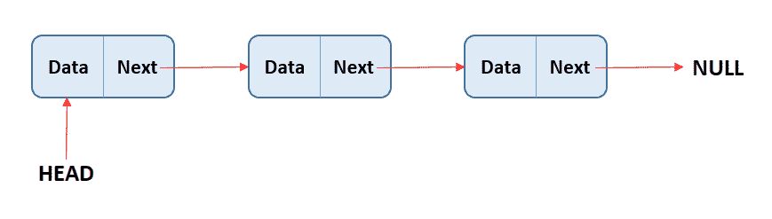

In singly linked list each node has a single pointer** **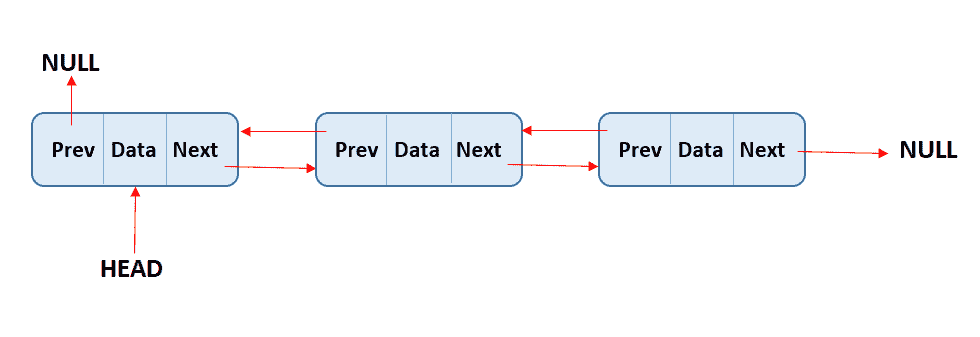

In doubly linked list each node has a two pointers** 

**列表的第一个元素被认为是头部**的**，最后一个元素被认为是尾部**的**。与数组一样，**长度**属性被定义为列表包含的元素数量。**

**与阵列相比，主要区别如下:**

*   ****列表没有索引**。每个值只“知道”它通过指针连接到的值。**
*   **由于列表没有索引，我们**不能随机访问值**。当我们想要访问一个值时，我们总是需要从头到尾遍历列表来寻找它。**
*   **没有索引的好处是在列表**的任何部分**插入/删除**比使用数组更有效**。我们只需要重定向“邻居”值的指针，而在数组中，值需要被重新索引。**

**像任何数据结构一样，不同的**方法**被实现，以便对数据进行操作。最常见的包括:推送、弹出、取消移动、移动、获取、设置、插入、移除和反转。**

**首先让我们看看如何实现一个单向链表，然后是一个双向链表。**

## **单向链表**

**单链表的完整实现如下所示:**

```
`// We create a class for each node within the list
class Node{
    // Each node has two properties, its value and a pointer that indicates the node that follows
    constructor(val){
        this.val = val
        this.next = null
    }
}

// We create a class for the list
class SinglyLinkedList{
    // The list has three properties, the head, the tail and the list size
    constructor(){
        this.head = null
        this.tail = null
        this.length = 0
    }
    // The push method takes a value as parameter and assigns it as the tail of the list
    push(val) {
        const newNode = new Node(val)
        if (!this.head){
            this.head = newNode
            this.tail = this.head
        } else {
            this.tail.next = newNode
            this.tail = newNode
        }
        this.length++
        return this
    }
    // The pop method removes the tail of the list
    pop() {
        if (!this.head) return undefined
        const current = this.head
        const newTail = current
        while (current.next) {
            newTail = current
            current = current.next
        }
        this.tail = newTail
        this.tail.next = null
        this.length--
        if (this.length === 0) {
            this.head = null
            this.tail = null
        }
        return current
    }
    // The shift method removes the head of the list
    shift() {
        if (!this.head) return undefined
        var currentHead = this.head
        this.head = currentHead.next
        this.length--
        if (this.length === 0) {
            this.tail = null
        }
        return currentHead
    }
    // The unshift method takes a value as parameter and assigns it as the head of the list
    unshift(val) {
        const newNode = new Node(val)
        if (!this.head) {
            this.head = newNode
            this.tail = this.head
        }
        newNode.next = this.head
        this.head = newNode
        this.length++
        return this
    }
    // The get method takes an index number as parameter and returns the value of the node at that index
    get(index) {
        if(index < 0 || index >= this.length) return null
        const counter = 0
        const current = this.head
        while(counter !== index) {
            current = current.next
            counter++
        }
        return current
    }
    // The set method takes an index number and a value as parameters, and modifies the node value at the given index in the list
    set(index, val) {
        const foundNode = this.get(index)
        if (foundNode) {
            foundNode.val = val
            return true
        }
        return false
    }
    // The insert method takes an index number and a value as parameters, and inserts the value at the given index in the list
    insert(index, val) {
        if (index < 0 || index > this.length) return false
        if (index === this.length) return !!this.push(val)
        if (index === 0) return !!this.unshift(val)

        const newNode = new Node(val)
        const prev = this.get(index - 1)
        const temp = prev.next
        prev.next = newNode
        newNode.next = temp
        this.length++
        return true
    }
    // The remove method takes an index number as parameter and removes the node at the given index in the list
    remove(index) {
        if(index < 0 || index >= this.length) return undefined
        if(index === 0) return this.shift()
        if(index === this.length - 1) return this.pop()
        const previousNode = this.get(index - 1)
        const removed = previousNode.next
        previousNode.next = removed.next
        this.length--
        return removed
    }
    // The reverse method reverses the list and all pointers so that the head becomes the tail and the tail becomes the head
    reverse(){
      const node = this.head
      this.head = this.tail
      this.tail = node
      let next
      const prev = null
      for(let i = 0; i < this.length; i++) {
        next = node.next
        node.next = prev
        prev = node
        node = next
      }
      return this
    }
}`
```

**单链表方法具有以下复杂性:**

*   **插入- O(1)**
*   **去除- O(n)**
*   **搜索- O(n)**
*   **访问- O(n)**

## **双向链表**

**如前所述，双向链表和单向链表的区别在于，双向链表的节点通过指针与上一个和下一个值相连接。另一方面，单链表只把它们的节点和下一个值连接起来。**

**与单链表相比，这种双指针方法允许双链表在某些方法上执行得更好，但代价是消耗更多的内存(对于双链表，我们需要存储两个指针而不是一个)。**

**双向链表的完整实现可能看起来有点像这样:**

```
`// We create a class for each node within the list
class Node{
    // Each node has three properties, its value, a pointer that indicates the node that follows and a pointer that indicates the previous node
    constructor(val){
        this.val = val;
        this.next = null;
        this.prev = null;
    }
}

// We create a class for the list
class DoublyLinkedList {
    // The list has three properties, the head, the tail and the list size
    constructor(){
        this.head = null
        this.tail = null
        this.length = 0
    }
    // The push method takes a value as parameter and assigns it as the tail of the list
    push(val){
        const newNode = new Node(val)
        if(this.length === 0){
            this.head = newNode
            this.tail = newNode
        } else {
            this.tail.next = newNode
            newNode.prev = this.tail
            this.tail = newNode
        }
        this.length++
        return this
    }
    // The pop method removes the tail of the list
    pop(){
        if(!this.head) return undefined
        const poppedNode = this.tail
        if(this.length === 1){
            this.head = null
            this.tail = null
        } else {
            this.tail = poppedNode.prev
            this.tail.next = null
            poppedNode.prev = null
        }
        this.length--
        return poppedNode
    }
    // The shift method removes the head of the list
    shift(){
        if(this.length === 0) return undefined
        const oldHead = this.head
        if(this.length === 1){
            this.head = null
            this.tail = null
        } else{
            this.head = oldHead.next
            this.head.prev = null
            oldHead.next = null
        }
        this.length--
        return oldHead
    }
    // The unshift method takes a value as parameter and assigns it as the head of the list
    unshift(val){
        const newNode = new Node(val)
        if(this.length === 0) {
            this.head = newNode
            this.tail = newNode
        } else {
            this.head.prev = newNode
            newNode.next = this.head
            this.head = newNode
        }
        this.length++
        return this
    }
    // The get method takes an index number as parameter and returns the value of the node at that index
    get(index){
        if(index < 0 || index >= this.length) return null
        let count, current
        if(index <= this.length/2){
            count = 0
            current = this.head
            while(count !== index){
                current = current.next
                count++
            }
        } else {
            count = this.length - 1
            current = this.tail
            while(count !== index){
                current = current.prev
                count--
            }
        }
        return current
    }
    // The set method takes an index number and a value as parameters, and modifies the node value at the given index in the list
    set(index, val){
        var foundNode = this.get(index)
        if(foundNode != null){
            foundNode.val = val
            return true
        }
        return false
    }
    // The insert method takes an index number and a value as parameters, and inserts the value at the given index in the list
    insert(index, val){
        if(index < 0 || index > this.length) return false
        if(index === 0) return !!this.unshift(val)
        if(index === this.length) return !!this.push(val)

        var newNode = new Node(val)
        var beforeNode = this.get(index-1)
        var afterNode = beforeNode.next

        beforeNode.next = newNode, newNode.prev = beforeNode
        newNode.next = afterNode, afterNode.prev = newNode
        this.length++
        return true
    }
}` 
```

**双向链表的主要方法如下:**

*   **插入- O(1)**
*   **移除- O(1)**
*   **搜索- O(n)**
*   **访问- O(n)**

# **树**

**树是一种数据结构，它链接**父/子关系**中的节点，从某种意义上说，存在依赖或脱离其他节点的节点。**

**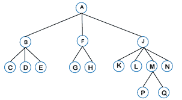

A tree** 

**树是由一个**根**节点(树上的第一个节点)组成的，从那个根出来的所有节点被称为**子节点**。树底部没有“后代”的节点被称为**叶节点**。树的**高度**由它拥有的父/子连接数决定。**

**与链表或数组不同，树**是非线性的**，在这种意义上，当迭代树时，程序流可以在数据结构中遵循不同的方向，从而得到不同的值。**

**而在链表或数组上，程序只能从一个极端到另一个极端迭代数据结构，总是遵循相同的路径。**

**形成树的一个重要要求是节点之间的唯一有效连接**是从父节点到子节点**。在树中不允许兄弟之间或从子到父的连接(这些类型的连接形成图，一种不同类型的数据结构)。另一个重要的要求是，树必须有**只有一根**。**

**在编程中使用树的一些例子是:**

*   **DOM 模型。**
*   **人工智能中的情境分析。**
*   **操作系统中的文件夹。**

**有许多不同种类的树。在每种类型的树中，值可以按照不同的模式来组织，这使得这种数据结构在面对不同类型的问题时更适合使用。最常用的树类型是二叉树和堆。**

## **二叉树**

**二叉树是一种树，其中每个节点最多有两个子节点。**

**

A binary tree** 

**二叉树真正有用的一个关键情况是在搜索中。并且为了搜索，使用了某种类型的二叉树，称为**二分搜索法树(BSTs)** 。**

**BST 就像二叉树，但其中的信息是有序的，这使它们成为适合搜索的数据结构。**

**在 BST 中，值是有序的，因此每个下降到其父节点左侧的节点的值必须小于其父节点的值，每个下降到其父节点右侧的节点的值必须大于其父节点的值。**

**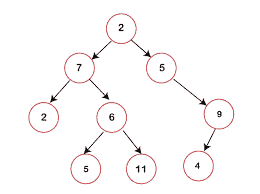

A binary search tree** 

**值的这种顺序使这种数据结构非常适合搜索，因为在树的每一层上，我们都可以确定要查找的值是大于还是小于父节点，并根据这种比较逐步丢弃大约一半的数据，直到达到我们的值。**

**当**插入或删除值**时，算法将遵循以下步骤:**

*   **检查是否有根节点。**
*   **如果有，检查要添加/删除的值是大于还是小于该节点。**
*   **如果更小，检查左侧是否有节点，重复前面的操作。如果没有，添加/删除该位置的节点。**
*   **如果更大，检查右边是否有节点，重复前面的操作。如果没有，添加/删除该位置的节点。**

**BSTs 中的搜索非常类似，只是我们不是添加/删除值，而是检查节点是否与我们正在寻找的值相等。**

**这些运算的**大 O** 复杂度为**对数(log(n))** 。但重要的是要认识到，为了实现这种复杂性，树必须具有平衡的结构，以便在每个搜索步骤中，大约一半的数据可以被“丢弃”。如果更多的值存储在三个中的一个或另一个上，数据结构的效率就会受到影响。**

**BST 的实现可能如下所示:**

```
`// We create a class for each node within the tree
class Node{
    // Each node has three properties, its value, a pointer that indicates the node to its left and a pointer that indicates the node to its right
    constructor(value){
        this.value = value
        this.left = null
        this.right = null
    }
}
// We create a class for the BST
class BinarySearchTree {
    // The tree has only one property which is its root node
    constructor(){
        this.root = null
    }
    // The insert method takes a value as parameter and inserts the value in its corresponding place within the tree
    insert(value){
        const newNode = new Node(value)
        if(this.root === null){
            this.root = newNode
            return this
        }
        let current = this.root
        while(true){
            if(value === current.value) return undefined
            if(value < current.value){
                if(current.left === null){
                    current.left = newNode
                    return this
                }
                current = current.left
            } else {
                if(current.right === null){
                    current.right = newNode
                    return this
                } 
                current = current.right
            }
        }
    }
    // The find method takes a value as parameter and iterates through the tree looking for that value
    // If the value is found, it returns the corresponding node and if it's not, it returns undefined
    find(value){
        if(this.root === null) return false
        let current = this.root,
            found = false
        while(current && !found){
            if(value < current.value){
                current = current.left
            } else if(value > current.value){
                current = current.right
            } else {
                found = true
            }
        }
        if(!found) return undefined
        return current
    }
    // The contains method takes a value as parameter and returns true if the value is found within the tree
    contains(value){
        if(this.root === null) return false
        let current = this.root,
            found = false
        while(current && !found){
            if(value < current.value){
                current = current.left
            } else if(value > current.value){
                current = current.right
            } else {
                return true
            }
        }
        return false
    }
}`
```

## **很**

**堆是另一种类型的树，有一些特殊的规则。有两种主要类型的堆， **MaxHeaps** 和 **MinHeaps** 。在 MaxHeaps 中，父节点总是大于其子节点，而在 MinHeaps 中，父节点总是小于其子节点。**

**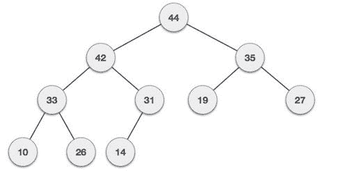

A max heap** **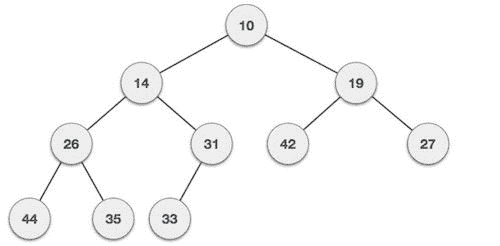

A min heap** 

**在这种数据结构中，兄弟节点之间没有保证，这意味着同一“级别”的节点除了高于/低于其父节点之外，不遵循任何规则。**

**此外，堆是尽可能紧凑的，这意味着每一级都包含它所能包含的所有节点，没有空格，新的子节点首先放在树的左边。**

**堆，特别是**二进制堆**，经常用于实现**优先级队列**，同时也经常用于众所周知的算法，如 Dijkstra 的路径查找算法。**

**优先级队列是一种数据结构，其中每个元素都有一个相关的优先级，优先级较高的元素首先出现。**

# **图形**

**图是由一组节点和这些节点之间的特定连接形成的数据结构。与树不同，图没有根和叶节点，也没有“头”或“尾”。不同的节点相互连接，它们之间没有隐含的父子关系。**

**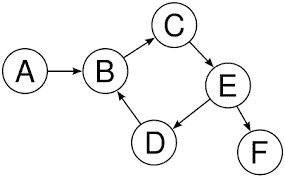

A graph** 

**图形是一种数据结构，通常用于:**

*   **社交网络**
*   **地理定位**
*   **推荐系统**

**根据节点之间连接的特征，可以将图分为不同的类型:**

## **无向图和有向图**

**如果节点之间的连接没有隐含的方向，我们就说图是无向图。**

**如果我们看下面的例子，你可以看到节点 2 和节点 3 之间的连接没有方向。连接是双向的，这意味着您可以从节点 2 到节点 3，从节点 3 到节点 2 遍历数据结构。无向意味着节点之间的连接可以双向使用。**

**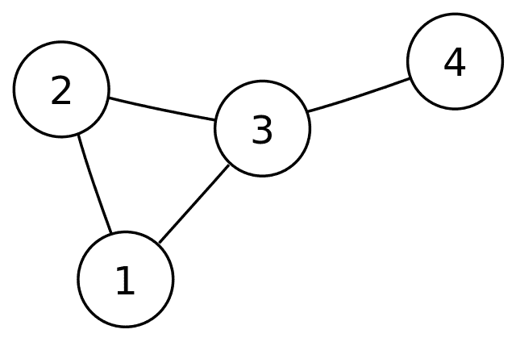

An undirected graph** 

**正如你可能已经猜到的，有向图是完全相反的。让我们重新使用之前的示例图像，并看到节点之间的连接有一个隐含的方向。**

**在这个特殊的图中，你可以从节点 A 到节点 B，但是你不能从节点 B 到节点 A。**

**

A directed graph** 

## **加权图和未加权图**

**如果节点之间的连接有一个指定的权重，我们说一个图是赋权的。在这种情况下，权重只是指分配给特定连接的值。它是关于连接本身的信息，而不是关于节点的信息。**

**根据这个例子，我们可以看到节点 0 和 4 之间的连接，权重为 7。节点 3 和 1 之间的连接的权重为 4。**

**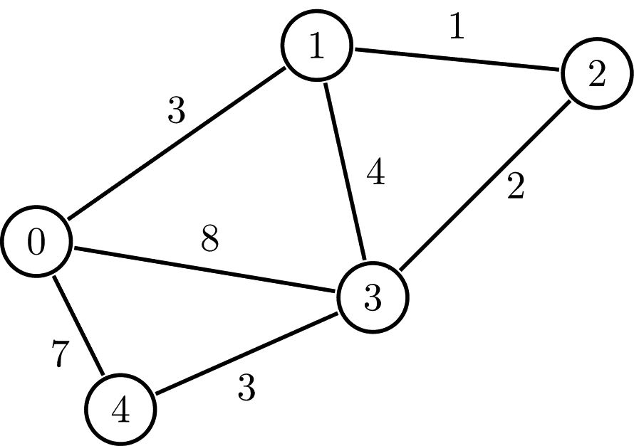

A weighted graph** 

**为了理解加权图的使用，想象一下，如果您想要用许多不同的位置来表示一张地图，并向用户提供关于他们从一个地方到另一个地方可能需要多长时间的信息。**

**加权图非常适合这种情况，因为您可以使用每个节点来保存位置信息，连接可以表示每个地点之间的可用道路，权重表示从一个地点到另一个地点的物理距离。**

**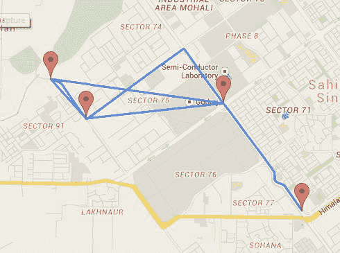

Weighted graphs are heavily used in geolocation systems** 

**你可能已经猜到了，未加权图是指节点之间的连接没有分配权重的图。因此，没有关于节点之间连接的特定信息，只有关于节点本身的信息。**

## **如何表示图形**

**当给图编码时，我们可以使用两种主要方法:一个**邻接矩阵**和一个**邻接表**。让我们解释一下两者是如何工作的，并看看它们的优缺点。**

**一个**邻接矩阵是一个二维结构**,它表示我们图中的节点以及它们之间的连接。**

**如果我们用这个例子...**

**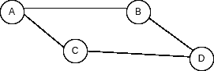**

**我们的邻接矩阵看起来像这样:**

| - | A | B | C | D |
| A | Zero | one | one | Zero |
| B | one | Zero | Zero | one |
| C | one | Zero | Zero | one |
| D | Zero | one | one | Zero |

**您可以看到矩阵就像表格一样，其中的列和行表示我们图形中的节点，单元格的值表示节点之间的连接。如果单元格为 1，则行和列之间有联系，如果为 0，则没有联系。**

**使用二维数组可以很容易地复制该表:**

```
`[
    [0, 1, 1, 0]
    [1, 0, 0, 1]
    [1, 0, 0, 1]
    [0, 1, 1, 0]
]`
```

**另一方面，**邻接表**可以被认为是**一个键-值对结构**，其中**键代表我们图上的每个节点**，t **he 值是那个特定节点拥有的连接**。**

**使用相同的示例图，我们的邻接表可以用以下对象表示:**

```
`{
    A: ["B", "C"],
    B: ["A", "D"],
    C: ["A", "D"],
    D: ["B", "C"],
}`
```

**您可以看到，对于每个节点，我们都有一个键，并且我们将所有节点的连接存储在一个数组中。**

**那么邻接矩阵和链表有什么区别呢？在添加或删除节点时，列表往往更有效，而在查询节点之间的特定连接时，矩阵更有效。**

**为了看到这一点，假设我们想在图中添加一个新节点:**

**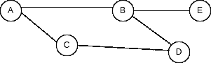**

**为了在矩阵中表示这一点，我们需要添加全新的列和行:**

| - | A | B | C | D | E |
| A | Zero | one | one | Zero | Zero |
| B | one | Zero | Zero | one | one |
| C | one | Zero | Zero | one | Zero |
| D | Zero | one | one | Zero | Zero |
| E | Zero | one | Zero | Zero | Zero |

**而要在列表中做同样的事情，向 B 连接添加一个值和一个键-值对来表示 E 就足够了:**

```
`{
    A: ["B", "C"],
    B: ["A", "D", "E"],
    C: ["A", "D"],
    D: ["B", "C"],
    E: ["B"],
}`
```

**现在，假设我们想要验证节点 B 和 e 之间是否存在连接，在矩阵中进行检查非常简单，因为我们知道矩阵中代表该连接的确切位置。**

| - | A | B | C | D | E |
| A | Zero | one | one | Zero | Zero |
| B | one | Zero | Zero | one | one |
| C | one | Zero | Zero | one | Zero |
| D | Zero | one | one | Zero | Zero |
| E | Zero | one | Zero | Zero | Zero |

**但是在一个列表中，我们没有遍历表示最佳连接的数组所需的信息，也不知道数组中有什么。所以你可以看到每种方法都有优点和缺点。**

**使用邻接表的图的完整实现可能如下所示。为了简单起见，我们将表示一个无向无权重图。**

```
`// We create a class for the graph
class Graph{
    // The graph has only one property which is the adjacency list
    constructor() {
        this.adjacencyList = {}
    }
    // The addNode method takes a node value as parameter and adds it as a key to the adjacencyList if it wasn't previously present
    addNode(node) {
        if (!this.adjacencyList[node]) this.adjacencyList[node] = []
    }
    // The addConnection takes two nodes as parameters, and it adds each node to the other's array of connections.
    addConnection(node1,node2) {
        this.adjacencyList[node1].push(node2)
        this.adjacencyList[node2].push(node1)
    }
    // The removeConnection takes two nodes as parameters, and it removes each node from the other's array of connections.
    removeConnection(node1,node2) {
        this.adjacencyList[node1] = this.adjacencyList[node1].filter(v => v !== node2)
        this.adjacencyList[node2] = this.adjacencyList[node2].filter(v => v !== node1)
    }
    // The removeNode method takes a node value as parameter. It removes all connections to that node present in the graph and then deletes the node key from the adj list.
    removeNode(node){
        while(this.adjacencyList[node].length) {
            const adjacentNode = this.adjacencyList[node].pop()
            this.removeConnection(node, adjacentNode)
        }
        delete this.adjacencyList[node]
    }
}

const Argentina = new Graph()
Argentina.addNode("Buenos Aires")
Argentina.addNode("Santa fe")
Argentina.addNode("Córdoba")
Argentina.addNode("Mendoza")
Argentina.addConnection("Buenos Aires", "Córdoba")
Argentina.addConnection("Buenos Aires", "Mendoza")
Argentina.addConnection("Santa fe", "Córdoba")

console.log(Argentina)
// Graph {
//     adjacencyList: {
//         'Buenos Aires': [ 'Córdoba', 'Mendoza' ],
//         'Santa fe': [ 'Córdoba' ],
//         'Córdoba': [ 'Buenos Aires', 'Santa fe' ],
//         Mendoza: [ 'Buenos Aires' ]
//     }
// }`
```

# ****综述****

**就这样了，各位。在本文中，我们介绍了计算机科学和软件开发中使用的主要数据结构。这些结构是我们日常生活中使用的大部分程序的基础，所以拥有这些知识真的很好。**

**尽管这个主题一开始可能感觉有点抽象和吓人，但我相信我们可以通过将数据结构视为我们组织数据以更好地完成特定任务的方式来更好地理解它。**

**一如既往，我希望你喜欢这篇文章，并学到一些新东西。如果你愿意，你也可以在 [LinkedIn](https://www.linkedin.com/in/germancocca/) 或 [Twitter](https://twitter.com/CoccaGerman) 上关注我。**

**回头见！**

****