# 数据可视化工具–2022 年指南

> 原文：<https://www.freecodecamp.org/news/data-visualization-tools-guide/>

数据可视化是以图形方式解释或表示数据的过程。通常，它是使用图表、表格、直方图和其他信息图形的数据的图形或视觉表示。

数据在任何类型的组织中都扮演着重要的角色。数据可视化有助于我们了解某些趋势和见解，并基于这些趋势和见解做出重要决策。

通过可视化表示，您可以用非常简单的方式显示复杂的数据负载。

## 什么是数据可视化工具？

想象一下，浏览一百万用户的记录，并根据他们的年龄范围对他们进行分组。那将是一项非常乏味的任务。

数据可视化工具从这些记录中提取信息，并以可视化的方式呈现给你或任何需要数据的人。

在下一节中，您将看到一些可供选择的最佳数据可视化工具。

## 2022 年可供选择的顶级数据可视化工具

在本节中，我们将回顾各种数据可视化工具的特性和可用性/定价计划。没有列出任何特定的顺序。

## 1.（舞台上由人扮的）静态画面

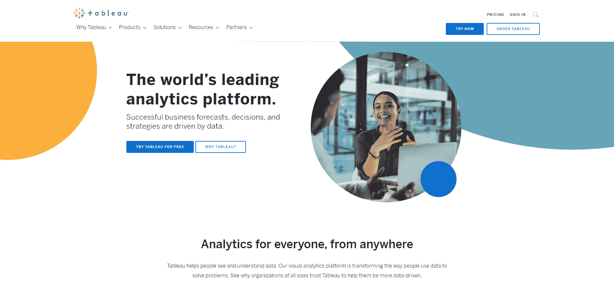

Tableau landing page

您可以使用 [Tableau](https://www.tableau.com/) 来访问、可视化和分析数据。它还有一个拖放功能，可以提供更具交互性的界面。

### 特征

*   实时数据分析。
*   离线支持。
*   数据库和云集成。
*   人工智能和人工智能驱动的分析。
*   支持数据科学家的集成。
*   团队协作和共享工作的专用环境。
*   针对数据警报通知、人工智能预测和团队协作分析的 Slack 集成。
*   对于非技术用户来说，这是一个很好的工具，因为你不必为基本的使用编写代码。

### 可用性/定价

Tableau 不是一个免费的工具。虽然有免费的路径，Tableau 提供了[三种方案供你选择](https://www.tableau.com/pricing/teams-orgs?_ga=2.122353858.813329281.1665059838-288272513.1665059837)——Tableau Creator、Tableau Explorer 和 Tableau Viewer，分别为每月 70 美元、42 美元和 15 美元，按年计费。

## 2.谷歌图表

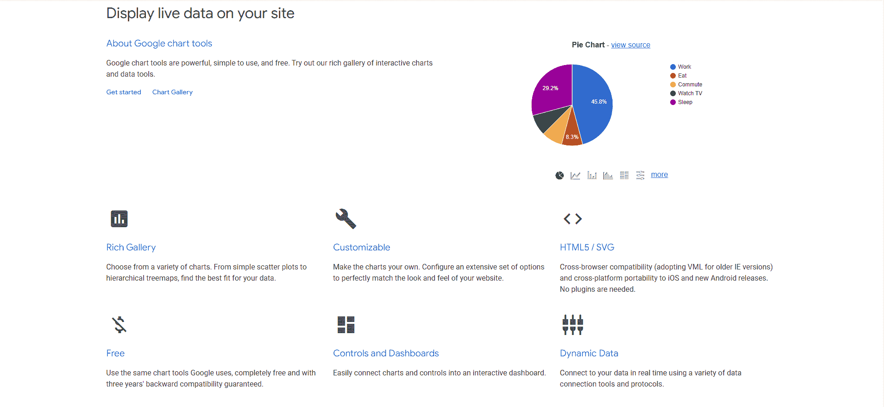

Google Charts landing page

谷歌图表是一个非常有效的工具，你可以用它来可视化或显示网站上的数据。它通常与 JavaScript 一起使用。

文档指南展示了如何创建不同的图表类型，如条形图、气泡图、日历图、直方图、地图、饼图等等。

### 特征

*   专为开发者打造。需要 JavaScript 知识。
*   多种预置图表类型可供选择。
*   不需要插件。
*   实时数据更新。
*   跨浏览器兼容性。
*   跨平台移植到 iOS 和 Android。
*   图表类型很容易自定义。
*   可连接到仪表板，向用户显示动态图表。

### 可用性/定价

谷歌图表是一个完全免费的产品。

## 3.Zoho 分析

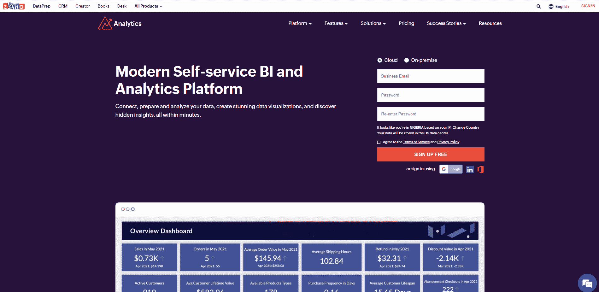

Zoho Analytics landing page

[Zoho Analytics](https://www.zoho.com/analytics/) 将原始数据转化为见解和仪表盘。你可以将不同的源文件、云数据库、定制应用和流行的商业应用连接到 Zoho。

该产品非常适合企业，因为它可以让您准备、分析和可视化数据。

### 特征

*   借助人工智能和人工智能实现自动化洞察和预测分析。
*   支持低代码和无代码集成。
*   支持与许多流行的应用程序集成，如 Twitter、YouTube、Mailchimp、Shopify 等。
*   协作功能。
*   灵活的部署选项。
*   使用幻灯片、门户网站和嵌入式人工智能助手进行演示的数据讲故事功能。

### 可用性/定价

Zoho Analytics 提供以下**云计划**:

*   基本= > 22 美元/月，按年计费。
*   标准= > 50 美元/月，按年计费。
*   保费= > 125 美元/月，按年计费。
*   enterprise = > 495 美元/月，按年计费。

云计划有 15 天的免费试用期，不需要信用卡。

面向自行处理所有部署和托管的用户的**内部部署计划**提供了以下选项:

##### 本地服务器:

*   个人= >永远免费。
*   Professional = >每月 30 美元，按年计费。
*   最少 5 个用户。

##### AWS:

*   个人= >永远免费。
*   专业= > 0.25 美元/小时的 AWS 使用。
*   最少 5 个用户。

##### 天蓝色:

*   个人= >永远免费。
*   professional = > 0.4 美元/小时 Azure 基础设施费。
*   最少 5 个用户。

##### 码头工人:

*   个人= >永远免费。
*   Professional = >每月 30 美元，按年计费。
*   最少 5 个用户。

## 4.Microsoft Power BI

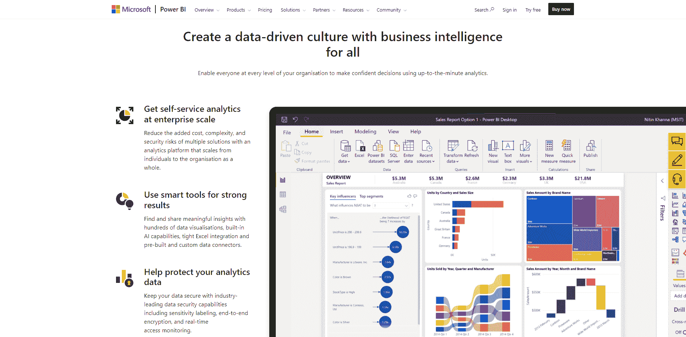

Microsoft Power BI landing page

[Microsoft Power BI](https://powerbi.microsoft.com/en-au/) 让您能够连接、建模和可视化您的数据。

### 特征

*   AI 根据你的数据生成答案。
*   集成到流行的应用程序和功能。
*   实时分析。
*   安全数据分析。

### 可用性/定价

微软 Power Bi 有两个主要计划 Power BI Pro 和 Power BI Premium，分别为每个用户/月 13.70 美元和 27.50 美元。

Power BI Premium 计划为大型组织提供了按容量计费的功能。此功能的起价为每容量/月 6，858.10 美元。

## 5\. Qlik Sense

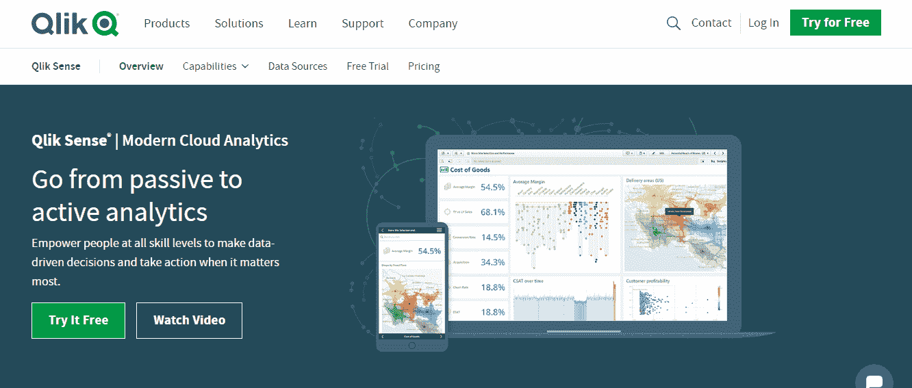

Qlik Sense landing page

与我们列出的其他工具一样，Qlik Sense 有一些很酷的功能，这使它成为数据可视化的一个很好的选择。

### 特征

*   人工智能产生了洞察力。
*   自动化数据准备。
*   实时数据分析。
*   交互式仪表盘。
*   完全可定制的分析。

### 可用性/定价

Qlik Sense 商业计划起价为每年每个用户每月 30 美元。他们的企业和客户管理的计划可以通过联系他们的销售团队进行评估。

## 6.Plotly

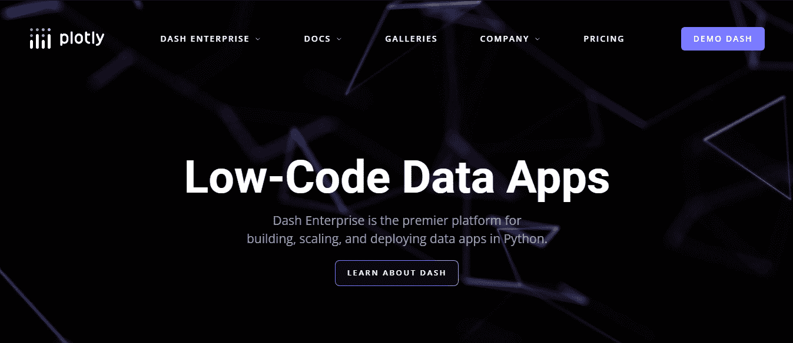

Plotly landing page

Plotly 是一个使用 Python 编程语言构建数据可视化应用的低代码工具。

### 特征

*   Python 知识是必需的。
*   这个产品是开源的，有一个活跃的社区。
*   可以离线使用。
*   用于创建折线图、面积图、条形图、直方图等的开源图形库。

### 可用性/定价

Plotly 是免费和开源的。

它还具有 Dash Enterprise 功能，可自动交付报告、警报和应用程序管理器。这个功能不是免费的。

## 7.多莫

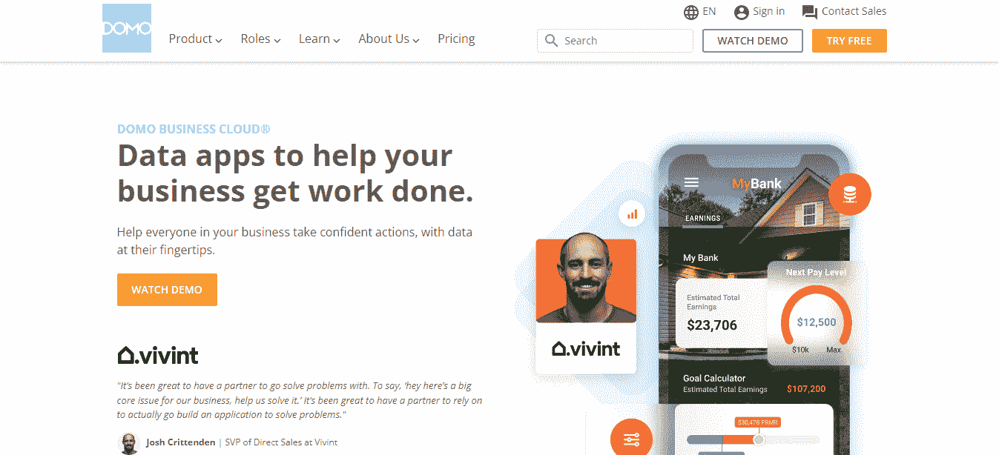

Domo landing page

### 特征

*   实时数据分析。
*   交互式仪表盘。
*   数据共享。
*   为企业打造的数据应用。

### 可用性/定价

根据 [Domo](https://www.domo.com/) :

> 定价基于与平台使用相关的几个因素，包括数据存储、数据刷新率、数据查询量和用户数量...

虽然不知道他们的确切定价计划，但您可以通过他们的定价页面了解更多信息。

## 8.信息图表

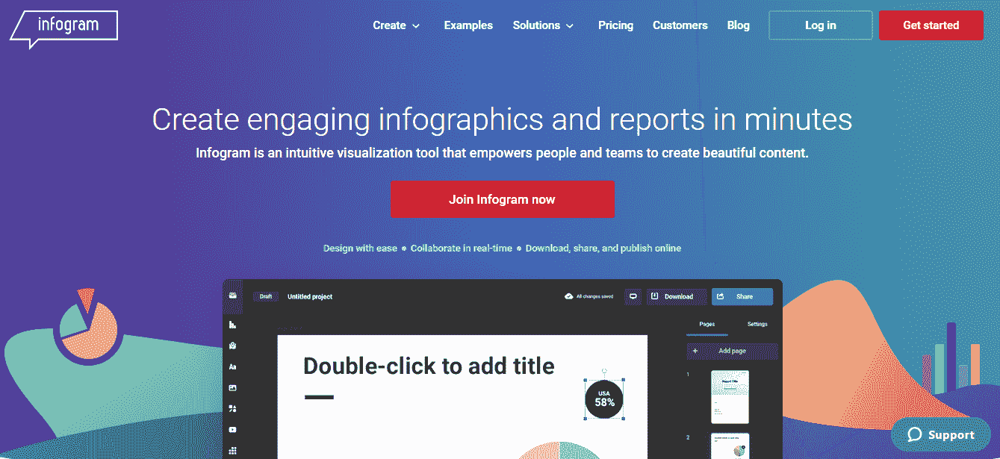

Infogram landing page

Inforgram 是一个很好的工具，可以很容易地创建信息图、报告、仪表板、幻灯片、社交媒体帖子、电子邮件标题等等。

### 特征

*   交互式图表。
*   实时团队协作。
*   访问项目版本历史记录。
*   非常适合创建和跟踪社交媒体内容。
*   自定义跟踪链接。

### 可用性/定价

Infogram 有以下计划:

*   基本= >永远免费。
*   pro = > 19 美元/月。
*   商务= > 67 美元/月。
*   团队= > 149/月。
*   Enterprise = >通过定价页面联系 Infogram 团队。

## 9.D3.js

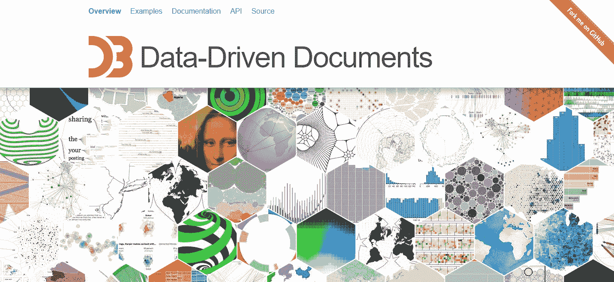

D3.js landing page

[D3.js](https://d3js.org/) 是一个 JavaScript 库，用于使用 HTML、SVG 和 CSS 操作和可视化 web 上的数据。

### 特征

*   需要 HTML、CSS、SVG 和 JavaScript 的知识。
*   创建信息图的不同代码示例库。
*   学习如何使用该库的好文档。

### 可用性/定价

D3.js 是免费开源的。

## 10.数据箱

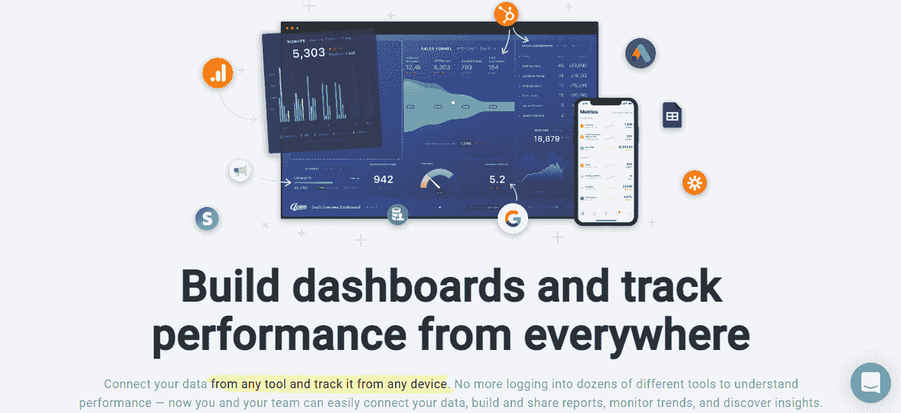

Databox landing page

Databox 主要是一个仪表板工具。它可用于跟踪和可视化来自任何来源的数据。

### 特征

*   自动化报告。
*   警报和通知。
*   支持集成流行的应用程序和平台。
*   可定制的模板。

### 可用性/定价

Databox 有一个永远免费的计划，带有 3 个数据源连接，所有标准功能和 60 多个集成。

以下是其他计划:

*   starter = > 72 美元/月。
*   专业= > 135/月。
*   执行者= > 231 美元/月。

## 11.数据包装器

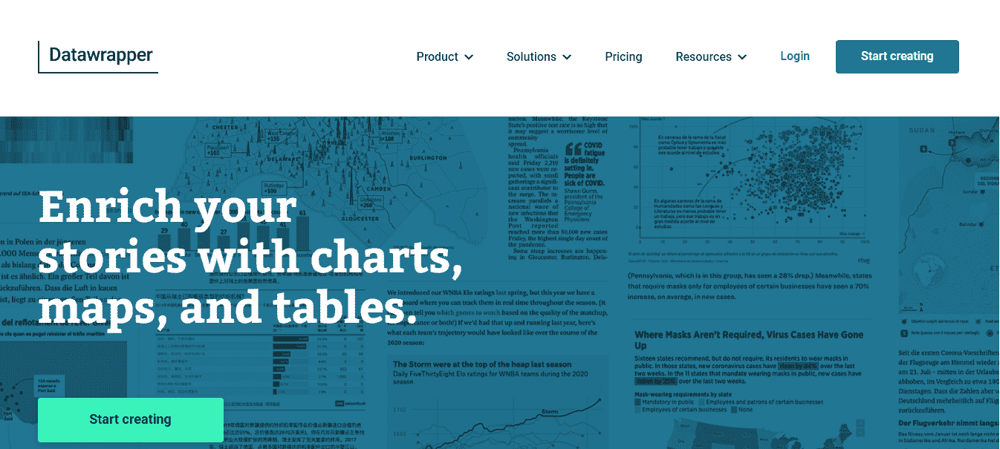

datawrapper landing page

Datawrapper 是为文章、报告和出版物等内容创建可视化的好工具。

### 特征

*   不需要代码或设计技能。
*   来自数据源的实时可视化更新。
*   在不同设备上响应。
*   PNG, SVG, PDF export.
*   打印就绪的图形。
*   可定制的图表。
*   通过共享文件夹、Slack 和团队集成实现团队协作。
*   可供选择的可视化范围很广。

### 可用性/定价

Datawrapper 有以下计划:

*   免费计划。
*   custom = > 599 美元/月。
*   Enterprise = >通过 Datawrapper 团队的定价页面联系他们。

## 12.高图表

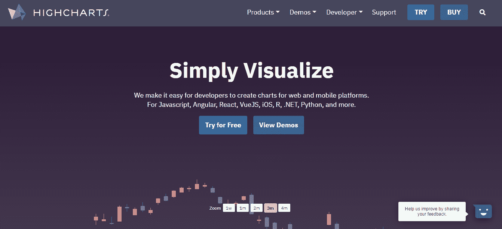

Highcharts landing page

[Highcharts](https://www.highcharts.com/) 让网络和移动开发者轻松创建图表。

Highcharts 的库建立在 Javascript 和 TypeScript 之上，可以与任何后端数据库一起工作，可以用于 JavaScript、Angular、React、VueJS、iOS、R、.NET，Python，Java，Android 项目。

### 特征

*   支持流行的技术堆栈。
*   易于定制。
*   文档和学习资源。

### 可用性/定价

Highcharts 具有 JS、股票、地图和甘特图计划，并具有以下定价功能:

*   Web = >每年每个座位 152 美元。
*   SaaS =每年每个座位 300 美元。
*   SaaS+ = >每年每个座位 750 美元。
*   OEM = >联系 Highcharts 团队。

还有一个指向 GitHub 上代码库的 Highcharts 编辑器计划。这是目前在测试中。

## 摘要

如果您不能可视化和图形化地表示您的数据，那么随着数据的增长，理解起来会变得非常困难。

有许多数据可视化工具可供选择。有些需要编码经验，有些则不需要。还有免费和高级工具。

选择正确的产品取决于你所寻找的功能，以及如果它不是免费的，你愿意花多少钱。

本文将通过列出一些流行的数据可视化工具、它们的特性和定价计划来帮助您缩小范围。

感谢您的阅读！