# 2016 年哪些语言获得了最多的 GitHub 星？

> 原文：<https://www.freecodecamp.org/news/data-visualization-what-languages-got-the-most-github-stars-in-2016-a4e3908a9532/>

何塞·阿吉纳加

# 2016 年哪些语言获得了最多的 GitHub 星？

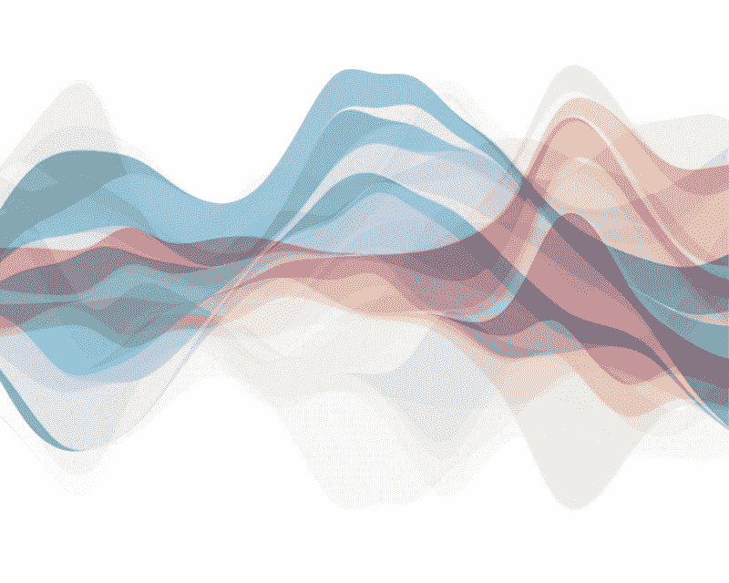

Staring patterns, by Jose Aguinaga. An overlapping of multiple starring GitHub events from various users.

几周前，我决定开发一个应用程序来查找我在 GitHub 中使用最多的编程语言。

为什么？因为最近我一直在主导关于**机器学习、数据科学、**和**人工智能的项目。**我想看看我越来越大的兴趣是否会以任何方式出现在我的星号项目时间表中。还有什么更好的方法可以通过使用一点数据科学来发现这一点呢？

该实验包括从 GitHub 获取信息，对其进行清理，并以可视化方式显示出来。要亲自尝试，请访问以下网页。

[**2016 年哪些语言获得 GitHub 星最多？**](https://starred.jjperezaguinaga.com/)
[*2016 年 github 明星语言流水图。*starred.jjperezaguinaga.com](https://starred.jjperezaguinaga.com/)

亲自尝试之后，给我一点时间解释它是如何工作的，并向您展示一些有趣的示例。

### 检索和分析数据

不管是好是坏，GitHub 并没有提供一种简单的方法来消费这些信息。你需要在[github.com](https://github.com/jjperezaguinaga?tab=stars)上浏览你所有的明星项目，然后点击许多页面找到它们。根据您标记了多少个存储库，您可能需要几分钟才能看到特定时间段内的所有项目。

好消息是 GitHub 有一个[主演活动 API](https://developer.github.com/v3/activity/starring/) ，然后我用它编写了一个 JavaScript 实用程序来获取我这一年中所有主演的项目。GitHub 允许你通过一个标志来查看你第一次主演一个项目的日期，这让我只能获得我在 2016 年主演的项目。

有了检索到的数据，我开始根据 GitHub 分配给他们的语言对其进行过滤。 [Ramda](http://ramdajs.com/) 对该数据进行制图和归约尤为有用。

然后，为了可视化这些信息，我决定通过一个名为 [*streamgraph*](https://en.wikipedia.org/wiki/Streamgraph) *的图表来显示每种存储库编程语言的频率。*每月汇总每个语言实例，我可以看到随着时间的推移，兴趣的增加和减少。

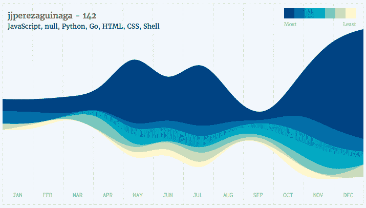

A streamgraph of my starred projects in 2016 aggregated by language and distributed per month. GitHub sometimes will be unable to decide over a specific language for a project, and will give ***null*** *instead*.

从图中可以看到，2016 年我主演了 **142 个项目**。在我标有星号的库中有超过 15 种语言，但我只显示了前 7 种，因为每种语言的频率在这个数字之后会下降。顶级语言是 JavaScript，这并不令我惊讶，因为我每天都是作为前端工程师工作的。

第二和第三种编程语言是 **Python** 和 **Go、**，它们很可能与我之前提到的人工智能/深度学习项目有关。Python 是有意义的，因为它最近被认为是[最流行的机器学习语言](https://www.ibm.com/developerworks/community/blogs/jfp/entry/What_Language_Is_Best_For_Machine_Learning_And_Data_Science?lang=en)。

### 每个人都有一张图表。

作为工具开发的一部分，我和其他开发人员一起测试了这个应用程序。这产生了一系列有趣的图表。

以下是一些著名开发人员的名单，按照他们主演最多的语言分组。

#### Javascript 开发人员

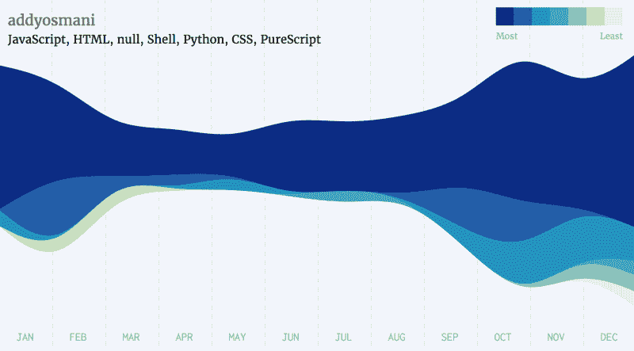

[Addy Osmani](https://www.freecodecamp.org/news/data-visualization-what-languages-got-the-most-github-stars-in-2016-a4e3908a9532/undefined) — Google Web Platform Engineer

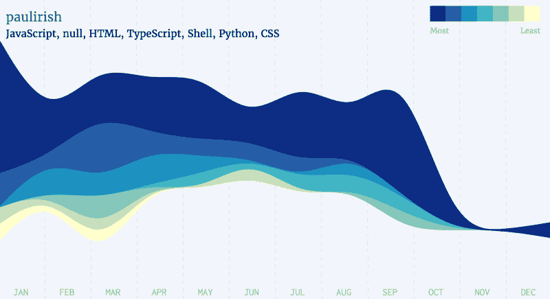

[Paul Irish](https://www.freecodecamp.org/news/data-visualization-what-languages-got-the-most-github-stars-in-2016-a4e3908a9532/undefined) — Chrome Dev Tools Engineer

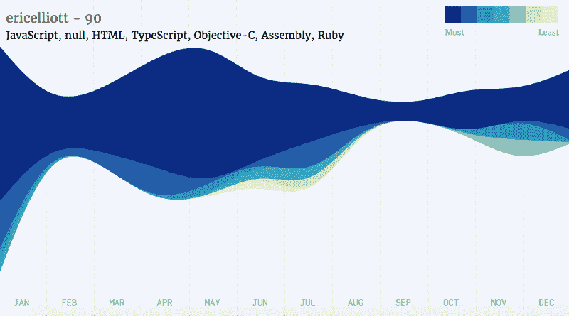

[Eric Elliott](https://www.freecodecamp.org/news/data-visualization-what-languages-got-the-most-github-stars-in-2016-a4e3908a9532/undefined) — Javascript Developer

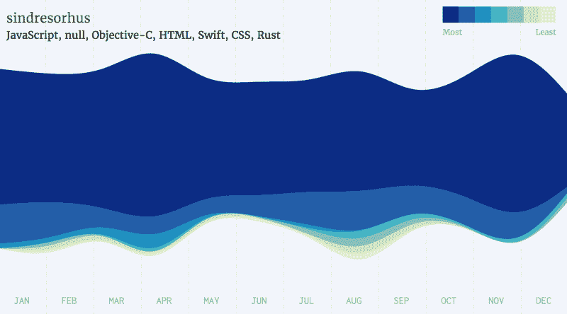

[Sindre Sorhus](https://www.freecodecamp.org/news/data-visualization-what-languages-got-the-most-github-stars-in-2016-a4e3908a9532/undefined) — Disguised unicorn

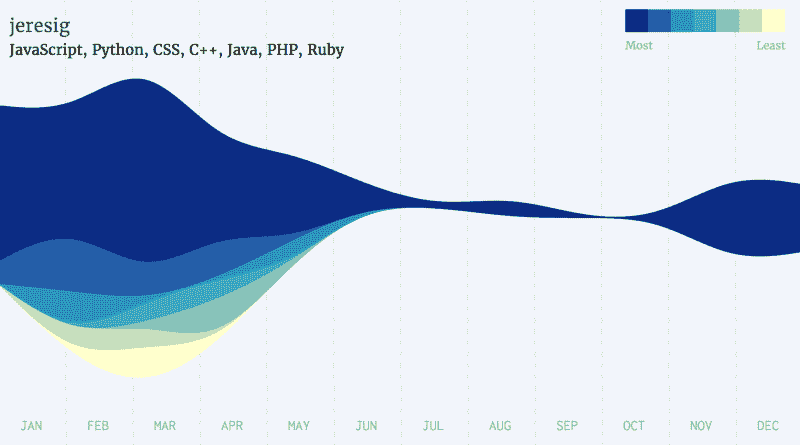

[John Resig](https://www.freecodecamp.org/news/data-visualization-what-languages-got-the-most-github-stars-in-2016-a4e3908a9532/undefined) — Staff Engineer at Khan Academy and creator of jQuery

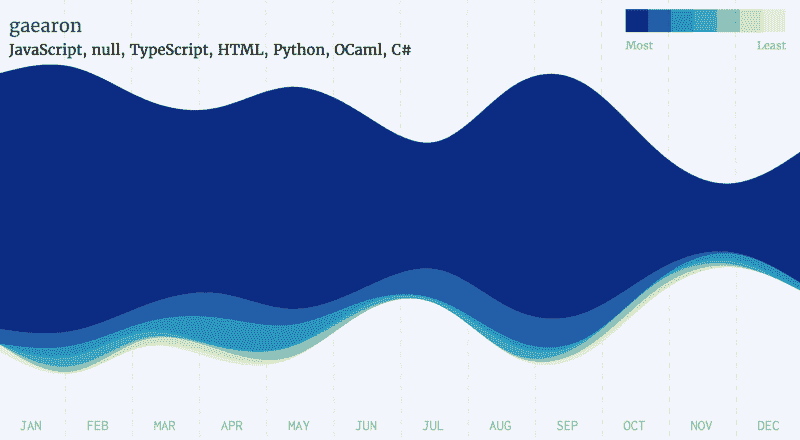

[Dan Abramov](https://www.freecodecamp.org/news/data-visualization-what-languages-got-the-most-github-stars-in-2016-a4e3908a9532/undefined) —Facebook Engineer, Co-author of Redux, Create React App and React.js

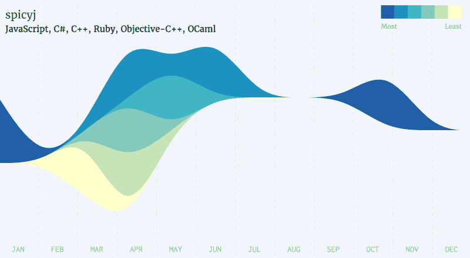

[Ben Alpert](https://github.com/spicyj) — Facebook Engineer, React.js Contributor

#### Golang 开发商

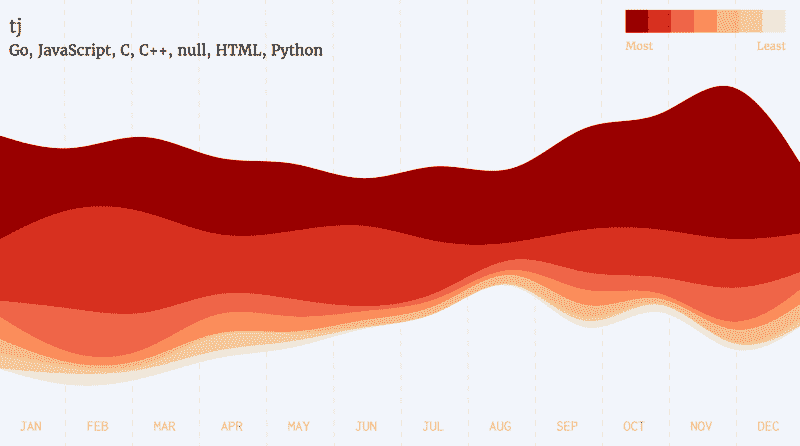

[TJ Holowaychuk](https://www.freecodecamp.org/news/data-visualization-what-languages-got-the-most-github-stars-in-2016-a4e3908a9532/undefined) — Founder of Apex.sh, Javascript and Golang Developer

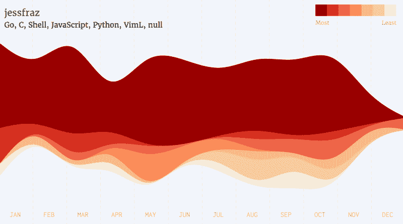

[Jessie Frazzelle](https://twitter.com/jessfraz) — Everything containers

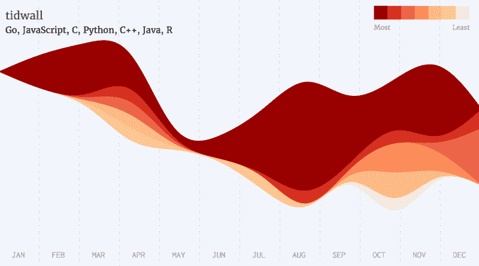

[Josh Baker](https://www.freecodecamp.org/news/data-visualization-what-languages-got-the-most-github-stars-in-2016-a4e3908a9532/undefined) — Makes a killer goulash

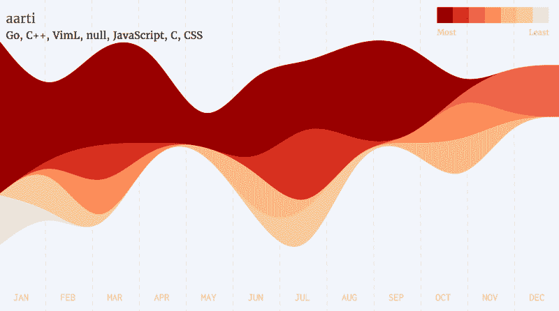

[aarti](https://github.com/aarti) — Exercism.io contributor

#### Python 开发者

[Thaddee Tyl](https://www.freecodecamp.org/news/data-visualization-what-languages-got-the-most-github-stars-in-2016-a4e3908a9532/undefined) — He saw some code

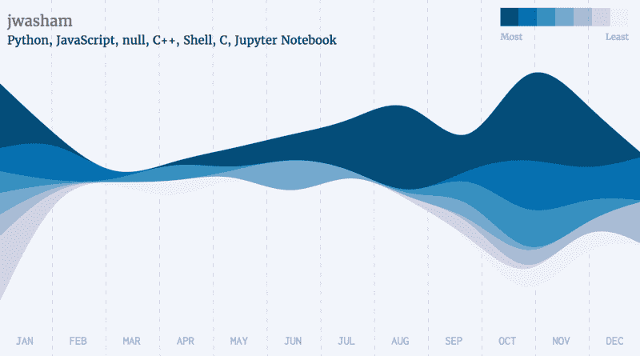

[John Washam](https://www.freecodecamp.org/news/data-visualization-what-languages-got-the-most-github-stars-in-2016-a4e3908a9532/undefined) — Future Google Engineer

[Geimfari](https://www.freecodecamp.org/news/data-visualization-what-languages-got-the-most-github-stars-in-2016-a4e3908a9532/undefined) — Pythonista, Erlanger, Cosmonaut

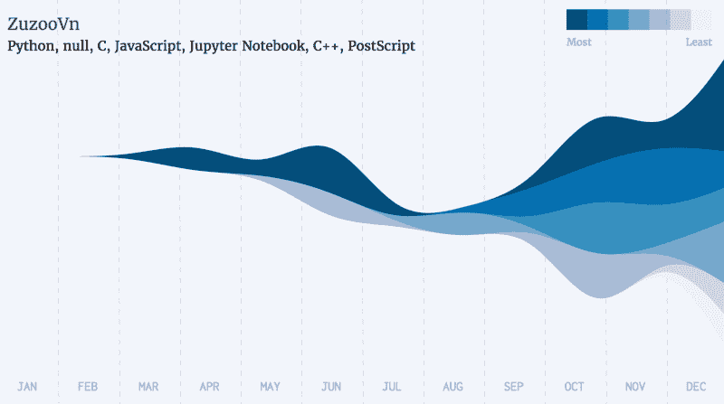

[Nam Vu](https://www.freecodecamp.org/news/data-visualization-what-languages-got-the-most-github-stars-in-2016-a4e3908a9532/undefined) — Future Machine Learning Engineer

#### 斯威夫特河

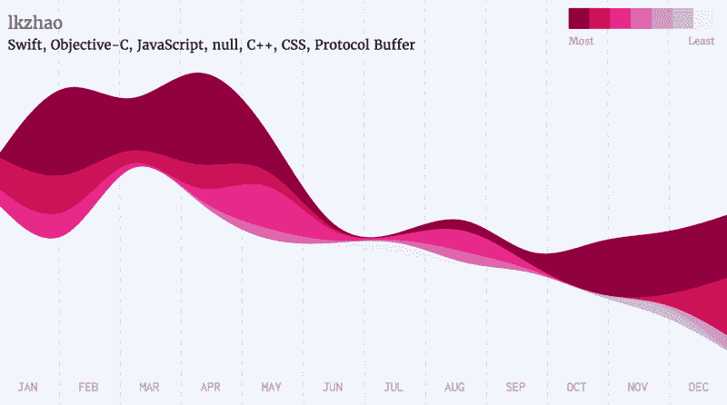

[Luke Zhao](https://github.com/lkzhao) — iOS Developer

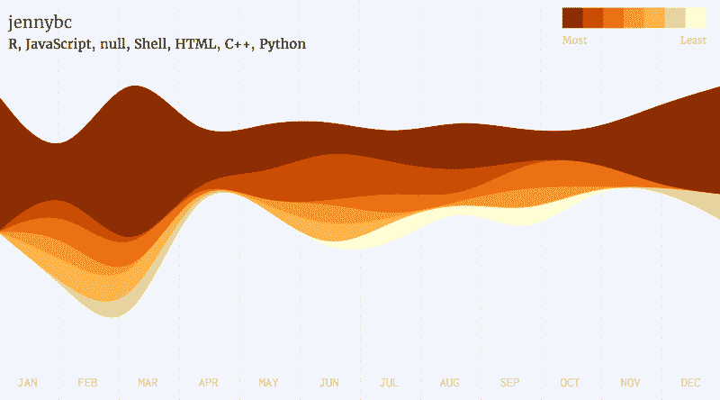

[Jennifer Bryan](https://github.com/jennybc) — Professor at UBC

### 关于数据

我从这个实验中获得了很多乐趣，并且学到了两个重要的经验:

*   **数据可以很美**。不是每件事都需要有深刻的含义才能有趣。例如，这篇文章的封面是来自不同数据集的一系列*流图*重叠的产物。我太喜欢它了，我甚至[为它申请了版权。](https://blockai.com/c/e1jLAq)
*   我们的数据识别我们。给定足够多的星号项目，两个人同时拥有完全相同的星号库的可能性微乎其微*。因此，如果我们分析开发人员的主要模式，我们可以通过查看他们的数据来识别他们。这是[行为分析](http://dl.acm.org/citation.cfm?id=2971707&dl=ACM&coll=DL&CFID=716696458&CFTOKEN=32651178)的一个例子，过去用于[通过移动应用使用](http://dl.acm.org/citation.cfm?id=2971707&dl=ACM&coll=DL&CFID=716696458&CFTOKEN=32651178)识别用户。

在这个实验结束时，我比以前更有兴趣探索数据可视化和机器学习的用法。我会继续扩展我在这方面的知识，在未来创造更多这样的实验。

### 请在家里试试这个

如果你对代码很好奇，可以在 Github 上看到。

[**jjperezaguinaga/github-patterns**](https://github.com/jjperezaguinaga/github-patterns)
[*github-patterns-？2016 年哪些语言获得了最多的 GitHub 星？克*ithub.com](https://github.com/jjperezaguinaga/github-patterns)

请记住，代码非常脏，所以可能会出现错误(例如，GitHub 速率限制超时错误没有被捕获)，所以不要将其作为任何实际生产项目的参考。随意地[改变、扩展或派生代码](https://github.com/jjperezaguinaga/github-patterns)。

不可忽略，但可能性极小。一个人需要在相同的时间开始相同的项目，以共享相同的模式。一个天文年有 31557600 秒，截至 2016 年底，GitHub 中约有[2000 万](https://octoverse.github.com/)个存储库，GitHub 中约有 580 万活跃用户。你告诉我，两个拥有 10 个星级项目的人拥有相同模式的几率有多大。

***Udacity 本周末发布了[一项新的关于深度学习基础的纳米学位](https://www.udacity.com/course/deep-learning-nanodegree-foundation--nd101)。我已经注册了，完成后我会发布一个概述。*