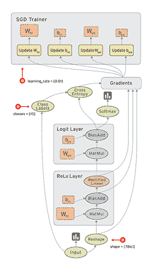
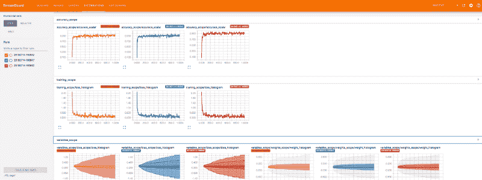
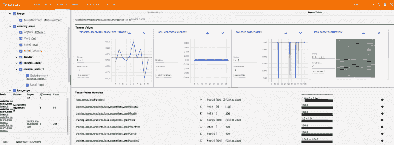
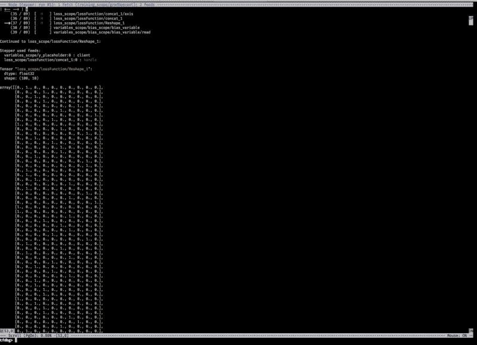

# 如何开始调试 TensorFlow

> 原文：<https://www.freecodecamp.org/news/debugging-tensorflow-a-starter-e6668ce72617/>

丹尼尔·多伊奇

# 如何开始调试 TensorFlow


Photo by Matthew Kane on Unsplash — [https://unsplash.com/photos/5brvJbR1Pn8](https://unsplash.com/photos/5brvJbR1Pn8)

### 目录

*   [这是怎么回事](https://github.com/Createdd/Writing/blob/master/2018/articles/DebugTFBasics.md#what-this-is-about)
*   [参考代码库](https://github.com/Createdd/Writing/blob/master/2018/articles/DebugTFBasics.md#the-reference-code-base)
*   [1。获取并打印 Session.run 中的值](https://github.com/Createdd/Writing/blob/master/2018/articles/DebugTFBasics.md#1-fetch-and-print-values-within-sessionrun)
*   [2。使用 tf。打印操作](https://github.com/Createdd/Writing/blob/master/2018/articles/DebugTFBasics.md#2-use-the-tfprint-operation)
*   [3。使用 Tensorboard 可视化进行监控](https://github.com/Createdd/Writing/blob/master/2018/articles/DebugTFBasics.md#3-use-tensorboard-visualization-for-monitoring)
*   [a)用专有名称和名称范围清理图形](https://github.com/Createdd/Writing/blob/master/2018/articles/DebugTFBasics.md#a-clean-the-graph-with-proper-names-and-name-scopes)
*   [b)添加 tf.summaries](https://github.com/Createdd/Writing/blob/master/2018/articles/DebugTFBasics.md#b-add-tfsummaries)
*   [c)添加一个 tf.summary.FileWriter 来创建日志文件](https://github.com/Createdd/Writing/blob/master/2018/articles/DebugTFBasics.md#c-add-a-tfsummaryfilewriter-to-create-log-files)
*   从您的终端启动 tensorboard 服务器
*   [4。使用 Tensorboard 调试器](https://github.com/Createdd/Writing/blob/master/2018/articles/DebugTFBasics.md#4-use-the-tensorboard-debugger)
*   [5。使用 TensorFlow 调试器](https://github.com/Createdd/Writing/blob/master/2018/articles/DebugTFBasics.md#5-use-the-tensorflow-debugger)
*   [结论](https://github.com/Createdd/Writing/blob/master/2018/articles/DebugTFBasics.md#conclusio)

### 这是怎么回事

> 调试比一开始写代码要难两倍。因此，如果你尽可能聪明地编写代码，从定义上来说，你没有足够的聪明去调试它。——布莱恩·w·克尼根

总的来说，调试可能是一项乏味且具有挑战性的任务。然而，您必须能够轻松地阅读编写的代码并识别问题。通常有许多指南，并且调试的过程通常对于许多语言和框架都有很好的文档记录。

然而，当谈到 TensorFlow 时，由于其工作方式，出现了一些新的挑战。

正如[官方文件](https://www.tensorflow.org/guide/low_level_intro)所述:

TensorFlow 核心程序由两个独立的部分组成:

1.  构建计算图(一个 tf。图)。
2.  运行计算图(使用 tf。会话)。



Source and credit to [https://www.tensorflow.org/guide/graphs](https://www.tensorflow.org/guide/graphs)

实际的计算是用`session.run()`完成的，这意味着我们需要找到一种方法来检查这个函数内部的值。

### 参考代码库

作为参考，我会在这里给我的 Github 库提供相应的代码[。](https://github.com/Createdd/tensorFlowTest/blob/debug/mnistPlain/mnistBasic.py)

我们将使用基本的神经网络对 MNIST 数据集中的手写数字进行分类，使用:

*   `tf.nn.softmax_cross_entropy_with_logits_v2`作为定义损失的 TF 分类操作
*   `tf.train.GradientDescentOptimizer`为了最大限度地减少损失

运行这个小型神经网络表明，它已经可以达到约 92%的准确率:

### 调试的过程

现在对于调试来说，基本上有 5 种(实用的)方法可以实现这一点。

> 顺便提一下:断言形状以确保所有的东西都按照预期的那样一起工作通常是有用的。

#### 1.获取并打印 Session.run 中的值

这可能是获取所需信息的最快、最简单的方法。

*   简单快捷
*   任何评价都可以从任何地方获得
*   有必要保留对张量的引用，这在复杂模型中是不好的

本质上，您在一个 print 语句中运行会话，并向它提供字典，就像这样:`print( f"The bias parameter is: {sess.run(b, feed_dict={x: mnist.test.images, y_: mnist.test.labels})}" )`

如果代码变得更复杂，可以使用会话的 [partial_run 执行。但是因为这是一个实验性的特性，所以我不会为了演示而实现它。](https://www.tensorflow.org/api_docs/python/tf/Session#partial_run)

此外，不要忘记专门评估张量的`[.eval()](https://www.tensorflow.org/api_docs/python/tf/Tensor#eval)`方法。

在 Github 上查看完整代码。

#### 2.使用 tf。打印操作

[tf。当我们不想用 session.run()显式地获取代码时，Print 方法](https://www.tensorflow.org/api_docs/python/tf/Print)在运行时评估中就派上了用场。这是一个在评估时打印数据的标识操作。

*   它让我们看到评估过程中价值观的发展
*   它的配置有限，因此很容易堵塞终端

玉凤制作了一个关于如何使用 tf 的精彩视频和[文章。打印报表](https://towardsdatascience.com/using-tf-print-in-tensorflow-aa26e1cff11e)。正如他所指出的，以进一步使用的方式来构建打印节点是至关重要的。正如他所说:

> 实际使用这个返回的节点是至关重要的，因为如果你不这样做，它就会悬空。

在我的代码中，我添加了一个 print 语句来获取会话中的值，以说明这两种方法在执行中的不同之处。

随着运行时评估而来的是[运行时断言](https://www.tensorflow.org/api_guides/python/check_ops#asserts-and-boolean-checks)与`tf.Assert`的可能性。

点击此处查看完整代码。

#### 3.使用 Tensorboard 可视化进行监控

在深入这个调试方法之前，要知道还有 Tensorboard 和 Tensorboard 调试器！

TF 网站提供了一个很好的实现和使用电路板的教程。

使用的关键是数据的序列化。TensorFlow 提供汇总操作，允许您导出关于模型的精简信息。他们就像告诉可视化板要绘制什么的锚。

**a)用专有名称和名称范围清理图形**

首先我们需要用 TF 提供的`[scope](https://www.tensorflow.org/guide/graph_viz#name_scoping_and_nodes)` [方法](https://www.tensorflow.org/guide/graph_viz#name_scoping_and_nodes)来组织所有的变量和操作。

```
with tf.name_scope("variables_scope"):    x = tf.placeholder(tf.float32, shape=[None, 784], name="x_placeholder")    y_ = tf.placeholder(tf.float32, shape=[None, 10], name="y_placeholder")
```

**b)添加 tf.summaries**

例如:

```
with tf.name_scope("weights_scope"):    W = tf.Variable(tf.zeros([784, 10]), name="weights_variable")    tf.summary.histogram("weight_histogram", W)
```

**c)添加一个 tf.summary.FileWriter 来创建日志文件**

提示:确保为每个日志创建子文件夹，以避免图形的堆积。

从您的终端启动 tensorboard 服务器

例如:`tensorboard --logdir=./tfb_logs/ --port=8090 --host=127.0.0.1`

导航到 tensorboard 服务器(在本例中为`http://127.0.0.1:8090`)显示以下内容:



The distributions tab of tensorboard

现在 tensorboard 的全部功能和使用变得清晰了。它可以让你很容易地发现你的机器学习模型中的错误。我的代码示例非常简单。想象一下一个模型有多层，有更多的变量和操作！

在 Github 上查看完整代码。

#### 4.使用张量板调试器

正如 [Tensorboard Github 知识库](https://github.com/tensorflow/tensorboard/tree/master/tensorboard/plugins/debugger)所述:

> 该仪表板处于 alpha 版本。有些功能尚未完全发挥作用。

然而，它仍然可以使用，并提供了很酷的调试功能。请查看 Github 库以获得充分的概述。还有，看他们的[视频](https://www.youtube.com/watch?v=XcHWLsVmHvk)深入了解。他们做得很好。

为了实现这一点，我们在前面的示例中添加了 3 项内容:

1.  导入`from tensorflow.python import debug as tf_debug`
2.  使用`tf_debug.TensorBoardDebugWrapsperSession`添加您的会话
3.  将`debugger_port`添加到您的 tensorboard 服务器

现在，您可以选择调试整个可视化模型，就像使用任何其他调试器一样，但是有一个漂亮的地图。您可以选择并检查某些节点，使用“步进”和“继续”按钮控制执行，并可视化张量及其值。



The debugger feature of tensorboard in action

关于 Tensorflow 的这一独特特性，还有很多要讨论的，但我可能会专门为此写另一篇文章。

在 Github 上看我的完整代码。

#### 5.使用 TensorFlow 调试器

最后一种方法也非常强大，那就是 [CLI TensorFlow 调试器](https://www.tensorflow.org/guide/debugger)。

这个调试器主要关注 tfdbg 的命令行界面(CLI ),而不是 tfdbg 的图形用户界面(GUI ),后者是 TensorBoard 调试器插件。

您只需用`tf_debug.LocalCLIDebugWrapperSession(sess)`包装会话，然后通过执行文件开始调试(可能有必要添加`--debug`标志)。

它基本上允许您运行并逐步执行您的模型，同时提供评估指标。

我认为[官方文件](https://www.tensorflow.org/guide/debugger#frequently_asked_questions)还可以改进，但是他们也制作了一个[视频](https://www.youtube.com/watch?v=CA7fjRfduOI&t=53s)，以一种很好的方式介绍了这个功能。

所以这里的关键特征是命令`invoke_stepper`，然后按下`s`来逐步完成每个操作。这是调试器的基本调试器功能，但在 CLI 中。看起来是这样的:



Evaluation metrics while debugging with the CLI

在 Github 上查看完整代码。

### 结论

如图所示，调试 TensorFlow 应用程序有许多方法。每种方法都有自己的优点和缺点。我没有提到 Python 调试器，因为它不是特定于 TensorFlow 的，但是请记住，简单的 Python 调试器已经提供了一些很好的见解！

Wookayin 做了一个很棒的[演示，他也谈到了这些概念，但也给出了一些一般性的调试建议。这个建议是:](https://wookayin.github.io/tensorflow-talk-debugging/#74)

*   正确命名张量
*   检查并净化输入
*   记录
*   断言
*   例外的正确使用
*   快速失败->如果出现问题，立即中止
*   不要重复你自己
*   组织你的模块和代码

我对 TensorFlow 为构建机器学习系统的人提供的所有功能感到非常兴奋。他们做得很好！期待进一步的发展！:)

感谢阅读我的文章！欢迎留下任何反馈！

丹尼尔是商法专业的法学硕士学生，在维也纳担任软件工程师和科技相关活动的组织者。他目前的个人学习努力集中在机器学习上。

关系

*   [LinkedIn](https://www.linkedin.com/in/createdd)
*   [Github](https://github.com/Createdd)
*   [中等](https://medium.com/@ddcreationstudi)
*   [推特](https://twitter.com/DDCreationStudi)
*   [Steemit](https://steemit.com/@createdd)
*   [哈希节点](https://hashnode.com/@DDCreationStudio)