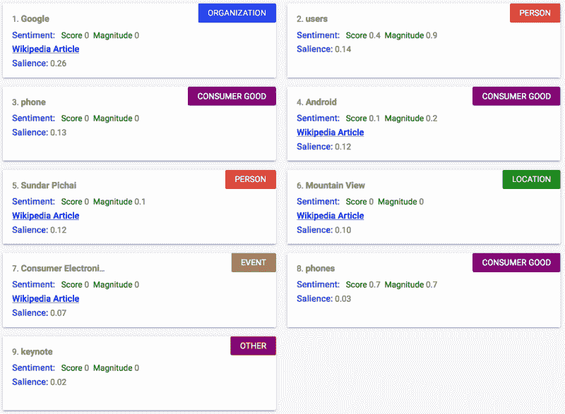

# 用谷歌云平台分散你的应用

> 原文：<https://www.freecodecamp.org/news/decentralize-your-application-with-google-cloud-platform-7149ec6d0255/>

西蒙·科斯塔迪诺夫

Photo by [NASA](https://unsplash.com/photos/Q1p7bh3SHj8?utm_source=unsplash&utm_medium=referral&utm_content=creditCopyText) on [Unsplash](https://unsplash.com/?utm_source=unsplash&utm_medium=referral&utm_content=creditCopyText)

# 用谷歌云平台分散你的应用

当第一次开始一个新的软件项目时，你通常会选择某种编程语言、特定的框架和库。然后你开始编码。2 - 3 个月后，你就有了一个工作良好的应用程序。

但是，随着项目的增长和更多功能的增加，你很快就会意识到集中式系统的缺点。难以维护和不可扩展是促使您寻找更好解决方案的一些原因。这就是微服务的用武之地。

#### 什么是微服务？

微服务是独立构建的系统，每个都在自己的进程中运行，经常与 REST API 通信。它们代表应用程序的不同部分，可以单独部署，每个部分都可以用任何语言编写。

通过处理单块系统的问题，你可以很容易地看到微服务是如何成为任何先进软件的需求的。

如果你想更深入地了解这种架构风格中的关键概念，我强烈推荐你阅读《单片微服务》(詹姆斯·刘易斯著)和《T2》。

#### 你打算建什么？

本文将带您了解使用 [Google 云平台](https://cloud.google.com/)实现微服务的过程。

假设您正在开发一个应用程序，它接受用户的文本输入，并确定输入中关键字的类别。

我们将用一个例子来说明该应用程序的功能。考虑下面来自 [GCP 云自然语言 API 网站](https://cloud.google.com/natural-language/)的示例文本:

> “总部位于山景城的谷歌在消费电子展上发布了新款安卓手机。桑德尔·皮帅在他的主题演讲中说，用户喜欢他们的新安卓手机

我们的 web 应用程序将接受上面的文本作为输入，并返回关键字所属的类别，如下图所示:

Source: [GCP Cloud Natural Language API website](https://cloud.google.com/natural-language/)

这个功能非常受欢迎，人们每天都要使用数百次。现在，如果您打算将这种功能作为一种服务来提供，并接收大量的日常流量，那么您需要一个稳定可靠的系统来响应。

这就是为什么我们将构建一个轻量级 Flask 应用，托管在[谷歌应用引擎](https://cloud.google.com/appengine/docs/flexible/python/)上。将它与 [Google Cloud Pub/Sub](https://cloud.google.com/pubsub/docs/) 整合将帮助我们处理我们收到的所有异步请求，并帮助我们确保用户不会等待太长时间的响应。

#### 创建和部署应用程序

先说 Flask app(也可以选择 Django、Node.js、go 或者任何用来构建服务器端应用的东西)。如果你对开发 Flask 应用不太熟悉，这个 [Flask 系列](https://damyanon.net/post/flask-series-environment/)可以一步一步向你展示如何设置一个应用。

出于本教程的目的，我们将使用这个简单的例子:

**此嵌入来自外部网站，似乎不再可用**

首先你需要安装依赖项`pip install Flask gunicorn`。您将使用`**gunicorn**`在 Google App Engine 上运行应用程序。对于本地访问，你可以在控制台运行`python text.py`，在 8080 端口找到应用程序。

要将应用程序部署到 Google App Engine，您需要采取以下步骤:

*   创建一个项目(遵循文档中的[“开始之前”说明)。**保存项目 id 以备后用。**](https://cloud.google.com/appengine/docs/flexible/python/quickstart)
*   创建`app.yaml`文件(如下所示)，Google App 引擎使用该文件来识别应用程序。
*   在控制台中运行`gcloud app deploy`。

`app.yaml`文件如下所示:

**此嵌入来自外部网站，似乎不再可用**

第 3 行很重要，这里使用`**gunicorn**` 告诉 Google App Engine 从一个名为`text.py`*(Flask App)*的文件中运行应用程序`**app**`。*你可以在这里了解更多关于`.yaml`文件结构[的信息。部署之后，您应该能够从`https://[YOUR_PROJECT_ID].appspot.com`访问您的项目。](https://cloud.google.com/appengine/docs/standard/python/config/appref)*

*当构建生产就绪的应用程序时，您通常希望在发布之前测试您的代码。一种方法是在本地服务器上运行你的应用程序。更好的方法是拥有一个应用程序的开发版本，它不仅可以在本地机器上测试，也可以在托管环境中测试。为此，您可以使用[谷歌应用引擎版本](https://cloud.google.com/appengine/docs/admin-api/deploying-apps)。*

*只需使用`gcloud app deploy -v textdev`(用于开发)或`gcloud app deploy -v textprod`(用于生产)部署您的应用。*

*然后导航至`https://textdev.[YOUR_PROJECT_ID].appspot.com`或`https://textprod.[YOUR_PROJECT_ID].appspot.com`以访问特定版本。*

#### *无限扩展*

*到目前为止一切顺利。你有一个工作应用，托管在谷歌云平台上。现在你需要添加 [Google Cloud Pub/Sub](https://cloud.google.com/pubsub/docs/) 和 [Google 自然语言 API](https://cloud.google.com/natural-language/) 。*

*但首先，让我们解释一下架构。*

*一旦收到请求，Flask 应用程序将发布一条消息，其中包含主题的文本(在下面创建)。然后，订阅者(Python 脚本)将提取这条消息，并将 Google 自然语言 API 应用于每条文本。最后，结果将被保存到数据库中。*

*对于多个请求，应用程序将它们异步发布到主题，订阅者开始执行第一个请求。准备好后，它会选择第二个，依此类推。*

*现在你需要修改`text.py`文件:*

***此嵌入来自外部网站，似乎不再可用***

*第 15 行和第 16 行的代码创建了发布者。在第 18 行，它发布了包含用户电子邮件和文本输入的消息。*

*你只需要填写`project_id`和`topic_id`(第 6 行和第 7 行)。*

*由于`project_id`用的比较早，这里就补充一下吧。*

*对于`topic_id`,您需要执行以下操作:*

*   *[启用谷歌云发布/订阅 API](https://console.cloud.google.com/apis/dashboard)*
*   *[转到您项目的发布/订阅页面](https://console.cloud.google.com/cloudpubsub/topicList)*
*   *创建主题和订阅*
*   *使用主题名称作为您的`topic_id`*
*   *保留订阅名称以备后用。
    你将需要它作为你的`subscription_id`*

*精彩！现在你有一个工作的出版商。*

*让我们开始设置订户。需要创建两个文件:`worker.py`和`startup-script.sh`。*

*`worker.py`看起来是这样的:*

***此嵌入来自外部网站，似乎不再可用***

*这个文件稍微大一点，但是我们将从底部开始一步一步地检查它。*

*当文件被执行时，第 44 行的代码运行`main()`。这个函数用您的`project_id`和`subscription_id`设置订户，并给它分配一个回调。*

*`callback`(在第 7 行初始化)将接收所有消息并执行所需的任务(确定文本的类别)。如果您遵循来自`callback`的代码，您可以很容易地看到 Google 自然语言 API 是如何被使用的。*

*有趣的是第 11 行，其中`message.ack()`确认了当前消息。您可以看到，这就好像工作人员在说:“我已经处理完了这条消息，准备处理下一条”。*

*现在，你需要实现`startup-script.sh`。*

*这是一个包含几个命令的 shell 脚本:*

***此嵌入来自外部网站，似乎不再可用***

*在解释上面的代码之前，我需要澄清一下这个过程。*

*基本上， [Google 云计算引擎](https://console.cloud.google.com/compute)通过提供同时运行多个工作人员所需的虚拟机(VM ),让您能够扩展应用程序。*

*您只需要为已经拥有的 worker 添加代码，并设置 VM 的配置。除了`worker.py`，您还需要添加一个`startup-script.sh`，它将在每次新的虚拟机启动时运行。*

*当收到大量消息时，启动新的 VM 实例以防止响应延迟。*

*要更深入地了解这一过程的技术解释，请查阅[文档](https://cloud.google.com/compute/docs/)。*

*现在，让我向您介绍一下脚本:*

*   ***第 1 行**:意味着脚本应该总是用 bash 运行，而不是另一个 shell。*
*   ***第 2 行和第 3 行**:创建并进入一个新的目录，所有的文件都将存储在这个目录中。*
*   ***第 4 行**:将`worker.py`文件从[谷歌云存储](https://cloud.google.com/storage/docs/)复制到 VM(我会在下面解释如何将你的文件上传到存储)。*
*   ***第 5 行**:这里您需要指定一个您的密钥的 JSON 字符串，以便 Google 可以验证您的凭证。为了得到这个字符串，你需要[创建一个服务账户](https://console.cloud.google.com/iam-admin/iam/project)。选择`**Furnish a new private key**` ，对于`**Key type**` 使用`JSON`。一个文件将被下载到您的计算机上。复制内容并将其转换成 JSON 字符串(在浏览器控制台中使用`JSON.stringify(key_in_json_format)`)。粘贴它而不是`SERVICE_ACCOUNT_KEY` *。**
*   ***第 6 行**:将密钥导出为一个[环境变量](https://developers.google.com/identity/protocols/application-default-credentials)，Google APIs 将使用它来验证您的凭证。*
*   ***第 7 - 12 行**:设置配置并安装 python 库。*
*   ***第 15 行**:运行工人。*

*现在您需要将`worker.py`和`startup-script.sh`上传到您的存储器并设置 VM。要上传文件，只需点击[这里](https://console.cloud.google.com/storage/)并创建一个与你的项目 id 同名的新存储桶。创建一个名为 *workers* 的文件夹，并上传里面的脚本。**确保将`worker.py`更改为“公共链接*”*，并将`*startup-script.sh*`** **的权限编辑为拥有您的服务帐户作为所有者。***

#### *配置和测试*

*最后一步是设置虚拟机的配置并测试系统。只需遵循文档中的[“创建实例模板”说明，您就可以开始了！](https://cloud.google.com/solutions/media-processing-pub-sub-compute-engine)*

*一旦 VM 启动，您可以尝试向您的应用程序发送请求，并通过检查[日志](https://console.cloud.google.com/logs/viewer)来检查它的反应。*

#### *最后的想法*

*通读谷歌的文档可能会对你有很大帮助。也看看这个[教程](https://cloud.google.com/solutions/media-processing-pub-sub-compute-engine)——你可能会发现它在实现上面的一些步骤时很有用。*

*我想感谢洛根·艾伦帮助我更好地理解这个过程。希望你觉得有用。*

*请在评论区留下任何问题或建议。*