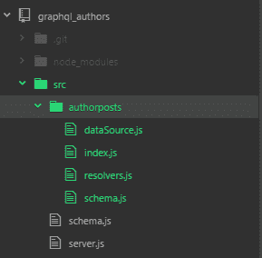
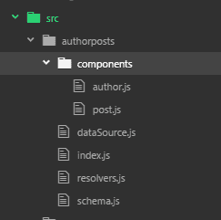
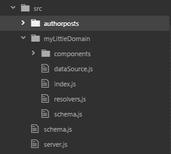

# 声明式 GraphQL:使用 graphql 工具编写更少的代码，完成更多的工作

> 原文：<https://www.freecodecamp.org/news/declarative-graphql-with-graphql-tools-cd1645f94fc/>

我使用 GraphQL 已经有几个月了，但是直到最近才开始使用 Apollo 的 graphql 工具库。在学习了一些习惯用法之后，我能够很快地模拟出一个功能 API。这在很大程度上是由于它对类型定义的低代码、声明性方法。

### 从他们的例子开始

阿波罗有一个交互式的发射台网站，就像我的《T2》招摇系列中的那些网站一样。有几个示例模式可供您使用，对于本文，我将使用他们的[帖子和作者模式](https://launchpad.graphql.com/1jzxrj179)。可以下载或者分叉代码。

我将重新安排项目文件夹。对于这篇文章，我将下载并存储在 Github 中，这样我就可以分支并修改每一步的代码。在这个过程中，我会将分支链接到这个帖子。

#### 基础知识

*   **声明模式类型**

在 Launchpad 中，您会看到一个`typeDefs`模板文本:

```
const typeDefs = `
  type Author {
    id: Int!
    firstName: String
    lastName: String
    posts: [Post] # the list of Posts by this author
  }

type Post {
    id: Int!
    title: String
    author: Author
    votes: Int
  }

# the schema allows the following query:
  type Query {
    posts: [Post]
    author(id: Int!): Author
  }

# this schema allows the following mutation:
  type Mutation {
    upvotePost (
      postId: Int!
    ): Post
  }
`;
```

定义了两个**实体**，`Author`和`Post`。此外，还有两种**类型** : `Query`和`Mutation`。查询类型定义了根`accessors`。在这种情况下，有一个访问器获取所有的`Posts`，另一个访问器通过`ID`获取单个的`Author`。

注意没有办法直接查询作者列表或单个帖子。以后可以添加这样的查询。

*   **声明解析器**

解析器提供必要的逻辑来支持模式。它们被写成一个 JavaScript 对象，其键与模式中定义的类型相匹配。下面显示的`resolver`对静态数据进行操作，我稍后会谈到。

```
const resolvers = {
  Query: {
    posts: () => posts,
    author: (_, { id }) => find(authors, { id: id }),
  },
  Mutation: {
    upvotePost: (_, { postId }) => {
      const post = find(posts, { id: postId });
      if (!post) {
        throw new Error(`Couldn't find post with id ${postId}`);
      }
      post.votes += 1;
      return post;
    },
  },
  Author: {
    posts: (author) => filter(posts, { authorId: author.id }),
  },
  Post: {
    author: (post) => find(authors, { id: post.authorId }),
  },
};
```

为了将`schema`和`resolver`链接在一起，我们将创建一个可执行的模式实例:

```
export const schema = makeExecutableSchema({
  typeDefs,
  resolvers,
});
```

*   **数据源**

对于这个简单的例子，数据来自定义为常量的两个对象数组:`**authors**` 和`**posts**`:

```
const authors = [
  { id: 1, firstName: 'Tom', lastName: 'Coleman' },
  { id: 2, firstName: 'Sashko', lastName: 'Stubailo' },
  { id: 3, firstName: 'Mikhail', lastName: 'Novikov' },
];

const posts = [
  { id: 1, authorId: 1, title: 'Introduction to GraphQL', votes: 2 },
  { id: 2, authorId: 2, title: 'Welcome to Meteor', votes: 3 },
  { id: 3, authorId: 2, title: 'Advanced GraphQL', votes: 1 },
  { id: 4, authorId: 3, title: 'Launchpad is Cool', votes: 7 },
];
```

*   **服务器**

您可以通过 **graphql_express** 、 **apollo_graphql_express** 或 **graphql-server-express 提供可执行模式。我们在这个例子中看到。**

重要的部分是:

```
import { graphqlExpress, graphiqlExpress } from 'graphql-server-express';
import { schema, rootValue, context } from './schema';

const PORT = 3000;
const server = express();

server.use('/graphql', bodyParser.json(), graphqlExpress(request => ({
  schema,
  rootValue,
  context: context(request.headers, process.env),
})));

server.use('/graphiql', graphiqlExpress({
  endpointURL: '/graphql',
}));

server.listen(PORT, () => {
  console.log(`GraphQL Server is now running on 
http://localhost:${PORT}/graphql`);
  console.log(`View GraphiQL at 
http://localhost:${PORT}/graphiql`);
});
```

注意，使用了两个 GraphQL 中间件:

*   处理查询和响应的 GraphQL 服务器
*   graphiqlExpress
    交互式 GraphQL web 服务，允许通过 HTML UI 进行交互式查询

### 改组

> 对于大型应用程序，我们建议将 GraphQL 服务器代码分成 4 个组件:模式、解析器、模型和连接器，每个组件处理工作的特定部分。([http://dev.apollodata.com/tools/graphql-tools/](http://dev.apollodata.com/tools/graphql-tools/)

将每种类型的组件放在自己的文件中是有意义的。我将更进一步，将每组组件放在它自己的“域”文件夹中。

#### 为什么是域名？

域是一种将大型系统划分为多个操作区域的便捷方式。每个域中可能有子域。一般来说，子域有一个有界的上下文。在有界的上下文中，实体名称、属性和过程具有精确的含义。

我发现有界上下文在分析过程中很有帮助，尤其是在与领域专家交谈时。

美中不足的是 GraphQL 类型占用单一的名称空间，因此可能存在命名冲突。稍后会详细介绍。



我将调用这个域 **authorposts** ，并将相关组件放在`authorpostsfolder`中。在其中，我将为`datasource`、`resolvers`和模式分别创建一个文件。我们还可以添加一个`index.js`文件来简化导入。原始模式和服务器文件将保留在根文件夹中，但是`schema.js`代码将是骨架。从 **lodash** 导入的`**find**` 和`**filter**` 方法将被移除，取而代之的是同义的本地 ES6 方法。产生的源是这里的。

主模式文件变得更简单了。它为我们领域中的模式的进一步扩展提供了框架结构。

```
import {
    makeExecutableSchema
} from 'graphql-tools';

import {
    schema as authorpostsSchema,
    resolvers as authorpostsResolvers
} from './authorposts';

const baseSchema = [
    `
    type Query {
        domain: String
    }
    type Mutation {
        domain: String
    }
    schema {
        query: Query,
        mutation: Mutation
    }`
]

// Put schema together into one array of schema strings and one map of resolvers, like makeExecutableSchema expects
const schema = [...baseSchema, ...authorpostsSchema]

const options = {
    typeDefs: schema,
    resolvers: {...authorPostResolvers}
}

const executableSchema = makeExecutableSchema(options);

export default executableSchema;
```

rootSchema.js

第 7–8 行导入了一个`domain`模式，第 11–23 行导入了一个`base`模式。您会注意到有一个**域**属性。这是任意的，但是 GraphQL 或 graphql-tools 坚持定义一个属性。

完整的模式是在第 26 行构建的，根据目前为止在第 28–33 行定义的`schema`和`resolvers`，创建了一个`executableSchema`实例。这是由 **server.js** 代码导入的内容，与原始代码相比基本没有变化。

以这种方式分割模式有一个技巧。让我们来看看:

```
import {
    authors,
    posts
} from './dataSource';

const rootResolvers = {
    Query: {
        posts: () => posts,
        author: (_, {
            id
        }) => authors.find(a => a.id === id)
    },
    Mutation: {
        upvotePost: (_, {
            postId
        }) => {
            const post = posts.find(p => p.id === postId);
            if (!post) {
                throw new Error(`Couldn't find post with id ${postId}`);
            }
            post.votes += 1;
            return post;
        }
    },
    Author: {
        posts: (author) => posts.filter(p => p.authorId === author.id)
    },
    Post: {
        author: (post) => authors.find(a => a.id === post.authorId)
    }
};

export default rootResolvers;
```

authorpostResolvers.js

```
const typeDefs = [
    `
  type Author {
    id: Int!
    firstName: String
    lastName: String
    posts: [Post] # the list of Posts by this author
  }
  type Post {
    id: Int!
    title: String
    author: Author
    votes: Int
  }
  # the schema allows the following query:
  extend type Query {
    posts: [Post]
    author(id: Int!): Author
  }
  # this schema allows the following mutation:
  extend type Mutation {
    upvotePost (
      postId: Int!
    ): Post
  }
`
];

export default typeDefs;
```

authorpostSchema.js

第一个清单`authorpostResolvers.js`是对 Apollo 示例中的原始`schema.js`源代码的剪切和粘贴。然而在`authorpostSchema.js`代码中，我们**扩展了**在基础模式中声明的`Query`和`Mutator`定义。如果不使用 **extend** 关键字，可执行模式构建器将抱怨两个**查询**定义。

#### 继续…

这是组织几个模式的良好开端，每个感兴趣的域一个模式(只要您注意类型的全局名称空间)，但是一个完整的模式，即使是一个域，也会变得很大。幸运的是，如果需要的话，您可以进一步分解每个模式，直到[实体级别](https://github.com/JeffML/graphql_authors/tree/reorg2)。

下面是修改后的目录结构和新内容清单:



```
export default `
  type Author {
    id: Int!
    firstName: String
    lastName: String
    posts: [Post] # the list of Posts by this author
}`
```

author.js

```
export default `
type Post {
  id: Int!
  title: String
  author: Author
  votes: Int
}`
```

post.js

```
import Author from './components/author'
import Post from './components/post'

const typeDefs =
    `
  # the schema allows the following query:
  extend type Query {
    posts: [Post]
    author(id: Int!): Author
  }
  # this schema allows the following mutation:
  extend type Mutation {
    upvotePost (
      postId: Int!
    ): Post
  }
`;

export default [typeDefs, Author, Post];
```

schema.js

我们可以通过定义两个组件文件，然后将它们导入到一个域模式中来实现粒度。

您不必为每个文件做一个组件。但是您需要确保模式将这些组件和模式本身一起导出，如第 20 行所示。否则，您可能会在包含链的更下游错过一个依赖项。

#### 多个架构和解析器

为一个新的域添加一个新的模式很简单。创建一个新的域文件夹，并添加数据源、解析器、模式和 index.js 文件。还可以添加一个包含构件类型定义的可选构件文件夹。



```
const myLittleTypes = [{
    id: 1,
    description: 'This is good',
}, {
    id: 2,
    description: 'This is better',
}, {
    id: 3,
    description: 'This is the best!',
}];

export {
    myLittleTypes
};
```

dataSource.js

```
export default `
  type MyLittleType {
    id: Int!
    description: String
}`
```

myLittleType.js

```
import {
    myLittleTypes
} from './dataSource';

const rootResolvers = {
    Query: {
        myLittleType: (_, {
            id
        }) => myLittleTypes.find(t => t.id === id)
    },
};

export default rootResolvers;
```

resolvers.js

```
import MyLittleType from './components/myLittleType'

const typeDefs =
    `
  # the schema allows the following query:
  extend type Query {
    myLittleType(id: Int!): MyLittleType
  }
`;

export default [typeDefs, MyLittleType];
```

schema.js

最后，根 schema.js 文件必须组合来自两个域的模式和解析器:

```
//...
import {
    schema as myLittleTypoSchema,
    resolvers as myLittleTypeResolvers
} from './myLittleDomain';

import {
    merge
} from 'lodash';
//...
const schema = [...baseSchema, ...authorpostsSchema, ...myLittleTypoSchema]

const options = {
    typeDefs: schema,
    resolvers: merge(authorpostsResolvers, myLittleTypeResolvers)
}
```

注意，我必须在这里包含`**lodash**` **合并**，因为需要两个**解析器** 导入的深度合并。

### 处理名称空间冲突

如果您正在进行一个大型项目，您将会遇到类型名称冲突。您可能认为一个域中的帐户与另一个域中的帐户意思相同。然而，即使它们意味着或多或少相似的东西，属性和关系也可能是不同的。所以技术上来说他们不是一个类型。

在撰写本文时，GraphQL 对类型使用单一的名称空间。

如何解决这个问题？脸书显然为他们的 10，000 种类型使用了一个[命名约定](https://github.com/facebook/graphql/issues/163#issuecomment-241607229)。虽然这看起来很尴尬，但对他们来说很有效。

Apollo graphql-tools 堆栈似乎可以捕捉类型名重复。所以你在那里应该很好。

关于[是否在 GraphQL 中包含名称空间的讨论正在进行中。这不是一个简单的决定。我记得 10 年前引入](https://github.com/facebook/graphql/issues/163#issuecomment-230163416) [XML 名称空间](https://www.w3.org/TR/REC-xml-names/)所带来的复杂性。

### 从这里去哪里？

这篇文章仅仅触及了如何组织一大组 GraphQL 模式的表面。下一篇文章将讨论模仿 GraphQL 解析器，以及如何在查询响应中混合真实值和模仿值。