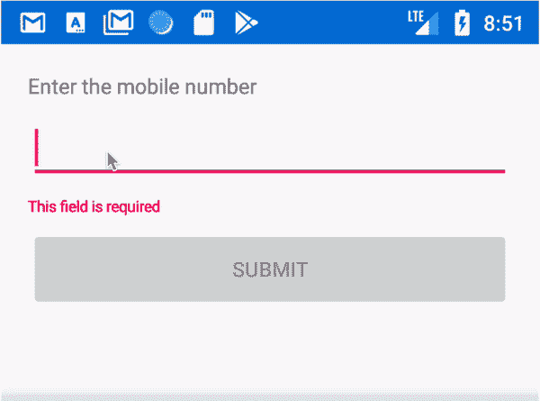
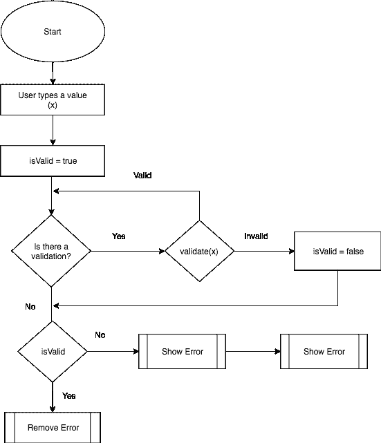
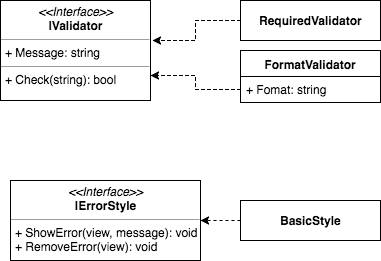
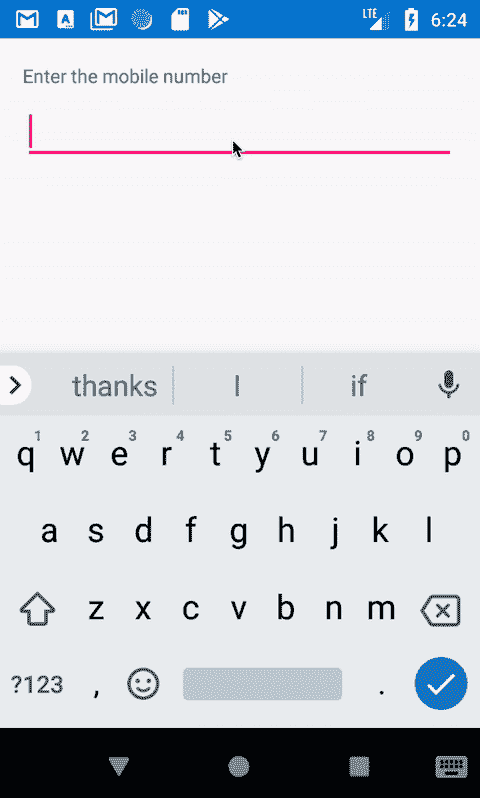
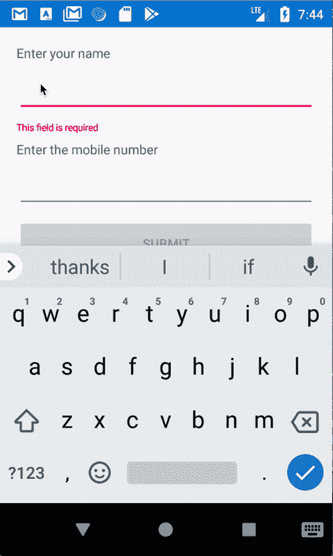

# 如何实现声明性 Xamarin 表单验证

> 原文：<https://www.freecodecamp.org/news/declarative-xamarin-form-validation-c174d2a74618/>

作者:阿米尔·詹

# 如何实现声明性 Xamarin 表单验证

如果你有一个现存的 **Xamarin。Forms** codebase，并希望在不影响您的代码或视图模型的情况下添加验证，那么这就是适合您的。？

### 是什么让我写了这篇文章？

我们的团队设计并开发了一个 Xamarin 移动应用程序，它有多个表单，没有验证，因为我们的时间更少，而且我们只需要后端验证就可以了。

随着时间的推移，我们对添加前端验证的需求与应用程序一起增长。所以我们决定在不影响代码或视图模型的情况下添加验证。没有文章可以帮助我们实现这个策略，所以我决定写一篇。

### 先决条件

我假设你对 **Xamarin** **行为**感到舒服。如果没有，请阅读下面的文档——它非常简单明了。

[**Xamarin。forms Behaviors-Xamarin**](https://docs.microsoft.com/en-us/xamarin/xamarin-forms/app-fundamentals/behaviors/)
[*Behaviors 让你可以在用户界面控件中添加功能，而不必继承它们。行为是书面的……*docs.microsoft.com](https://docs.microsoft.com/en-us/xamarin/xamarin-forms/app-fundamentals/behaviors/)

### 我们最终会得到什么

结果将是 xaml 上的高度可读和声明性验证，使代码和视图模型远离验证！

### 注意事项

每当代码太长而无法在一个解释中消化时，我会将它分成多个部分，并使用三个省略号( **…** )来代替前面或后面部分中的代码。

### 那么计划是什么？

如果我们能够思考验证时发生的基本事情，我们就可以很好地规划我们的方式:

上面的流程图是我们整个设计的一个非常抽象的表示。为了更好地理解实际代码，请看下图:

### 够了，让我们编码吧！

下面的接口有助于保持我们定义的不同验证器之间的一致性。

现在让我们为一些常见的验证器编写一些实现。

一些验证器可能需要很少的额外参数。例如， **FormatValidator** 需要一个格式参数，这些参数可以作为字段添加到类中。

显示错误有多种方式。您可能更喜欢将它显示在控件的正下方，或者您可能更喜欢将它作为摘要显示在表单的顶部。为了适应这些不同的错误显示风格，我们为它定义了一个接口来保持一致性。

为了简单起见，我实现了一个非常基本的错误样式，它只是在被验证的控件下添加和删除一个标签。

现在到了 **Xamarin 行为**部分，它将上述所有代码粘合在一起。

**_style:** 该字段由我们的自定义 BasicErrorStyle 实现初始化。这将有助于我们在需要时显示和删除错误。

**_view:** 这是进行验证的控件。

**PropertyName:** 这是要根据验证规则进行验证的控件的属性，比方说入口控件的 Text 属性或选择器控件的 SelectedItem 属性。

**验证器:**这是验证控制属性所依据的验证规则列表。

**Validate()** 方法运行所有的验证规则，并对控件的属性值执行 Check 方法。如果所有的验证规则都通过了，那么就在 _style 上调用 **RemoveError** 方法。否则就调用 on _style 的 **ShowError** 方法。

代码的剩余部分只是在将此行为添加到 xaml 时，将 **OnPropertyChanged、onUnFocussed**方法附加和分离到控件的 PropertyChanged 和 unfocused 事件。

当这些事件被触发时，它们调用我们之前定义的 **Validate()** 方法，该方法根据需要依次添加或删除错误。

### 如何使用它

是的，等待终于结束了！现在，您可以通过导入必要的 xaml 名称空间将这些验证添加到 xaml 中。

如果你现在运行这个应用程序，你应该会有这样的体验:

### 验证整个表单

现在下一个挑战来了:我们如何知道整个表单是否有效？也就是说，我们如何知道表单中的所有控件都有有效数据？

为了实现这一点，我们创建了另一个名为 **ValidationGroupBehavior，**的行为，在这个行为中，我们将要验证的控件分组在一起，以验证整个表单。

**_validationBehaviors:** 这个是要验证的各种控件的验证行为列表。

**IsValidProperty:** 这是一个可绑定的属性，您可以在 xaml 中访问它来检查表单是否有效。

我们公开了两个方法，即 **Add()** 和 **Remove()，**来帮助控件在特定的验证组中添加或删除它们自己。

我们还公开了一个方法， **Update()，**来帮助控件在数据改变时刷新表单的有效性。该方法依次运行 **_validationBehaviors** 中的所有验证，并相应地设置 **IsValid** 属性的值。

### 重构我们的验证行为

让我们对 ValidationBehavior 类做一点重构，以适应控件的验证分组:

我们添加了一个名为 **Group** 的属性来存储控件所属的验证组。**集团。添加()**和**组。Remove()** 方法在此行为分别附加到控件或从控件分离时被调用。反过来，这将在特定的验证组中添加或移除控件。每当控件失去焦点时，它通过调用**组来更新组的有效性。**方法更新()。

### **行动中的验证组行为**

如下所示更新 xaml 文件，看看验证组有多棒:

上述代码将 **ValidationGroupBehavior** 添加到所有控件的父元素中，然后将其引用添加到控件中**验证器**的**组**属性中。然后可以使用验证组的 **IsValid** 属性来启用或禁用提交按钮。很棒的东西，对吧？

如果您现在运行该应用程序，您应该会看到类似这样的内容:

### 异步验证器呢？

我能听到这个问题在你脑海中回响。我们的设计有一个好处，那就是它可以很容易地进行扩展。这可以通过声明如下所示的另一个接口来实现:

现在，您可以为异步验证器创建一个实现，假设 **AsyncUserExists，**返回一个解析为布尔值的任务。向 **ValidationBehavior** 添加一个名为 **AsyncValidators** 的新属性，并向该属性添加异步验证器。稍微异步一下并等待验证过程的加入将解决我们的问题。

### 我们终于结束了吗？

我们已经以非常简单的方式介绍了相当多的信息。但是有一些不错的特性你可以自己尝试一下:

*   谴责异步验证器
*   在显示错误之前，检查控件是否脏(用户输入了某些内容)

### 迷茫？

如果你有困惑或者有一些灰色地带，欢迎在评论中联系我。你也可以参考我在 GitHub 中的演示应用，我在下面做了链接。

[**ameerthehacker/XamarinFormValidationDemo**](https://github.com/ameerthehacker/XamarinFormValidationDemo)
[*XamarinFormValidationDemo——这是我的中型博客关于 XamarinFormValidationDemo 的演示应用*github.com](https://github.com/ameerthehacker/XamarinFormValidationDemo)

### TL；速度三角形定位法(dead reckoning)

如果你像我一样懒惰，或者不想写很多东西来获得上述功能，那么你可以等到我使用上述策略开发一个用于 xamarin 表单验证的 NuGet 包。欢迎大家投稿，下面我有链接。

[**ameerthehacker/XamarinFormValidation**](https://github.com/ameerthehacker/XamarinFormValidation)
[*XamarinFormValidation-在 Xamarin 中进行主动的、灵活的和高度可配置的验证:hearts:*github.com](https://github.com/ameerthehacker/XamarinFormValidation)

如果你觉得这篇文章有帮助，给我一些掌声？