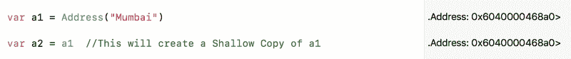
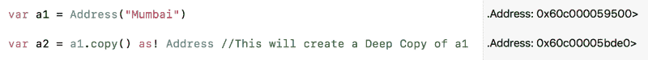
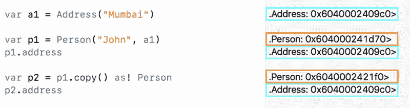
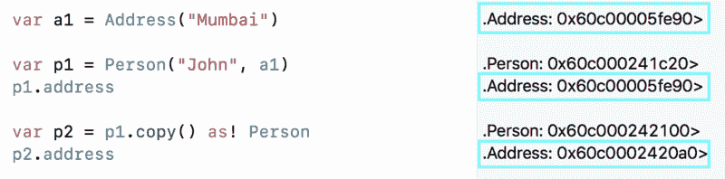
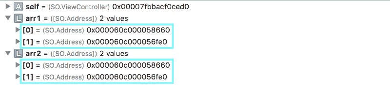
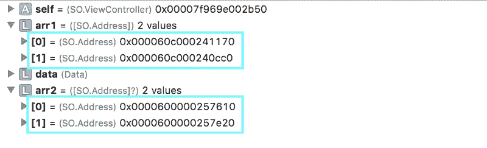

# 深层拷贝与浅层拷贝——以及如何在 Swift 中使用它们

> 原文：<https://www.freecodecamp.org/news/deep-copy-vs-shallow-copy-and-how-you-can-use-them-in-swift-c623833f5ad3/>

作者帕亚尔·古普塔

# 深层拷贝与浅层拷贝——以及如何在 Swift 中使用它们


复制一个对象一直是编码范例中必不可少的一部分。无论是在 Swift、Objective-C、JAVA 或任何其他语言中，我们总是需要复制一个对象以用于不同的上下文。

在本文中，我们将详细讨论如何在 Swift 中复制不同的数据类型，以及它们在不同情况下的表现。

### 值类型和引用类型

Swift 中的所有数据类型大致分为两类，即**值类型**和**引用类型**。

*   **值类型** —每个实例保存其数据的唯一副本。属于这一类别的数据类型包括— `all the basic data types, struct, enum, array, tuples`。
*   **引用类型** —实例共享数据的单个副本，该类型通常被定义为`class`。

这两种类型最显著的特征在于它们的复制行为。

### 什么是深浅抄？

无论实例是值类型还是引用类型，都可以通过下列方式之一进行复制:

#### **深层复制—** 复制一切

*   对于深度拷贝，源指向的任何对象都被拷贝，而拷贝由目标指向。因此将创建两个完全独立的对象。
*   **集合** —集合的深层副本是两个集合，其中复制了原始集合中的所有元素。
*   **不易出现竞争情况**并且在多线程环境中表现良好——一个对象中的变化不会对另一个对象产生影响。
*   **值类型**被深度复制。

在上面的代码中，

*   **第 1 行** : `arr1` —字符串数组(值类型)
*   **线 2** : `arr1`分配给`arr2`。这将创建`arr1`的深层副本，然后将该副本分配给`arr2`
*   **第 7 行到第 11 行**:在`arr2`中所做的任何改变都不会反映在`arr1`中。

这就是深度拷贝——完全独立的实例。相同的概念适用于所有的值类型。

在某些情况下，当值类型包含嵌套引用类型时，深度复制揭示了一种不同的行为。我们将在接下来的章节中看到这一点。

#### **浅层复制—** 尽量少复制

*   使用浅层拷贝，源指向的任何对象也会被目标指向。所以在内存中只会创建一个对象。
*   **集合** —集合的浅层副本是集合结构的副本，而不是元素。使用浅层副本，两个集合现在共享单个元素。
*   **更快** —仅复制参照。
*   复制引用类型会创建一个浅层副本。

在上面的代码中，

*   **第 1 行到第 8 行** : `Address`类类型
*   **第 10 行**:`a1`—`Address`类型的一个实例
*   **第 11 行** : `a1`分配给`a2`。这将创建一个`a1`的浅层副本，然后将该副本分配给`a2`，也就是说只有引用被复制到`a2`。
*   **第 16 行到第 19 行**:在`a2`中所做的任何改变都会反映在`a1`中。



在上图中，我们可以看到`a1`和`a2`都指向同一个内存地址。

### 深度复制引用类型

到目前为止，我们知道每当我们试图复制一个引用类型时，只复制对对象的引用。没有创建新对象。如果我们想要创建一个完全独立的对象呢？

我们可以使用`[copy()](https://developer.apple.com/documentation/objectivec/nsobject/1418807-copy)`方法创建引用类型的深层副本。根据[文档](https://developer.apple.com/documentation/foundation/nscopying/1410311-copy)，

copy() —返回由`[copy(with:)](https://developer.apple.com/documentation/foundation/nscopying/1410311-copy)`返回的对象。

对于采用`[NSCopying](https://developer.apple.com/documentation/foundation/nscopying)`协议的类来说，这是一个方便的方法。如果`[copy(with:)](https://developer.apple.com/documentation/foundation/nscopying/1410311-copy)`没有实现，则会引发异常。

让我们重组我们在代码片段 2 中创建的`Address class`以符合`NSCopying`协议。

在上面的代码中，

*   **1 至 14 行** : `Address`类类型符合`NSCopying`并实现`[copy(with:)](https://developer.apple.com/documentation/foundation/nscopying/1410311-copy)`方法
*   **第 16 行**:`a1`—`Address`类型的一个实例
*   **使用`copy()`方法将第 17 行** : `a1`分配给`a2`。这将创建一个`a1`的深层副本，然后将该副本分配给`a2`，即创建一个全新的对象。
*   **第 22 行到第 25 行**:在`a2`中所做的任何更改都不会反映在`a1`中。



从上图可以明显看出，`a1`和`a2`指向不同的内存位置。

让我们看另一个例子。这一次我们将看到它如何与**嵌套引用类型一起工作——一个引用类型包含另一个引用类型**。

在上面的代码中，

*   **第 22 行:**使用`copy()`方法将`p1`的深层副本分配给`p2`。这意味着其中一个的任何变化都不能对另一个产生任何影响。
*   **第 27 行到第 28 行:** `p2’s` `name`和`city`的值被改变。这些一定不能体现在`p1`里。
*   **第 30 行:** `p1’s` `name`果然是，但是它的`city`？应该是`“Mumbai”`不是吗？但我们看不到这种情况发生。`“Bangalore”`只是为了`p2`对吗？是的……没错。？

*深度复制…！*？T *这不是你所期望的。你说过你会复制一切。现在你却这样。为什么哦为什么..？！我现在该怎么办？☠* ️

不要惊慌。让我们看看内存地址在这里说了什么。



从上面的例子中，我们可以看出

*   `p1`和`p2`如预期指向不同的内存位置。
*   但是它们的`address`变量仍然指向同一个位置。这意味着即使在深度复制它们之后，也只复制了引用——当然是一个**浅复制**。

**请注意:**我们每次复制一个引用类型，默认会创建一个浅拷贝，直到我们明确指定要深拷贝。

```
func copy(with zone: NSZone? = nil) -> Any{    let person = Person(self.name, self.address)    return person}
```

在上面我们为`Person`类实现的方法中，我们通过用`self.address`复制地址创建了一个新的实例。这将只复制对地址对象的引用。这就是`p1`和`p2’s` `address`都指向同一个位置的原因。

因此，使用`copy()`方法复制对象不会创建对象 ***的真正深层副本。***

**要完全复制一个引用对象:**引用类型以及所有嵌套的引用类型必须用`copy()`方法复制。

```
let person = Person(self.name, self.address.copy() as? Address)
```

在`func copy(with zone: NSZone? = nil) ->` 中使用上面的代码，任何方法都会让一切正常工作。你可以从下图中看到这一点。



### 真正的深度复制—引用和值类型

我们已经看到了如何创建引用类型的深层副本。当然，我们可以对所有嵌套的引用类型都这样做。

但是对于值类型中的嵌套引用类型，也就是对象数组，或者结构中的引用类型变量，或者元组呢？我们也可以使用`copy()`来解决这个问题吗？不，实际上我们不能。`copy()`方法需要实现仅适用于`NSObject`子类的`NSCopying`协议。值类型不支持继承，所以我们不能对它们使用`copy()`。

第 2 行只深度复制了`arr1`的结构，但是里面的`Address`对象还是浅复制的。你可以从下面的记忆图中看到。



`arr1`和`arr2`中的元素都指向相同的内存位置。这是出于同样的原因—默认情况下，引用类型是浅复制的。

**序列化然后反序列化一个对象总是创建一个全新的对象。它对值类型和引用类型都有效。**

下面是一些我们可以用来序列化和反序列化数据的 API:

1.  [**NSCoding**](https://developer.apple.com/documentation/foundation/nscoding) —一种使对象能够被编码和解码以便存档和分发的协议。它只适用于`class`类型的对象，因为它需要从`NSObject`继承。
2.  [**可编码**](https://developer.apple.com/documentation/foundation/archives_and_serialization/encoding_and_decoding_custom_types) —使您的数据类型可编码和可解码，以兼容外部表示，如 JSON。它既适用于值类型— `struct, array, tuple, basic data types`也适用于引用类型— `class`。

让我们进一步重组`Address`类，以符合`Codable`协议，并删除我们之前在代码片段 3 中添加的所有`NSCopying`代码。

在上面的代码中，第 11–13 行将创建一个真正的深度副本`arr1`。下图清楚地展示了内存位置。



### 写入时复制

写时复制是一种优化技术，有助于在复制值类型时提高性能。

比方说，我们复制一个字符串或 Int 或任何其他值类型——在这种情况下，我们不会面临任何关键的性能问题。但是当我们复制一个有数千个元素的数组时呢？它仍然不会产生任何性能问题吗？如果我们只是复制它，而不对该副本做任何更改，会怎么样？在这种情况下，我们使用的额外内存不就是一种浪费吗？

这里出现了写中复制的概念——当复制时，每个引用指向同一个内存地址。只有当其中一个引用修改底层数据时，Swift 才会实际复制原始实例并进行修改。

也就是说，无论是深层拷贝还是浅层拷贝，在我们对其中一个对象进行更改之前，都不会创建新的拷贝。

在上面的代码中，

*   **第 2 行**:将`arr1`的深层副本分配给`arr2`
*   **第 4 行和第 5 行** : `arr1`和`arr2`仍然指向同一个内存地址
*   **第 7 行**:在`arr2`中的变更
*   **第 9 行和第 10 行** : `arr1`和`arr2`现在指向不同的存储位置

现在，您对深度和浅层拷贝以及它们在不同数据类型的不同场景中的行为有了更多的了解。您可以用自己的一组示例来尝试它们，看看会得到什么结果。

### 进一步阅读

别忘了阅读我的其他文章:

1.  [Swift 4 中关于 Codable 的一切](https://hackernoon.com/everything-about-codable-in-swift-4-97d0e18a2999)
2.  [你一直想知道的关于 iOS 通知的一切](https://medium.freecodecamp.org/ios-10-notifications-inshorts-all-in-one-ad727e03983a)
3.  [用渐变给它上色——iOS](https://hackernoon.com/color-it-with-gradients-ios-a4b374c3c79f)
4.  [iOS 11 编码:如何将&拖放到收藏&表](https://hackernoon.com/drag-it-drop-it-in-collection-table-ios-11-6bd28795b313)
5.  [关于 iOS 10 中的今日扩展(Widget)你需要知道的一切](https://hackernoon.com/app-extensions-and-today-extensions-widget-in-ios-10-e2d9fd9957a8)
6.  [uicollectionview 单元格选择变得简单..！！](https://hackernoon.com/uicollectionviewcell-selection-made-easy-41dae148379d)

如果您有任何问题，请随时发表评论。