# GraphQL 与 Golang:从基础到高级的深度探讨

> 原文：<https://www.freecodecamp.org/news/deep-dive-into-graphql-with-golang-d3e02a429ac3/>

作者:Ridham Tarpara

# GraphQL 与 Golang:从基础到高级的深度探讨

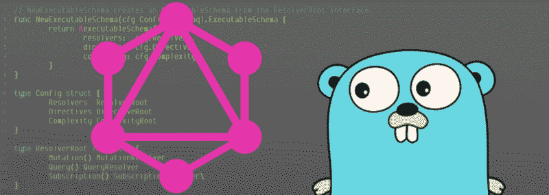

在脸书将其开源后，GraphQL 在过去几年中已经成为一个时髦词汇。我已经用 Node.js 尝试过 GraphQL，我同意所有关于 GraphQL 的优点和简单性的讨论。

那么 GraphQL 是什么呢？这是 GraphQL 的官方定义:

> GraphQL 是一种针对 API 和运行时的查询语言，用于使用现有数据完成这些查询。GraphQL 为 API 中的数据提供了完整且易于理解的描述，使客户能够准确地要求他们需要的东西，使 API 更容易随时间发展，并支持强大的开发工具。

我最近为了一个新项目(来自 Node.js)转到了 Golang，我决定用它来尝试 GraphQL。Golang 的库选项不多，但我已经用 [Thunder](https://github.com/samsarahq/thunder) 、 [graphql](https://github.com/graphql-go/graphql) 、 [graphql-go](https://github.com/graph-gophers/graphql-go) 和 [gqlgen](https://github.com/99designs/gqlgen) 试过了。而且我不得不说，在我尝试过的所有库当中，gqlgen 是胜出的。

在撰写本文时，gqlgen 仍处于测试阶段，最新版本为 [0.7.2](https://github.com/99designs/gqlgen/releases/tag/v0.7.2) ，它正在快速发展。你可以在这里找到他们的路线图。现在 [99designs](https://99designs.com/) 正式赞助他们，所以我们将会看到这个令人敬畏的开源项目更好的开发速度。 [vektah](https://github.com/vektah) 和 [neelance](https://github.com/neelance) 是主要贡献者， [neelance](https://github.com/neelance) 也写了 [graphql-go](https://github.com/graph-gophers/graphql-go) 。

因此，假设您有基本的 GraphQL 知识，让我们深入研究一下库语义。

### 突出

正如他们的标题所说，

> 这是一个用于在 Golang 中快速创建严格类型的 GraphQL 服务器的库。

我认为这是这个库最有前途的地方:你永远不会在这里看到`map[string]interface{}`，因为它使用了严格的类型化方法。

除此之外，它使用了一种**模式优先的方法**:所以你使用 graphql [模式定义语言](http://graphql.org/learn/schema/)来定义你的 API。它有自己强大的代码生成工具，可以自动生成所有的 GraphQL 代码，你只需要实现接口方法的核心逻辑。

我将本文分为两个阶段:

*   基础知识:配置、变异、查询和订阅
*   高级:身份验证、数据加载器和查询复杂性

### 阶段 1:基础——配置、变化、查询和订阅

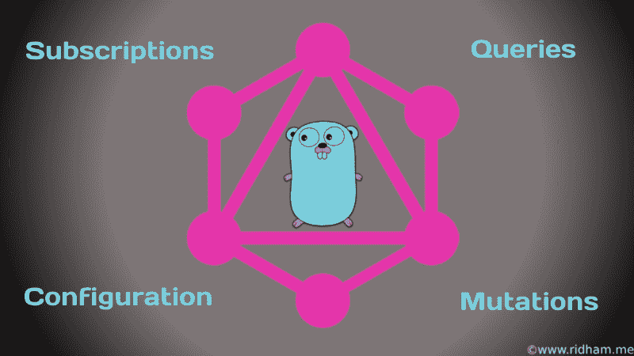

我们将使用一个视频发布站点作为示例，用户可以在其中发布视频、添加截图、添加评论以及获取视频和相关视频。

```
mkdir -p $GOPATH/src/github.com/ridhamtarpara/go-graphql-demo/
```

在项目根中创建以下模式:

这里，我们定义了基本模型和一个发布新视频的变体，以及一个获取所有视频的查询。你可以在这里阅读更多关于 graphql [模式的内容。我们还定义了一个自定义类型(标量)，因为默认情况下 graphql 只有 5 个标量](https://graphql.org/learn/schema)[类型](https://graphql.org/learn/schema/#scalar-types)，包括 Int、Float、String、Boolean 和 ID。

所以如果你想使用自定义类型，那么你可以在`schema.graphql`中定义一个自定义标量(就像我们已经定义了`Timestamp`)并在代码中提供它的定义。在 gqlgen 中，您需要为所有定制标量提供编组和解组方法，并将它们映射到`gqlgen.yml`。

gqlgen 在上一个版本中的另一个主要变化是，他们已经消除了对编译后的二进制文件的依赖。因此，将以下文件添加到您的项目中的 scripts/gqlgen.go 下。

并用以下命令初始化 dep:

```
dep init
```

现在是时候利用这个库的 codegen 特性了，它可以生成所有令人厌烦(但对一些人来说很有趣)的框架代码。

```
go run scripts/gqlgen.go init
```

这将创建以下文件:

**gqlgen.yml** —控制代码生成的配置文件。
**generated . go**——生成的代码你可能不想看到。
**models_gen.go** —您提供的模式的输入和类型的所有模型。
**resolver.go** —您需要编写您的实现。
**server/server . go**—带有 http 的入口点。启动 GraphQL 服务器的处理程序。

让我们来看看`Video`类型的一个生成模型:

这里可以看到，ID 被定义为一个字符串，CreatedAt 也是一个字符串。其他相关模型也相应地进行了映射，但是在现实世界中，您并不希望这样——如果您使用任何 SQL 数据类型，您希望您的 ID 字段为 int 或 int64，这取决于您的数据库。

例如，我正在使用 PostgreSQL 进行演示，所以当然*我希望 ID 为 int，CreatedAt 为 time。时间*。所以我们需要定义自己的模型，并指示 gqlgen 使用我们的模型，而不是生成一个新的模型。

并更新 gqlgen 以使用这些模型，如下所示:

因此，重点是 ID 和时间戳的自定义定义，以及编组和解组方法以及它们在 gqlgen.yml 文件中的映射。现在，当用户提供一个字符串作为 ID 时，UnmarshalID 会将一个字符串转换成一个 int。发送响应时，MarshalID 会将 int 转换为 string。这同样适用于 Timestamp 或您定义的任何其他自定义标量。

现在是实现真正逻辑的时候了。打开`resolver.go`并提供突变和查询的定义。存根已经自动生成了一个未实现的 panic 语句，所以让我们覆盖它。

然后发生了突变:

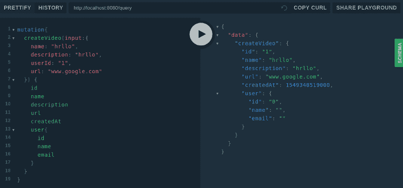

createVideo Mutation

哦，成功了…..但是等等，为什么我的用户是空的？？所以这里有一个类似的概念像懒和急装。由于 graphQL 是可扩展的，所以您需要定义哪些字段需要快速填充，哪些字段需要延迟填充。

我为与 gqlgen 合作的组织团队制定了这条黄金法则:

> 不要在模型中包含只有在客户请求时才加载的字段。

对于我们的用例，我希望只有当客户要求这些字段时才加载相关视频(甚至用户)。但是由于我们已经在模型中包含了这些字段，gqlgen 将假设您将在解析视频时提供这些值——所以目前我们得到的是一个空结构。

有时您每次都需要某种类型的数据，所以您不想用另一个查询来加载它。相反，您可以使用类似 SQL 连接的东西来提高性能。对于一个用例(不包括在本文中)，我每次都需要存储在不同位置的视频元数据。因此，如果我在请求时加载它，我将需要另一个查询。但是因为我知道我的需求(我在客户端的任何地方都需要它)，所以我更喜欢急切地加载它以提高性能。

所以让我们重写模型，重新生成 gqlgen 代码。为了简单起见，我们将只为用户定义方法。

因此，我们添加了 UserID，删除了 User struct 并重新生成了代码:

```
go run scripts/gqlgen.go -v
```

这将生成以下接口方法来解析未定义的结构，您需要在解析器中定义这些方法:

这是我们的定义:

现在，结果应该是这样的:

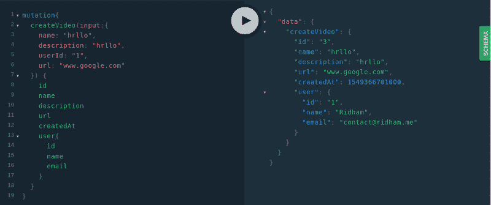

因此，这涵盖了 graphql 的基础知识，应该可以帮助您入门。用 graphql 和 Golang 的力量做一些尝试！但在此之前，让我们先看看订阅应该包括在本文的范围内。

#### 捐款

Graphql 提供 subscription 作为一种操作类型，允许您在 GraphQL 中订阅真实的图块数据。gqlgen 提供基于 web 套接字的实时订阅事件。

您需要在`schema.graphql`文件中定义您的订阅。在这里，我们正在订阅视频发布活动。

运行`go run scripts/gqlgen.go -v`重新生成代码。

如前所述，它将在 generated.go 中生成一个接口，您需要在解析器中实现该接口。在我们的例子中，它看起来像这样:

现在，您需要在创建新视频时发出事件。正如你在第 23 行看到的，我们已经完成了。

现在是时候测试订阅了:

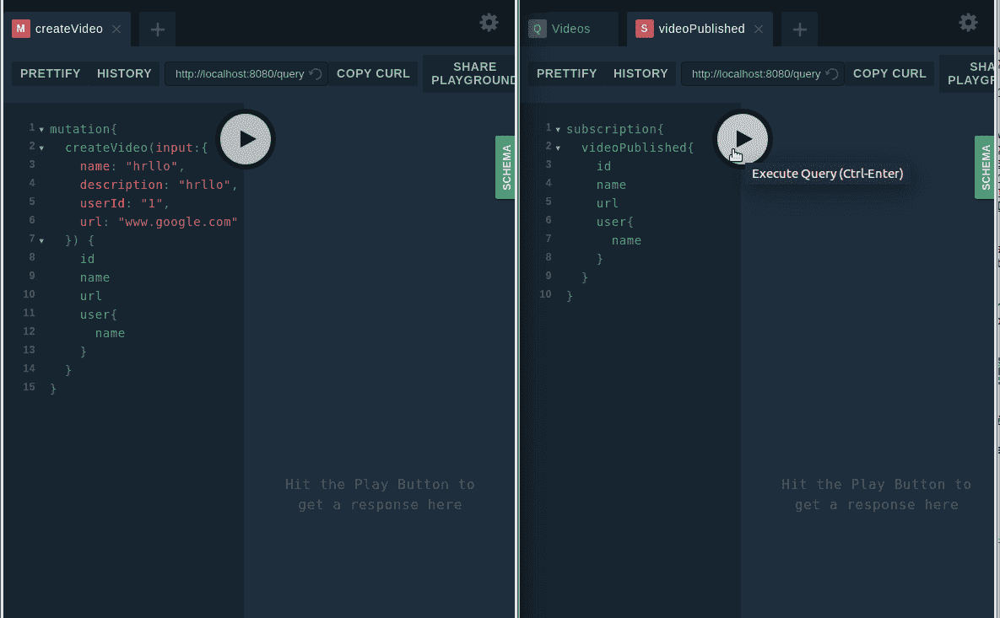

GraphQL 有一定的优势，但闪光的不一定是金子。您需要注意一些事情，如授权、查询复杂性、缓存、N+1 查询问题、速率限制以及其他一些问题——否则会使您的性能处于危险之中。

### 阶段 2:高级认证、数据加载器和查询复杂性

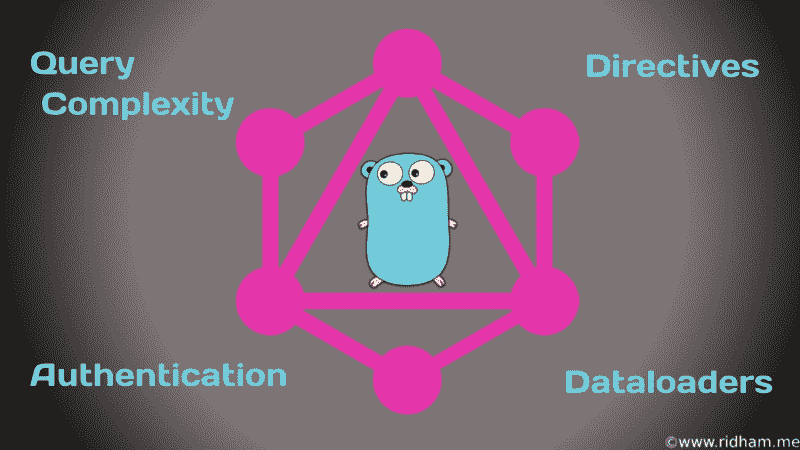

每次我读这样的教程，我都觉得我知道我需要知道的一切，并且可以解决我所有的问题。

但是当我开始自己工作时，我通常会得到一个内部服务器错误或永无止境的请求或死胡同，我必须深入挖掘才能找到出路。希望我们可以帮助防止这种情况发生。

让我们从基本身份认证开始，了解一些高级概念。

#### 证明

在 REST API 中，您有一种身份验证系统，并且在特定端点上有一些现成的授权。但是在 GraphQL 中，只有一个端点是公开的，所以您可以通过模式指令来实现这一点。
您需要编辑您的 schema.graphql，如下所示:

我们已经创建了一个 isAuthenticated 指令，现在我们已经将该指令应用于`createVideo`订阅。重新生成代码后，您需要给出指令的定义。目前，指令是作为结构方法而不是接口实现的，所以我们必须给出一个定义。
我已经更新了 server.go 的生成代码，并创建了一个方法来返回 server.go 的 graphql 配置，如下所示:

我们已经从上下文中读取了 userId。看起来很奇怪吧？userId 是如何插入到上下文中的，为什么插入到上下文中？好的，所以 gqlgen 只在实现级别为您提供请求上下文，所以您不能读取任何 HTTP 请求数据，比如 graphql 解析器或指令中的头或 cookies。因此，您需要添加您的中间件，获取这些数据，并将数据放入您的上下文中。

因此，我们需要定义身份验证中间件来从请求中获取身份验证数据并进行验证。

我没有在那里定义任何逻辑，而是出于演示目的将 userId 作为授权进行传递。然后在`server.go`中链接这个中间件和新的配置加载方法。

现在，指令定义是有意义的。不要在您的中间件中处理未经授权的用户，因为它将由您的指令来处理。

演示时间:

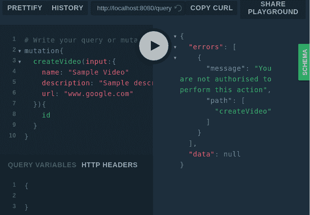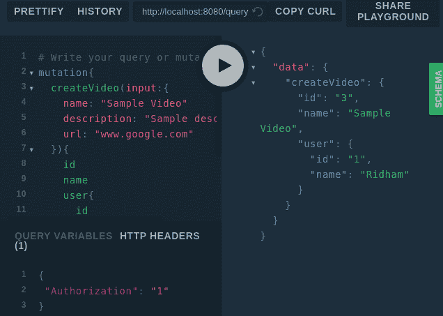

您甚至可以像这样在模式指令中传递参数:

```
directive @hasRole(role: Role!) on FIELD_DEFINITIONenum Role { ADMIN USER }
```

#### 数据加载器

这一切看起来很奇特，不是吗？您在需要时加载数据。客户端可以控制数据，不会出现数据提取不足和数据提取过度的情况。但是一切都是有代价的。

那么这里的成本是多少呢？让我们在获取所有视频的同时查看一下日志。我们有 8 个视频条目，有 5 个用户。

```
query{  Videos(limit: 10){    name    user{      name    }  }}
```

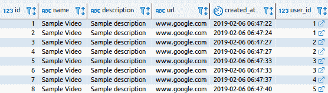

```
Query: Videos : SELECT id, name, description, url, created_at, user_id FROM videos ORDER BY created_at desc limit $1 offset $2Resolver: User : SELECT id, name, email FROM users where id = $1Resolver: User : SELECT id, name, email FROM users where id = $1Resolver: User : SELECT id, name, email FROM users where id = $1Resolver: User : SELECT id, name, email FROM users where id = $1Resolver: User : SELECT id, name, email FROM users where id = $1Resolver: User : SELECT id, name, email FROM users where id = $1Resolver: User : SELECT id, name, email FROM users where id = $1Resolver: User : SELECT id, name, email FROM users where id = $1
```


为什么有 9 个查询(1 个视频表和 8 个用户表)？看起来很恐怖。当我想到用这个替换我们当前的 REST API 服务器时，我几乎要心脏病发作了……但是数据加载器完全解决了这个问题！

这被称为 N+1 问题，将有一个查询来获取所有数据，并且对于每个数据(N)将有另一个数据库查询。

就性能和资源而言，这是一个非常严重的问题:尽管这些查询是并行的，但它们会耗尽您的资源。

我们将使用 gqlgen 作者提供的 [dataloaden](https://github.com/vektah/dataloaden) 库。这是一个 Go 生成的库。我们将首先为用户生成数据加载器。

```
go get github.com/vektah/dataloadendataloaden github.com/ridhamtarpara/go-graphql-demo/api.User
```

这将生成一个文件`userloader_gen.go`,其中包含 Fetch、LoadAll 和 Prime 等方法。

现在，我们需要定义 Fetch 方法来批量获取结果。

这里，我们等待 1 毫秒，等待用户加载查询，我们保留了最多 100 个查询。所以现在，dataloader 不是为每个用户触发一个查询，而是在命中数据库之前，为 100 个用户等待 1 毫秒。我们需要更改我们的用户解析器逻辑，以使用 dataloader 代替以前的查询逻辑。

在这之后，我的日志看起来像这样:

```
Query: Videos : SELECT id, name, description, url, created_at, user_id FROM videos ORDER BY created_at desc limit $1 offset $2Dataloader: User : SELECT id, name, email from users WHERE id IN ($1, $2, $3, $4, $5)
```

现在只发射了两个查询，所以大家都很高兴。有趣的是，即使有 8 个视频，也只给了 5 个用户键来查询。所以 dataloader 删除了重复的条目。

#### 查询复杂性


在 GraphQL 中，您为客户端提供了一种强大的方法来获取他们需要的任何东西，但是这将您暴露在拒绝服务攻击的风险中。

让我们通过整篇文章中提到的一个例子来理解这一点。

现在我们在 video type 中有一个相关字段，它返回相关的视频。每个相关的视频都是 graphql 视频类型，所以它们也都有相关的视频…如此循环。

考虑以下查询以了解情况的严重性:

```
{  Videos(limit: 10, offset: 0){    name    url    related(limit: 10, offset: 0){      name      url      related(limit: 10, offset: 0){        name        url        related(limit: 100, offset: 0){          name          url        }      }    }  }}
```

如果我再添加一个子对象或者将限制增加到 100，那么一次调用将加载数百万个视频。也许(或者更确切地说，这肯定会使您的数据库和服务没有响应。

gqlgen 提供了一种方法来定义一次调用中允许的最大查询复杂度。您只需要在 graphql 处理程序中添加一行(下面代码片段中的第 5 行)并定义最大复杂性(在我们的例子中是 300)。

gqlgen 为每个字段分配固定的复杂性权重，因此它将把 struct、array 和 string 都视为相等。所以对于这个查询，复杂度将是 12。但是我们知道嵌套字段的权重太大，所以我们需要告诉 gqlgen 进行相应的计算(简单来说，使用乘法而不仅仅是求和)。

就像指令一样，复杂性也被定义为 struct，所以我们相应地改变了我们的 config 方法。

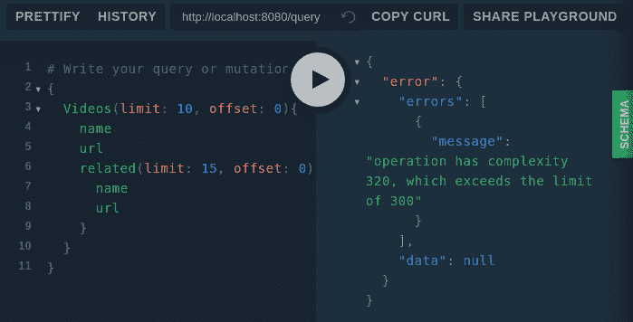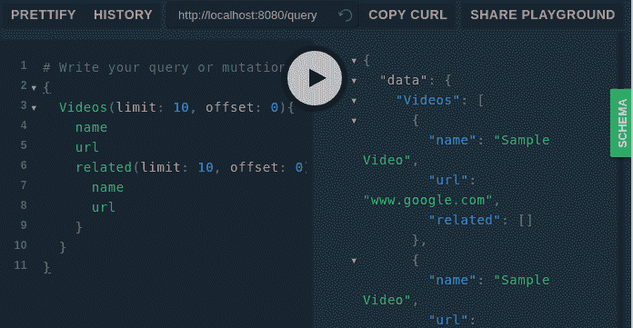

我没有定义相关的方法逻辑，只是返回了空数组。所以 related 在输出中是空的，但是这应该让您对如何使用查询复杂性有一个清晰的概念。

### 最终注释

这个代码在 [Github](https://github.com/ridhamtarpara/go-graphql-demo) 上。你可以试着用它，如果你有任何问题或顾虑，请在评论区告诉我。

**感谢阅读！几下(希望是 50 下)掌声？总是受到赞赏。我**写关于 JavaScript、Go 语言、DevOps 和计算机科学的文章。喜欢这篇文章就关注我分享吧。****

**通过@[Twitter](https://twitter.com/RidhamTarpara)@[Linkedin](https://www.linkedin.com/in/ridham-tarpara-97430270)联系我。请访问 [www.ridham.me](http://www.ridham.me) 了解更多信息。**